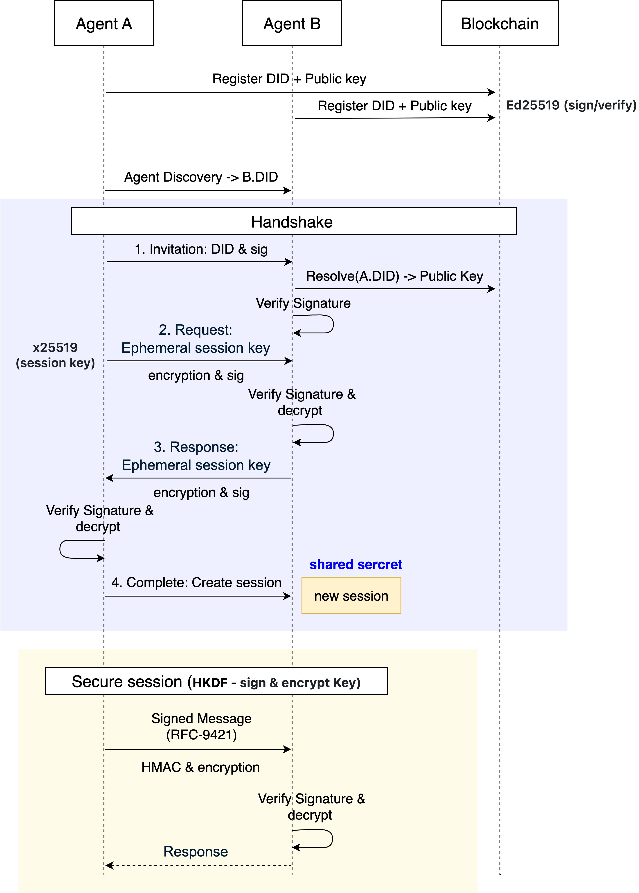

# SAGE - Secure Agent Guarantee Engine

[](https://golang.org/dl/)
[](https://soliditylang.org/)
[](LICENSE)

[](https://github.com/sage-x-project/sage/actions/workflows/test.yml)
[](https://github.com/sage-x-project/sage/actions/workflows/integration-test.yml)
[](https://github.com/sage-x-project/sage/actions/workflows/security.yml)
[](https://codecov.io/gh/sage-x-project/sage)

## Overview

SAGE (Secure Agent Guarantee Engine) is a comprehensive blockchain-based security framework for AI agent communication. It provides end-to-end encrypted, authenticated communication channels between AI agents using decentralized identity (DID) management, HPKE-based key agreement, and RFC 9421 HTTP Message Signatures.

### 🌐 Live Deployments

**Sepolia Testnet** (LIVE ✅):
- **SAGE Core System**:
  - SageRegistryV2: [`0x487d45a678eb947bbF9d8f38a67721b13a0209BF`](https://sepolia.etherscan.io/address/0x487d45a678eb947bbF9d8f38a67721b13a0209BF)
  - ERC8004ValidationRegistry: [`0x4D31A11DdE882D2B2cdFB9cCf534FaA55A519440`](https://sepolia.etherscan.io/address/0x4D31A11DdE882D2B2cdFB9cCf534FaA55A519440)
- **ERC-8004 Standalone**:
  - ERC8004IdentityRegistry: [`0x02439d8DA11517603d0DE1424B33139A90969517`](https://sepolia.etherscan.io/address/0x02439d8DA11517603d0DE1424B33139A90969517)
  - [See all deployed contracts →](contracts/ethereum/docs/PHASE7-SEPOLIA-DEPLOYMENT-COMPLETE.md)

### Key Features

- **End-to-End Encrypted Handshake**: HPKE (RFC 9180) based secure session establishment with X25519 key agreement
- **RFC 9421 Compliance**: Complete HTTP message signature implementation for verifiable agent communication
- **Multi-Chain Support**: Ethereum, Solana, and Kaia network integration for DID registry
- **Enhanced Security**: Public key ownership verification with on-chain validation and key revocation
- **Multi-Algorithm Support**: Ed25519, Secp256k1, and X25519 cryptographic operations
- **Smart Contract Registry**: Decentralized agent registry with V2 security enhancements
- **Session Management**: Automatic session creation, key rotation, nonce tracking, and replay protection
- **Modular Architecture**: Clean separation of concerns with extensible event-driven design
- **Comprehensive Testing**: Integration tests, random fuzzing, and health monitoring

## Project Structure

```
sage/
├── core/                    # Core RFC 9421 implementation
│   ├── rfc9421/            # HTTP message signatures (canonicalization, signing, verification)
│   └── message/            # Message processing, validation, ordering, and deduplication
├── crypto/                  # Cryptographic operations
│   ├── keys/               # Ed25519, Secp256k1, X25519 key pair implementations
│   ├── chain/              # Blockchain-specific providers (Ethereum, Solana)
│   ├── storage/            # Secure key storage (file, memory)
│   ├── vault/              # Hardware-backed secure storage with OS keychain integration
│   └── formats/            # JWK, PEM key format converters
├── did/                     # Decentralized Identity
│   ├── ethereum/           # Ethereum DID client with enhanced provider
│   ├── solana/             # Solana DID client
│   ├── manager.go          # Multi-chain DID management
│   └── resolver.go         # DID document resolution with caching
├── handshake/               # Secure session establishment (NEW)
│   ├── client.go           # Handshake initiator implementation
│   ├── server.go           # Handshake responder with peer caching
│   └── types.go            # Invitation, Request, Response, Complete messages
├── hpke/                    # HPKE (RFC 9180) implementation (NEW)
│   ├── client.go           # HPKE sender (encapsulation)
│   ├── server.go           # HPKE receiver (decapsulation)
│   └── common.go           # Shared HPKE utilities
├── session/                 # Session and key management (NEW)
│   ├── manager.go          # Session lifecycle, cleanup, and key ID binding
│   ├── session.go          # Secure session with ChaCha20-Poly1305 AEAD
│   ├── nonce.go            # Replay attack prevention with nonce cache
│   └── metadata.go         # Session state and expiration tracking
├── health/                  # Health monitoring system (NEW)
│   ├── checker.go          # Component health checks
│   └── server.go           # HTTP health endpoint
├── config/                  # Configuration management (NEW)
│   ├── config.go           # Unified configuration loader
│   ├── blockchain.go       # Blockchain-specific settings
│   └── validator.go        # Configuration validation
├── contracts/               # Smart contracts
│   └── ethereum/           # Ethereum contracts, tests, deployment scripts
├── cmd/                     # CLI applications
│   ├── sage-crypto/        # Cryptographic operations CLI
│   ├── sage-did/           # DID management CLI
│   └── sage-verify/        # Message signature verification CLI (NEW)
├── examples/                # Usage examples
│   └── mcp-integration/    # Model Context Protocol integration examples
├── tests/                   # Testing infrastructure (NEW)
│   ├── integration/        # End-to-end integration tests
│   ├── random/             # Randomized fuzzing tests
│   └── handshake/          # Handshake integration tests
├── docs/                    # Documentation
│   ├── handshake/          # Handshake protocol documentation (EN/KO)
│   ├── dev/                # Developer guides and security design
│   └── assets/             # Architecture diagrams
├── scripts/                 # Test and deployment scripts
└── internal/                # Internal utilities and helpers
```

## Installation

### Prerequisites

- **Go 1.24 or higher**
- **Node.js 18+** and npm (for smart contract development)
- **Git**

### Quick Start

1. **Clone the repository**

```bash
git clone https://github.com/SAGE-X-project/sage.git
cd sage
```

2. **Install Go dependencies**

```bash
go mod download
```

3. **Install smart contract dependencies**

```bash
cd contracts/ethereum
npm install
```

4. **Build the project**

```bash
# Build all CLI tools for current platform
make build

# Build for all platforms (Linux, macOS, Windows on x86_64 and ARM64)
make build-all-platforms

# Build as C-compatible library
make build-lib              # Build for current platform
make build-lib-all          # Build for all platforms

# Create release packages with checksums
make release

# Or build individually
go build -o build/bin/sage-crypto ./cmd/sage-crypto
go build -o build/bin/sage-did ./cmd/sage-did
go build -o build/bin/sage-verify ./cmd/sage-verify

# Compile smart contracts
cd contracts/ethereum
npm run compile
```

**See [docs/BUILD.md](docs/BUILD.md) for detailed build instructions including:**
- Cross-platform compilation (Linux, macOS, Windows)
- Multi-architecture support (x86_64, ARM64)
- Library builds (static `.a`, shared `.so`/`.dylib`/`.dll`)
- C/C++, Python, and Rust integration examples

## Configuration

### Environment Setup

SAGE supports multiple configuration methods:

1. **YAML Configuration File** (Recommended)

Create `config.yaml`:

```yaml
blockchain:
  ethereum:
    rpc_url: "https://eth-mainnet.g.alchemy.com/v2/YOUR_KEY"
    contract_address: "0x..."
    chain_id: 1
  kaia:
    rpc_url: "https://public-en.node.kaia.io"
    contract_address: "0x..."
    chain_id: 8217

crypto:
  key_dir: "./keys"
  default_algorithm: "ed25519"

session:
  max_age: "1h"
  idle_timeout: "10m"
  cleanup_interval: "30s"
```

2. **Environment Variables**

```env
# Network RPC Endpoints
ETHEREUM_RPC_URL=https://eth-mainnet.g.alchemy.com/v2/YOUR_KEY
KAIA_RPC_URL=https://public-en.node.kaia.io
KAIROS_RPC_URL=https://public-en-kairos.node.kaia.io

# Private Keys (use test keys only!)
PRIVATE_KEY=your_private_key_here
MNEMONIC=your_twelve_word_mnemonic_phrase_here

# Contract Addresses
SAGE_REGISTRY_ADDRESS=0x...
```

## Usage

### 1. Generate Key Pairs

```bash
# Generate Ed25519 key pair (for DID signatures)
./build/bin/sage-crypto generate -t ed25519 -o keys/agent.key

# Generate Secp256k1 key pair (for Ethereum)
./build/bin/sage-crypto generate -t secp256k1 -o keys/ethereum.key

# Generate X25519 key pair (for HPKE encryption)
./build/bin/sage-crypto generate -t x25519 -o keys/hpke.key

# List all keys
./build/bin/sage-crypto list -d keys/
```

### 2. Register an AI Agent

```bash
# Register on Ethereum
./build/bin/sage-did register \
  --chain ethereum \
  --key keys/ethereum.key \
  --name "My AI Agent" \
  --endpoint "https://api.myagent.com" \
  --capabilities "chat,code,analysis"

# Resolve a DID
./build/bin/sage-did resolve did:sage:ethereum:0x...

# List agents by owner
./build/bin/sage-did list --owner 0x...
```

### 3. Secure Handshake Protocol

The handshake establishes an end-to-end encrypted session between two agents:

```go
import (
    "github.com/sage-x-project/sage/hpke"
    "github.com/sage-x-project/sage/session"
    "github.com/sage-x-project/sage/did"
)

// Client side (Agent A)
client := hpke.NewClient(conn, myKeyPair)

// Initialize session
// Receive kid from Server (Agent B)
ctxID := "ctx-" + uuid.NewString()
kid, _ := client.Initialize(ctx, ctxID, clientDID, serverDID)

```

### 4. HPKE Encryption/Decryption

```go
import (
    "github.com/sage-x-project/sage/hpke"
    "github.com/sage-x-project/sage/session"
)

// Get session from manager
sess, ok := sessionManager.GetByKeyID(keyID)

// encryption
cipher, _ := sess.Encrypt(body)

// decryption
plain, _:= sess.Decrypt(cipher)

```

### 5. Create RFC 9421 Signed Messages

```go
import (
    "github.com/sage-x-project/sage/core/rfc9421"
    "github.com/sage-x-project/sage/session"
)


// Create HTTP message builder
builder := rfc9421.NewMessageBuilder()
msg := builder.
    Method("POST").
    Authority("api.example.com").
    Path("/api/v1/chat").
    Header("Content-Type", "application/json").
    Body([]byte(cipherRequestBody)).
    Build()

// Create verifier with session
verifier := rfc9421.NewHTTPVerifier(sess, sessionManager)

// Sign the message
signature, err := verifier.SignRequest(msg, sigName, []string{
    "@method", "@authority", "@path", "content-type", "content-digest", privKey
})

// Verify signature
err = verifier.VerifyRequest(req, pubKey, HTTPVerificationOptions)
```

## Testing

### Run Go Tests

```bash
# Run all tests with Makefile
make test

# Run all tests manually
go test ./...

# Run with coverage
go test -cover ./...

# Run specific package tests
go test ./crypto/...
go test ./did/...
go test ./core/...
go test ./handshake/...
go test ./session/...

# Run integration tests
make test-integration

# Run hpke based handshake integration test
make test-hpke

# Run quick tests (excluding slow integration tests)
make test-quick
```

### Advanced Testing

```bash
# Random fuzzing tests
make random-test

# Benchmark tests
make bench

# Test with race detection
go test -race ./...

# Generate coverage report
go test -coverprofile=coverage.out ./...
go tool cover -html=coverage.out
```

### Development Scripts

```bash
# Verify all Makefile targets
./tools/scripts/verify_makefile.sh

# This script tests all major Makefile targets and reports:
# - PASS: Target executed successfully
# - FAIL: Target failed with error details
# - SKIP: Target skipped (e.g., requires external services)
```

### Run Smart Contract Tests

```bash
cd contracts/ethereum

# Run all contract tests
npm test

# Run specific test suite
npm run test:v2

# Run with coverage
npm run coverage

# Run integration tests
npm run test:integration
```

### Health Monitoring

```bash
# The health check endpoint provides system status
curl http://localhost:8080/health

# Response includes:
# - Component status (blockchain, session, crypto)
# - Session statistics
# - Uptime information
# - Degraded/healthy state
```

## Smart Contract Features

### SageRegistryV2 - Enhanced Security Features

The latest version includes significant security enhancements:

- **5-Step Public Key Validation**: Length, format, zero-key check, ownership proof, revocation status
- **Challenge-Response Authentication**: Signature-based proof of key ownership
- **Key Revocation System**: Ability to revoke compromised keys with auto-deactivation
- **Hook System**: Extensible validation through hook contracts
- **Gas Optimized**: Efficient storage patterns and operations

See [contracts/README.md](contracts/README.md) for detailed smart contract documentation.

## Gas Usage

| Operation        | Gas Used | USD (@ 30 gwei) |
| ---------------- | -------- | --------------- |
| Register Agent   | ~620,000 | ~$48            |
| Update Agent     | ~80,000  | ~$6             |
| Revoke Key       | ~66,000  | ~$5             |
| Deactivate Agent | ~50,000  | ~$3.8           |

## Supported Networks

### Mainnet

- **Ethereum**: Full support with ENS integration
- **Kaia (Cypress)**: Production deployment
- **Solana**: In development

### Testnet

- **Sepolia**: Ethereum testnet
- **Kairos**: Kaia testnet
- **Solana Devnet**: Testing environment

## Architecture Highlights

### Handshake Protocol

SAGE implements a four-phase handshake protocol for secure session establishment:

1. **Invitation**: Agent A declares intent, Agent B verifies DID signature
2. **Request**: Agent A sends ephemeral key (encrypted with B's public key)
3. **Response**: Agent B sends ephemeral key (encrypted with A's public key)
4. **Complete**: Both agents derive session keys from shared secret



See [docs/handshake/handshake-en.md](docs/handshake/handshake-en.md) for detailed protocol documentation.

### Session Management

- **Deterministic Session IDs**: Derived from HKDF of shared secret
- **Directional Keys**: Separate encryption/signing keys for client-to-server and server-to-client
- **Automatic Cleanup**: Background goroutine removes expired sessions
- **Key ID Binding**: Maps opaque key IDs to session IDs for RFC 9421 verification
- **Replay Protection**: Nonce cache prevents replay attacks

### Security Design

- **DID-Based Authentication**: All agents verified through blockchain DID registry
- **Bootstrap Encryption**: Initial messages encrypted with peer's Ed25519 public key
- **HPKE Session Keys**: Ephemeral X25519 keys for forward secrecy
- **AEAD Encryption**: ChaCha20-Poly1305 for session messages
- **HMAC Signatures**: SHA-256 based message authentication
- **Challenge-Response**: Prevents unauthorized key registration

## Multi-Language Bindings

SAGE provides bindings for multiple programming languages:

- **Go**: Native implementation
- **C/C++**: Static and shared library bindings
- **Python**: Web3.py based bindings + ctypes library integration
- **Rust**: FFI bindings via static library
- **JavaScript/TypeScript**: Ethers.js bindings
- **Java**: JNI bindings (planned)

### Smart Contract Bindings (Python Example)

```python
from sage_contracts import SageRegistry

registry = SageRegistry(
    rpc_url="https://eth-mainnet.g.alchemy.com/v2/YOUR_KEY",
    contract_address="0x...",
    private_key="0x..."
)

# Register an agent
tx_hash = registry.register_agent(
    did="did:sage:ethereum:0x...",
    name="Python AI Agent",
    endpoint="https://api.example.com",
    public_key=public_key_bytes,
    capabilities=["chat", "analysis"]
)
```

### C Library Integration

SAGE can be built as a C-compatible library for integration with other languages:

```c
#include "libsage.h"

int main() {
    // Initialize SAGE library
    sage_init();

    // Generate Ed25519 key pair
    char public_key[128];
    char private_key[128];
    sage_generate_keypair(public_key, private_key);

    printf("Public Key: %s\n", public_key);

    // Cleanup
    sage_cleanup();
    return 0;
}
```

**Compile with static library:**
```bash
# Linux
gcc -o myapp myapp.c build/lib/linux-amd64/libsage.a

# macOS
clang -o myapp myapp.c build/lib/darwin-arm64/libsage.a

# Windows (MinGW)
x86_64-w64-mingw32-gcc -o myapp.exe myapp.c build/lib/windows-amd64/libsage.a
```

### Python Library Integration (ctypes)

```python
import ctypes
import os

# Load SAGE library
if os.name == 'nt':
    lib = ctypes.CDLL('libsage.dll')
elif os.uname().sysname == 'Darwin':
    lib = ctypes.CDLL('libsage.dylib')
else:
    lib = ctypes.CDLL('libsage.so')

# Initialize
lib.sage_init()

# Generate key pair
public_key = ctypes.create_string_buffer(128)
private_key = ctypes.create_string_buffer(128)
lib.sage_generate_keypair(public_key, private_key)

print(f"Public Key: {public_key.value.decode()}")

# Cleanup
lib.sage_cleanup()
```

**See [docs/BUILD.md](docs/BUILD.md) for complete integration examples with C/C++, Python, Rust, and other languages.**

## Security Considerations

1. **Private Key Management**

   - Never commit private keys to version control
   - Use hardware wallets for production (via vault package)
   - Implement key rotation policies
   - Use OS keychain integration for sensitive keys

2. **Smart Contract Security**

   - Contracts are upgradeable through proxy pattern
   - Regular security audits recommended
   - Bug bounty program available
   - V2 includes 5-step key validation

3. **Message Signature Verification**

   - Always verify signatures on the receiving end
   - Check signature expiration timestamps
   - Validate signer's DID status on-chain
   - Use nonce cache to prevent replay attacks

4. **Session Security**
   - Sessions auto-expire based on MaxAge and IdleTimeout
   - Ephemeral keys provide forward secrecy
   - Nonce tracking prevents replay attacks
   - Secure memory cleanup on session close

## Contributing

We welcome contributions! Please see our [Contributing Guidelines](CONTRIBUTING.md) for details.

### Development Setup

1. Fork the repository
2. Create your feature branch (`git checkout -b feature/AmazingFeature`)
3. Commit your changes (`git commit -m 'Add some AmazingFeature'`)
4. Push to the branch (`git push origin feature/AmazingFeature`)
5. Open a Pull Request

### Code Style

- Go: Follow standard Go formatting (`gofmt`, `golangci-lint`)
- Solidity: Follow Solidity style guide
- Use meaningful commit messages (conventional commits)
- Add tests for new features (maintain >80% coverage)
- Update documentation for API changes

### Branch Protection

- `main` branch requires PR approval
- All PRs must pass CI checks
- Direct pushes to `main` are not allowed

## License

This project is licensed under the **GNU Lesser General Public License v3.0** - see the [LICENSE](LICENSE) file for details.

### What This Means for Users

**You CAN:**

- ✅ Use SAGE in commercial applications
- ✅ Use SAGE in proprietary software
- ✅ Modify SAGE for your needs
- ✅ Distribute SAGE

**You MUST:**

- ❗ Provide SAGE source code if you distribute it (modified or not)
- ❗ Allow users to replace/relink the SAGE library
- ❗ Maintain LGPL-3.0 license notices
- ❗ Provide installation/build instructions (see [INSTALL.md](INSTALL.md))

**You DON'T Need To:**

- ⭕ Open-source your application that uses SAGE
- ⭕ Release your application under LGPL-3.0

### Smart Contracts - Separate License

**Note**: Smart contracts in `contracts/ethereum/` are separately licensed under **MIT License** to align with blockchain ecosystem standards. See [contracts/ethereum/LICENSE](contracts/ethereum/LICENSE) for details.

### Additional Resources

- **LGPL-3.0 Full Text**: https://www.gnu.org/licenses/lgpl-3.0.html
- **Installation Guide**: [INSTALL.md](INSTALL.md)
- **Third-Party Notices**: [NOTICE](NOTICE)

## Resources

- [RFC 9421 Specification - HTTP Message Signatures](https://datatracker.ietf.org/doc/rfc9421/)
- [RFC 9180 Specification - HPKE](https://datatracker.ietf.org/doc/rfc9180/)
- [A2A Protocol Specification](https://a2a-protocol.org/)
- [W3C DID Specification](https://www.w3.org/TR/did-core/)
- [Ethereum Development Docs](https://ethereum.org/developers)
- [Kaia Network Docs](https://docs.kaia.io)

## Support

- **Issues**: [GitHub Issues](https://github.com/SAGE-X-project/sage/issues)
- **Discussions**: [GitHub Discussions](https://github.com/SAGE-X-project/sage/discussions)
- **Documentation**: [docs/](docs/)

## Acknowledgments

- RFC 9421 Working Group for HTTP Message Signatures specification
- RFC 9180 Working Group for HPKE specification
- A2A Protocol team for agent-to-agent communication framework
- Ethereum Foundation for blockchain infrastructure
- Kaia Network team for multi-chain support
- Cloudflare CIRCL library for cryptographic primitives
- Open source community for continuous feedback and contributions

---

**Built by the SAGE Team**

For detailed documentation on specific components:

- [Handshake Protocol](docs/handshake/handshake-en.md)
- [Smart Contracts](contracts/README.md)
- [Security Design](docs/dev/security-design.md)
- [Testing Guide](docs/TEST_EXECUTION_GUIDE.md)
