# 🚀 SAGE Registry V2 배포 가이드

## 📋 목차
- [개요](#개요)
- [지원 네트워크](#지원-네트워크)
- [환경 설정](#환경-설정)
- [배포 프로세스](#배포-프로세스)
- [네트워크별 배포](#네트워크별-배포)
- [검증 및 테스트](#검증-및-테스트)
- [문제 해결](#문제-해결)

## 개요

SAGE Registry는 Kaia 블록체인 기반 AI 에이전트 레지스트리 시스템입니다. 본 가이드는 로컬, 테스트넷, 메인넷 환경에서의 배포 방법을 상세히 설명합니다.

### 주요 컨트랙트
- **SageRegistryV2**: 메인 레지스트리 컨트랙트 (향상된 보안 기능)
- **SageVerificationHook**: 에이전트 등록 검증 시스템
- **ISageRegistry**: 레지스트리 인터페이스

## 지원 네트워크

### 1. **Local (Hardhat)**
- **Chain ID**: 31337
- **RPC URL**: http://127.0.0.1:8545
- **용도**: 개발 및 테스트
- **특징**: 
  - 자동 계정 생성 및 자금 충전
  - 즉시 블록 확정
  - 테스트 에이전트 자동 등록

### 2. **Kairos Testnet (Kaia 테스트넷)**
- **Chain ID**: 1001
- **RPC URL**: https://public-en-kairos.node.kaia.io
- **Explorer**: https://kairos.kaiascan.io
- **Faucet**: https://kairos.wallet.kaia.io/faucet
- **용도**: 스테이징 및 통합 테스트
- **특징**:
  - 프로덕션과 동일한 환경
  - 컨트랙트 검증 지원
  - 2블록 확정 대기

### 3. **Cypress Mainnet (Kaia 메인넷)**
- **Chain ID**: 8217
- **RPC URL**: https://public-en.node.kaia.io
- **Explorer**: https://kaiascan.io
- **용도**: 프로덕션 배포
- **특징**:
  - 실제 KLAY 필요
  - 완전한 보안 및 검증
  - 고정 가스 가격 (250 Gwei)

### 4. **Sepolia Testnet** (선택적 - 현재 미지원)
Ethereum Sepolia 테스트넷 지원이 필요한 경우 [Sepolia 설정 가이드](#sepolia-설정-추가)를 참조하세요.

## 환경 설정

### 1. 프로젝트 설정
```bash
# 프로젝트 클론
git clone https://github.com/sage-x-project/sage.git
cd sage/contracts/ethereum

# 의존성 설치
npm install
```

### 2. 환경 변수 설정

`.env.example` 파일을 복사하여 `.env` 파일을 생성:

```bash
cp .env.example .env
```

`.env` 파일 내용:

```env
# ============================================
# NETWORK CONFIGURATION
# ============================================

# Private Keys (절대 공개하지 마세요!)
PRIVATE_KEY=your_private_key_here_without_0x
MAINNET_PRIVATE_KEY=your_mainnet_key_for_production

# Network RPC URLs (선택적 - 기본값 사용 가능)
KAIROS_RPC_URL=https://public-en-kairos.node.kaia.io
KAIA_RPC_URL=https://public-en.node.kaia.io
LOCALHOST_RPC_URL=http://127.0.0.1:8545

# Gas Settings (선택적)
GAS_PRICE_GWEI=250
GAS_LIMIT=3000000

# ============================================
# CONTRACT ADDRESSES (배포 후 업데이트)
# ============================================

SAGE_REGISTRY_ADDRESS=
SAGE_VERIFICATION_HOOK_ADDRESS=

# ============================================
# PRODUCTION AGENTS CONFIGURATION
# ============================================

# Root Agent
ROOT_AGENT_ENDPOINT=https://root.sage.ai
ROOT_AGENT_KEY_ENDPOINT=https://root.sage.ai/public-key
ROOT_AGENT_DID=did:sage:root

# Ordering Agent
ORDERING_AGENT_ENDPOINT=https://ordering.sage.ai
ORDERING_AGENT_KEY_ENDPOINT=https://ordering.sage.ai/public-key
ORDERING_AGENT_DID=did:sage:ordering

# Planning Agent
PLANNING_AGENT_ENDPOINT=https://planning.sage.ai
PLANNING_AGENT_KEY_ENDPOINT=https://planning.sage.ai/public-key
PLANNING_AGENT_DID=did:sage:planning

# ============================================
# BLOCK EXPLORER VERIFICATION
# ============================================

KAIROS_API_KEY=unnecessary
KAIA_API_KEY=unnecessary
ETHERSCAN_API_KEY=your_etherscan_key_if_using_sepolia

# ============================================
# OPTIONAL: SEPOLIA CONFIGURATION
# ============================================

# SEPOLIA_RPC_URL=https://sepolia.infura.io/v3/YOUR_INFURA_KEY
# SEPOLIA_PRIVATE_KEY=your_sepolia_test_key
```

### 3. 계정 준비

#### 테스트넷 계정 설정
```bash
# 계정 주소 확인
npx hardhat accounts

# Kairos Faucet에서 테스트 KLAY 받기
# https://kairos.wallet.kaia.io/faucet 방문
# 하루 최대 5 KLAY 수령 가능
```

## 배포 프로세스

### 표준 배포 플로우

```mermaid
graph LR
    A[1. 컴파일] --> B[2. 네트워크 확인]
    B --> C[3. SageRegistryV2 배포]
    C --> D[4. SageVerificationHook 배포]
    D --> E[5. Hook 연결]
    E --> F[6. 배포 정보 저장]
    F --> G[7. 컨트랙트 검증]
    G --> H[8. 프로덕션 에이전트 등록]
```



### 배포 스크립트 구조

| 스크립트 | 용도 | 네트워크 | 권장도 |
|---------|-----|---------|--------|
| `deploy-kaia-v2-latest.js` | V2 최신 배포 | 모든 네트워크 | ⭐⭐⭐⭐⭐ |
| `deploy-v2.js` | V2 기본 배포 | 모든 네트워크 | ⭐⭐⭐⭐ |
| `deploy-local.js` | 로컬 전용 (테스트 데이터) | localhost | ⭐⭐⭐⭐⭐ |
| `deploy-kaia-v2.js` | Kaia 특화 배포 | kairos/kaia | ⭐⭐⭐ |
| `deploy.js` | V1 레거시 | - | ⭐ |

## 네트워크별 배포

### 1. Local 배포

#### 방법 1: NPM 스크립트
```bash
# 로컬 노드 시작 (별도 터미널)
npm run node

# 배포 실행
npm run deploy:local
```

#### 방법 2: Hardhat 직접 실행
```bash
# 로컬 노드 시작
npx hardhat node

# 배포
npx hardhat run scripts/deploy-local.js --network localhost
```

#### 테스트 데이터와 함께 배포
```bash
# interact-local.js로 테스트 에이전트 등록
npx hardhat run scripts/interact-local.js --network localhost
```

### 2. Kairos Testnet 배포

#### 사전 준비
```bash
# 잔액 확인
npx hardhat run scripts/check-balance.js --network kairos

# 네트워크 연결 테스트
npx hardhat console --network kairos
> const provider = ethers.provider
> await provider.getBlockNumber()
> .exit
```

#### 배포 실행
```bash
# 방법 1: NPM 스크립트
npm run deploy:kairos

# 방법 2: 최신 스크립트 사용 (권장)
npx hardhat run scripts/deploy-kaia-v2-latest.js --network kairos

# 방법 3: 기본 V2 스크립트
npx hardhat run scripts/deploy-v2.js --network kairos
```

#### 배포 후 검증
```bash
# 자동 검증
npm run verify:kairos

# 수동 검증
npx hardhat verify --network kairos YOUR_CONTRACT_ADDRESS
```

### 3. Cypress Mainnet 배포

⚠️ **주의사항**: 메인넷 배포 전 체크리스트
- [ ] 테스트넷에서 충분한 테스트 완료
- [ ] 보안 감사 통과
- [ ] 가스 최적화 확인
- [ ] 충분한 KLAY 보유 (최소 10 KLAY 권장)
- [ ] 백업 및 복구 계획 수립

#### 배포 실행
```bash
# 환경 변수 확인
export PRIVATE_KEY=your_mainnet_private_key

# 배포 (신중히!)
npx hardhat run scripts/deploy-kaia-v2-latest.js --network kaia

# 또는 cypress 네트워크 사용
npx hardhat run scripts/deploy-kaia-v2-latest.js --network cypress
```

### 4. Sepolia 설정 추가

Sepolia 테스트넷 지원이 필요한 경우:

#### hardhat.config.js에 추가
```javascript
sepolia: {
  url: process.env.SEPOLIA_RPC_URL || "https://sepolia.infura.io/v3/YOUR_KEY",
  chainId: 11155111,
  accounts: process.env.SEPOLIA_PRIVATE_KEY ? [process.env.SEPOLIA_PRIVATE_KEY] : [],
  gasPrice: "auto",
  gas: "auto"
}
```

#### package.json에 스크립트 추가
```json
"deploy:sepolia": "hardhat run scripts/deploy-v2.js --network sepolia",
"verify:sepolia": "hardhat verify --network sepolia"
```

## 검증 및 테스트

### 1. 배포된 컨트랙트 테스트

```javascript
// scripts/test-deployed.js
const REGISTRY_ADDRESS = process.env.SAGE_REGISTRY_ADDRESS;

async function testDeployed() {
  const [signer] = await ethers.getSigners();
  const registry = await ethers.getContractAt("SageRegistryV2", REGISTRY_ADDRESS);
  
  // 기본 정보 확인
  console.log("Owner:", await registry.owner());
  console.log("Hook:", await registry.beforeRegisterHook());
  
  // 테스트 에이전트 등록
  const publicKey = "0x04" + ethers.hexlify(ethers.randomBytes(64)).slice(2);
  const did = `did:sage:test:${Date.now()}`;
  
  // 서명 생성
  const keyHash = ethers.keccak256(publicKey);
  const chainId = (await ethers.provider.getNetwork()).chainId;
  
  const message = ethers.solidityPacked(
    ["string", "uint256", "address", "address", "bytes32"],
    ["SAGE Key Registration:", chainId, REGISTRY_ADDRESS, signer.address, keyHash]
  );
  
  const challenge = ethers.keccak256(message);
  const signature = await signer.signMessage(ethers.getBytes(challenge));
  
  // 등록
  const tx = await registry.registerAgent(
    did,
    "Test Agent",
    "Testing deployment",
    "https://test.example.com",
    publicKey,
    '["test", "deployment"]',
    signature
  );
  
  const receipt = await tx.wait();
  console.log("✅ Agent registered! Gas used:", receipt.gasUsed.toString());
}

testDeployed().catch(console.error);
```

실행:
```bash
npx hardhat run scripts/test-deployed.js --network kairos
```

### 2. 프로덕션 에이전트 등록

```bash
# 환경 변수에 에이전트 정보 설정 후
npx hardhat run scripts/register-production-agents.js --network kairos
```

### 3. 모니터링

```javascript
// scripts/monitor.js
async function monitor() {
  const registry = await ethers.getContractAt(
    "SageRegistryV2", 
    process.env.SAGE_REGISTRY_ADDRESS
  );
  
  // 이벤트 리스너 설정
  registry.on("AgentRegistered", (agentId, owner, did) => {
    console.log(`✅ New Agent: ${did}`);
    console.log(`   ID: ${agentId}`);
    console.log(`   Owner: ${owner}`);
  });
  
  registry.on("AgentDeactivated", (agentId) => {
    console.log(`❌ Agent Deactivated: ${agentId}`);
  });
  
  console.log("Monitoring events... Press Ctrl+C to stop");
}

monitor().catch(console.error);
```

## 문제 해결

### 일반적인 오류

#### 1. "Insufficient funds"
```bash
# 잔액 확인
npx hardhat run scripts/check-balance.js --network kairos

# Faucet 사용
# Kairos: https://kairos.wallet.kaia.io/faucet
```

#### 2. "Nonce too high"
```bash
# 캐시 정리
npx hardhat clean
rm -rf cache artifacts
```

#### 3. "Transaction reverted"
```javascript
// 가스 리밋 증가
const tx = await contract.method({
  gasLimit: 1000000
});
```

#### 4. "Network connection error"
```bash
# RPC URL 확인
curl https://public-en-kairos.node.kaia.io \
  -X POST \
  -H "Content-Type: application/json" \
  -d '{"jsonrpc":"2.0","method":"eth_blockNumber","params":[],"id":1}'
```

### 디버깅 팁

```bash
# 상세 로그 활성화
DEBUG=* npx hardhat run scripts/deploy-v2.js --network kairos

# 드라이런 (실제 배포 없이 테스트)
npx hardhat run scripts/deploy-v2.js --network hardhat

# 가스 추정
npx hardhat run scripts/estimate-gas.js --network kairos
```

## 유용한 명령어

```bash
# 컴파일
npx hardhat compile --force

# 테스트
npx hardhat test
npx hardhat coverage

# 콘솔
npx hardhat console --network kairos

# 크기 확인
npx hardhat size-contracts

# 플래튼 (검증용)
npm run flatten

# 클린
npx hardhat clean
```

## 추가 리소스

- [Kaia Documentation](https://docs.kaia.io)
- [Hardhat Documentation](https://hardhat.org/docs)
- [OpenZeppelin Contracts](https://docs.openzeppelin.com/contracts)
- [Kaia Block Explorer](https://kaiascan.io)
- [SAGE Project Repository](https://github.com/sage-x-project/sage)

---

📌 **중요**: 
- 프라이빗 키는 절대 공개 저장소에 커밋하지 마세요
- 메인넷 배포 전 반드시 테스트넷에서 충분히 테스트하세요
- 배포 후 컨트랙트 주소를 안전하게 백업하세요

