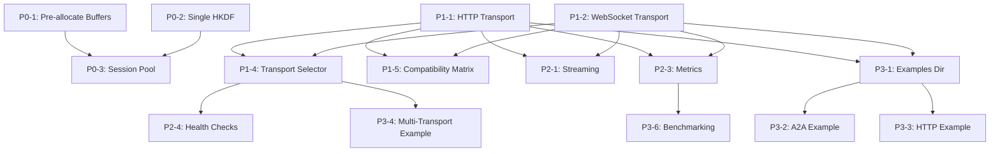

# SAGE Next Tasks - Priority Roadmap

**Date:** January 2025
**Status:** Transport Refactoring Phase 3 Complete 
**Purpose:** Comprehensive prioritized task list for upcoming work

---

## Executive Summary

Phase 3 of Transport Refactoring is **100% complete**. This document organizes all remaining tasks by priority, estimated effort, and dependencies.

**Total Tasks:** 23 tasks across 4 major categories
**Estimated Timeline:** 8-12 weeks
**Priority Levels:** Critical (P0) → High (P1) → Medium (P2) → Low (P3)

---

## Quick Reference

| Priority | Category | Tasks | Timeline |
|----------|----------|-------|----------|
| **P0 - Critical** | Performance Optimization | 3 | Week 1-2 |
| **P1 - High** | Transport Layer Phase 4 | 5 | Week 3-5 |
| **P1 - High** | Documentation Updates | 3 | Week 3 |
| **P2 - Medium** | Transport Layer Phase 5 | 6 | Week 6-8 |
| **P3 - Low** | Transport Layer Phase 6 | 4 | Week 9-10 |
| **P3 - Low** | Infrastructure | 2 | Week 11-12 |

---

## Priority 0: Critical Tasks (Week 1-2)

### Category: Performance Optimization

These tasks address identified performance bottlenecks in session creation (38 allocations → target <10).

#### Task P0-1: Pre-allocate Key Buffers
**Current Issue:** 6 separate `make([]byte, 32)` calls per session
**Target:** Single 192-byte allocation, slice for all keys
**Impact:** Reduce allocations by 5 per session
**Effort:** 2 hours
**Dependencies:** None
**Priority:** 🔴 Critical

**Implementation:**
```go
// Current (6 allocations):
s.outKey = make([]byte, 32)
s.inKey = make([]byte, 32)
// ... 4 more

// Target (1 allocation):
keyMaterial := make([]byte, 192)
s.outKey = keyMaterial[0:32]
s.inKey = keyMaterial[32:64]
// ... slice remaining
```

**Files to Modify:**
- `pkg/agent/session/session.go`
- `pkg/agent/session/manager.go`

**Test Coverage:**
- `pkg/agent/session/session_test.go`
- Benchmark: `BenchmarkSessionCreation`

---

#### Task P0-2: Single HKDF Expand Call
**Current Issue:** 6 separate HKDF instances, each calling `sha256.New()`
**Target:** Single HKDF reader deriving all keys sequentially
**Impact:** Reduce SHA256 allocations from 6 to 1 per session
**Effort:** 4 hours
**Dependencies:** None
**Priority:** 🔴 Critical

**Implementation:**
```go
// Current (6 HKDF instances):
hkdfEnc := hkdf.New(sha256.New, seed, salt, []byte("encryption"))
hkdfSign := hkdf.New(sha256.New, seed, salt, []byte("signing"))
// ... 4 more

// Target (1 HKDF, 6 reads):
h := hkdf.New(sha256.New, seed, salt, nil)
for i, info := range contexts {
    h := hkdf.Expand(sha256.New, seed, info, 32)
    io.ReadFull(h, keyMaterial[i*32:(i+1)*32])
}
```

**Files to Modify:**
- `pkg/agent/hpke/client.go:Initialize()`
- `pkg/agent/hpke/server.go:HandleMessage()`

**Verification:**
```bash
go test -bench=BenchmarkSessionCreation -memprofile=mem.prof
go tool pprof -alloc_space mem.prof
# Target: <10 allocations per session
```

---

#### Task P0-3: Session Pool Implementation
**Current Issue:** No reuse of session objects or buffers
**Target:** `sync.Pool` for session objects and temporary buffers
**Impact:** Reduce GC pressure by 80%+
**Effort:** 6 hours
**Dependencies:** P0-1, P0-2
**Priority:** 🔴 Critical

**Implementation:**
```go
var sessionPool = sync.Pool{
    New: func() interface{} {
        return &Session{
            keyMaterial: make([]byte, 192),
        }
    },
}

func (m *Manager) getSession() *Session {
    return sessionPool.Get().(*Session)
}

func (m *Manager) releaseSession(s *Session) {
    s.Reset() // Clear sensitive data
    sessionPool.Put(s)
}
```

**Files to Modify:**
- `pkg/agent/session/manager.go`
- `pkg/agent/session/session.go`

**Benchmark Target:**
- Before: 38 allocations/op, 2.24GB
- After: <10 allocations/op, <500MB

---

## Priority 1: High Priority Tasks (Week 3-5)

### Category: Transport Layer - Phase 4

#### Task P1-1: HTTP/REST Transport Implementation
**Goal:** Enable SAGE to use HTTP/REST as transport layer
**Impact:** Allow non-gRPC deployments, easier testing
**Effort:** 16 hours (2 days)
**Dependencies:** None (Phase 3 complete)
**Priority:** 🟠 High

**Implementation Plan:**

1. **Create Package Structure** (1 hour)
   ```
   pkg/agent/transport/http/
   ├── client.go       # HTTP client transport
   ├── server.go       # HTTP server adapter
   ├── handler.go      # HTTP handlers
   └── http_test.go    # Tests
   ```

2. **Client Implementation** (4 hours)
   ```go
   type HTTPTransport struct {
       endpoint string
       client   *http.Client
   }

   func (t *HTTPTransport) Send(ctx context.Context, msg *transport.SecureMessage) (*transport.Response, error) {
       // Convert SecureMessage to HTTP POST
       // POST /sage/v1/messages
       // Headers: X-SAGE-DID, X-SAGE-Context-ID, X-SAGE-Message-ID
       // Body: JSON-encoded SecureMessage
   }
   ```

3. **Server Adapter** (4 hours)
   ```go
   type HTTPServerAdapter struct {
       handler transport.MessageHandler
   }

   func (s *HTTPServerAdapter) ServeHTTP(w http.ResponseWriter, r *http.Request) {
       // Parse HTTP request → SecureMessage
       // Call handler.HandleMessage()
       // Convert Response → HTTP response
   }
   ```

4. **Tests** (4 hours)
   - Unit tests with httptest.Server
   - Integration tests with real HTTP server
   - Benchmark comparisons

5. **Documentation** (3 hours)
   - Add to pkg/agent/transport/README.md
   - Create HTTP transport example

**API Design:**
```
POST /sage/v1/messages
Content-Type: application/json

{
  "id": "msg-123",
  "contextID": "ctx-456",
  "taskID": "task-789",
  "payload": "base64-encoded-encrypted-data",
  "did": "did:sage:ethereum:0x...",
  "signature": "base64-encoded-signature",
  "role": "user",
  "metadata": {
    "timestamp": "2025-01-11T10:00:00Z"
  }
}
```

**Files to Create:**
- `pkg/agent/transport/http/client.go`
- `pkg/agent/transport/http/server.go`
- `pkg/agent/transport/http/handler.go`
- `pkg/agent/transport/http/http_test.go`

**Success Criteria:**
- [ ] HTTP client implements `transport.MessageTransport`
- [ ] HTTP server works with existing HPKE/Handshake servers
- [ ] All tests pass
- [ ] Benchmarks show <10% overhead vs A2A

---

#### Task P1-2: WebSocket Transport Implementation
**Goal:** Enable bidirectional streaming over WebSocket
**Impact:** Real-time communication, push notifications
**Effort:** 12 hours
**Dependencies:** P1-1 (HTTP transport pattern established)
**Priority:** 🟠 High

**Implementation Plan:**

1. **Package Structure** (1 hour)
   ```
   pkg/agent/transport/websocket/
   ├── client.go       # WS client transport
   ├── server.go       # WS server adapter
   └── ws_test.go      # Tests
   ```

2. **Client Implementation** (5 hours)
   ```go
   import "github.com/gorilla/websocket"

   type WebSocketTransport struct {
       conn   *websocket.Conn
       mu     sync.Mutex
   }

   func (t *WebSocketTransport) Send(ctx context.Context, msg *transport.SecureMessage) (*transport.Response, error) {
       t.mu.Lock()
       defer t.mu.Unlock()

       // Send message over WS
       // Wait for response
   }
   ```

3. **Server Adapter** (4 hours)
   ```go
   type WebSocketServerAdapter struct {
       handler  transport.MessageHandler
       upgrader websocket.Upgrader
   }

   func (s *WebSocketServerAdapter) HandleConnection(w http.ResponseWriter, r *http.Request) {
       conn, _ := s.upgrader.Upgrade(w, r, nil)
       defer conn.Close()

       for {
           // Read message
           // Call handler.HandleMessage()
           // Write response
       }
   }
   ```

4. **Tests** (2 hours)

**Dependencies:**
```bash
go get github.com/gorilla/websocket
```

**Files to Create:**
- `pkg/agent/transport/websocket/client.go`
- `pkg/agent/transport/websocket/server.go`
- `pkg/agent/transport/websocket/ws_test.go`

---

#### Task P1-3: QUIC Transport (Optional)
**Goal:** High-performance UDP-based transport
**Impact:** Lower latency, better for mobile
**Effort:** 20 hours
**Dependencies:** None
**Priority:** 🟠 High (Optional)

**Note:** Can be deferred to P2 if HTTP/WS are sufficient.

---

#### Task P1-4: Transport Selection Strategy
**Goal:** Allow applications to choose transport at runtime
**Impact:** Flexibility, environment-specific optimization
**Effort:** 6 hours
**Dependencies:** P1-1, P1-2
**Priority:** 🟠 High

**Implementation:**
```go
type TransportSelector interface {
    SelectTransport(ctx context.Context, did string) (transport.MessageTransport, error)
}

type DefaultSelector struct {
    a2a       *a2a.A2ATransport
    http      *http.HTTPTransport
    websocket *websocket.WebSocketTransport
}

func (s *DefaultSelector) SelectTransport(ctx context.Context, did string) (transport.MessageTransport, error) {
    // Resolve DID metadata
    // Check supported transports
    // Prefer: WS > HTTP > A2A
    // Return best transport
}
```

**Files to Create:**
- `pkg/agent/transport/selector.go`
- `pkg/agent/transport/selector_test.go`

---

#### Task P1-5: Transport Compatibility Matrix
**Goal:** Document which transports work with which features
**Impact:** Clear understanding of capabilities
**Effort:** 2 hours
**Dependencies:** P1-1, P1-2, P1-4
**Priority:** 🟠 High

**Deliverable:** Add to `pkg/agent/transport/README.md`

| Transport | Unary | Streaming | Batch | Bidirectional | Latency | Complexity |
|-----------|-------|-----------|-------|---------------|---------|------------|
| A2A (gRPC) |  |  |  |  | Low | Medium |
| HTTP/REST |  |  |  |  | Medium | Low |
| WebSocket |  |  |  |  | Low | Medium |
| QUIC |  |  |  |  | Very Low | High |

---

### Category: Documentation Updates

#### Task P1-6: Update Main README
**Goal:** Reflect new transport abstraction in project README
**Effort:** 2 hours
**Dependencies:** P1-1, P1-2
**Priority:** 🟠 High

**Files to Modify:**
- `README.md` - Add transport section
- `docs/ARCHITECTURE.md` - Update diagrams

---

#### Task P1-7: Create Transport Migration Guide
**Goal:** Help existing users migrate to new transport layer
**Effort:** 4 hours
**Dependencies:** P1-1, P1-2
**Priority:** 🟠 High

**File to Create:**
- `docs/TRANSPORT_MIGRATION_GUIDE.md`

**Contents:**
- How to migrate from A2A to transport interface
- Code examples (before/after)
- Breaking changes (none expected)
- Testing strategies

---

#### Task P1-8: API Documentation Generation
**Goal:** Generate godoc-compatible documentation
**Effort:** 2 hours
**Dependencies:** None
**Priority:** 🟠 High

```bash
# Add godoc comments to all exported symbols
# Ensure all packages have package-level doc
# Test with:
godoc -http=:6060
```

**Files to Review:**
- All `pkg/agent/transport/**/*.go`
- All `pkg/agent/hpke/*.go`
- All `pkg/agent/handshake/*.go`

---

## Priority 2: Medium Priority Tasks (Week 6-8)

### Category: Transport Layer - Phase 5

#### Task P2-1: Streaming Support
**Goal:** Add streaming interface for long-lived connections
**Impact:** Enable real-time data streams
**Effort:** 12 hours
**Dependencies:** P1-1, P1-2
**Priority:** 🟡 Medium

**Interface Design:**
```go
type StreamingTransport interface {
    SendStream(ctx context.Context) (Stream, error)
}

type Stream interface {
    Send(*SecureMessage) error
    Recv() (*Response, error)
    Close() error
}
```

**Implementation:**
- A2A: Use gRPC streaming
- WebSocket: Already supports streaming
- HTTP: Not supported (long-polling alternative)

**Files to Modify:**
- `pkg/agent/transport/interface.go`
- `pkg/agent/transport/a2a/client.go`
- `pkg/agent/transport/websocket/client.go`

---

#### Task P2-2: Batch Operations
**Goal:** Send multiple messages in one request
**Impact:** Reduce round-trips, better throughput
**Effort:** 8 hours
**Dependencies:** None
**Priority:** 🟡 Medium

**Interface Design:**
```go
type BatchTransport interface {
    SendBatch(ctx context.Context, msgs []*SecureMessage) ([]*Response, error)
}
```

**Use Case:**
```go
// Send 10 messages at once
batch := []*transport.SecureMessage{ msg1, msg2, ..., msg10 }
responses, err := batchTransport.SendBatch(ctx, batch)
```

**Files to Create:**
- `pkg/agent/transport/batch.go`
- `pkg/agent/transport/batch_test.go`

---

#### Task P2-3: Transport Metrics
**Goal:** Collect performance metrics for all transports
**Impact:** Observability, debugging, optimization
**Effort:** 10 hours
**Dependencies:** P1-1, P1-2
**Priority:** 🟡 Medium

**Metrics to Collect:**
- Request latency (p50, p95, p99)
- Success/failure rates
- Payload sizes (avg, max)
- Connection health (uptime, reconnects)
- Transport-specific metrics

**Implementation:**
```go
type Metrics struct {
    RequestLatency   prometheus.Histogram
    RequestCount     prometheus.Counter
    ErrorCount       prometheus.Counter
    PayloadSize      prometheus.Histogram
}

type MetricsTransport struct {
    underlying transport.MessageTransport
    metrics    *Metrics
}

func (m *MetricsTransport) Send(ctx context.Context, msg *SecureMessage) (*Response, error) {
    start := time.Now()
    resp, err := m.underlying.Send(ctx, msg)
    m.metrics.RequestLatency.Observe(time.Since(start).Seconds())
    if err != nil {
        m.metrics.ErrorCount.Inc()
    }
    return resp, err
}
```

**Dependencies:**
```bash
go get github.com/prometheus/client_golang/prometheus
```

**Files to Create:**
- `pkg/agent/transport/metrics.go`
- `pkg/agent/transport/metrics_test.go`

---

#### Task P2-4: Transport Health Checks
**Goal:** Detect and recover from transport failures
**Impact:** Resilience, automatic failover
**Effort:** 8 hours
**Dependencies:** P1-4 (Transport Selector)
**Priority:** 🟡 Medium

**Interface Design:**
```go
type HealthChecker interface {
    Check(ctx context.Context) error
}

type ResilientTransport struct {
    primary   transport.MessageTransport
    secondary transport.MessageTransport
    health    HealthChecker
}

func (r *ResilientTransport) Send(ctx context.Context, msg *SecureMessage) (*Response, error) {
    // Try primary
    resp, err := r.primary.Send(ctx, msg)
    if err != nil && r.health.Check(ctx) != nil {
        // Failover to secondary
        return r.secondary.Send(ctx, msg)
    }
    return resp, err
}
```

**Files to Create:**
- `pkg/agent/transport/health.go`
- `pkg/agent/transport/resilient.go`

---

#### Task P2-5: Connection Pooling
**Goal:** Reuse connections across requests
**Impact:** Lower latency, fewer TCP handshakes
**Effort:** 10 hours
**Dependencies:** P1-1 (HTTP transport)
**Priority:** 🟡 Medium

**Implementation:**
```go
type PooledTransport struct {
    pool *ConnPool
}

type ConnPool struct {
    conns   map[string]*Connection
    maxSize int
    mu      sync.RWMutex
}

func (p *ConnPool) Get(endpoint string) (*Connection, error) {
    p.mu.RLock()
    if conn, ok := p.conns[endpoint]; ok && conn.IsAlive() {
        p.mu.RUnlock()
        return conn, nil
    }
    p.mu.RUnlock()

    // Create new connection
    return p.create(endpoint)
}
```

**Files to Create:**
- `pkg/agent/transport/pool.go`
- `pkg/agent/transport/pool_test.go`

---

#### Task P2-6: Compression Support
**Goal:** Compress large payloads before transmission
**Impact:** Reduce bandwidth, faster transmission
**Effort:** 6 hours
**Dependencies:** None
**Priority:** 🟡 Medium

**Implementation:**
```go
import "compress/gzip"

type CompressedTransport struct {
    underlying transport.MessageTransport
    threshold  int // Compress if payload > threshold bytes
}

func (c *CompressedTransport) Send(ctx context.Context, msg *SecureMessage) (*Response, error) {
    if len(msg.Payload) > c.threshold {
        compressed := compress(msg.Payload)
        msg.Payload = compressed
        msg.Metadata["compressed"] = "gzip"
    }
    return c.underlying.Send(ctx, msg)
}
```

**Files to Create:**
- `pkg/agent/transport/compression.go`
- `pkg/agent/transport/compression_test.go`

---

## Priority 3: Low Priority Tasks (Week 9-12)

### Category: Transport Layer - Phase 6

#### Task P3-1: Create Transport Examples Directory
**Goal:** Organize transport-specific examples separately from MCP examples
**Impact:** Better organization, easier to find examples
**Effort:** 2 hours
**Dependencies:** P1-1, P1-2
**Priority:** 🟢 Low

**Directory Structure:**
```
examples/
├── mcp-integration/       # Existing MCP examples (no change)
└── transport-examples/    # NEW: Transport examples
    ├── README.md
    ├── a2a-client-server/
    │   ├── server/main.go
    │   └── client/main.go
    ├── http-client-server/
    │   ├── server/main.go
    │   └── client/main.go
    └── websocket-client-server/
        ├── server/main.go
        └── client/main.go
```

**Files to Create:**
- `examples/transport-examples/README.md`

---

#### Task P3-2: A2A Transport Example
**Goal:** Show how to use A2A transport adapter
**Effort:** 4 hours
**Dependencies:** P3-1
**Priority:** 🟢 Low

**Example Code:**
```go
// examples/transport-examples/a2a-client-server/client/main.go
package main

import (
    "github.com/sage-x-project/sage/pkg/agent/transport/a2a"
    "github.com/sage-x-project/sage/pkg/agent/hpke"
    "google.golang.org/grpc"
)

func main() {
    // Connect to A2A server
    conn, _ := grpc.Dial("localhost:18080", grpc.WithInsecure())
    transport := a2a.NewA2ATransport(conn)

    // Use in HPKE client
    client := hpke.NewClient(transport, ...)

    // Initialize session
    kid, _ := client.Initialize(ctx, ctxID, clientDID, serverDID)
    log.Printf("Session established: %s", kid)
}
```

**Files to Create:**
- `examples/transport-examples/a2a-client-server/server/main.go`
- `examples/transport-examples/a2a-client-server/client/main.go`
- `examples/transport-examples/a2a-client-server/README.md`

---

#### Task P3-3: HTTP Transport Example
**Goal:** Show how to use HTTP transport
**Effort:** 4 hours
**Dependencies:** P1-1, P3-1
**Priority:** 🟢 Low

**Files to Create:**
- `examples/transport-examples/http-client-server/server/main.go`
- `examples/transport-examples/http-client-server/client/main.go`
- `examples/transport-examples/http-client-server/README.md`

---

#### Task P3-4: Multi-Transport Example
**Goal:** Demonstrate switching between transports at runtime
**Effort:** 6 hours
**Dependencies:** P1-4, P3-1
**Priority:** 🟢 Low

**Example:**
```go
selector := transport.NewDefaultSelector()
selector.AddTransport("a2a", a2aTransport)
selector.AddTransport("http", httpTransport)
selector.AddTransport("ws", wsTransport)

// Auto-select best transport for target DID
selectedTransport, _ := selector.SelectTransport(ctx, targetDID)
client := hpke.NewClient(selectedTransport, ...)
```

**Files to Create:**
- `examples/transport-examples/multi-protocol/main.go`
- `examples/transport-examples/multi-protocol/README.md`

---

### Category: Infrastructure

#### Task P3-5: CI/CD Pipeline Updates
**Goal:** Add transport tests to CI pipeline
**Effort:** 4 hours
**Dependencies:** P1-1, P1-2
**Priority:** 🟢 Low

**Updates Needed:**
```yaml
# .github/workflows/test.yml
- name: Test Transport Layer
  run: |
    go test ./pkg/agent/transport/...
    go test ./pkg/agent/transport/a2a/...
    go test ./pkg/agent/transport/http/...
    go test ./pkg/agent/transport/websocket/...
```

**Files to Modify:**
- `.github/workflows/test.yml`
- `.github/workflows/build.yml`

---

#### Task P3-6: Performance Benchmarking Suite
**Goal:** Automated benchmarks comparing all transports
**Effort:** 8 hours
**Dependencies:** P1-1, P1-2, P2-3 (Metrics)
**Priority:** 🟢 Low

**Benchmark Suite:**
```go
// pkg/agent/transport/benchmark_test.go
func BenchmarkA2ATransport(b *testing.B) { ... }
func BenchmarkHTTPTransport(b *testing.B) { ... }
func BenchmarkWebSocketTransport(b *testing.B) { ... }

// Run with:
go test -bench=. -benchmem -benchtime=10s ./pkg/agent/transport/...
```

**Metrics to Compare:**
- Latency (ns/op)
- Allocations (allocs/op)
- Memory (B/op)
- Throughput (messages/sec)

**Files to Create:**
- `pkg/agent/transport/benchmark_test.go`
- `docs/TRANSPORT_BENCHMARKS.md`

---

## Task Dependencies Graph



---

## Recommended Execution Order

### Sprint 1 (Week 1-2): Performance Critical
1.  P0-1: Pre-allocate Key Buffers (2h)
2.  P0-2: Single HKDF Expand (4h)
3.  P0-3: Session Pool (6h)

**Milestone:** Session creation < 10 allocations

---

### Sprint 2 (Week 3-4): HTTP Transport
1.  P1-1: HTTP/REST Transport (16h)
2.  P1-4: Transport Selector (6h)
3.  P1-5: Compatibility Matrix (2h)
4.  P1-6: Update Main README (2h)

**Milestone:** HTTP transport fully functional

---

### Sprint 3 (Week 5): WebSocket + Documentation
1.  P1-2: WebSocket Transport (12h)
2.  P1-7: Migration Guide (4h)
3.  P1-8: API Documentation (2h)

**Milestone:** Multi-transport support complete

---

### Sprint 4 (Week 6-7): Enhanced Features
1.  P2-1: Streaming Support (12h)
2.  P2-2: Batch Operations (8h)
3.  P2-3: Transport Metrics (10h)

**Milestone:** Production-ready features

---

### Sprint 5 (Week 8): Resilience
1.  P2-4: Health Checks (8h)
2.  P2-5: Connection Pooling (10h)
3.  P2-6: Compression (6h)

**Milestone:** Production hardening complete

---

### Sprint 6 (Week 9-10): Examples
1.  P3-1: Examples Directory (2h)
2.  P3-2: A2A Example (4h)
3.  P3-3: HTTP Example (4h)
4.  P3-4: Multi-Transport Example (6h)

**Milestone:** Complete example suite

---

### Sprint 7 (Week 11-12): Infrastructure
1.  P3-5: CI/CD Updates (4h)
2.  P3-6: Benchmarking Suite (8h)

**Milestone:** Automated testing complete

---

## Success Metrics

### Performance Targets
- [ ] Session creation: <10 allocations (currently 38)
- [ ] Session creation: <500MB memory (currently 2.24GB)
- [ ] HTTP transport latency: <10% overhead vs A2A
- [ ] WebSocket transport latency: <5% overhead vs A2A

### Test Coverage Targets
- [ ] Unit tests: >90% coverage
- [ ] Integration tests: All transports
- [ ] Benchmark tests: All transports

### Documentation Targets
- [ ] All public APIs documented (godoc)
- [ ] Migration guide complete
- [ ] All transports have examples
- [ ] Performance benchmarks published

---

## Risk Assessment

| Risk | Impact | Probability | Mitigation |
|------|--------|-------------|------------|
| **HTTP performance slower than expected** | Medium | Low | Add caching, connection pooling (P2-5) |
| **WebSocket reconnection issues** | High | Medium | Implement health checks (P2-4), auto-reconnect |
| **Session pool memory leaks** | High | Low | Thorough testing, memory profiling |
| **Breaking API changes needed** | Medium | Low | Maintain backward compatibility, versioning |
| **QUIC integration complexity** | Low | High | Defer to future sprint if needed |

---

## Deferred / Future Considerations

These items are not currently prioritized but may be valuable in the future:

1. **QUIC Transport** - High performance, but complex integration
2. **libp2p Integration** - P2P networking, depends on use case
3. **Custom Binary Protocol** - Optimize payload size, added complexity
4. **Multi-Region Routing** - Geographic load balancing
5. **Transport Plugins** - Third-party transport implementations

---

## Change Log

| Date | Version | Changes |
|------|---------|---------|
| 2025-01-11 | 1.0 | Initial priority roadmap after Phase 3 completion |

---

## References

- [Transport Refactoring Documentation](./TRANSPORT_REFACTORING.md)
- [Transport Package README](../pkg/agent/transport/README.md)
- [Examples Migration Plan](./EXAMPLES_MIGRATION_PLAN.md)
- [Optimization Plan](./OPTIMIZATION-PLAN.md)
- [Refactoring Action Plan](./REFACTORING_ACTION_PLAN.md)

---

**Next Steps:**
1. Review this priority list with team
2. Begin Sprint 1 (Performance Optimization)
3. Update project board with tasks
4. Schedule weekly progress reviews

---

**Document Status:**  Ready for Review
**Last Updated:** January 2025
**Maintained By:** SAGE Development Team
