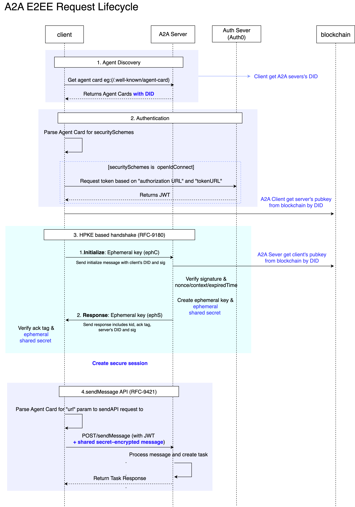

# Secure Session Communication

SAGE 프로토콜은 에이전트간 통신에서 종단간 보안을 제공하기 위해 기존 [A2A 프로토콜](https://a2a-protocol.org/latest/topics/what-is-a2a/#a2a-request-lifecycle)에 핸드쉐이크 단계를 추가해 보호된 세션을 생성합니다. 세션이 성립되면 이후 모든 요청/응답은 대칭키 기반 AEAD 암호화로 보호되며, 헤더·메서드·경로 등의 메타데이터는 RFC 9421(HTTP Message Signatures) 스타일의 HMAC으로 무결성과 리플레이 방지를 보장합니다.

### DID를 이용한 신원보장

에이전트의 신원 공개키는 DID Registry에 앵커되어 DID Document(verificationMethod) 로 공개됩니다. 핸드셰이크에서 각 당사자는 임시 X25519 공개키와 컨텍스트를 자신의 장기 Ed25519 신원 키로 서명해 교환하고, 상대는 DID Document의 공개키로 이를 검증합니다. 이로써 단기 세션 키 ↔ 장기 신원 키가 암호학적으로 바인딩되어 중간자 공격(Man-in-Middle Attack)시도를 차단합니다.

### 장기 키(신원 키) & 단키 키(세션 키) 분리를 통한 전방향 비밀성(PFS) 보장

- 장기 신원 키는 DID에 앵커된 공개키로 제공되며, 핸드셰이크 단계에서 해당 키의 서명을 검증해 피어 신원을 보장합니다.
- 세션 키는 매 세션 새로 생성되는 ECDH 공유 비밀에서 HKDF로 파생되어 사용되므로, 장기 개인키가 유출되어도 과거 트래픽은 복호화되지 않습니다(PFS).
- 장기 신원 키는 이상 징후 발생 시 즉시 변경하며, 키 교체 주기는 조직 보안 정책에 따르되 일반적으로 6–12개월을 권장합니다. 키 회전 원칙이고, 회전 주기는 조직 보안정책에 따라 결정합니다.(6개월 ~ 1년으로 권장)

### End-to-End Encryption

A2A E2EE 구성

1. DID 등록 (DID Registry)  
   각 체인별로 운영되는 DID Registry에 에이전트의 DID와 메타데이터를 제출합니다.
   등록되는 메타데이터에는 보통 다음이 포함됩니다:

   - DID 식별자 (예: did:sage:ethereum:agent001)
   - 공개키 (서명 검증 및 키 교환에 사용)

   이 과정을 통해 에이전트의 신원(Identity) 과 연결 정보가 공개적으로 검증 가능하게 됩니다.

2. DID 조회 및 Resolve (Agent Discovery → Registry)
   통신을 시작할 때, 상대방 DID로 Registry를 Resolve 하여 다음 정보를 가져옵니다:

   - 상대방 공개키(서명 검증·암호화에 사용)
     이 과정은 A2A Agent Discovery 레이어가 담당하며, DID → PublicKey/Endpoint 매핑을 보장합니다.

3. 핸드쉐이크
   4단계

4. **Invitation** (agent A -> agent B): 세션 생성 요청
5. **Request** (agent A -> agent B): ephemeral 키 전송 (Ed25519 신원 키로 암호화 및 서명)
6. **Response** (agent B -> agent A): ephemeral 키 전송 (Ed25519 신원 키로 암호화 및 서명)
7. **Complete** (agent A -> agnet B): 세션 생성 후 세션에 해당하는 keyid(kid) 응답

- 보안 세션 통신
  - 핸드쉐이크 완료 후, agent A와 agent B는 같은 shared secret을 기반으로 동일한 session seed/ID와 세션 키를 가집니다.
  - 서버는 클라이언트가 보낸 kid로 같은 session ID를 갖는 세션을 생성하고, 그 세션 내에서 유효한 키로 검증/복호화를 수행합니다.
  - 각 요청은 리플레이 방지를 위해 고유 nonce를 포함하고, 서버는 (kid, nonce) 캐시로 재사용을 차단합니다.
  - 세션 수명은 정책(MaxAge, IdleTimeout, MaxMessages)으로 관리되며, 만료 시 kid 매핑과 관련 캐시가 정리됩니다.
  - 세션 내 모든 메시지는 세션 키로 암호화 및 서명되어 종단 간 보안이 보장됩니다.
  - HTTP 메시지는 RFC 9421 서명 규칙에 따라 `Signature-Input`과 `Signature` 헤더로 교환한다.
    1. 클라이언트는 메서드, 경로, 호스트, 날짜, 콘텐츠 다이제스트를 순서대로 결합해 서명 대상을 만든다.
    2. 공유된 세션 키로 HMAC을 계산해 서명 값을 만들고, kid와 nonce를 헤더에 넣는다.
    3. 서버는 동일한 입력을 재생성해 서명을 검증하고, nonce 재사용을 감시한다.

### Cryptography

- Identity: Ed25519 (DID→verificationMethod)
- Key Agreement: X25519 (ephemeral)
- KDF: HKDF-SHA256
- AEAD: ChaCha20-Poly1305
- Message Signatures: HMAC-SHA256 (RFC 9421 style)
- Replay: kid + nonce cache, Date/Expires, IdleTimeout/MaxMessages
