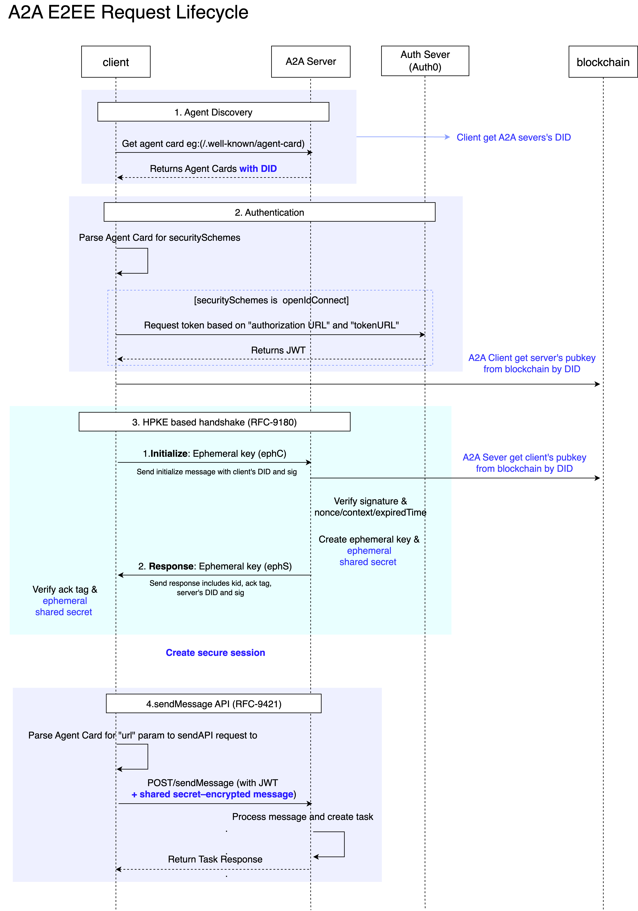

# Secure Session Communication

SAGE 프로토콜은 종단간 보안을 제공하기 위해 기존 [에이전트 간 통신(Agent-to-Agent, A2A) 프로토콜](https://a2a-protocol.org/latest/topics/what-is-a2a/#a2a-request-lifecycle)에 핸드쉐이크 단계를 추가하여 보호된 세션을 생성합니다. 세션이 성립되면 이후 모든 요청/응답은 대칭키 기반 AEAD 암호화로 보호되며, 헤더·메서드·경로 등의 메타데이터는 RFC 9421(HTTP Message Signatures) 스타일의 HMAC으로 무결성과 리플레이 방지를 보장합니다.

### DID를 이용한 신원보장

에이전트의 신원 공개키는 DID Registry에 앵커되어 DID Document(verificationMethod)로 공개됩니다. 핸드셰이크에서 각 에이전트는 세션에서 사용할 임시(X25519) 공개키와 컨텍스트를 자신의 DID 신원 키(Ed25519)로 서명해 교환하고, 상대는 DID Document에서 얻은 공개키로 서명을 검증합니다.
이 과정으로 “누구와 통신하는지”가 암호학적으로 확정되며, 임시 키가 신원 키에 바인딩되기 때문에 중간자(MitM)가 임시 키를 바꿔치기 하면 서명이 깨져 차단됩니다.

검증된 신원의 에이전트끼리는 임시 키 교환으로 생성된 공유 비밀(shared secret)로부터 단기 세션 키로 파생합니다. 이 세션 키는 세션 동안 AEAD 암·복호화와 HMAC 서명에 사용되며, 결과적으로 세션 범위의 모든 통신이 신원이 보장된 상대와만 안전하게 이루어집니다.

### 장기 키(신원 키) & 단키 키(세션 키) 분리를 통한 전방향 비밀성(PFS) 보장

- 장기 신원 키는 DID에 앵커된 공개키로 제공되며, 핸드셰이크 단계에서 해당 키의 서명을 검증해 상대 에이전트의 신원을 보장합니다.
- 세션 키는 매 세션 새로 생성되는 ECDH 공유 비밀에서 HKDF로 파생되어 사용되므로, 장기 개인키가 유출되어도 과거 트래픽은 복호화되지 않습니다(PFS).
- 장기 신원 키는 이상 징후 발생 시 즉시 변경하며, 키 교체 주기는 조직 보안 정책에 따르되 일반적으로 6–12개월을 권장합니다. 키 회전 원칙이고, 회전 주기는 조직 보안정책에 따라 결정합니다.(6개월 ~ 1년으로 권장)

### End-to-End Encryption

A2A E2EE 구성

1. DID 등록 (DID Registry)  
   각 체인별로 운영되는 DID Registry에 에이전트의 DID와 메타데이터를 제출합니다.
   등록되는 메타데이터에는 보통 다음이 포함됩니다:

   - DID 식별자 (예: did:sage:ethereum:agent001)
   - 공개키 (서명 검증 및 키 교환에 사용)

   이 과정을 통해 에이전트의 신원(Identity) 과 연결 정보가 공개적으로 검증 가능하게 됩니다.

2. DID 조회 및 Resolve (Agent Discovery → Registry)
   통신을 시작할 때, 상대방 DID로 Registry를 Resolve 하여 다음 정보를 가져옵니다:

   - 상대방 공개키(서명 검증·암호화에 사용)
     이 과정은 A2A Agent Discovery 레이어가 담당하며, DID → PublicKey/Endpoint 매핑을 보장합니다.

3. 핸드쉐이크
   4단계

   1. **Invitation** (agent A -> agent B): 세션 생성 요청
   2. **Request** (agent A -> agent B): ephemeral 키 전송 (Ed25519 신원 키로 암호화 및 서명)
   3. **Response** (agent B -> agent A): ephemeral 키 전송 (Ed25519 신원 키로 암호화 및 서명)
   4. **Complete** (agent A -> agnet B): 세션 생성 후 세션키 식별자 keyid(kid) 응답

4. 보안 세션 통신  
   핸드셰이크가 완료되면 에이전트 A와 B는 동일한 shared secret을 공유하고, 이를 바탕으로 같은 ID를 갖는 세션을 생성 합니다. 이후 모든 요청/응답은 이 세션 키로 보호됩니다.

   **RFC 9421 (HTTP Message Signatures)**

   1. HTTP 메시지는 Signature-Input과 Signature 헤더를 사용합니다.
   2. @method, @path, host, date, content-digest를 순서대로 결합해 서명 대상을 만듭니다.
   3. 공유된 세션 키로 HMAC을 계산해 서명 값을 만들고, kid와 nonce를 헤더에 포함합니다.
   4. 메세지는 세션 내 암호화 키로 암호화하고, 서명키로 서명하여 전송합니다.

   이에 따라 세션 내 모든 메시지는 세션 키로 암호화되고 HMAC으로 서명되어, 종단 간 기밀성과 무결성이 보장됩니다.

   **추가 보안 사항**

   - 각 요청은 (kid, nonce) 캐시로 재전송(Replay)을 차단합니다.
   - 세션 수명은 MaxAge, IdleTimeout, MaxMessages 정책으로 관리되며, 만료 시 관련 캐시를 정리합니다.

### Cryptography

- Identity: Ed25519 (DID→verificationMethod)
- Key Agreement: X25519 (ephemeral)
- KDF: HKDF-SHA256
- AEAD: ChaCha20-Poly1305
- Message Signatures: HMAC-SHA256 (RFC 9421 style)
- Replay: kid + nonce cache, Date/Expires, IdleTimeout/MaxMessages
