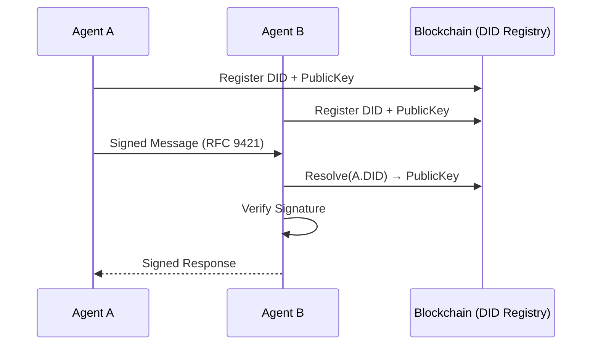
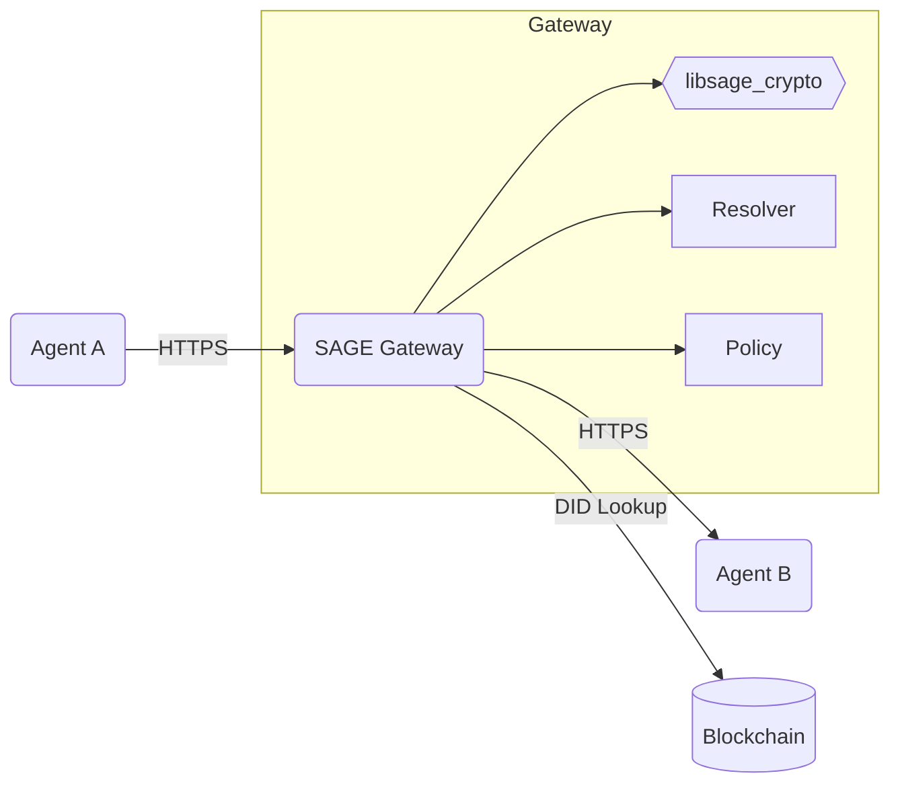
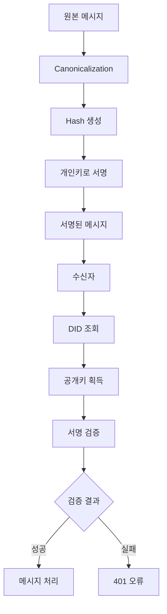
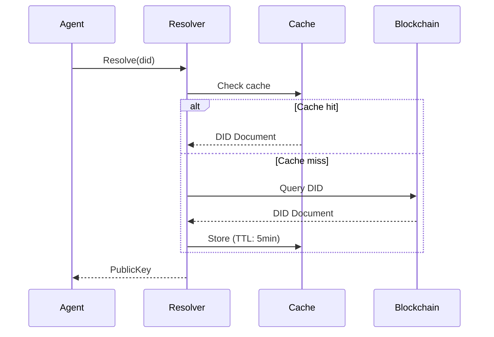

# SAGE 아키텍처 문서

## 목차

- [1. 아키텍처 개요](#1-아키텍처-개요)
- [2. 시스템 구성](#2-시스템-구성)
- [3. 모듈 설계](#3-모듈-설계)
- [4. 데이터 흐름](#4-데이터-흐름)
- [5. 기술 스택](#5-기술-스택)
- [6. 배포 구조](#6-배포-구조)

## 1. 아키텍처 개요

SAGE는 두 가지 통신 모드를 지원하는 유연한 아키텍처로 설계되었습니다:

### Direct P2P 모드 (현재 구현)
에이전트 간 직접 통신으로 최소한의 지연시간과 최대한의 자율성을 제공합니다.



### Gateway 모드 (향후 계획)
중앙 라우터를 통한 정책 기반 통신으로 기업 환경에 적합합니다.
**참고: Gateway 모드는 별도 프로젝트로 구현 예정이며, 현재 문서는 향후 개발 시 참조용입니다.**



## 2. 시스템 구성

### 핵심 컴포넌트

| 컴포넌트 | 역할 | 구현 언어 | 상태 |
|----------|------|-----------|------|
| **Crypto Module** | 키 관리, 서명/검증 | Go | 구현 완료 |
| **DID Module** | DID 관리 및 조회 | Go | 구현 완료 |
| **RFC9421 Core** | HTTP 메시지 서명 | Go | 구현 완료 |
| **CLI Tools** | sage-crypto, sage-did | Go | 구현 완료 |
| **Agent SDK** | 메시지 서명/검증, DID 관리 | Go, TypeScript | 별도 프로젝트 계획 |
| **libsage_crypto** | RFC 9421 서명 엔진 | Rust | 별도 프로젝트 진행 중 |
| **Gateway** | 라우팅, 정책, 감사 | Go | 향후 계획 |
| **Policy Engine** | 접근 제어, Rate Limiting | Go | 향후 계획 |
| **HTTP Server Integration** | HTTP 서버 통합 | Go | 향후 계획 |

### 계층 구조

```
┌─────────────────────────────────────────┐
│          Application Layer              │
│    (AI Agents, MCP Tools, Services)    │
├─────────────────────────────────────────┤
│           SDK Layer                     │
│    (Go SDK, TypeScript SDK)            │
├─────────────────────────────────────────┤
│          Core Layer                     │
│  (Signature, DID, Message, Resolver)   │
├─────────────────────────────────────────┤
│        Infrastructure Layer             │
│   (Blockchain RPC, Storage, Network)   │
└─────────────────────────────────────────┘
```

## 3. 모듈 설계

### 3.1 현재 디렉터리 구조

```
sage/
├── core/               # 핵심 로직
│   ├── rfc9421/        # RFC 9421 구현
│   │   ├── types.go
│   │   ├── parser.go
│   │   ├── canonicalizer.go
│   │   ├── verifier.go
│   │   └── message_builder.go
│   └── verification_service.go
│
├── crypto/             # 암호화 모듈
│   ├── keys/           # 키 관리
│   ├── formats/        # JWK, PEM 지원
│   ├── storage/        # 키 저장소
│   ├── rotation/       # 키 회전
│   └── chain/          # 블록체인 주소
│
├── did/                # DID 모듈
│   ├── manager.go      # DID 관리
│   ├── registry.go     # DID 레지스트리
│   ├── resolver.go     # DID 해석기
│   ├── ethereum/       # Ethereum 구현
│   └── solana/         # Solana 구현
│
├── cmd/                # CLI 도구
│   ├── sage-crypto/    # 암호화 CLI
│   └── sage-did/       # DID CLI
│
├── examples/           # 사용 예제
│   └── mcp-integration/ # MCP 통합 예제
├── pkg/                # 공개 API
└── rust/               # Rust 암호화 엔진
    └── sage_crypto/
```

### 3.2 모듈 책임

#### Core 모듈
- **signature**: RFC 9421 canonicalization, 서명 생성/검증
- **did**: DID Document 파싱, 공개키 추출
- **resolver**: 블록체인 통신, DID 조회, 캐싱
- **message**: 서명된 메시지 구조체 정의

#### Server 모듈 (Gateway용)
- **handler**: REST API 엔드포인트 구현
- **middleware**: 서명 검증, 정책 확인, 로깅
- **router**: HTTP 라우팅 및 미들웨어 체인

#### libsage_crypto (Rust)
- Ed25519/ECDSA 서명 알고리즘
- SHA-256 해시 함수
- FFI 및 WASM 바인딩

### 3.3 인터페이스 설계

```go
// core/signature/signature.go
type Signer interface {
    Sign(data []byte, privKey []byte) ([]byte, error)
    Verify(data []byte, sig []byte, pubKey []byte) bool
}

// core/resolver/resolver.go
type Resolver interface {
    Resolve(did string) (*did.DIDDocument, error)
}

// core/agent/agent.go
type Agent interface {
    CreateMessage(path string, headers map[string]string, body []byte) (*SignedMessage, error)
    VerifyMessage(msg *SignedMessage, senderDID string) error
}
```

## 4. 데이터 흐름

### 4.1 메시지 서명 흐름



### 4.2 DID 조회 흐름



## 5. 기술 스택

### 5.1 핵심 기술

| 영역 | 기술 | 선택 이유 |
|------|------|-----------|
| **블록체인** | Ethereum, Solana | DID 표준 지원, 생태계 성숙도 |
| **DID** | W3C DID v1.0 | 업계 표준, 상호운용성 |
| **서명** | RFC 9421 | HTTP 메시지 부분 서명 지원 |
| **암호화** | Ed25519, ECDSA | 성능과 보안의 균형 |
| **전송** | HTTP/2, TLS 1.3 | 성능, 보안, 호환성 |

### 5.2 개발 도구

| 도구 | 용도 |
|------|------|
| **Go 1.19+** | 서버, SDK 개발 |
| **Rust 1.65+** | 암호화 엔진 |
| **TypeScript 4.5+** | 웹 SDK |
| **Protocol Buffers** | gRPC 통신 |
| **Docker** | 컨테이너화 |
| **Kubernetes** | 오케스트레이션 |

### 5.3 의존성

```toml
# Go 주요 의존성
github.com/gin-gonic/gin       # HTTP 서버
github.com/go-redis/redis       # 캐싱
github.com/ethereum/go-ethereum # 블록체인 통신
google.golang.org/grpc          # 내부 통신

# Rust 주요 의존성
ed25519-dalek = "1.0"           # 서명 알고리즘
wasm-bindgen = "0.2"            # WASM 바인딩
ffi-support = "0.4"             # FFI 지원
```

## 6. 배포 구조

### 6.1 컨테이너 구성

```yaml
version: '3.8'
services:
  gateway:
    image: sage/gateway:latest
    ports:
      - "8080:8080"
    environment:
      - REDIS_URL=redis://cache:6379
      - BLOCKCHAIN_RPC=https://eth.rpc.url
    
  cache:
    image: redis:7-alpine
    volumes:
      - cache_data:/data
      
  agent:
    image: sage/agent:latest
    environment:
      - DID=did:ethr:0x...
      - PRIVATE_KEY_PATH=/keys/private.pem
```

### 6.2 Kubernetes 배포

```yaml
apiVersion: apps/v1
kind: Deployment
metadata:
  name: sage-gateway
spec:
  replicas: 3
  selector:
    matchLabels:
      app: sage-gateway
  template:
    spec:
      containers:
      - name: gateway
        image: sage/gateway:latest
        resources:
          requests:
            memory: "256Mi"
            cpu: "500m"
          limits:
            memory: "512Mi"
            cpu: "1000m"
```

### 6.3 확장성 고려사항

1. **수평 확장**: Gateway는 무상태로 설계되어 쉽게 확장 가능
2. **캐시 계층**: Redis 클러스터로 DID 조회 성능 향상
3. **부하 분산**: L7 로드밸런서로 트래픽 분산
4. **모니터링**: Prometheus + Grafana로 메트릭 수집

## 아키텍처 결정 기록 (ADR)

### ADR-001: Rust 암호화 엔진 채택
- **상태**: 승인됨
- **컨텍스트**: 고성능 암호화 연산 필요
- **결정**: Rust로 핵심 암호화 로직 구현
- **결과**: 메모리 안전성 보장, WASM 지원으로 다중 플랫폼 대응

### ADR-002: Direct P2P를 기본 모드로 선택
- **상태**: 승인됨
- **컨텍스트**: 최소 지연시간과 자율성 요구
- **결정**: Gateway는 선택적 기능으로 제공
- **결과**: 단순한 아키텍처, 확장 가능한 설계

### ADR-003: 블록체인 추상화 계층
- **상태**: 제안됨
- **컨텍스트**: 다양한 블록체인 지원 필요
- **결정**: Resolver 인터페이스로 블록체인 종속성 분리
- **결과**: 새로운 블록체인 쉽게 추가 가능