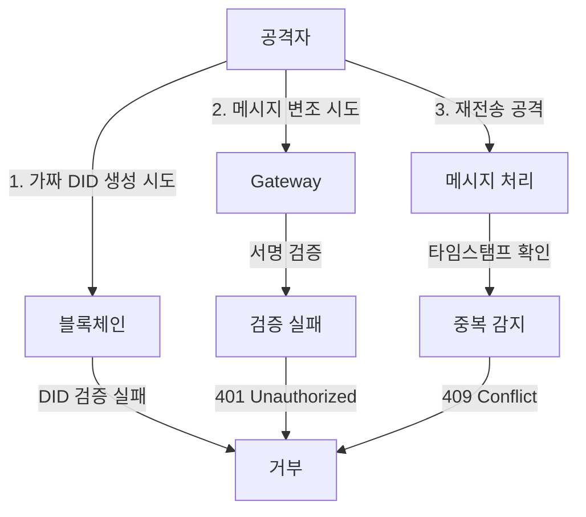
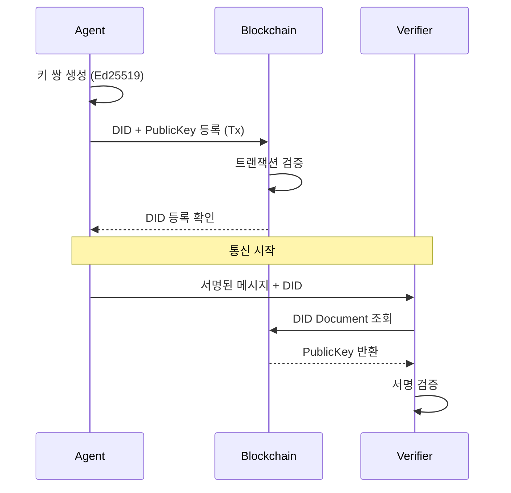

# SAGE 보안 설계서

## 목차

- [1. 보안 개요](#1-보안-개요)
- [2. 위협 모델](#2-위협-모델)
- [3. 보안 아키텍처](#3-보안-아키텍처)
- [4. DID 기반 인증](#4-did-기반-인증)
- [5. RFC 9421 메시지 서명](#5-rfc-9421-메시지-서명)
- [6. 보안 구현 가이드](#6-보안-구현-가이드)
- [7. 보안 체크리스트](#7-보안-체크리스트)

## 1. 보안 개요

SAGE는 AI 에이전트 간 통신에서 다음과 같은 보안 목표를 달성하도록 설계되었습니다:

### 1.1 보안 목표

| 목표                    | 설명               | 구현 방법                                       |
| ----------------------- | ------------------ | ----------------------------------------------- |
| **기밀성(종단간 보호)** | 민감한 데이터 보호 | TLS 1.3 암호화 + 세션키 AEAD(ChaCha20-Poly1305) |
| **무결성**              | 메시지 변조 방지   | AEAD 인증태그 + RFC 9421(HMAC)                  |
| **인증**                | 에이전트 신원 확인 | 블록체인 DID + 신원–세션 바인딩                 |
| **부인 방지**           | 행위 증명          | 디지털 서명 + 감사 로그                         |
| **가용성**              | 서비스 지속성      | Rate limiting, DDoS 방어 + 세션 만료·nonce 캐시 |

### 1.2 보안 원칙

1. **Defense in Depth**: 다층 보안 적용
2. **Least Privilege**: 최소 권한 원칙
3. **Zero Trust**: 모든 요청 검증
4. **Secure by Default**: 기본 보안 설정
5. **Fail Secure**: 안전한 실패 처리

## 2. 위협 모델

### 2.1 주요 위협

#### 중간자 공격 (Man-in-the-Middle)

- **위협**: 통신 경로상에서 메시지 가로채기 및 변조
- **대응**: TLS 암호화 + RFC 9421 서명으로 이중 보호

#### 신원 위조 (Identity Spoofing)

- **위협**: 다른 에이전트로 가장하여 악의적 행동
- **대응**: 블록체인 기반 DID로 위조 불가능한 신원 확인

#### 재전송 공격 (Replay Attack)

- **위협**: 이전 메시지를 재사용하여 중복 실행
- **대응**: 타임스탬프 + nonce + 메시지 ID 검증

#### 서비스 거부 공격 (DoS/DDoS)

- **위협**: 대량 요청으로 서비스 마비
- **대응**: Rate limiting + 리소스 격리

### 2.2 공격 시나리오 및 대응



## 3. 보안 아키텍처

### 3.1 계층별 보안

```
┌────────────────────────────────────────────┐
│               Application                  │
│  - 입력 검증, 권한/정책, 비즈 로직                │
├────────────────────────────────────────────┤
│        Message Signatures (RFC 9421)       │
│  - 세션키(HMAC-SHA256)로 RFC 9421 서명        │
│  - 메시지 무결성                              │
│  - 타임스탬 프검증                             │
│  - kid + nonce 재사용 방지                    │
├────────────────────────────────────────────┤
│            Session (AEAD/HMAC)             │
│  - HKDF-SHA256로 파생된 세션키                 │
│  - ChaCha20-Poly1305 암·복호                 │
│  - kid 매핑, nonce 캐시, 만료정책               │
├────────────────────────────────────────────┤
│           Handshake (A2A 확장)              │
│  - 세션 키 교환, 공유비밀 생성                   │
│  - 부트스트랩 암호화(DID 공개키)                 │
│  - DID 서명 검증으로 신원 바인딩                 │
├────────────────────────────────────────────┤
│      Identity & Discovery (DID) Layer      │
│  - DID 기반 인증                             │
│  - 공개키 관리                                │
│  - 권한 검증                                  │
├────────────────────────────────────────────┤
│            Transport  Layer                │
│  - TLS 1.3 (필수), mTLS(선택)                │
│  -  mTLS(선택)                              │
└────────────────────────────────────────────┘

```

### 3.2 보안 컴포넌트

| 컴포넌트                  | 역할        | 보안 기능                                  |
| ------------------------- | ----------- | ------------------------------------------ |
| DID Resolver              | 신원 확인   | DID Document 검증, 캐시 보안               |
| Handshake Orchestrator    | 세션 생성   | 장기 신원키, 단기 세션키 분리              |
| Session Manager           | 세션 관리   | 암호화 통신 제공                           |
| Replay Guard(Nonce Cache) | 재전송 방지 | 단위 사용 이력·TTL 관리, 중복 탐지 시 거부 |
| Signature Verifier        | 서명 검증   | RFC 9421 검증, 알고리즘 화이트리스트       |
| Policy Engine             | 접근 제어   | RBAC, 속성 기반 제어                       |
| Audit Logger              | 감사 추적   | 불변 로그, 해시 체인                       |
| Rate Limiter              | DoS 방어    | 토큰 버킷, IP 기반 제한                    |

## 4. DID 기반 인증

### 4.1 DID 등록 프로세스



### 4.2 DID Document 보안

```json
{
  "id": "did:ethr:0xabc123",
  "verificationMethod": [
    {
      "id": "did:ethr:0xabc123#key-1",
      "type": "Ed25519VerificationKey2020",
      "controller": "did:ethr:0xabc123",
      "publicKeyMultibase": "z6MkhaXgBZD...",
      "created": "2025-06-24T12:00:00Z",
      "expires": "2026-06-24T12:00:00Z"
    }
  ],
  "authentication": ["did:ethr:0xabc123#key-1"],
  "proof": {
    "type": "Ed25519Signature2020",
    "created": "2025-06-24T12:00:00Z",
    "proofPurpose": "assertionMethod",
    "verificationMethod": "did:ethr:0xabc123#key-1",
    "proofValue": "z58DAdFfa..."
  }
}
```

### 4.3 키 관리

#### 키 저장

- **개인키**: HSM 또는 Secure Enclave 권장
- **암호화**: AES-256-GCM으로 저장 시 암호화
- **접근 제어**: OS 레벨 권한 설정

#### 키 회전

```go
// 키 회전 정책
type KeyRotationPolicy struct {
    MaxAge        time.Duration // 최대 90일
    UsageLimit    int64         // 최대 100만 회 서명
    CompromiseAction string     // "revoke_immediate"
}
```

## 5. 핸드쉐이크 & 세션 내 통신 보안

메세지 암복호화 및 서명을 위한 절차

- 핸드쉐이크(A2A 확장) 로 세션키 합의
- 세션키 AEAD 암·복호화 + RFC 9421 서명

### 5.1 핸드쉐이크

DID 등록 가정

- Invitation (A→B): 세션 생성 요청

- Request (A→B): 임시 세션 키 전송

- Response (B→A): 임시 세션 키 전송

- Complete (A→B): shared secret 생성 및 세션 서명 키/암복호화키 생성

### 5.2 세션 파생·관리

- 키 파생: shared_secret → HKDF-SHA256 → (AEAD 키, HMAC 키)

- 데이터 보호: 본문은 ChaCha20-Poly1305(AEAD) 로 암·복호(무결성 태그 포함).

- 메타데이터 보호: 메서드/경로/Host/Date/Content-Digest 등은 RFC 9421 스타일 HMAC 으로 서명(세션의 HMAC 키 사용).

- 리플레이 방지: 각 요청은 (kid, nonce) 로 식별되고, 서버의 Nonce 캐시가 재사용을 거부.

- 수명 정책: MaxAge, IdleTimeout, MaxMessages 로 세션 만료를 관리하고, 만료 시 세션키·kid 매핑·논스 캐시를 안전 폐기.

| 목표                   | 설명                                                                            | 구현 방법                                                                    |
| ---------------------- | ------------------------------------------------------------------------------- | ---------------------------------------------------------------------------- |
| **종단간 보호(E2E)**   | 트랜스포트 경유·프록시 구간을 넘어 **애플리케이션 계층**에서도 기밀·무결성 보장 | Handshake로 합의된 세션키 기반 AEAD(ChaCha20-Poly1305) + RFC 9421 HMAC       |
| **전방향 비밀성(PFS)** | 장기 신원키가 노출돼도 과거 트래픽 복호화 불가                                  | Ephemeral X25519(ECDH) → HKDF-SHA256로 세션키 파생                           |
| **재전송 방지**        | 이전 메시지 재사용(Replay) 차단                                                 | `kid + nonce` 캐시 검증, 유휴/수명/건수 정책(IdleTimeout/MaxAge/MaxMessages) |
| **신원-세션 바인딩**   | 세션이 실제 DID 신원에 귀속됨                                                   | DID 서명 검증(Ed25519) + Ephemeral 키 교환을 DID에 바인딩                    |

## 6. RFC 9421 메시지 서명

### 6.1 서명 생성 프로세스

```go
// 1. Canonicalization
canonicalString := buildCanonicalString([]string{
    "@method",
    "@path",
    "host",
    "date",
    "content-digest",
})

// 2. 서명 입력 생성
signatureInput := fmt.Sprintf(
    `sig1=(%s);alg="ed25519";keyid="%s";created=%d`,
    componentsString,
    keyID,
    time.Now().Unix(),
)

// 3. 서명 생성
signature := ed25519.Sign(privateKey, []byte(canonicalString))

// 4. 헤더 추가
headers["Signature-Input"] = signatureInput
headers["Signature"] = base64.StdEncoding.EncodeToString(signature)
```

### 5.2 서명 검증 프로세스

```go
func verifySignature(request *http.Request) error {
    // 1. 서명 파라미터 파싱
    sigParams := parseSignatureInput(request.Header.Get("Signature-Input"))

    // 2. 서명 알고리즘 확인
    if !isAllowedAlgorithm(sigParams.Algorithm) {
        return ErrUnsupportedAlgorithm
    }

    // 3. 타임스탬프 검증 (5분 이내)
    if time.Since(sigParams.Created) > 5*time.Minute {
        return ErrSignatureExpired
    }

    // 4. DID로 공개키 조회
    pubKey, err := resolveDIDPublicKey(sigParams.KeyID)
    if err != nil {
        return err
    }

    // 5. Canonical string 재구성
    canonical := rebuildCanonicalString(request, sigParams.Components)

    // 6. 서명 검증
    signature := request.Header.Get("Signature")
    if !ed25519.Verify(pubKey, []byte(canonical), signature) {
        return ErrInvalidSignature
    }

    return nil
}
```

### 6.3 보안 고려사항

#### 허용 알고리즘

```go
var allowedAlgorithms = map[string]bool{
    "ed25519": true,
    "ecdsa-p256": true,
    "rsa-pss-sha256": true,
}
```

#### 헤더 보호

```go
var requiredHeaders = []string{
    "@method",      // HTTP 메소드
    "@path",        // 요청 경로
    "host",         // 대상 호스트
    "date",         // 요청 시간
    "content-digest", // 본문 해시
}
```

## 7. 보안 구현 가이드

### 7.1 입력 검증

```go
// DID 형식 검증
func validateDID(did string) error {
    pattern := regexp.MustCompile(`^did:[a-z0-9]+:[a-zA-Z0-9._%-]+$`)
    if !pattern.MatchString(did) {
        return ErrInvalidDIDFormat
    }
    return nil
}

// 메시지 크기 제한
const MaxMessageSize = 1 * 1024 * 1024 // 1MB

// Content-Type 검증
var allowedContentTypes = map[string]bool{
    "application/json": true,
    "application/cbor": true,
}
```

### 7.2 에러 처리

```go
// 보안 정보 노출 방지
func handleError(err error) Response {
    // 내부 에러는 로깅만
    log.Error("Internal error:", err)

    // 클라이언트에는 일반적인 메시지만
    return Response{
        Error: "Authentication failed",
        Code: "auth_error",
    }
}
```

### 7.3 감사 로깅

```go
type AuditLog struct {
    Timestamp   time.Time `json:"timestamp"`
    RequestID   string    `json:"requestId"`
    AgentDID    string    `json:"agentDid"`
    Action      string    `json:"action"`
    Result      string    `json:"result"`
    IPAddress   string    `json:"ipAddress"`
    SignatureOK bool      `json:"signatureOk"`
}

// 모든 요청 로깅
func logRequest(ctx context.Context, log AuditLog) {
    // 구조화된 로그
    logger.WithFields(logrus.Fields{
        "requestId": log.RequestID,
        "agentDid":  log.AgentDID,
        "action":    log.Action,
    }).Info("Request processed")

    // 영구 저장소에 기록
    auditStore.Write(ctx, log)
}
```

## 8. 보안 체크리스트

### 8.1 개발 단계

- [ ] 모든 입력 검증 구현
- [ ] 안전한 기본값 설정
- [ ] 민감 정보 로깅 방지
- [ ] 에러 메시지 정보 최소화
- [ ] 타임아웃 설정
- [ ] 리소스 제한 설정

### 8.2 배포 단계

- [ ] TLS 인증서 유효성 확인
- [ ] 환경 변수로 민감 정보 관리
- [ ] 최소 권한으로 서비스 실행
- [ ] 보안 헤더 설정 (HSTS, CSP 등)
- [ ] 방화벽 규칙 설정
- [ ] 모니터링 및 알림 설정

### 8.3 운영 단계

- [ ] 정기적인 보안 패치
- [ ] 키 회전 정책 실행
- [ ] 감사 로그 검토
- [ ] 침입 탐지 모니터링
- [ ] 정기적인 보안 감사
- [ ] 사고 대응 계획 수립

## 보안 사고 대응

### 사고 대응 절차

1. **탐지**: 이상 징후 모니터링
2. **격리**: 영향받은 시스템 격리
3. **분석**: 공격 벡터 및 영향 범위 파악
4. **복구**: 시스템 복원 및 패치
5. **개선**: 재발 방지 대책 수립

### 비상 연락망

- 보안팀: security@sage-project.org
- 사고 대응: incident@sage-project.org
- 버그 바운티: bugbounty@sage-project.org

## 참고 자료

- [OWASP API Security Top 10](https://owasp.org/www-project-api-security/)
- [RFC 9421 - HTTP Message Signatures](https://datatracker.ietf.org/doc/html/rfc9421)
- [W3C DID Core Specification](https://www.w3.org/TR/did-core/)
- [NIST Cybersecurity Framework](https://www.nist.gov/cyberframework)
