# SAGE (Secure Agent Guarantee Engine)
## 2025 오픈소스 개발자대회 최종 발표자료 (시각화 버전)

---

## 📊 목차

1. [프로젝트 개요](#프로젝트-개요)
2. [팀 소개](#팀-소개)
3. [개발 배경: 다가오는 위기](#개발-배경-다가오는-위기)
4. [개발 목적](#개발-목적)
5. [프로젝트 구성 및 기능](#프로젝트-구성-및-기능)
6. [추후 활용 방안](#추후-활용-방안-및-계획)
7. [시연 계획](#시연-계획)
8. [Appendix](#appendix-사용된-오픈소스-목록)

---

## 🎯 프로젝트 개요

### "AI Agent 시대, 보안은 선택이 아닌 필수입니다"

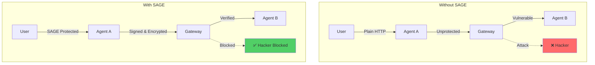

**핵심 메시지:**
- **문제**: AI Agent 간 통신의 보안 취약점 (중간자 공격, 메시지 변조, 신원 위조)
- **솔루션**: RFC 표준 기반 메시지 서명/암호화 + 블록체인 기반 투명한 Agent 검증
- **임팩트**: 개인정보 유출 방지, 금융 자산 보호, 신뢰할 수 있는 Agent 생태계 구축

### 🔑 핵심 가치 제안

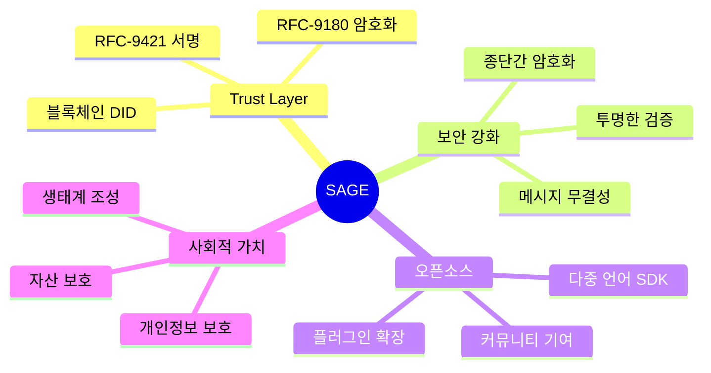

---

## 👥 팀 소개

**SAGE-X Project Team**

(추후 팀원 정보 추가)

---

## 🚨 개발 배경: 다가오는 위기

### 1. AI Agent 시대의 도래

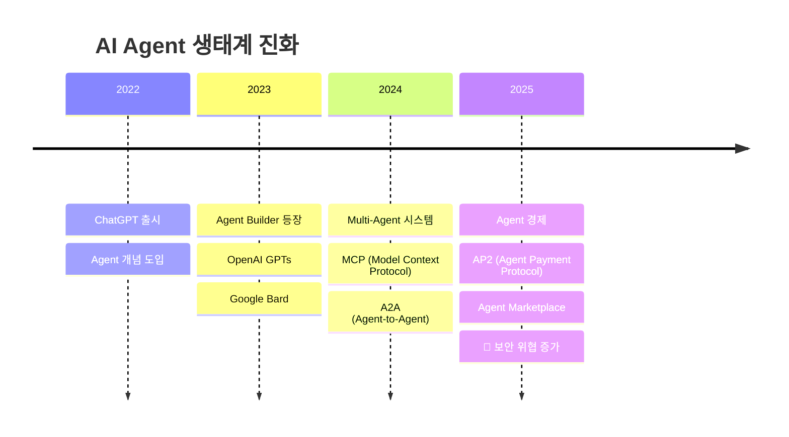

#### 1.1 누구나 Agent를 만드는 시대

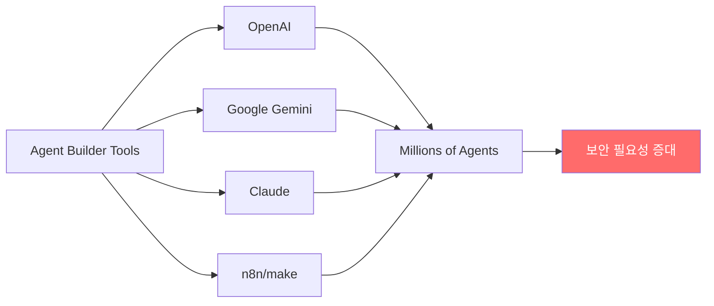

#### 1.2 Agent 사용 확산 통계

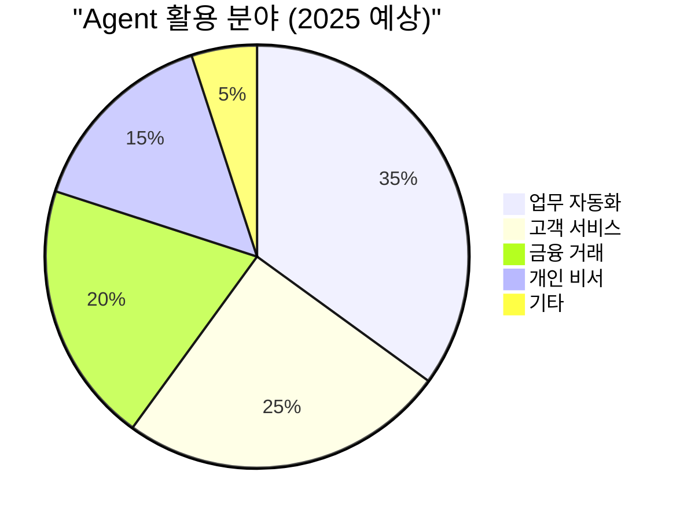

### 2. 현재 보안의 심각한 한계

#### 2.1 TLS/HTTPS의 근본적 한계

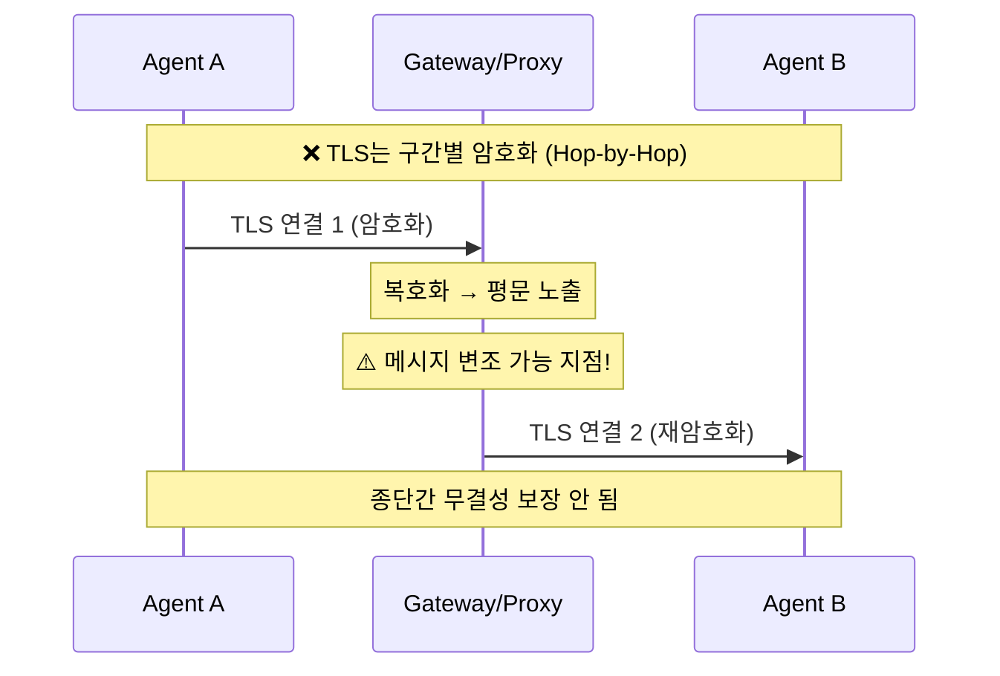

**vs SAGE의 종단간 보안:**

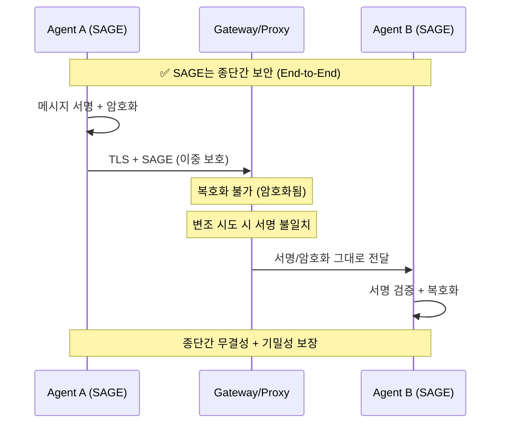

#### 2.2 학술 논문이 경고하는 위험

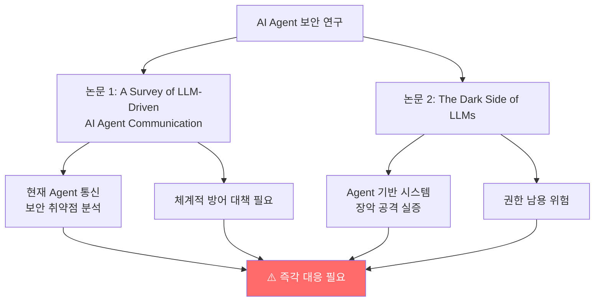

### 3. 예상되는 피해 규모

#### 3.1 보안 사고 비용 비교

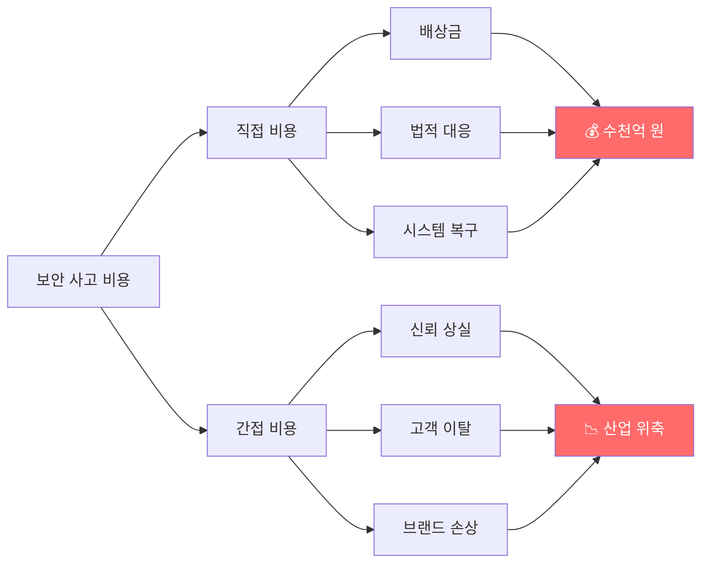

#### 3.2 실제 사례: SKT 해킹 사태

| 항목 | 내용 |
|------|------|
| **피해 규모** | 약 1,200만 고객 정보 유출 |
| **직접 비용** | 수백억 원 (배상, 복구) |
| **간접 비용** | 신뢰 상실, 브랜드 훼손 |
| **사회적 비용** | 개인정보 보호 인식 저하 |
| **교훈** | **사전 예방 > 사후 대응** |

### 4. 왜 지금 시작해야 하는가?

#### 4.1 역사는 반복된다

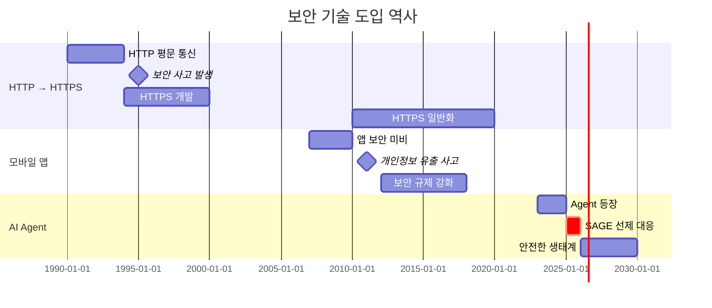

**핵심 메시지:**
- HTTP → HTTPS 전환: **보안 사고 후 10년+ 소요**
- 모바일 앱 보안: **수많은 피해 후 규제**
- AI Agent: **🎯 지금 선제적 대응 필요!**

#### 4.2 선제적 대응의 가치

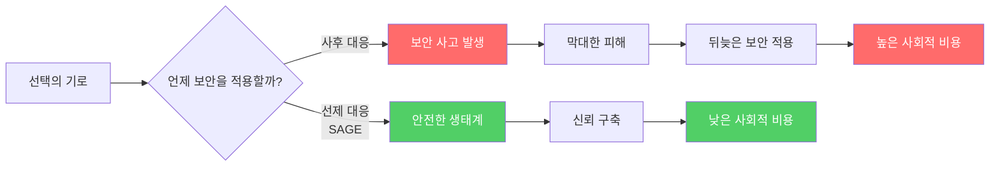

---

## 🎯 개발 목적

### Trust Layer로 안전한 AI Agent 생태계 구축

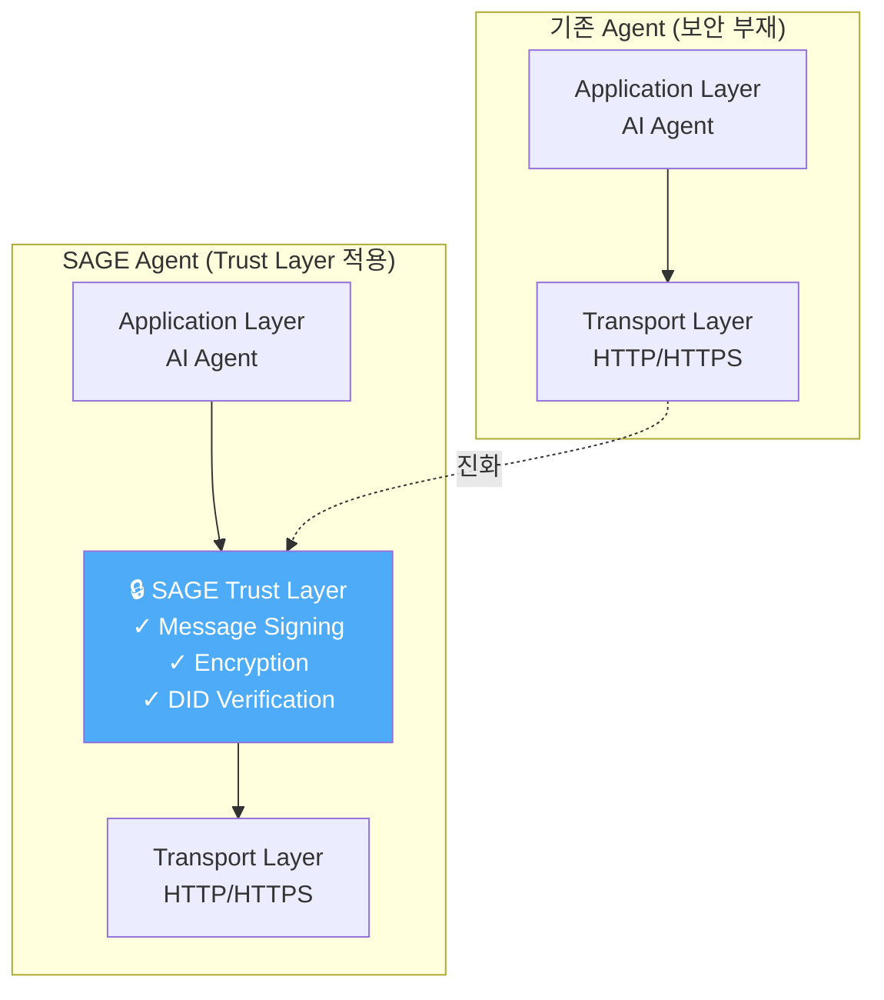

### 핵심 목표

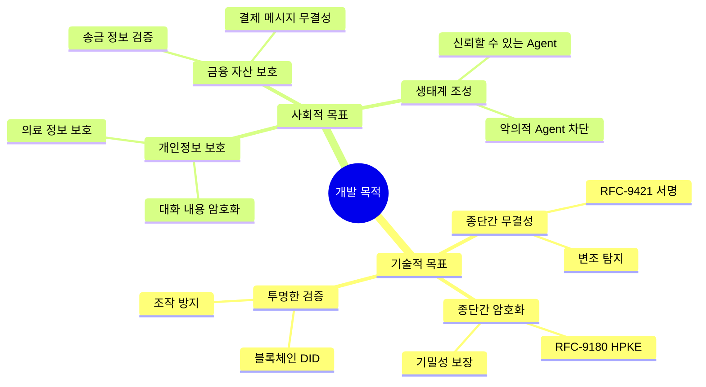

---

## 🏗️ 프로젝트 구성 및 기능

### 1. 전체 아키텍처

```mermaid
graph TB
    subgraph "Application Layer"
        APP[AI Agents<br/>ChatGPT, Gemini, Claude, etc.]
    end

    subgraph "SAGE Trust Layer"
        SIGN[RFC-9421<br/>Message Signing]
        ENCRYPT[RFC-9180<br/>HPKE Encryption]
        DID[DID Management<br/>Blockchain]
        CRYPTO[Crypto Engine<br/>Secp256k1, Ed25519]
        SESSION[Session Manager]
        STORAGE[Secure Storage<br/>Vault]

        SIGN --- ENCRYPT
        ENCRYPT --- DID
        DID --- CRYPTO
        CRYPTO --- SESSION
        SESSION --- STORAGE
    end

    subgraph "Integration Layer"
        BC[Blockchain<br/>Ethereum, ...]
        SDK[Multi-Lang SDKs<br/>Go, Python, TS, Java]
        CLI[CLI Tools<br/>sage-crypto, sage-did]
    end

    APP --> SIGN
    SIGN --> BC
    ENCRYPT --> SDK
    DID --> CLI

    style "SAGE Trust Layer" fill:#e3f2fd
```

### 2. 핵심 기능

#### 2.1 RFC-9421 메시지 서명

```mermaid
sequenceDiagram
    autonumber
    participant A as Agent A
    participant S as SAGE Signer
    participant G as Gateway
    participant V as SAGE Verifier
    participant B as Agent B

    Note over A,B: RFC-9421 HTTP Message Signatures

    A->>S: 메시지 전송 요청
    S->>S: 1. Signature Base 생성<br/>2. 개인키로 서명<br/>3. Signature-Input 헤더 생성<br/>4. Signature 헤더 생성
    S->>G: HTTP Request<br/>+ Signature-Input<br/>+ Signature

    Note over G: Gateway는 내용을<br/>변조할 수 있지만<br/>서명은 재생성 불가

    G->>V: 메시지 전달
    V->>V: 1. Signature Base 재생성<br/>2. 공개키로 서명 검증<br/>3. Timestamp 확인<br/>4. Nonce 검증

    alt 검증 성공
        V->>B: ✅ 메시지 전달
    else 검증 실패
        V->>A: ❌ 거부 (변조 감지)
    end

    style V fill:#51cf66
```

**서명 헤더 구조:**

```
Signature-Input: sig1=("@method" "@path" "content-type" "content-digest");
                 created=1618884473;
                 expires=1618884773;
                 nonce="b3k6t4n7"

Signature: sig1=:K2qGT5srn2OGbOIDzQ6kYT+ruaycnDAAUpKv+ePFfD6/...:
```

#### 2.2 RFC-9180 HPKE 암호화

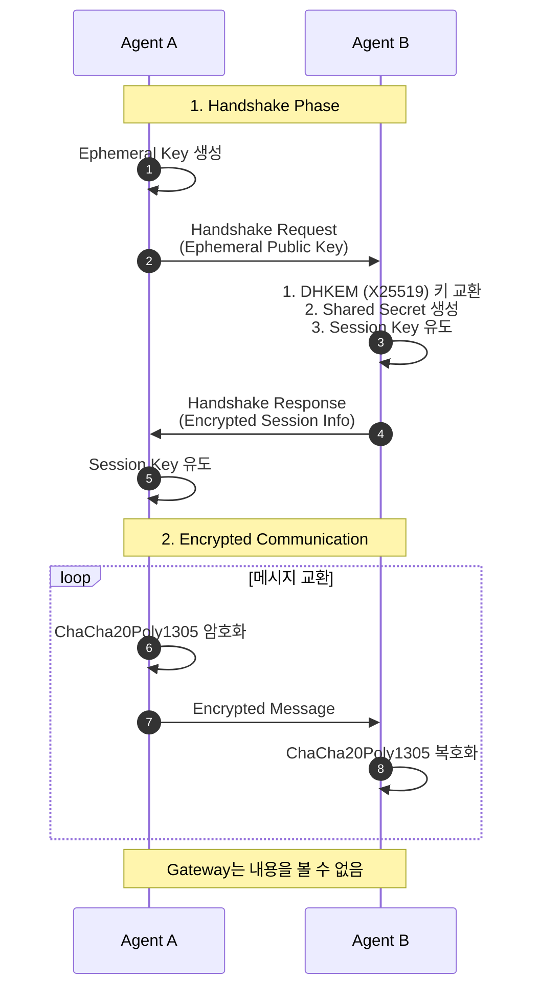

**HPKE 암호화 과정:**

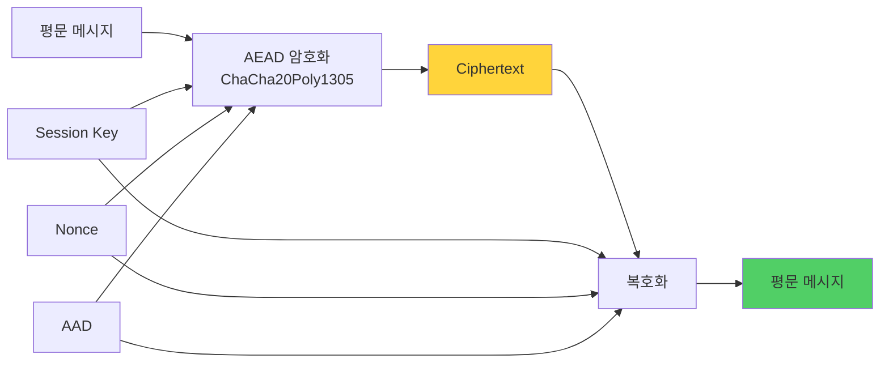

#### 2.3 블록체인 기반 DID 관리

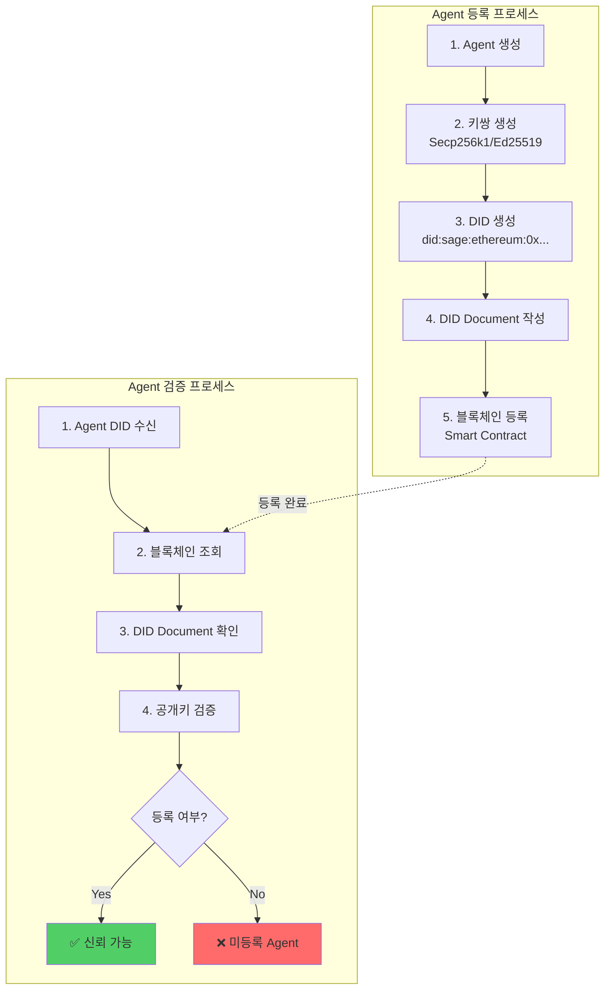

**DID Document 구조:**

```json
{
  "id": "did:sage:ethereum:0x1234567890abcdef",
  "publicKey": [{
    "id": "did:sage:ethereum:0x1234567890abcdef#keys-1",
    "type": "Secp256k1VerificationKey2019",
    "controller": "did:sage:ethereum:0x1234567890abcdef",
    "publicKeyHex": "04abc123..."
  }],
  "service": [{
    "id": "did:sage:ethereum:0x1234567890abcdef#agent-service",
    "type": "AgentService",
    "serviceEndpoint": "https://agent.example.com"
  }],
  "metadata": {
    "name": "Payment Agent",
    "description": "Secure payment processing agent",
    "version": "1.0.0",
    "category": "finance"
  }
}
```

### 3. 시스템 구성도 (상세)

```mermaid
graph TB
    subgraph "SAGE Core Engine"
        direction TB

        subgraph "Security Layer"
            RFC9421[RFC-9421 Signer/Verifier]
            RFC9180[RFC-9180 HPKE]
            NONCE[Nonce Manager]
        end

        subgraph "Identity Layer"
            DID[DID Manager]
            DIDRES[DID Resolver]
            META[Metadata Handler]
        end

        subgraph "Crypto Layer"
            SECP[Secp256k1 Engine]
            ED[Ed25519 Engine]
            X25519[X25519 ECDH]
            CHACHA[ChaCha20Poly1305]
        end

        subgraph "Storage Layer"
            VAULT[Encrypted Vault]
            CACHE[Cache Manager]
            SESSION[Session Store]
        end
    end

    subgraph "External Integration"
        BC[Blockchain<br/>Ethereum]
        RPC[RPC Provider<br/>Alchemy/Infura]
    end

    subgraph "Developer Interface"
        SDK_GO[Go SDK]
        SDK_PY[Python SDK]
        SDK_TS[TypeScript SDK]
        SDK_JAVA[Java SDK]
        CLI[CLI Tools]
    end

    RFC9421 --> SECP
    RFC9421 --> ED
    RFC9180 --> X25519
    RFC9180 --> CHACHA

    DID --> BC
    DIDRES --> RPC

    RFC9421 --> VAULT
    SESSION --> CACHE

    SDK_GO --> RFC9421
    SDK_PY --> RFC9180
    SDK_TS --> DID
    SDK_JAVA --> RFC9421
    CLI --> DID

    style "SAGE Core Engine" fill:#e3f2fd
    style "Security Layer" fill:#fff3e0
    style "Identity Layer" fill:#f3e5f5
```

### 4. 플러그인 아키텍처

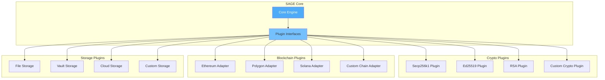

### 5. 검증 및 품질 보증

#### 5.1 테스트 커버리지

```mermaid
pie title "명세서 검증 완료율 (83개 항목)"
    "RFC-9421 구현" : 11
    "암호화 키 관리" : 13
    "DID 관리" : 12
    "블록체인 연동" : 10
    "메시지 처리" : 10
    "CLI 도구" : 13
    "세션 관리" : 6
    "HPKE" : 5
    "헬스체크" : 3
```

#### 5.2 품질 메트릭

```mermaid
graph LR
    A[품질 지표] --> B[코드 품질]
    A --> C[테스트 품질]
    A --> D[문서 품질]

    B --> B1[✅ 100% 명세 준수]
    B --> B2[✅ 린트 통과]
    B --> B3[✅ 코드 리뷰 완료]

    C --> C1[✅ 61개 테스트 함수]
    C --> C2[✅ 7,848 라인 테스트 코드]
    C --> C3[✅ 통합 테스트 완료]

    D --> D1[✅ 5,128 라인 문서]
    D --> D2[✅ API 문서 완비]
    D --> D3[✅ 예제 코드 제공]

    style B1 fill:#51cf66
    style C1 fill:#51cf66
    style D1 fill:#51cf66
```

---

## 🌟 추후 활용 방안 및 계획

### 로드맵 타임라인

```mermaid
timeline
    title SAGE 프로젝트 로드맵
    section 단기 (6개월)
    2025 Q3 : rs-sage-core (Rust)
            : WebAssembly 지원
            : 모바일 SDK 완성
    2025 Q4 : 다중 언어 SDK 안정화
            : 패키지 매니저 등록
            : 커뮤니티 구축

    section 중기 (1년)
    2026 Q1 : SAGE-ADK 출시
            : Agent Builder UI
            : Agent Marketplace
    2026 Q2 : MCP Integration
            : 주요 플랫폼 연동
            : 기업 파트너십

    section 장기 (2-3년)
    2027 : IETF 표준화 제안
         : W3C DID 확장
         : 글로벌 채택
    2028 : 산업별 특화 솔루션
         : 금융/의료/공공
         : 국제 표준 확정
```

### 주요 마일스톤

```mermaid
graph TB
    NOW[현재<br/>SAGE v1.0] --> M1[마일스톤 1<br/>6개월]
    M1 --> M2[마일스톤 2<br/>1년]
    M2 --> M3[마일스톤 3<br/>2-3년]

    M1 --> M1A[rs-sage-core]
    M1 --> M1B[SDK 완성]
    M1 --> M1C[커뮤니티 100명]

    M2 --> M2A[SAGE-ADK]
    M2 --> M2B[Agent Marketplace]
    M2 --> M2C[MCP 통합]
    M2 --> M2D[기업 파트너 10개]

    M3 --> M3A[IETF RFC 제안]
    M3 --> M3B[W3C 표준]
    M3 --> M3C[산업 특화]
    M3 --> M3D[글로벌 1만 Agent]

    style NOW fill:#4dabf7,color:#fff
    style M1 fill:#74c0fc
    style M2 fill:#a5d8ff
    style M3 fill:#d0ebff
```

### SAGE-ADK 개념도

```mermaid
graph TB
    subgraph "SAGE-ADK (Agent Development Kit)"
        UI[Agent Builder UI<br/>드래그 앤 드롭]
        TEMPLATE[Agent Templates<br/>결제/예약/상담/...]
        SAGE[Auto SAGE Integration<br/>보안 자동 적용]
        A2A[A2A Support<br/>Multi-Agent]
        TEST[Local Test Environment]
    end

    subgraph "개발자 경험"
        DEV[개발자] --> UI
        UI --> TEMPLATE
        TEMPLATE --> SAGE
        SAGE --> A2A
        A2A --> TEST
        TEST --> DEPLOY[One-Click Deploy]
    end

    subgraph "결과"
        DEPLOY --> SECURE[보안이 적용된<br/>프로덕션 Agent]
        SECURE --> MARKET[Agent Marketplace<br/>등록]
    end

    style SAGE fill:#51cf66,color:#fff
    style SECURE fill:#51cf66,color:#fff
```

### Agent Marketplace 개념도

```mermaid
graph TB
    subgraph "Agent Marketplace"
        BC[Blockchain<br/>Agent Registry] --> DASH[Dashboard UI<br/>24/7 실시간]

        DASH --> LIST[Agent 목록]
        DASH --> SEARCH[검색/필터]
        DASH --> VERIFY[검증 배지]
        DASH --> REVIEW[평점/리뷰]

        LIST --> DETAIL[Agent 상세 정보]
        DETAIL --> DID_INFO[DID 정보]
        DETAIL --> KEY_INFO[공개키]
        DETAIL --> META_INFO[메타데이터]
        DETAIL --> RATING[평점/사용자 리뷰]

        VERIFY --> BADGE1[✅ SAGE 인증]
        VERIFY --> BADGE2[🔒 보안 검증]
        VERIFY --> BADGE3[⭐ 우수 Agent]
    end

    subgraph "사용자"
        USER[사용자] --> SEARCH
        USER --> LIST
        DETAIL --> CHOOSE{선택}
        CHOOSE -->|신뢰| USE[Agent 사용]
        CHOOSE -->|불신| REPORT[신고/경고]
    end

    style BADGE1 fill:#51cf66
    style USE fill:#51cf66
```

---

## 🎬 시연 계획

### 시연 인프라 구성

```mermaid
graph TB
    subgraph "Frontend"
        FE[Chat UI<br/>Vercel 배포<br/>sage-demo.vercel.app]
    end

    subgraph "Agent Layer"
        A1[Normal Agent<br/>보안 미적용<br/>Supabase/AWS]
        A2[SAGE Agent<br/>보안 적용<br/>Supabase/AWS]
    end

    subgraph "Gateway (MitM)"
        GW[Infected Gateway<br/>메시지 변조 시도<br/>Supabase/AWS]
    end

    subgraph "Payment Layer"
        PAY[Payment Agent<br/>AP2 + SAGE<br/>Supabase/AWS]
    end

    subgraph "Blockchain"
        BC[Ethereum Sepolia<br/>Testnet]
        RPC[Alchemy RPC API]
    end

    FE --> A1
    FE --> A2
    A1 --> GW
    A2 --> GW
    GW --> PAY

    A2 -.->|DID 검증| BC
    PAY -.->|DID 검증| BC
    BC --> RPC

    style GW fill:#ff6b6b,color:#fff
    style A2 fill:#51cf66,color:#fff
    style PAY fill:#51cf66,color:#fff
```

### 시연 시나리오 플로우

#### 시나리오 1: 보안 미적용 (공격 성공)

```mermaid
sequenceDiagram
    autonumber
    participant U as 사용자
    participant F as Frontend
    participant A as Normal Agent
    participant G as Gateway (MitM)
    participant P as Payment Agent

    Note over U,P: ❌ 보안 미적용 시나리오

    U->>F: "iPhone 15 Pro 구매"
    F->>A: 구매 요청
    A->>U: 결제 정보 요청
    U->>A: to: Apple Store<br/>amount: 1,500,000원

    Note over G: ⚠️  메시지 변조!
    A->>G: 원본 메시지
    G->>G: to: Apple Store → Hacker<br/>amount: 1,500,000원
    G->>P: 변조된 메시지

    P->>P: 검증 없이 처리
    P-->>G: ✅ 결제 완료
    G-->>A: 결제 완료 응답
    A-->>U: "구매 완료"

    Note over U,P: ❌ 1,500,000원이 Hacker에게!

    rect rgb(255, 107, 107, 0.3)
        Note over U: 자산 탈취 발생
    end
```

#### 시나리오 2: SAGE 적용 (공격 차단)

```mermaid
sequenceDiagram
    autonumber
    participant U as 사용자
    participant F as Frontend
    participant A as SAGE Agent
    participant G as Gateway (MitM)
    participant P as Payment Agent (SAGE)

    Note over U,P: ✅ SAGE 적용 시나리오

    U->>F: "iPhone 15 Pro 구매"
    F->>A: 구매 요청
    A->>U: 결제 정보 요청
    U->>A: to: Apple Store<br/>amount: 1,500,000원

    A->>A: RFC-9421 서명 생성

    Note over G: ⚠️  메시지 변조 시도!
    A->>G: 원본 메시지 + 서명
    G->>G: to: Apple Store → Hacker<br/>(서명은 변경 불가)
    G->>P: 변조된 메시지 + 원본 서명

    P->>P: RFC-9421 서명 검증
    P->>P: ❌ 서명 불일치!
    P-->>G: ⛔ 거래 거부
    G-->>A: 거래 거부 응답
    A-->>U: "⚠️  보안 위협 감지"

    Note over U,P: ✅ 공격 차단 성공!

    rect rgb(81, 207, 102, 0.3)
        Note over U: 자산 보호 성공
    end
```

#### 시나리오 3: 개인정보 암호화

```mermaid
sequenceDiagram
    autonumber
    participant U as 사용자
    participant A as SAGE Agent
    participant G as Gateway
    participant H as Health Agent (SAGE)

    Note over U,H: 🔒 RFC-9180 HPKE 암호화

    U->>A: "건강 상담 연결"
    A->>H: Handshake Request
    H->>H: Session Key 생성
    H->>A: Handshake Response
    A->>A: Session Key 유도

    Note over A,H: 암호화 세션 수립

    U->>A: "당뇨병 진단...<br/>혈당 180mg/dL..."
    A->>A: ChaCha20Poly1305 암호화
    A->>G: 암호화된 메시지

    Note over G: Gateway는 내용을<br/>볼 수 없음 (암호화됨)

    G->>H: 암호화된 메시지 전달
    H->>H: ChaCha20Poly1305 복호화
    H->>H: 상담 응답 생성
    H->>A: 암호화된 응답
    A->>A: 복호화
    A->>U: "당뇨병 관리 안내..."

    rect rgb(81, 207, 102, 0.3)
        Note over U: 개인정보 보호 성공
    end
```

#### 시나리오 4: Agent 신원 검증

```mermaid
flowchart TB
    U[사용자: Agent 선택] --> SEARCH[Agent Marketplace 검색]

    SEARCH --> A1[Official Payment Agent]
    SEARCH --> A2[Fake Payment Agent]

    A1 --> CHECK1{블록체인 검증}
    A2 --> CHECK2{블록체인 검증}

    CHECK1 -->|DID 등록 확인| BC1[✅ DID 존재<br/>공개키 검증 성공]
    CHECK2 -->|DID 조회| BC2[❌ DID 미등록<br/>또는 비활성화]

    BC1 --> TRUST[✅ 신뢰 가능<br/>★★★★★ 1,234 리뷰]
    BC2 --> WARN[⚠️  경고: 미검증 Agent<br/>사용 불가]

    TRUST --> SELECT[Agent 선택]
    WARN --> BLOCK[사용 차단]

    SELECT --> USE[안전하게 사용]

    style BC1 fill:#51cf66
    style TRUST fill:#51cf66
    style USE fill:#51cf66
    style BC2 fill:#ff6b6b
    style WARN fill:#ff6b6b
    style BLOCK fill:#ff6b6b
```

### 시연 영상 구성 (3분)

```mermaid
gantt
    title 시연 영상 타임라인 (180초)
    dateFormat ss
    axisFormat %S초

    section 도입
    문제 제기 :00, 30s

    section 시나리오
    1. 보안 미적용 :30, 30s
    2. SAGE 서명 :60, 40s
    3. SAGE 암호화 :100, 30s
    4. DID 검증 :130, 30s

    section 마무리
    SAGE 가치 :160, 20s
```

---

## 📊 SAGE의 차별성

### 1. 기술 비교 매트릭스

| 비교 항목 | HTTP | HTTPS (TLS) | SAGE |
|---------|------|-------------|------|
| **전송 암호화** | ❌ 없음 | ✅ 구간별 | ✅ 종단간 |
| **메시지 무결성** | ❌ 없음 | ⚠️  구간별 | ✅ 종단간 |
| **메시지 서명** | ❌ 없음 | ❌ 없음 | ✅ RFC-9421 |
| **종단간 암호화** | ❌ 없음 | ❌ 없음 | ✅ RFC-9180 |
| **신원 검증** | ❌ 없음 | ⚠️  인증서 | ✅ 블록체인 DID |
| **변조 탐지** | ❌ 불가능 | ⚠️  구간별만 | ✅ 즉시 탐지 |
| **투명성** | N/A | ⚠️  CA 신뢰 | ✅ 블록체인 |
| **표준 준수** | RFC-1945 | RFC-8446 | RFC-9421, 9180, DID |

### 2. 보안 레벨 비교

```mermaid
graph TB
    subgraph "보안 레벨"
        L0[Level 0: HTTP<br/>❌ 보안 없음]
        L1[Level 1: HTTPS<br/>⚠️  구간 암호화]
        L2[Level 2: HTTPS + OAuth<br/>⚠️  인증 추가]
        L3[Level 3: SAGE<br/>✅ 종단간 보안]
    end

    L0 -.->|진화| L1
    L1 -.->|진화| L2
    L2 -.->|진화| L3

    L0 --> V0[중간자 공격 취약<br/>변조 가능<br/>도청 가능]
    L1 --> V1[Gateway 변조 가능<br/>종단간 무결성 없음]
    L2 --> V2[메시지 무결성 없음<br/>Gateway 신뢰 필요]
    L3 --> V3[✅ 완전한 보호<br/>✅ 종단간 보안<br/>✅ 투명한 검증]

    style L0 fill:#ff6b6b,color:#fff
    style L1 fill:#ffd43b
    style L2 fill:#74c0fc
    style L3 fill:#51cf66,color:#fff
    style V3 fill:#51cf66,color:#fff
```

### 3. 경쟁 우위

```mermaid
mindmap
  root((SAGE<br/>경쟁 우위))
    표준 기반
      RFC-9421
      RFC-9180
      DID Core
      검증된 암호
    완성도
      100% 명세 검증
      61개 테스트
      5천+ 라인 문서
    확장성
      플러그인 구조
      다중 언어 SDK
      다중 블록체인
    오픈소스
      LGPL-v3
      커뮤니티 환영
      투명한 개발
    선제적 대응
      보안 사고 전 예방
      학술 연구 기반
      사회적 가치
```

---

## 📚 Appendix

### A. 사용된 오픈소스 목록

#### A.1 핵심 기술 스택

```mermaid
graph TB
    subgraph "프로그래밍 언어"
        GO[Go 1.22+<br/>BSD-3-Clause]
        SOL[Solidity<br/>GPL-3.0]
    end

    subgraph "블록체인"
        ETH[Ethereum<br/>LGPL-3.0]
        GETH[go-ethereum<br/>LGPL-3.0]
    end

    subgraph "암호화"
        ECDSA[crypto/ecdsa<br/>BSD-3-Clause]
        ED25519[crypto/ed25519<br/>BSD-3-Clause]
        XCRYPTO[golang.org/x/crypto<br/>BSD-3-Clause]
        CIRCL[cloudflare/circl<br/>BSD-3-Clause]
    end

    subgraph "웹 프레임워크"
        HTTP[net/http<br/>BSD-3-Clause]
        MUX[gorilla/mux<br/>BSD-3-Clause]
    end

    subgraph "개발 도구"
        COBRA[spf13/cobra<br/>Apache-2.0]
        VIPER[spf13/viper<br/>MIT]
        TESTIFY[stretchr/testify<br/>MIT]
    end

    GO --> ECDSA
    GO --> ED25519
    ETH --> GETH
    XCRYPTO --> CIRCL
```

#### A.2 오픈소스 라이선스 분포

```mermaid
pie title "사용된 오픈소스 라이선스 분포"
    "BSD-3-Clause" : 50
    "MIT" : 25
    "Apache-2.0" : 12.5
    "LGPL-3.0" : 12.5
```

### B. 참조 표준

```mermaid
timeline
    title SAGE 기반 표준 타임라인
    2018 : RFC-8032 (EdDSA)
    2019 : W3C DID Core
    2020 : RFC-5869 (HKDF)
    2023 : RFC-9180 (HPKE)
         : RFC-9421 (HTTP Signatures)
    2025 : SAGE 1.0
         : 표준 기반 통합
```

### C. 프로젝트 통계

#### C.1 코드 통계

```mermaid
graph LR
    A[SAGE 프로젝트] --> B[코드베이스]
    A --> C[테스트]
    A --> D[문서]

    B --> B1[Go 소스 코드<br/>189 파일]
    B --> B2[스마트 컨트랙트<br/>Solidity]

    C --> C1[61개 테스트 함수]
    C --> C2[7,848 라인<br/>테스트 코드]

    D --> D1[5,128 라인<br/>검증 문서]
    D --> D2[9개 섹션<br/>상세 문서]
```

#### C.2 검증 완료 현황

```mermaid
graph TB
    START[명세서 87개 항목] --> SEC1[Section 1: RFC-9421<br/>11/11 ✅]
    START --> SEC2[Section 2: 암호화 키<br/>13/13 ✅]
    START --> SEC3[Section 3: DID<br/>12/12 ✅]
    START --> SEC4[Section 4: 블록체인<br/>10/10 ✅]
    START --> SEC5[Section 5: 메시지<br/>10/10 ✅]
    START --> SEC6[Section 6: CLI<br/>13/13 ✅]
    START --> SEC7[Section 7: 세션<br/>6/6 ✅]
    START --> SEC8[Section 8: HPKE<br/>5/5 ✅]
    START --> SEC9[Section 9: 헬스체크<br/>3/3 ✅]

    SEC1 --> COMPLETE[✅ 100% 검증 완료<br/>83/83 항목]
    SEC2 --> COMPLETE
    SEC3 --> COMPLETE
    SEC4 --> COMPLETE
    SEC5 --> COMPLETE
    SEC6 --> COMPLETE
    SEC7 --> COMPLETE
    SEC8 --> COMPLETE
    SEC9 --> COMPLETE

    style COMPLETE fill:#51cf66,color:#fff
```

---

## 🎯 결론

### SAGE의 비전

```mermaid
graph TB
    PROBLEM[문제: AI Agent<br/>보안 위협] --> SAGE[해결책: SAGE<br/>Trust Layer]

    SAGE --> TECH[기술적 우수성]
    SAGE --> SOCIAL[사회적 가치]
    SAGE --> OPEN[오픈소스 기여]

    TECH --> T1[RFC 표준 준수]
    TECH --> T2[100% 검증 완료]
    TECH --> T3[플러그인 확장성]

    SOCIAL --> S1[개인정보 보호]
    SOCIAL --> S2[자산 보호]
    SOCIAL --> S3[안전한 생태계]

    OPEN --> O1[다중 언어 SDK]
    OPEN --> O2[커뮤니티 기여]
    OPEN --> O3[국가 경쟁력]

    T1 --> VISION[Trust Layer for<br/>AI Agent Era]
    T2 --> VISION
    T3 --> VISION
    S1 --> VISION
    S2 --> VISION
    S3 --> VISION
    O1 --> VISION
    O2 --> VISION
    O3 --> VISION

    style PROBLEM fill:#ff6b6b,color:#fff
    style SAGE fill:#4dabf7,color:#fff
    style VISION fill:#51cf66,color:#fff,font-size:16px
```

### 핵심 메시지

> **"AI Agent 시대, 보안은 선택이 아닌 필수입니다"**
>
> HTTP에 HTTPS가 필요했듯이, AI Agent에는 SAGE가 필요합니다.
>
> **SAGE와 함께, 안전한 AI Agent 시대를 만들어갑니다.**

---

## 📞 연락처

- **GitHub**: https://github.com/sage-x-project/sage
- **문의**: (추후 추가)
- **데모**: (시연용 도메인 추가 예정)

---

*본 프로젝트는 2025 오픈소스 개발자대회 출품작입니다.*
*과학기술정보통신부 · 정보통신산업진흥원 주최*
