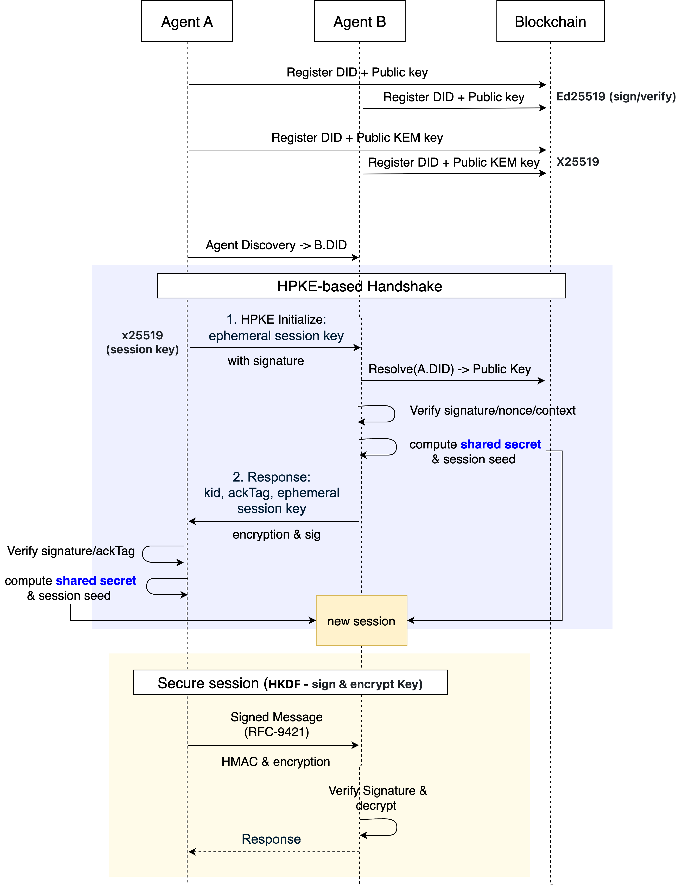

# SAGE HPKE-based Handshake

This Go package implements an HPKE (RFC 9180) based pre-handshake that allows agents in SAGE (Secure Agent Guarantee Engine) to establish **secure sessions** with each other.

It extends the existing [A2A protocol](https://a2a-protocol.org/latest/topics/what-is-a2a/#a2a-request-lifecycle) over **gRPC**. After the session is established, the application payloads are protected with **session encryption plus HTTP Message Signatures (RFC 9421)**.



The server derives a shared secret from the temporary session key sent by the client and turns it into a session seed.

## Key Characteristics

- **DID metadata validation & bootstrap integrity**  
  Validates the DID and Ed25519 signature contained in the A2A metadata. Anchoring the sender identity blocks **MITM / malicious senders**.
- **Key agreement via HPKE Base (single encapsulation)**  
  Resolves the recipient's static X25519 KEM public key from its DID Document and, together with the sender-generated `enc`, derives the HPKE **exporter secret**.
- **Forward secrecy add-on (E2E)**  
  Supplements HPKE Base by performing an additional **ephemeral-ephemeral X25519 exchange** (`ephC ↔ ephS`). The final session seed is built by HKDF-combining `exporterHPKE || ssE2E`, reducing the risk of decrypting historic traffic even if the recipient's static KEM secret key leaks later.
- **Session and nonce management**  
  `session.Manager` enforces **MaxAge/IdleTimeout/MaxMessages** policies and blocks **nonce reuse (replay)**. It also handles key confirmation via an HPKE exporter-based **ackTag**.
- **Compact 1-RTT exchange**  
  The base mode finishes in **two messages** (Client → Server Init, Server → Client Ack). Adding PFS keeps the same round-trip count—only `ephS` is returned by the server.

## Installation

```bash
go get github.com/sage-x-project/sage/hpke
```

## Architecture & Components

```text
hpke/
├── client.go        # HPKE client (init, ack validation, session binding)
├── server.go        # HPKE server (metadata verification, exporter reproduction, ack generation)
├── common.go        # Shared helper functions
session/
├── manager.go       # Session lifecycle and replay guard
└── session.go       # AEAD encrypt/decrypt and secure key disposal
did/
└── resolver.go      # DID → (identity / HPKE KEM) public key resolution
```

### Info / Export Context (Actual Implementation)

The `InfoBuilder` interface generates context-binding strings that prevent cross-context attacks and key reuse:

```go
type InfoBuilder interface {
    BuildInfo(ctxID, initDID, respDID string) []byte
    BuildExportContext(ctxID string) []byte
}

type DefaultInfoBuilder struct{}

func (DefaultInfoBuilder) BuildInfo(ctxID, initDID, respDID string) []byte {
    return []byte(
        "sage/hpke-info|v1" +
            "|suite=hpke-base+x25519+hkdf-sha256" +
            "|combiner=e2e-x25519-hkdf-v1" +
            "|ctx=" + ctxID +
            "|init=" + initDID +
            "|resp=" + respDID,
    )
}
func (DefaultInfoBuilder) BuildExportContext(ctxID string) []byte {
    return []byte(
        "sage/hpke-export|v1" +
            "|suite=hpke-base+x25519+hkdf-sha256" +
            "|combiner=e2e-x25519-hkdf-v1" +
            "|ctx=" + ctxID,
    )
}
```

**Example output**:
```
info: "sage/hpke-info|v1|suite=hpke-base+x25519+hkdf-sha256|combiner=e2e-x25519-hkdf-v1|ctx=abc123|init=did:sage:A|resp=did:sage:B"
exportCtx: "sage/hpke-export|v1|suite=hpke-base+x25519+hkdf-sha256|combiner=e2e-x25519-hkdf-v1|ctx=abc123"
```

**Security properties**:
- `suite`: Binds to specific cryptographic algorithms (HPKE Base mode + X25519 + HKDF-SHA256)
- `combiner`: Separates Base-only mode from Base+E2E mode (prevents downgrade attacks)
- `v1`: Version tag for protocol upgrades
- `info` embeds the **session context** (ctxID and both DIDs), preventing **key reuse / cross-context confusion**
- `exportCtx` is used as the exporter's HKDF **salt/context**, separating sessions and limiting the blast radius of key disclosure

## Handshake Flow

### 0) Prerequisites

- Both agents’ DIDs are registered on-chain, and the server exposes a **static X25519 KEM public key** in its DID Document.
- The client **resolves** the server’s DID to obtain the KEM public key.

### 1) Initialize (Client → Server)

The client sends a `TaskHPKEComplete` message that includes:

- `enc`: HPKE encapsulation (32 bytes)
- `info`, `exportCtx`: InfoBuilder outputs
- `nonce`, `ts`: replay protections / freshness check
- _(Recommended)_ `ephC`: client ephemeral X25519 public key (32 bytes) for the PFS add-on

The metadata is protected by an **Ed25519 signature of the sender’s DID**.

### 2) Ack (Server → Client)

The server:

1. Verifies DID metadata, **freshness (±maxSkew)**, **replay (nonce)**, and **info/exportCtx consistency**
2. Reproduces **exporterHPKE** via HPKE Base
3. Generates server `ephS` and computes `ssE2E = ECDH(ephS, ephC)`
4. Builds the final session seed:

```
Base only:
    seed = exporterHPKE
Base + PFS add-on:
    seed = HKDF-Extract( salt = exportCtx,
                         IKM  = exporterHPKE || ssE2E )
           → HKDF-Expand(info = "SAGE-HPKE+E2E-Combiner", L=32)
```

- **If the server’s static KEM private key leaks**:  
  Past captures of `enc` allow reenacting **`exporterHPKE`**.  
  → However, attackers would still need the client or server ephemeral private key from that past session. These are destroyed right after the handshake, so **`ssE2E` cannot be recreated**.  
  → Because HKDF mixes both secrets, the resulting `combined` seed stays safe, giving the session **PFS** guarantees.
- **Conversely**, if only the client’s ephemeral private key leaks later while the server’s static KEM key remains safe, **`exporterHPKE`** is unknowable and the final seed stays protected.
- **If both leak later** (server static KEM key + the client or server ephemeral private key), historical sessions can of course be reconstructed.

Therefore, as long as **ephemeral keys are wiped immediately after use**, the session remains secure.

5. Creates the session, binds `kid`, and generates **ackTag** (transcript-binding authentication):

```
ackKey = HKDF-Expand(PRK=seed, info="SAGE-ack-key-v1", L=32)

// Build transcript hash from all handshake parameters
transcriptHash = SHA256(
    0x00 || info ||
    0x00 || exportCtx ||
    0x00 || enc ||
    0x00 || ephC ||
    0x00 || ephS ||
    0x00 || initDID ||
    0x00 || respDID
)

// Create length-prefixed ackMsg (binary-safe encoding)
ackMsg = "SAGE-ack-msg|v1|" ||
         len(ctxID) || ctxID ||
         len(nonce) || nonce ||
         len(kid) || kid ||
         transcriptHash

ackTag = HMAC-SHA256(ackKey, ackMsg)
```

**Security properties**:
- **Length-prefixed encoding**: Prevents length-extension attacks
- **Transcript binding**: Includes all handshake parameters (info, exportCtx, enc, ephC, ephS, DIDs)
- **Version tag**: `SAGE-ack-key-v1` and `SAGE-ack-msg|v1|` for protocol upgrades
- **Constant-time comparison**: `hmac.Equal()` prevents timing attacks

6. Returns **`kid`**, **`ackTagB64`**, and optionally **`ephS`** in the response metadata.

The client mirrors the same steps to compute the seed, validates `ackTag` using constant-time comparison, and creates/binds the session under `kid`.

> **Round trips**: both the Base mode and the PFS add-on complete in **1RTT (Init/Ack)**.

## Operation Modes

### A) HPKE Base

- Simplest to implement and interoperable.
- **Limitation**: if the recipient’s **static KEM private key leaks later**, past captures (`enc`, ciphertext) allow recreating the exporter and decrypting historical traffic (the known limitation of the Base mode in RFC 9180).

When running in Base mode only, operate with **short KEM key lifetimes**, frequent rotation, and ideally HSM-backed storage.

See also `hpke/hpke_test.go` (when L1 DIDs are used, frequent rotation may be constrained).

### B) HPKE Base + E2E PFS Add-on (Recommended)

- Mixes an **ephemeral-ephemeral ECDH** secret into the base exporter, making it difficult to recover past seeds even if the recipient’s static KEM key leaks.
- Adds `ephC` (Init) and `ephS` (Ack) fields.
- Implementation changes are limited to the **payload parser and the HKDF combiner**.

## Past HPKE Issues and Fixes

- **Base vs Envelope mode mismatch**  
  Historically, the server parsed “envelope (enc+ct)” while the client used Base (enc only).  
  → Both sides now use Base uniformly, with an optional **PFS add-on**.  
  → Parsers use **`ParseHPKEBaseInitPayload`** (Base) or **`ParseHPKEInitPayloadWithEphC`** (with PFS).

- **Misconception that HPKE Base alone provides PFS**  
  RFC 9180 Base mode does **not** protect against leakage of the recipient’s static KEM key.  
  → Documentation and code explicitly differentiate **Base (simple/interoperable)** vs **Base + PFS add-on (enhanced forward secrecy)**.  
  → Operational guidance covers short KEM TTLs, HSM storage, and how to optionally hide encapsulations.

## Security Design (Threat → Mitigation)

### 1) Historical traffic decryption if the recipient KEM key leaks later

- **Threat**: `enc` travels in the clear, so a future leak of the static KEM key lets attackers reproduce past exporters.
- **Mitigation (recommended)**: Combine **`ssE2E`** via the PFS add-on. By making the seed a function of `exporterHPKE ∥ ssE2E`, the static key alone is insufficient. Enforce policies for **secure disposal of ephemeral keys**.

### 2) MITM / UKS / downgrade attacks

- **Threat**: missing identity binding, manipulating info/exportCtx, or swapping `enc` / `ephC` can trick peers into reusing key material in a different transcript.
- **Mitigations**:

  - **Identity binding**: the server signs a canonical envelope with its Ed25519 key and the client verifies it using the server DID public key.
  - **Key confirmation**: **ackTag**, derived from the combined seed, ensures both sides computed the same secret.
  - **Canonical transcripts**: info/exportCtx are generated in a fixed format (`suite`, `combiner`, `ctxID`, both DIDs), hashed, and covered by the signature to prevent cross-context reuse or downgrade.
  - **Echo checks**: the client compares echoed `enc` / `ephC` values in the response with what it sent to detect tampering.

### 3) Replay attacks

- **Threat**: resending the same packet or nonce.
- **Mitigations**:

  - Init messages validate **nonce + timestamp** (±maxSkew) and record them in a **NonceStore**.
  - RFC 9421 requests reject duplicate `Signature-Input` nonces via `ReplayGuardSeenOnce(kid, nonce)`.
  - Session policy enforces **MaxMessages**.

### 4) Session hijacking / key reuse

- **Threat**: leaking `kid` or reusing handles could cause peers to attach the wrong keys to a session.
- **Mitigations**:

  - **Key separation**: sessions derive traffic keys from the combined seed via HKDF, so `kid` alone never reveals decryption material.
  - **Binding**: the binder ties every `kid` to a concrete `sessionID`, preventing handle confusion.
  - **Lifetime policies**: **MaxAge**, **IdleTimeout**, and **MaxMessages** keep sessions short-lived and revoke them promptly.

### 5) Integrity / confidentiality (runtime data plane)

- **Threat**: nonce reuse, key confusion, or header tampering can break confidentiality or integrity.
- **Mitigations**:

  - Session payloads use **AEAD** (e.g., ChaCha20-Poly1305).
  - **Direction separation**: HKDF-Expand derives distinct `c2s` / `s2c` keys and IVs (labels such as `"c2s:key"`, `"s2c:iv"`), so compromising one direction does not expose the other.
  - **Nonce discipline**: nonces are computed as `IV XOR seq` with a monotonically increasing sequence counter to guarantee single use.
  - At the HTTP layer, **RFC 9421 signatures** cover the request line, headers, and body (`content-digest`, `@method`, `@path`, `@authority`, etc.).

### 6) DoS surface (unauthenticated pre-handshake)

- **Threat**: attackers can trigger expensive KEM or signature work before authentication and exhaust server resources.
- **Mitigations**:

  - **Cookies / puzzles** (policy-driven): when the server is configured with a verifier they are mandatory; otherwise traffic is accepted without them.
    - **HMAC cookie**: `hmac:<b64url(HMAC(secret, "SAGE-Cookie|v1|ctx|init|resp"))>`
    - **PoW puzzle**: `pow:<nonce>:<hex(SHA256("SAGE-PoW|ctx|init|resp|nonce"))>` with a configurable leading-zero-nibble difficulty
  - **Early rejection**: validate cookies or puzzles **before** running HPKE so invalid attempts fail fast.
  - **Additional guards**: combine with rate limiting, retry caps, and IP throttling as needed.

## End-to-End Protection Strategy

1. **Handshake phase**: HPKE (Base or PFS) agrees on a shared seed, with `ackTag` providing mutual key confirmation.
2. **Session phase**: The seed feeds into HKDF to derive session keys; every application payload is encrypted with **session-level AEAD**.
3. **HTTP signing phase**: RFC 9421 signs the request line, headers, and body digest. `keyId=kid` identifies the session for verification.
4. **Operational safeguards**: Reject nonce reuse, expire sessions, securely destroy keys, and maintain DID rollover policies to achieve end-to-end confidentiality, integrity, and non-repudiation.

## Message Schemas

### Init (Client → Server)

```json
{
  "initDid": "did:sage:...:client",
  "respDid": "did:sage:...:server",
  "info": "sage/hpke v1|ctx=CTX|init=...|resp=...",
  "exportCtx": "exporter:CTX",
  "enc": "<base64url 32B>",
  "nonce": "n-...",
  "ts": "RFC3339Nano",
  "ephC": "<base64url 32B>" // only present when using the PFS add-on
}
```

Metadata: `did`, `signature` (Ed25519).

### Ack (Server → Client)

```json
{
  "kid": "kid-uuid",
  "ackTagB64": "<base64url HMAC(ackKey, 'hpke-ack|ctxID|nonce|kid')>",
  "ephS": "<base64url 32B>", // PFS add-on
  "ts": "RFC3339Nano"
}
```

Metadata: `did`, `signature` (Ed25519).

## Channel Binding (CB) — Application-Layer Binding of Session Secrets

**Purpose**: bind the session secret established during the handshake to every application request so that stealing or replaying `kid` alone is insufficient to hijack the session (prevents session confusion and token injection).

**Backing material**: `DeriveTrafficKeys(seed)` yields `CB` (32 bytes), a channel-binding value derived from the same symmetric secret as the traffic keys.

### Derivation (recap)

- `seed = HKDF-Extract(exportCtx, exporterHPKE || ssE2E)` → `HKDF-Expand("SAGE-HPKE+E2E-Combiner", 32)`
- `DeriveTrafficKeys(seed)` → `{ C2SKey, C2SIV, S2CKey, S2CIV, CB }`
- `CB` is 32 bytes of binary data; encode it with base64url (raw, no padding) when transmitting.

### Header format (recommended)

- Header name: `X-Channel-Binding`
- Value: `sage-cb:v1.<base64url(CB)>`  
  Example: `X-Channel-Binding: sage-cb:v1.RoK1Vj3gR8tOq0...`

> Recommendation: include this header in the RFC 9421 covered components list. Any tampering in transit will then invalidate the signature.

### Client behavior (when sending requests)

1. After the handshake, run `DeriveTrafficKeys(seed)` and obtain `CB`.
2. Attach the header to every protected request:
   - `Authorization: Bearer <kid>`
   - `X-Channel-Binding: sage-cb:v1.<b64url(CB)>`
3. Add `"x-channel-binding"` to the covered components list when generating the RFC 9421 signature.

### Server behavior (when verifying requests)

1. Look up the session via `kid` and compute `CB_expected` from the stored seed (or fetch the cached CB).
2. Parse the incoming header, ensure the prefix `sage-cb:v1.`, and decode `CB_received = base64urlDecode(...)`.
3. Compare in constant time: `hmac.Equal(CB_expected, CB_received)`; return **401 (channel binding mismatch)** if it differs.
4. During RFC 9421 verification, ensure `"x-channel-binding"` is present in the covered set so the header cannot be modified by intermediaries.

### Security considerations

- **Per-session uniqueness**: each seed yields a unique CB; `kid` by itself cannot recreate it.
- **Sensitive material**: CB is derived from secret material; avoid logging or exporting it.
- **Rekey / resume**: a rekey produces a new seed and CB. Require the new CB immediately and reject old values with 401.
- **Proxies / gateways**: intermediaries may touch headers, so always cover the header with RFC 9421 signatures.
- **Interoperability**: use **base64url without padding** and match the prefix/version string exactly.

### HTTP example

```
POST /v1/tasks HTTP/1.1
Host: api.example.com
Authorization: Bearer kid-3f8b...
X-Channel-Binding: sage-cb:v1.Px6f0k1w3k0O0_QH4m1k1J4oC4J9wTq6rj1c2dV2o0M
Date: Tue, 07 Oct 2025 10:18:25 GMT
Signature-Input: sig1=("@method" "@path" "host" "date" "x-channel-binding");keyid="kid-3f8b";created=1696673905
Signature: sig1=:AbCd...:
```

### gRPC / metadata example

- Metadata key: `x-channel-binding`
- Value: `sage-cb:v1.<b64url(CB)>`
- Recommendation: ensure the signing / integrity layer covers this metadata key as well.

### Pseudocode (Go)

**Client**

```go
seed := combined // after ackTag verification and signature check
tk := DeriveTrafficKeys(seed)
cbB64 := base64.RawURLEncoding.EncodeToString(tk.CB)

req.Header.Set("Authorization", "Bearer "+kid)
req.Header.Set("X-Channel-Binding", "sage-cb:v1."+cbB64)

// RFC 9421: include "x-channel-binding" in the covered components.
```

**Server**

```go
cbHeader := req.Header.Get("X-Channel-Binding")
if !strings.HasPrefix(cbHeader, "sage-cb:v1.") {
    return unauthorized("channel binding required")
}
cbRecv, err := base64.RawURLEncoding.DecodeString(strings.TrimPrefix(cbHeader, "sage-cb:v1."))
if err != nil {
    return unauthorized("bad channel binding")
}

seed := lookupSessionSeedByKID(kid)           // or recompute from session state
cbExp := DeriveTrafficKeys(seed).CB
if !hmac.Equal(cbExp, cbRecv) {
    return unauthorized("channel binding mismatch")
}

// Then verify the RFC 9421 signature, which must cover "x-channel-binding".
```

## Configuration & Tuning

- **ServerOpts.MaxSkew**: acceptable drift for `ts` (default 2 minutes)
- **NonceStore TTL**: replay window for Init messages
- **session.Config**: `MaxAge`/`IdleTimeout`/`MaxMessages`
- **InfoBuilder**: can be extended with service-specific context (tenant, scope, etc.)

## Error Reference

- `missing did`: metadata lacks a DID → check signature generation / transport
- `signature verification failed`: DID Document key mismatch or corruption
- `ts out of window`: clock skew / latency → adjust NTP or MaxSkew
- `replay detected` / `replay`: nonce reuse
- `info/exportCtx mismatch`: inconsistent InfoBuilder or ctxID
- `ack tag mismatch`: seed mismatch between endpoints (check HPKE parameters / eph keys)
- `no session`: `kid` not bound or session expired
- `sig verify failed` (RFC 9421): header coverage or signature parameters invalid

## Operational Guidance (HPKE)

- **If using Base mode only**:

  - Rotate KEM keys frequently (short TTL) and store them in HSMs.
  - Hide the encapsulation (`enc`) inside an additional encrypted framing if possible.

- **For strong PFS (recommended)**:

  - Enable the **PFS add-on** (ephC/ephS + HKDF combiner).
  - Immediately zeroize ephemeral private keys and handle memory securely.

## Example (Summary)

```go
// Client
enc, exporter := hpke.DeriveToPeer(serverKEMPub, info, exportCtx)
nonce := uuid.NewString()
payload := {enc, info, exportCtx, nonce, ts, ephC?}
resp := Send(TaskHPKEComplete, payload, metaSig(DID))

kid, ackTagB64, ephS? := resp.Meta...
seed := exporter                   // base
seed := Combine(exporter, ssE2E)   // base + PFS
checkAck(seed, ctxID, nonce, kid)
Bind(kid, session(seed))

// Server
exporter := hpke.OpenWithPriv(skR, enc, info, exportCtx)
if hasEphC { ephS, ssE2E := ECDH() }
seed := exporter or Combine(...)
kid := IssueKeyID(ctxID)
ackTag := HMAC(HKDF(seed,"ack-key"), "hpke-ack|ctx|nonce|kid")
return {kid, ackTag, ephS?}
```

## Roadmap

- Improve DID key rollover UX/policies and optimize on-chain update delays/costs.
- Increase Base-mode security by automating KEM key rotation and shortening key lifetimes.
