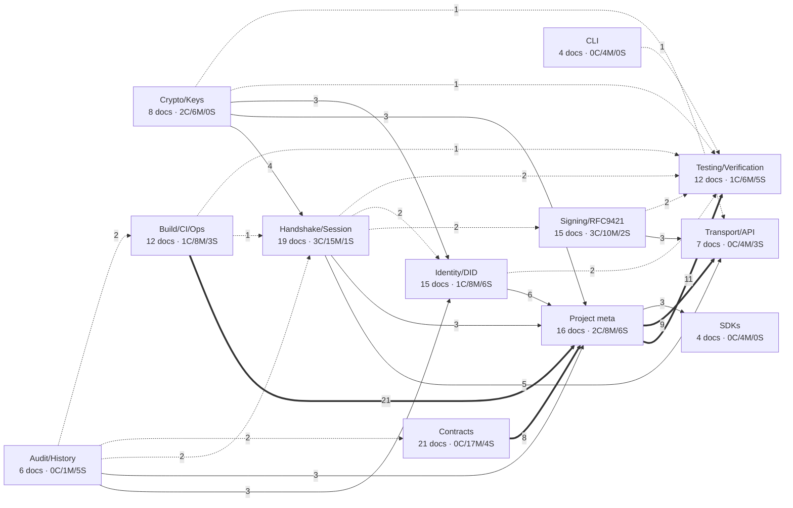

# SAGE Documentation Graph (X-bar classification)

Scope: every Markdown file in the repository except `docs/refactoring/**` (this effort's own output) and `node_modules`. 139 documents, 78,897 lines. Generated 2026-09-11 from the mechanical inventory (`docgraph.json`, 147 nodes / 283 link edges) plus per-document reading and code checks. Companion documents: `docs/refactoring/graph/summary.md` (package table), `docs/refactoring/analysis/*.md` (five scope analyses). `docs/refactoring/FEATURE_MAP.md` was named as an input but does not exist in the tree; the analysis files and the code itself were used instead.

## 1. Method

Each document is a node modelled on X-bar phrase structure: the **head** is the topic noun the document is about; the **type** is the phrase category (SPEC = normative protocol/format description, GUIDE = how-to, REFERENCE = API/CLI/config listing, RATIONALE = ADR/design reasoning, STATUS = changelog/audit/report/plan/test record, INDEX = navigation); the **specifier** is the intended audience; the **complement** is the code the document acts on (packages, contracts, commands); **adjuncts** are version/date anchors, language and duplication (bilingual twin or series membership).

Classification was done by reading: every file under 400 lines was read fully; longer files were read by headings, introduction, every section containing code paths/contract names/CLI flags, and any version/status block. The DETAILED_GUIDE series (17k lines) and the SECTION_1..9 test records were sampled: 8-21 identifiers or test names per file were grepped against the code and hit/miss counts are recorded in the notes.

Freshness was decided against the working tree, not against other documents. A claim counted as stale when the named path, symbol, contract, script, npm target, make target, flag or label does not exist or differs in the code; each such finding cites file:line. Verdicts: **CURRENT** = every checked claim matches; **MIXED** = the core is right but named sections are stale (listed in notes); **STALE** = the document's subject or most of its concrete claims no longer exist (SageRegistry/V2/V4, clientv4.go, cmd/sage-server, pkg/verifier, gRPC/A2A transports, scripts that were deleted); **UNVERIFIED** = not checkable (none needed it; unverifiable sub-claims are marked inline). Dead links and dead code references come from the inventory and were re-checked with `ls` where cited.

Ground truth used throughout (all verified in code): current contract is `AgentCardRegistry.sol` (commit-reveal: commitRegistration -> registerAgentWithParams -> activateAgent); the only working Go write path is `pkg/agent/did/ethereum/agentcard_client.go`; `did.Manager.Configure` never installs a chain client outside tests (`manager.go:74-114`, creator hook has no callers), so every `NewManager().Configure().RegisterAgent/ResolveAgent` example fails with `no registry/resolver for chain ethereum`; the primary handshake is the HPKE 1-RTT in `pkg/agent/hpke` (task `hpke/complete@v1`), while `pkg/agent/handshake` (4-phase) is only imported by `internal/session_creator.go`; there is no HTTP API server, no `cmd/sage-server`, no gRPC or A2A transport, no `pkg/verifier`, no `pkg/crypto|session|signature` (everything is under `pkg/agent/`); the four SDKs talk to routes no Go code serves and do not implement RFC 9421 or RFC 9180.

## 2. Summary counts

| Dimension | Counts |
|---|---|
| Documents | 139 (of 147 inventory nodes; 8 under docs/refactoring excluded) |
| By type | GUIDE 62, REFERENCE 28, STATUS 18, INDEX 15, RATIONALE 12, SPEC 4 |
| By freshness | MIXED 91, STALE 35, CURRENT 13 |
| By language | en 89, ko 50 |
| Bilingual pairs (en/ko twins) | 8 (handshake README, cryptographic, handshake, hpke-based-handshake, rfc9421, crypto, did, cli-guide); all 8 pairs share identical structure and identical stale claims; hpke-detailed has a -ko file only |
| Series / near-duplicates | DETAILED_GUIDE PART1..6C (8 files, 16,986 lines), SECTION_1..9 under SPECIFICATION_VERIFICATION_MATRIX (9), api/examples (3), docs/adr (3), docs/audit (4), a2a-integration examples (5), mcp-integration examples (7), SDK READMEs (4), contracts/README vs contracts/ethereum/README, docs/ARCHITECTURE vs audit/ARCHITECTURE-OVERVIEW vs dev/architecture, OPTIMIZATION-PLAN vs planning/PERFORMANCE_OPTIMIZATION_ROADMAP |
| Docs with dead links | 39 (94 dead links total) |
| Docs with dead code refs (backticked paths that do not exist) | 24 (46 dead refs total) |
| Docs with either | 53 of 139 |
| Last commit dates | 2025-07-08 … 2026-02-20; 130 of 139 last touched 2025-10 or 2025-11; only README, CHANGELOG, CONTRIBUTING, contracts/ethereum/README touched in 2026 |

Freshness by cluster:

| Cluster | Docs | CURRENT | MIXED | STALE |
|---|---|---|---|---|
| Identity/DID | 15 | 1 | 8 | 6 |
| Handshake/Session | 19 | 3 | 15 | 1 |
| Signing/RFC9421 | 15 | 3 | 10 | 2 |
| Crypto/Keys | 8 | 2 | 6 | 0 |
| Contracts | 21 | 0 | 17 | 4 |
| Transport/API | 7 | 0 | 4 | 3 |
| CLI | 4 | 0 | 4 | 0 |
| Build/CI/Ops | 12 | 1 | 8 | 3 |
| Testing/Verification | 12 | 1 | 6 | 5 |
| SDKs | 4 | 0 | 4 | 0 |
| Audit/History | 6 | 0 | 1 | 5 |
| Project meta | 16 | 2 | 8 | 6 |

Reading of the counts: only 13 documents are fully current, and 7 of those are the SECTION_* test records plus two coding-guideline files. Every reference document for a core package (crypto, did, session, transport, rfc9421, cli) is MIXED or STALE; the 35 STALE documents cluster around three retired designs — the SageRegistry/V2/V4 contract lineage, the never-built HTTP API server (`cmd/sage-server`, `/debug/*`, `/a2a:sendMessage`) and the planning-era Gateway/Rust architecture in `docs/dev/`.

## 3. Cluster map

Twelve clusters, assigned by path and head. Edges are cross-links between documents of different clusters (weight = number of links in the inventory; intra-cluster links omitted). Intra-cluster link counts: Identity/DID 4, Handshake/Session 22, Signing/RFC9421 5, Contracts 25, Transport/API 10, Build/CI/Ops 4, Testing/Verification 2, Audit/History 12, Project meta 31.

Observations from the edge weights: `Project meta` (README, INDEX, ARCHITECTURE, CONTRIBUTING) is the hub — 21 links into Build/CI/Ops, 11 into Testing, 9 into Transport/API, 8 into Contracts. The module reference clusters (Identity/DID, Handshake/Session, Crypto/Keys, Signing) link to each other weakly (2-4 links each) and almost never to Contracts or CLI, so a reader entering from `pkg/agent/did/README.md` is never routed to `docs/AGENTCARD_MIGRATION_GUIDE.md`, the one document that describes the current registration flow. `SDKs` and `CLI` are nearly isolated (3 and 1 cross-links). `Audit/History` links only outward to stale targets.

## 4. Node table

Sorted by cluster, then path. Notes give the stale claims and the code location used to decide; `(DEAD)` marks paths that do not exist. Line numbers are those of the working tree on 2026-09-11.

### Identity/DID (15)

| path | type | head | specifier | freshness | key adjuncts | notes |
|---|---|---|---|---|---|---|
| `docs/AGENTCARD_MIGRATION_GUIDE.md` | GUIDE | AgentCardRegistry commit-reveal migration | library user, operator | **MIXED** | en; v1.5.0; 2025-10-30; 575L; last commit 2025-11-02; dead links 0, dead refs 2 | Go API (agentcard_client.go:77-475) and CLI shape (commit/register/activate) match; `make generate-bindings` (L146) and scripts/test-local-registration.sh (L195) do not exist; Sepolia address 'TBD' (L543) contradicts README/CLAUDE.md. |
| `docs/KME_PUBLIC_KEY_INTEGRATION.md` | STATUS | KEM (X25519) key on AgentCardRegistry | contract developer, library user | **MIXED** | en; v1.5.0; 2025-10-28; 778L; last commit 2025-11-02 | Solidity/Go API reference matches (AgentCardRegistry.sol:540,557; agentcard_client.go:500,517; types_v4.go:78). Go usage examples (L458-578) call non-existent NewAgentCardClient(rpc,addr), client.Register, keys.GenerateECDSAKeyPair, hpke.NewClient(resolver).Encrypt. |
| `docs/SAGE_A2A_INTEGRATION_GUIDE.md` | GUIDE | sage-a2a-go DID/RFC 9421 integration plan | contributor (external project) | **STALE** | en; 'SAGE v4'; 2025-01-19; v1.1; 1050L; last commit 2025-11-02; dead links 3, dead refs 2 | Built on SageRegistryV4, EthereumClientV4, ResolveAllPublicKeys, pkg/verifier (DEAD), clientv4_multikey_resolution_test.go (DEAD). KeyType order inverted vs types_v4.go:37-39. `sage-did register --additional-keys` flags do not exist. Only the DID helper/A2A card function list (L189-258) is valid. |
| `docs/adr/003-did-method-selection.md` | RATIONALE | did:sage method selection | contributor | **MIXED** | en; 2024-10-26 v1.0; ADR series; 668L; last commit 2025-11-02; dead links 3, dead refs 0 | Rationale and DID format (utils.go:145) valid. Implementation notes use SageRegistryV4 AgentData, did.NewEthereumClient(url), manager.AddChain/Resolve (all DEAD); links docs/V4_UPDATE_DEPLOYMENT_GUIDE.md and contracts/solana/programs/agent_registry (DEAD). Claims Solana program deployed (L665); program IDs are placeholders. |
| `docs/did/did-en.md` | REFERENCE | DID package and sage-did CLI | library user | **MIXED** | en; pair did-ko.md; Sepolia SageRegistryV2 0x487d…; 547L; last commit 2025-10-11 | Read-side CLI flags match (resolve/list/update/deactivate/verify). Stale: SageRegistryV2 as deployed contract (L7,42,298-301,515); `register --chain --name --endpoint --key` (register.go:32 is `register [commit-hash]`); Configure→ResolveAgent example fails (manager.go:74-114 never installs a client); rfc9421.NewSigner and GenerateDID(chain,keyPair) do not exist; import paths lack pkg/agent/. |
| `docs/did/did-ko.md` | REFERENCE | DID 패키지 및 sage-did CLI | library user | **MIXED** | ko; pair did-en.md; 547L; last commit 2025-10-11 | Identical structure/code blocks to did-en.md; inherits every stale point (register flags L200-207, GenerateDID L421, NewSigner L442, SageRegistryV2 table L298-301). |
| `docs/overview/DETAILED_GUIDE_PART3_KO.md` | GUIDE | DID design and Ethereum/Kaia integration (series part 3) | library user | **STALE** | ko; 2025-10-07 v1.0; DETAILED_GUIDE series; 2648L; last commit 2025-10-11; dead links 1, dead refs 0 | Identifier sample 7/16 hit. did.ChainKaia, NewCrossChainVerifier, ResolveBatch, SageRegistryV2ABI, SageRegistryBatch.sol, NewEthereumClient(rpc,addr,key) (client.go:75 takes *RegistryConfig) all absent; single-step registerAgent (L211-214) vs commit-reveal; register CLI flags wrong (L900-913). |
| `docs/test/sections/SECTION_3_DID.md` | STATUS | DID test items 3.x verification record | auditor | **STALE** | ko; 2025-10-23/24; SECTION_1..9 series; 1114L; last commit 2025-11-02; dead links 0, dead refs 7 | 4 of 10 sampled tests missing (TestDIDPreRegistrationCheck, TestV4DIDLifecycleWithFundedKey, TestDIDResolution, TestV4Update); cites clientv4.go, SageRegistryV4.sol, deploy_v4.js, 7 test files that do not exist; commands target pkg/agent/did/ethereum for tests living elsewhere (did_test.go:407, tests/integration). |
| `docs/test/sections/SECTION_4_BLOCKCHAIN.md` | STATUS | Blockchain test items 4.x verification record | auditor | **CURRENT** | ko; SECTION_1..9 series; 451L; last commit 2025-11-02 | 8/8 sampled test names hit in tests/blockchain_verification_test.go (:41-528; two carry `_SpecVerification` suffix matched by regex). Contract items explicitly marked as simulation. testdata JSON not tracked in git. |
| `examples/a2a-integration/01-register-agent/README.md` | GUIDE | Multi-key agent registration example | library user | **MIXED** | en; a2a example series; 232L; last commit 2025-11-02; dead links 3, dead refs 0 | Walkthrough matches main.go:126-193 (`//go:build ignore`). SageRegistryV4 (L22,228), deploy-v4-local.js (L53), `key approve --contract-address/--rpc-url` (key.go:212-214 uses --contract/--rpc), three dead doc links; promised output unreachable (registry.go:98). |
| `examples/a2a-integration/02-generate-card/README.md` | GUIDE | A2A agent card generation example | library user | **MIXED** | en; a2a example series; 293L; last commit 2025-11-02; dead links 1, dead refs 0 | API usage matches a2a.go:35,153 and types_v4.go:166; docs/DID_SPECIFICATION.md link dead; 'Agent resolved successfully' unreachable (resolver.go:94 'no resolver for chain ethereum'). |
| `examples/a2a-integration/03-exchange-cards/README.md` | GUIDE | A2A card exchange and cross-verification example | library user | **MIXED** | en; a2a example series; 242L; last commit 2025-11-02 | Matches main.go:73-186, 299-334. Prerequisite 'SageRegistryV4 deployed' (L26) stale; registration output unreachable (registry.go:98). |
| `examples/a2a-integration/04-secure-message/README.md` | GUIDE | Encrypted/signed A2A message example | library user | **STALE** | en; a2a example series; 317L; last commit 2025-11-02 | Claims HPKE confidentiality (L18,137,180-204,294) but main.go:199-201 copies plaintext into `ciphertext` and :285 reads content unencrypted; hpke.Seal/Open exist only in comments and nowhere in the module. Only Ed25519 sign/verify is real. |
| `examples/a2a-integration/README.md` | GUIDE | A2A multi-key example set overview | library user | **STALE** | en; a2a example series; 223L; last commit 2025-10-22; dead links 1, dead refs 0 | Requires deploying SageRegistryV4 via scripts/deploy-v4-local.js (both absent); run_all_examples.sh and `go test -v` absent; contracts/MULTI_KEY_DESIGN.md dead. All flows fail at RegisterAgent: Manager.Configure never installs a client (manager.go:40-43,92-104) → registry.go:98 'no registry for chain ethereum'. |
| `pkg/agent/did/README.md` | REFERENCE | DID management package | library user | **STALE** | en; Sepolia V2 0x487d…; 858L; last commit 2025-11-02; dead links 5, dead refs 0 | Presents SageRegistryV4 as the recommended contract (L13,52-53,108-117,605-619,787) and omits AgentCardRegistry; lists ethereum/clientv4.go (L642, absent); Manager methods ResolveAgentV4/ResolvePublicKeyByType/RotateKey, RegistryConfig.RegistryVersion, MetadataVerifier.VerifySignature, ValidationOptions fields all absent (manager.go:63-342, registry.go:58-66, verification.go:45-158). DID format and A2A funcs still valid. |

### Handshake/Session (19)

| path | type | head | specifier | freshness | key adjuncts | notes |
|---|---|---|---|---|---|---|
| `api/examples/authentication.md` | GUIDE | HPKE authentication over HTTP | SDK user | **STALE** | en; api/examples series; 312L; last commit 2025-10-11; dead links 2, dead refs 1 | Every reference dead: tests/session/handshake/{server,client}/main.go, pkg/crypto/hpke, hpke.SetupSender/Seal/Open, pkg/crypto, pkg/session; routes /debug/* have no Go server. Ad-hoc `sender\|receiver\|message\|ts` signature matches SDKs, not the Go core. |
| `api/examples/sessions.md` | GUIDE | Session lifecycle and PostgreSQL session store | operator | **MIXED** | en; api/examples series; 511L; last commit 2025-10-11; dead links 1, dead refs 0 | pkg/storage API snippets accurate (postgres/store.go:48,78; memory/store.go:46). HTTP flow targets endpoints no Go code serves; `sage_sessions_expired_total{reason}` label and `sage_session_activity_update_seconds` do not exist (internal/metrics/session.go:49); tests/session/ link dead; pkg/storage has zero Go importers. |
| `docs/QUICKSTART_PR118.md` | GUIDE | PR #118 features (Content-Digest, HPKE ECDSA, DID X25519) | library user | **MIXED** | en; PR #118; 596L; last commit 2025-11-02 | Content-Digest API (body_integrity.go:43-134), ECDSA/Composite verifier (signature_verifier.go:58,178), error strings (client.go:291-313), UnmarshalPublicKey x25519 current. hpke.NewClient(key,transport,resolver,&ClientOpts{}), CompleteHandshake, NewAgentCardRegistryClient, rfc9421.NewHTTPSigner, VerifyHTTPRequest, crypto.NewKeyPairFromECDH do not exist (client.go:56,79; verifier_http.go:52,111). |
| `docs/adr/002-hpke-selection-rationale.md` | RATIONALE | HPKE (RFC 9180) selection | contributor | **MIXED** | en; 2024-10-26 v1.0; ADR series; 457L; last commit 2025-11-02 | Rationale, cipher suite (X25519+HKDF-SHA256+ChaCha20-Poly1305) and circl usage (go.mod:7) valid. Implementation sketch hpke.NewClient(pub).Seal / NewServer(priv).Open (L114-119) does not match client.go:56/server.go:88; Auth-mode support (L105,340,454) and RFC test vectors (L455) not found in code. |
| `docs/dev/SAGE-secure-session-communication-ko.md` | SPEC | HPKE secure session communication overview | library user, auditor | **CURRENT** | ko; 160L; last commit 2025-10-11 | Suite labels (types.go:45-46), combineSecrets (common.go:74-79), (ctxID\|nonce) replay cache (common.go:160-178), ackTag transcript (client.go:158-160, server.go:178), Ack fields (server.go:73-87), session.Config all match. Only handshake doc with no stale path or label. |
| `docs/handshake/README-ko.md` | INDEX | 핸드셰이크 프로토콜 문서 안내 | library user | **MIXED** | ko; pair README.md; 210L; last commit 2025-10-11 | 1:1 translation; same stale import paths (L180-183, L201). Its tutorial link resolves (hpke-detailed-ko.md). |
| `docs/handshake/README.md` | INDEX | Handshake protocol family navigation | library user | **MIXED** | en; pair README-ko.md; 210L; last commit 2025-10-11; dead links 2, dead refs 0 | Protocol summaries and directional HKDF keys (session.go:268-269) correct. Links hpke-detailed-en.md (absent; only -ko exists); import paths `sage/handshake` etc. and `go test ./handshake/...` predate pkg/agent/. Calls 4-phase 'mature, battle-tested' (L11) though it is unused outside internal/session_creator.go and never checks nonce/timestamp. |
| `docs/handshake/cryptographic-en.md` | RATIONALE | Cryptographic design and threat model | auditor | **MIXED** | en; pair cryptographic-ko.md; 330L; last commit 2025-10-12 | Bootstrap AES-GCM AAD (x25519.go:210-229), DeriveSessionSeed/ComputeSessionIDFromSeed (session.go:186-211), SignCovered (:661) match. Stale: ackKey/ackTag labels 'ack-key'/'hpke-ack\|' (code common.go:226,245 'SAGE-ack-key-v1'/'SAGE-ack-msg\|v1\|'); HKDF info 'encryption'/'signing' (code session.go:236 'sage-session-keys-v1'); info example 'sage/hpke v1' (code types.go:47 'sage/hpke-info\|v1'). |
| `docs/handshake/cryptographic-ko.md` | RATIONALE | 암호학적 설계 및 위협 모델 | auditor | **MIXED** | ko; pair cryptographic-en.md; 375L; last commit 2025-10-12 | Same structure and same stale labels (L99-100, L212-220, L256); one extra explanatory line (L219). |
| `docs/handshake/handshake-en.md` | GUIDE | 4-phase handshake package | library user | **MIXED** | en; pair handshake-ko.md; 195L; last commit 2025-09-28 | API names resolve (client.go:40-186, server.go:91,342,446, types.go:59,98). Stale: 'over gRPC' (L7,149,192; client.go:32 uses transport.MessageTransport), package tree with handshake/session/* (L44-55), import paths (L39,87-90); claims nonce replay check (L13) that server never performs. |
| `docs/handshake/handshake-ko.md` | GUIDE | 4단계 핸드셰이크 패키지 | library user | **MIXED** | ko; pair handshake-en.md; 195L; last commit 2025-10-11 | Same 195 lines; same gRPC/tree/import staleness; typos 'Handshak Packae' (L1), 'sendRes.ponseToPeer' (L192). |
| `docs/handshake/hpke-based-handshake-en.md` | SPEC | HPKE 1-RTT handshake protocol | library user | **MIXED** | en; protocol 'v1'; pair hpke-based-handshake-ko.md; 450L; last commit 2025-10-12 | InfoBuilder strings (types.go:23-48, common.go:40-58), TaskHPKEComplete (types.go:21), ackTag derivation (common.go:222-245), DeriveTrafficKeys/CB (common.go:100-109), MaxSkew 2 min (server.go:95-96) match. Message schema (L264-294) and example (L423-445) use old 'sage/hpke v1' info, 'hpke-ack\|' tag, 'c2s:key' labels (code 'SAGE-c2s:key' types.go:52-55), hpke.DeriveToPeer/OpenWithPriv (code keys.HPKEDeriveSharedSecretToPeer x25519.go:433); cookie/PoW formats exist only in security_test.go:852-931. |
| `docs/handshake/hpke-based-handshake-ko.md` | SPEC | HPKE 기반 1-RTT 핸드셰이크 | library user | **MIXED** | ko; pair hpke-based-handshake-en.md; 465L; last commit 2025-10-12 | Same content plus one extra subsection (L403-406); same stale schema (L274-304), example (L438-460), DeriveToPeer (L442). |
| `docs/handshake/hpke-detailed-ko.md` | GUIDE | HPKE 핸드셰이크 단계별 코드 해설 | library user | **MIXED** | ko; 2025-10-09; no -en twin (README links a missing one); 852L; last commit 2025-10-12 | Self-declares mid-update (L11). Constants appendix (L666-700) current; walkthrough shows handshake.Client.Invitation with a2a protobuf labelled as hpke/client.go (L96-156), Server.OnHandleTask (L274; code HandleMessage server.go:115), old makeAckTag labels (L355-360), task 'hpke/complete' without @v1 (L700). |
| `docs/overview/DETAILED_GUIDE_PART4_KO.md` | GUIDE | HPKE handshake and session management (series part 4) | library user | **MIXED** | ko; 2025-10-07 v1.2; DETAILED_GUIDE series; 1500L; last commit 2025-10-12 | 15/21 identifiers hit (session.NewManager, BindKeyID, GetByKeyID, DeriveSessionSeed, hpke.Client/Server, TaskHPKEComplete…). Stale: gRPC/a2a.A2AServiceClient field (L422; code client.go:45 transport.MessageTransport), hpke.Server.SendMessage (code HandleMessage), Server.key described as X25519 (code server.go:44-45 separate key/kem), `make test-hpke` (Makefile:516-517 commented out). |
| `docs/test/sections/SECTION_7_SESSION.md` | STATUS | Session test items 7.x verification record | auditor | **CURRENT** | ko; 2025-10-24; SECTION_1..9 series; 531L; last commit 2025-11-02; dead links 0, dead refs 6 | 6/6 Test_7_* names hit (session_test.go:473-913). Six cited testdata JSON files are generated at run time and gitignored (inventory dead refs). |
| `docs/test/sections/SECTION_8_HPKE.md` | STATUS | HPKE test items 8.x verification record | auditor | **CURRENT** | ko; 2025-10-23/24; SECTION_1..9 series; 424L; last commit 2025-11-02 | 3/3 test commands hit (hpke_test.go:33, security_test.go:227,284). Per-item line ranges not verified. |
| `internal/sessioninit/README.md` | RATIONALE | handshake-to-session Creator adapter | contributor | **MIXED** | en; 608L; last commit 2025-11-02 | Creator struct/flow matches internal/session_creator.go:38-141. File Structure (L592-596) claims internal/sessioninit/session_creator.go; file is internal/session_creator.go (package sessioninit) and the dir holds only this README. Usage (L135-257) uses fictional handshake.New/Protocol/Initiate and sessionMgr.Encrypt; session.Params fields wrong (session.go:76-86). Documents the legacy 4-phase path. |
| `pkg/agent/session/README.md` | REFERENCE | Session management package | library user | **MIXED** | en; 869L; last commit 2025-11-02 | Session iface, Config defaults (manager.go:47-50), NonceCache (nonce.go:35-70), EnsureSessionFromExporterWithRole (manager.go:81-86) accurate. Wrong names: DeleteSession→RemoveSession (:301), GetSessionByKeyID→GetByKeyID (:270), GetStatus→GetSessionStats (:360), BindKeyID returns nothing (:229); hpke.NewSender/ExportSecret absent; HKDF salt 'sage/hpke v1' vs session.go:236 info label. Does not mention the zero-signingKey/nil-aead defect in the exporter path (session.go:251-291). |

### Signing/RFC9421 (15)

| path | type | head | specifier | freshness | key adjuncts | notes |
|---|---|---|---|---|---|---|
| `api/examples/signatures.md` | GUIDE | RFC 9421 HTTP message signatures | SDK user | **MIXED** | en; api/examples series; 580L; last commit 2025-11-02; dead links 2, dead refs 0 | Wire-format description (RFC 9421/9530) correct. 'alg always ed25519' (L34) wrong: types.go:88 and verifier_http.go:67,209 support ECDSA secp256k1. pkg/signature/rfc9421.go, tests/signature/, tests/session/handshake server, scripts/sign-request.sh all absent. |
| `docs/core/README.md` | INDEX | core package doc index | library user | **CURRENT** | en; 15L; last commit 2025-07-08 | Three links resolve; no code claims. |
| `docs/core/rfc-9421-test.md` | STATUS | RFC 9421 test plan/status (26 cases) | contributor | **MIXED** | ko; 2025-10-09; 227L; last commit 2025-10-11 | Test names exist (parser_test.go:30-232, canonicalizer_test.go:33-334, integration_test.go:39-502) but cited line ranges drifted; 26-test tally predates body_integrity_test.go (+13 funcs); `go test ./core/rfc9421/...` path stale; VerificationOptions.MaxAge (L134) is on HTTPVerificationOptions (verifier_http.go:261-269); named Err* sentinels not in package. |
| `docs/core/rfc9421-en.md` | REFERENCE | RFC 9421 package (HTTPVerifier, MessageBuilder, registry) | library user | **MIXED** | en; pair rfc9421-ko.md; 456L; last commit 2025-11-02 | Signatures verified (verifier_http.go:45-278, verifier.go:43-234, message_builder.go:32-120). Stale: P-256 'not registered' (L55,432,444) vs keys/algorithms.go:57-63 'ecdsa-p256-sha256'; algorithm list (L42); tree omits body_integrity.go; `Algorithm: "ed25519"` on rfc9421.Message rejected by verifier.go:175-211 (expects 'EdDSA'); test section '26/26' and old path. |
| `docs/core/rfc9421-ko.md` | REFERENCE | RFC 9421 패키지 레퍼런스 | library user | **MIXED** | ko; pair rfc9421-en.md; 456L; last commit 2025-11-02 | Same 40 headings and code blocks; inherits all stale points (L55, L42, L26, L361-456). |
| `docs/test/sections/SECTION_1_RFC9421.md` | STATUS | RFC 9421 test items 1.x verification record | auditor | **CURRENT** | ko; 2025-10-23; SECTION_1..9 series; 685L; last commit 2025-11-02 | 9/9 sampled test commands hit (integration_test.go:41-228, verifier_test.go:119-1204). testdata/rfc9421/*.json not in git. One -run regex (L403) matches only the Secp256k1 tamper case (Ed25519 case named differently, verifier_test.go:119). |
| `docs/test/sections/SECTION_5_MESSAGE.md` | STATUS | Message nonce/order/dedupe test items 5.x record | auditor | **CURRENT** | ko; 2025-10-24; SECTION_1..9 series; 708L; last commit 2025-11-02 | 11/11 subtests hit with exact t.Run line numbers (nonce/manager_test.go:35-297, order/manager_test.go:133-450, dedupe/detector_test.go:106, validator/validator_test.go:44-335). testdata JSON not tracked. |
| `examples/README.md` | INDEX | Examples directory index | library user | **MIXED** | en; 74L; last commit 2025-10-26; dead links 1, dead refs 0 | mcp-integration/simple/example_tool.go (L10,31-33), scripts/deploy-v4-local.js (L50), docs/architecture/ (L75) absent; omits examples/agent-initialization and simple-agent-init. |
| `examples/mcp-integration/QUICKSTART.md` | GUIDE | MCP demo fast path | library user | **MIXED** | en; mcp example set; 98L; last commit 2025-11-02; dead links 3, dead refs 0 | Commands match simple-standalone/main.go:196-239 and attacker/main.go:141. 'Tools verify signatures before processing' (L92) false for simple-standalone (main.go:46-66 header presence only) and secure-chat; links mis-depthed (L96-99). |
| `examples/mcp-integration/README.md` | INDEX | MCP tool security examples overview | library user | **MIXED** | en; mcp example set; 204L; last commit 2025-11-02; dead links 4, dead refs 0 | Directory list, ports (basic-demo :8080, simple-standalone :8082) and `go run . --secure` correct. Integration Patterns (L143-178) call sage.VerifyRequest/HasCapability/SignResponse which exist nowhere; 'blockchain-verified identities' (L15) is an in-memory map (basic-demo/main.go:272); doc links go above repo root (../../../docs). |
| `examples/mcp-integration/basic-demo/README.md` | GUIDE | Calculator MCP tool with RFC 9421-verified agents | library user | **MIXED** | en; mcp example set; 78L; last commit 2025-10-06; dead links 1, dead refs 0 | Matches main.go:79-80 (rfc9421.NewHTTPVerifier().VerifyRequest), :272-354. The only MCP example that really verifies signatures. ../sage-wrapper/ (L78) absent. |
| `examples/mcp-integration/multi-agent/README.md` | GUIDE | Planned multi-agent capability demo | library user | **STALE** | en; mcp example set; 77L; last commit 2025-07-08 | Instructs `cd research-agent && go run .` etc.; directory contains only README.md. Parent README marks it '(planned)'. |
| `examples/mcp-integration/performance-benchmark/README.md` | GUIDE | Secured vs insecure endpoint benchmark | library user | **STALE** | en; mcp example set; 85L; last commit 2025-10-11 | `go run main.go` (L15) and package import (L69) refer to code that does not exist; directory holds only README.md; numbers unbacked. |
| `examples/mcp-integration/simple-standalone/README.md` | GUIDE | Insecure vs SAGE-gated weather endpoints | library user | **MIXED** | en; mcp example set; 53L; last commit 2025-07-08 | Run instructions match main.go:196-239. '3 extra lines add complete cryptographic security' (L54) false: verifySAGERequest (main.go:46-66) checks header presence only ('In a real app, verify the signature here' :64). |
| `examples/mcp-integration/vulnerable-vs-secure/README.md` | GUIDE | Attack demo vs header-gated server | library user | **MIXED** | en; mcp example set; 85L; last commit 2025-11-02 | Ports and commands match (vulnerable-chat :8082, secure-chat :8083). 'Attack blocked / SAGE protects the server' (L40,62,86) rests on secure-chat/main.go:42-60 which accepts any request with both headers (:59) and never verifies a signature or nonce; sage.VerifyRequest (L78) does not exist. |

### Crypto/Keys (8)

| path | type | head | specifier | freshness | key adjuncts | notes |
|---|---|---|---|---|---|---|
| `docs/crypto/crypto-en.md` | REFERENCE | Crypto package and sage-crypto CLI | library user | **MIXED** | en; pair crypto-ko.md; 560L; last commit 2025-10-11 | Go API names resolve (keys/x25519.go:52-450, vault/secure_storage.go, chain/registry.go, storage/file.go). Stale: import/test paths without pkg/agent (L20,79-91…), tree omits keys/p256.go, `sign\|verify --format pem` (code --key-format, sign.go:74/verify.go:71), `verify --storage-dir --key-id` (verify.go:70-75 has neither). MemoryVault is XOR not AES-GCM (secure_storage.go:325-350). |
| `docs/crypto/crypto-ko.md` | REFERENCE | 암호화 패키지 및 sage-crypto CLI | library user | **MIXED** | ko; pair crypto-en.md; 560L; last commit 2025-10-11 | Identical code/CLI blocks; same stale flags (L277,293,433-436) and paths. |
| `docs/overview/DETAILED_GUIDE_PART2_KO.md` | GUIDE | Cryptographic primitives (series part 2) | library user | **MIXED** | ko; 2025-10-07 v1.0; DETAILED_GUIDE series; 2529L; last commit 2025-10-11 | 10/17 identifiers hit (keys.Generate*, HPKESealAndExport…, session.Params, NewSecureSessionFromExporterWithRole). All import paths lack pkg/agent/; keys.NewSecp256k1KeyPairFromPrivate/NewEd25519KeyPairFromPrivate (L2008-2059) absent; SageRegistryV2.sol (L602) absent. |
| `docs/test/sections/SECTION_2_CRYPTO.md` | STATUS | Key management test items 2.x record | auditor | **CURRENT** | ko; 2025-10-23; SECTION_1..9 series; 436L; last commit 2025-11-02 | 7/7 test names hit (secp256k1_test.go:36-289, ed25519_test.go:40-265); CLI flags match cmd/sage-crypto. Expected-output file name keys_test.go is illustrative only. |
| `examples/agent-initialization/README.md` | GUIDE | Agent initialization with key management | library user | **MIXED** | ko; pair simple-agent-init; 195L; last commit 2025-11-02; dead links 4, dead refs 0 | Key files/permissions/env vars match main.go:66-139,400-439 (`//go:build ignore`). agent.SignMessage/VerifyMessage (L80-84) not defined on *Agent (only SimpleAgent); links ../../../ resolve above repo root; on-chain registration fails (registry.go:98). |
| `examples/simple-agent-init/README.md` | GUIDE | Minimal agent initialization example | library user | **CURRENT** | ko; pair agent-initialization; 136L; last commit 2025-11-02; dead links 1, dead refs 0 | All methods/files/permissions match main.go:41-217. Only the LICENSE link (L136) is one level too deep. |
| `internal/cryptoinit/README.md` | RATIONALE | cryptoinit registration package | contributor | **MIXED** | en; 322L; last commit 2025-11-02; dead links 0, dead refs 1 | Registered components match init.go:28-48. Examples use crypto.GenerateKeyPair (package-level; only Manager method manager.go:43) and crypto.RegisterKeyGenerator (code SetKeyGenerators wrappers.go:51); claims cmd/sage-crypto, sage-did, sage-server import it (actual importers: pkg/agent/core/core.go and examples). |
| `pkg/agent/crypto/README.md` | REFERENCE | Crypto key management package | library user | **MIXED** | en; benchmarks 'Apple M1/Go 1.24'; 828L; last commit 2025-11-02 | Manager/KeyPair/storage/formats/chain constructors match (manager.go:31-92, storage/memory.go:35, file.go:51). Wrong: vault as OS-keychain `vault.NewSecureStorage` (code NewFileVault(basePath) secure_storage.go:76, passphrase file); NewFileKeyStorage returns (KeyStorage, error) not one value; 'encrypted at rest' (file.go:104 writes plain JSON 0600); rotation.NewKeyRotator(manager).RotateKey (code NewKeyRotator(storage).Rotate rotator.go:40,54); P-256 omitted; KeyStorage iface omits Exists. |

### Contracts (21)

| path | type | head | specifier | freshness | key adjuncts | notes |
|---|---|---|---|---|---|---|
| `contracts/README.md` | INDEX | Ethereum contracts overview (AgentCard) | contract developer, operator | **MIXED** | en; V4.1; 2025-10-31; twin contracts/ethereum/README.md; 415L; last commit 2025-11-01; dead links 1, dead refs 0 | npm scripts and script files exist. Test count '124' (L21,236) vs 202 `it(`; per-file counts wrong (VerifyHook 36 vs 24, Registry 47 vs 63…); contracts/deprecated/ (L35,311) absent; erc-8004/README.md link dead; 'full ERC-8004 implementation' though AgentCardRegistry.sol:616-627 registerAgent(string,string) reverts. |
| `contracts/ethereum/.slither.config.md` | RATIONALE | Slither exclusion rationale | auditor | **MIXED** | en; pair .slither.config.json; 65L; last commit 2025-11-01 | Documented exclusions and nonReentrant claims verified (SimpleMultiSig.sol:196, TEEKeyRegistry.sol:478,555). JSON additionally excludes nine detectors (incl. missing-events-access-control) the .md never justifies; encodePacked claim (L31) wrong for AgentCardRegistry.sol:160,446-452; filter_paths 'deprecated' dir absent. |
| `contracts/ethereum/QUICK_START.md` | GUIDE | Local full-stack deployment quick start | contract developer | **MIXED** | ko; pair LOCAL_TESTING_GUIDE.md; 364L; last commit 2025-11-02; dead links 1, dead refs 0 | npm commands and deploy-all-contracts.js output match. JS usage examples (L170-317) call registerAgent(did,publicKey,metadata), getAgent, createValidationRequest, commitAgentRegistration, revealAgentRegistration — none exist (ERC8004IdentityRegistry.sol:88-135, ERC8004ValidationRegistry.sol:132, AgentCardRegistry.sol:86,122,145-151); docs/DEPLOYMENT_GUIDE.md dead. |
| `contracts/ethereum/README.md` | INDEX | AgentCard Hardhat package reference | contract developer, operator | **MIXED** | en; V4.1; 2026-02-20; twin contracts/README.md; 548L; last commit 2026-02-20; dead links 2, dead refs 1 | 202 total and all npm scripts match; env var names match hardhat.config.js:59-212. Per-file test counts wrong for 8 of 9 files (L249-365); three deprecated/ dirs absent; VERIFICATION_MATRIX.md and ../erc-8004/README.md dead; Sepolia addresses (L211-217) appear in no code or deployment JSON (on-chain status unverified). |
| `contracts/ethereum/contracts/erc-8004/standalone/README.md` | REFERENCE | Standalone ERC-8004 registries | contract developer | **MIXED** | en; EIP 'Draft'; 312L; last commit 2025-11-02 | Constructor shapes and function names match (ERC8004ValidationRegistry.sol:103-206, ERC8004ReputationRegistry.sol:84-146). test/erc8004-standalone.test.js and '27 tests' (L107,127,272) absent; line counts off (255/373/693 actual). Silent on the missing admin access control (ValidationRegistry.sol:603-651 setters are unprotected). |
| `contracts/ethereum/deployments/README.md` | REFERENCE | Deployment record format and per-network commands | operator | **MIXED** | en; 238L; last commit 2025-10-26 | Networks/chain IDs match hardhat.config.js:38-212. File naming convention (L34-40) vs deploy-agentcard.js:173 `-agentcard-`, deploy-all-contracts.js:260 `-complete-latest.json`; deploy:kaia:testnet etc. (actual :kairos/:sepolia); KAIA_MAINNET_RPC_URL/KAIA_TESTNET_RPC_URL (actual KAIROS_RPC_URL/KAIA_RPC_URL hardhat.config.js:59,71). |
| `contracts/ethereum/docs/ARCHITECTURE-DIAGRAMS.md` | SPEC | AgentCard system architecture and flows | contract developer, auditor | **MIXED** | en; v2.0; 2025-11-01; pair INTEGRATION-GUIDE.md; 856L; last commit 2025-11-02 | Component table, commit hash (AgentCardRegistry.sol:145-151), stake/delays (:40-41, AgentCardStorage.sol:217), hook limits, TEE params (TEEKeyRegistry.sol:296-302) match. Stale: event RegistrationCommitted (code CommitmentRecorded AgentCardStorage.sol:323), registerAgent(params,salt)+kmePublicKey (code registerAgentWithParams :122), X25519 'signature N/A' (code requires 65-byte proof :446-447), ReputationV2 commit-reveal flow (code single-step authorizeTask ERC8004ReputationRegistry.sol:102), submitValidation/finalizeValidation (code submitStakeValidation :206), 'custom errors' (require strings :97-141), constructor wiring (L805-812). |
| `contracts/ethereum/docs/CLEAN_GUIDE.md` | REFERENCE | npm clean scripts | contributor | **MIXED** | en; v1.3.1; 2025-10-26; 317L; last commit 2025-11-02; dead links 0, dead refs 1 | clean/clean:generated/clean:deployments/clean:deep accurate. clean:bindings, generate:all, deploy:sepolia absent from package.json; clean:all definition wrong; bindings/, abi/, verification/ dirs and deployments/example.json absent. |
| `contracts/ethereum/docs/GOVERNANCE-SETUP.md` | GUIDE | Multi-sig + timelock ownership hand-over | operator | **STALE** | en; v1.0; 2025-10-07; 509L; last commit 2025-11-02 | All five scripts (deploy-multisig-governance.js, transfer-ownership-to-timelock.js…) absent; names SageRegistry/SageRegistryV2; assumes ERC-8004 registries are Ownable and have pause() — none inherit Ownable (ERC8004ValidationRegistry.sol:26) and setMinStake (:619) is callable by anyone; getContractAt('TimelockController') vs SAGETimelockController (TimelockController.sol:12); never mentions SimpleMultiSig/TEEKeyRegistry which deploy-all-contracts.js:86-112 deploys. |
| `contracts/ethereum/docs/INTEGRATION-GUIDE.md` | GUIDE | dApp integration with AgentCard/validation/reputation/TEE | library user (dApp developer) | **MIXED** | en; v2.0; 2025-11-01; pair ARCHITECTURE-DIAGRAMS.md; 1106L; last commit 2025-11-02 | Validation and TEE sections track code (ERC8004ValidationRegistry.sol:132-209, TEEKeyRegistry.sol:387-750). Registration reveal wrong: abi.encode vs abi.encodePacked (AgentCardRegistry.sol:426-431), X25519 '0x' signature (65 bytes required :446-447), registerAgent(params) vs registerAgentWithParams (:122); validationType 0=STAKE (enum NONE=0,STAKE=1); ValidationFinalized shape; whole Reputation section (commitTaskAuthorization etc.) and custom error names absent; Hardhat 2.x/CommonJS (package.json:107 ^3.1.10, ESM config); SageRegistryV3/ReputationRegistryV2 names. |
| `contracts/ethereum/docs/LOCAL_TESTING_GUIDE.md` | GUIDE | Local Hardhat deploy-and-interact walkthrough | contract developer | **MIXED** | ko; v2.0; 2025-11-01; pair QUICK_START.md; 301L; last commit 2025-11-01 | Parameters and getters match (AgentCardRegistry.sol:40-41,145-151,245,391; AgentCardVerifyHook.sol:41). ./bin/deploy-local.sh, scripts/deploy-local.js, scripts/interact-local.js absent; ERC8004ReputationRegistryV2 absent; AgentCardStorage listed as deployed (abstract :22); signing example (abi.encode, '0x' X25519 sig, registerAgent(params)) contradicts contract; revert strings invented (L207-211). |
| `contracts/ethereum/docs/NATSPEC-GUIDE.md` | GUIDE | NatSpec documentation standard | contributor | **MIXED** | en; v1.0; 2025-10-07; 721L; last commit 2025-11-02; dead links 2, dead refs 0 | Tag conventions and checklist usable. Every SAGE example targets SageRegistry/SageRegistryV3/ReputationRegistryV2, registerAgentWithReveal, MAX_AGENTS_PER_OWNER, minValidatorStake/setValidatorRewardPercentage onlyOwner — none exist; AgentMetadata/AgentRegistered/ValidationFinalized shapes wrong (AgentCardStorage.sol:55-68,264-269; IERC8004ValidationRegistry.sol:183-187); links FRONT-RUNNING-PROTECTION.md, ARRAY-BOUNDS-CHECKING.md dead; hardhat docgen/check-natspec not installed. |
| `contracts/ethereum/docs/QUERY_COMMANDS.md` | REFERENCE | Read-only agent query recipes | contract developer | **MIXED** | ko; v2.0; 2025-11-01; pair LOCAL_TESTING_GUIDE.md; 240L; last commit 2025-11-01 | Getters exist (AgentCardRegistry.sol:40-408). scripts/query-agents.js absent; selector 0x4b9f0cea wrong (getAgentsByOwner(address) = 0x1ab6f888); AgentRegistered topic/ABI wrong (AgentCardStorage.sol:264-269 has indexed string did); field kmePublicKey vs kemPublicKey (AgentCardStorage.sol:82); registry address 0x5FbDB2… is the hook in hardhat-latest.json; hard-coded /Users/0xtopaz paths. |
| `contracts/ethereum/docs/README.md` | INDEX | Index of contracts/ethereum/docs | mixed | **MIXED** | en; v2.1; 2025-11-02; 76L; last commit 2025-11-02 | All eight links resolve. Status table marks VERIFICATION_GUIDE, GOVERNANCE-SETUP, NATSPEC-GUIDE 'Current' though they cite SageRegistry/V2/V3; CLEAN_GUIDE version mismatch (v1.0 vs v1.3.1). |
| `contracts/ethereum/docs/VERIFICATION_GUIDE.md` | GUIDE | Source verification on Kaia Klaytnscope | operator | **STALE** | en; 196L; last commit 2025-11-02; dead links 0, dead refs 2 | npm deploy:kairos/deploy:kaia/verify:kairos/verify:kaia/verify:*:manual absent (actual deploy:kaia:kairos etc.); SageRegistry/SageVerificationHook and contracts/SageRegistry.sol absent; compiler 0.8.19/EVM london vs hardhat.config.js:235,248 (0.8.20, shanghai). Only the sourcify snippet survives. |
| `contracts/ethereum/flattened/VERIFICATION_INSTRUCTIONS.md` | GUIDE | Klaytnscope manual verification form values | operator | **STALE** | en; compiler 0.8.19; 70L; last commit 2025-08-24 | Leftover generator output: names SageRegistryV2/SageVerificationHook *_flat.sol, scripts/verify-contracts.js, 'no constructor parameters' (AgentCardRegistry.sol:74 takes _verifyHook). scripts/flatten-contracts.sh:18-196 would overwrite it with AgentCard names; flattened/ has no *_flat.sol. |
| `docs/PERFORMANCE_BENCHMARKS.md` | STATUS | AgentCardRegistry Go client benchmarks | contributor | **MIXED** | en; Go 1.24.0; 2025-01-15; v1.5.0-alpha; 76L; last commit 2025-11-02 | Benchmark names exist (agentcard_benchmark_test.go:34-299; BenchmarkKeyTypeConversion :206 omitted). Go 1.24.0 vs go.mod 1.25.2; gas numbers and '99%+ success' unbacked; date 2025-01-15 with v1.5.0-alpha conflicts with CHANGELOG (1.5.x = 2025-11). |
| `docs/contracts/ERC-8004-Analysis.md` | RATIONALE | ERC-8004 standard analysis and SAGE roadmap | contract developer | **MIXED** | ko; 2025-10-06 v1.0; 608L; last commit 2025-10-11 | External analysis untouched. SAGE parts stale: SageRegistryV2 as Identity Registry (L323,335,542); Reputation/Validation registries 'future' (L341-376) though erc-8004/standalone/*.sol exist. |
| `docs/contracts/SAGE-vs-ERC8004-Comparison.md` | RATIONALE | SAGE vs ERC-8004 scope comparison | contract developer | **MIXED** | ko; 2025-10-06 v1.0; 531L; last commit 2025-10-11 | Core argument (RFC 9421 + session AEAD + nonce/ordering on top of ERC-8004) matches packages. SageRegistryV2 (L15) and 'reputation: No' (L16) stale; integration scenario assumes external ERC-8004 registries. |
| `docs/contracts/SOLIDITY_CONTRACTS_ANALYSIS.md` | REFERENCE | Solidity contract system analysis / Go client signatures | contract developer | **MIXED** | en; 1052L; last commit 2025-10-28 | Function signatures verified against AgentCardRegistry.sol:86-591; ISageRegistry.sol:56-91 matches. ISageRegistryV4.sol (L201-257, L985-1020) does not exist (interfaces/ has IRegistryHook, ISageRegistry only); 'ValidationRegistry can call TEEKeyRegistry' (L1028) has no code. |
| `docs/overview/DETAILED_GUIDE_PART5_KO.md` | GUIDE | SageRegistry contract internals, hooks, deployment, bindings (series part 5) | contract developer | **STALE** | ko; 2025-01-15 v1.0; pragma ^0.8.19; DETAILED_GUIDE series; 3124L; last commit 2025-10-11; dead links 2, dead refs 1 | 12/21 hit but the subject is SageRegistry.sol/SageVerificationHook.sol (absent); bindings/registry + registry.NewSageRegistry (actual pkg/blockchain/ethereum/contracts/agentcardregistry); did.NewEthereumRegistry/NetworkKairos/ChainKaia absent; pragma ^0.8.19 vs 0.8.20; full-test.sh absent; links PART6_KO.md (only 6A/6B/6C exist). Commit-reveal never mentioned. |

### Transport/API (7)

| path | type | head | specifier | freshness | key adjuncts | notes |
|---|---|---|---|---|---|---|
| `api/README.md` | INDEX | SAGE HTTP API OpenAPI spec | SDK user, contributor | **STALE** | en; 2025-10-26; API 1.0.0; SAGE 1.3.0; 205L; last commit 2025-11-02; dead links 0, dead refs 2 | Depends on cmd/sage-server 'implements all endpoints' (L153) — no such binary; lists /health but openapi.yaml:216 defines /debug/health; SAGE version 1.3.0 vs VERSION 1.5.2. No Go handler serves /a2a:sendMessage or /debug/*. |
| `docs/API.md` | REFERENCE | SAGE HTTP API server + Transport Layer API | library user, SDK user | **STALE** | en; 1.0.0; 2025-10-10; pair api/openapi.yaml; 1139L; last commit 2025-10-11; dead links 0, dead refs 1 | HTTP transport (http/client.go:56,68; server.go:64,77) and selector (selector.go:140-165) sections are current. Everything else describes a server that does not exist (endpoints, rate limiting, monitoring, quick start via tests/session/handshake/*); MessageTransport.Close() (interface.go:42-54 has Send only); transport/a2a, NewWebSocketTransport/NewWebSocketServer/HandleConnection (actual NewWSTransport/NewWSServer), pkg/crypto\|session\|signature imports, root docker-compose, `sage-did register --chain-id` all dead; SDK table says Python/Rust/Java 'planned' though sdk/ dirs exist. |
| `docs/adr/001-transport-layer-abstraction.md` | RATIONALE | Transport layer abstraction decision | contributor | **MIXED** | en; 2024-10-26 v1.0; ADR series; 380L; last commit 2025-11-02; dead links 1, dead refs 1 | Decision and alternatives match interface.go:42-54 (single Send) and http/websocket/mock/selector. Implementation notes: pkg/agent/transport/mock/ (actual mock.go), transport.RegisterScheme (actual RegisterFactory selector.go:68), docs/SAGE_A2A_GO_IMPLEMENTATION_GUIDE.md dead; date 2024-10-26 conflicts with GO_VERSION_REQUIREMENT.md (2025-01). |
| `docs/dev/api-spec.md` | REFERENCE | API spec (current modules + planned SDK/Gateway) | SDK user | **STALE** | ko; openapi 3.1.0 / Gateway 1.0.0; 544L; last commit 2025-11-02 | 'Implemented' section never matched code: KeyPair{Generate,Export} vs types.go:47-59; did.Manager interface vs struct manager.go:54 (RegisterAgent/ResolveAgent); RegistrationRequest fields; SignRequest(req,keyID) vs verifier_http.go:52. Sections 2-4 (Gateway /relay, github.com/sage/sdk, @sage/sdk) self-declared unbuilt. |
| `pkg/agent/transport/README.md` | REFERENCE | Transport abstraction layer | library user | **MIXED** | en; 470L; last commit 2025-11-02; dead links 3, dead refs 0 | Interfaces, MockTransport, SelectByURL, http/websocket constructors, handshake.NewClient/NewServer signatures verified. Diagram shows A2ATransport (absent); gRPC/A2A 'planned'; See Also links ../hpke/README.md, ../handshake/README.md, docs/architecture/TRANSPORT_REFACTORING.md all absent. |
| `pkg/agent/transport/http/README.md` | REFERENCE | HTTP transport | library user | **MIXED** | en; 254L; last commit 2025-11-02; dead links 1, dead refs 1 | Constructors/server API/headers match client.go:56-113, server.go:64-77. examples/http-transport/ and ../a2a/README.md absent; comparison table has a gRPC column and stripped cells. |
| `pkg/agent/transport/websocket/README.md` | REFERENCE | WebSocket transport | library user | **MIXED** | en; gorilla/websocket v1.5.3; 387L; last commit 2025-11-02; dead links 1, dead refs 1 | All documented methods exist (client.go:64-257, server.go:77-318). `server.upgrader.CheckOrigin` (L221) is unexported; public API is NewWSServerWithOrigins/AddAllowedOrigin/SetOriginCheckEnabled (server.go:104-163); examples/websocket-transport/ and ../a2a/README.md absent. |

### CLI (4)

| path | type | head | specifier | freshness | key adjuncts | notes |
|---|---|---|---|---|---|---|
| `docs/cli/cli-guide-en.md` | REFERENCE | sage-crypto / sage-did CLI reference | operator | **MIXED** | en; pair cli-guide-ko.md; 437L; last commit 2025-10-11 | sage-crypto and read-side sage-did flags match (generate.go:69-73 … debug.go:59-66). `register --chain --name --endpoint --key` stale (register.go:32,70-73); env vars SAGE_KEY_STORAGE/SAGE_ETH_RPC/… not read by either binary (no Getenv); `--format pem` (code --key-format); `address --storage-dir` needs `generate` subcommand; omits commit, activate, key add/list/revoke/approve/verify-pop, card generate/validate/show; update/deactivate omit --private-key. |
| `docs/cli/cli-guide-ko.md` | REFERENCE | sage-crypto / sage-did CLI 가이드 | operator | **MIXED** | ko; pair cli-guide-en.md; 512L; last commit 2025-10-11 | Same command lists and staleness; adds 추가 예제 (L464-512); writes `address generate` correctly (L373); runs `sage-did verify` without --metadata which verify.go:59 marks required. |
| `docs/test/sage-cli-commands-copy-paste.md` | GUIDE | CLI copy-paste command set | operator | **MIXED** | ko; 2025-10-24; derived from GO_TEST_COMMANDS ch.8; 366L; last commit 2025-11-02 | sage-crypto section (L21-90) fully matches flags. sage-did register (L155-163), key add --key (L282), key revoke --key-id (L292) use pre-commit-reveal interface (register.go:70-73, key.go:81,130); scripts/deploy-v4-local.js and 'DIDRegistryV4' (L94-109) absent. |
| `docs/test/sections/SECTION_6_CLI.md` | STATUS | CLI test items 6.x verification record | auditor | **MIXED** | ko; 2025-10-25; SECTION_1..9 series; 441L; last commit 2025-11-02 | 13/13 Test_6_* integration tests exist (cli_crypto_test.go, cli_did_test.go). Manual sage-did examples (`key create`, `register --network local`, top-level `revoke`) do not match cmd/sage-did (key.go:81-173, register.go:70-73, deactivate.go:31); doc itself marks 6.2.x 'TODO: need to fix'. |

### Build/CI/Ops (12)

| path | type | head | specifier | freshness | key adjuncts | notes |
|---|---|---|---|---|---|---|
| `INSTALL.md` | GUIDE | Build/install and LGPL relinking | operator, library user | **STALE** | en; Go 1.21+; Node 18+; tag v0.1.0; 398L; last commit 2025-11-02 | Go 1.21 (L17,268,319) vs go.mod 1.25.2; `-X main.Version` and `sage-crypto --version` (L91,139,171) have no counterpart in cmd/sage-crypto; tag v0.1.0 (L382) — tags start at v1.3.1. LGPL header guidance consistent with 201/208 .go files. |
| `deployments/README.md` | GUIDE | Deployment configuration, Docker, migrations | operator | **STALE** | en; 2025-10-26; SAGE 1.3.0; 484L; last commit 2025-10-26; dead links 3, dead refs 0 | Runs ./build/bin/sage-server (L51,272; absent); config.LoadFromFile/LoadFromEnv/cfg.Validate() vs loader.go:50,156 Load/LoadForEnvironment and validator.go:41 ValidateConfiguration; sample YAML keys (server:, blockchain.rpc_url) vs local.yaml (network_rpc, contract_addr); deploy-v4-local.js, cmd/config-validator, docs/V4_UPDATE_DEPLOYMENT_GUIDE.md absent; metric names wrong (session.go:39 sage_sessions_active); docker-build.sh path (actual tools/scripts/). |
| `deployments/docker/README.md` | GUIDE | Docker deployment of SAGE | operator | **MIXED** | en; VERSION=v1.0.0 examples; 494L; last commit 2025-10-26; dead links 1, dead refs 0 | Services/ports match docker-compose.yml:5-123; non-root user (Dockerfile:42,66). ./scripts/docker-build.sh\|docker-run.sh absent at that path (tools/scripts/); '8080 HTTP API' but image CMD is `sage-crypto help` (Dockerfile:76) and no server listens; `sage-crypto --version` no such flag; `docker-compose exec … go test` impossible in alpine runtime (Dockerfile:33); docs/DEPLOYMENT.md dead. |
| `docs/BUILD.md` | GUIDE | Binary/library and cross-platform builds | contributor | **MIXED** | en; Go 1.23.0+; SAGE 1.0.0; 2025-10-08; 836L; last commit 2025-10-11 | Makefile targets and build/ layout current (Makefile:72-216,797-824; PLATFORMS/ARCHITECTURES :53-54). Go 1.23 (L42,696,749) vs go.mod 1.25.2 / Dockerfile:5 golang:1.26.3; C API sage_init/sage_generate_keypair/sage_sign/sage_verify (L470-480) — lib/export.go:31-46 exports only SageVersion/SageInit/SageCleanup; version embedding into main.Version (L789-791) — Makefile:30-31 injects pkg/version; `go build -i` removed flag; `sage-crypto --version` absent. |
| `docs/CI-CD.md` | GUIDE | GitHub Actions CI/CD pipeline | contributor | **MIXED** | en; Go 1.24; Node 20; 497L; last commit 2025-10-11; dead links 1, dead refs 0 | Workflow list/triggers/jobs largely match (test.yml, integration-test.yml, docker.yml, security.yml, release.yml, dependabot). Go 1.24 (L21) vs test.yml:20 1.25.2; `make test-handshake`/`test-hpke` (L90-91) no such targets; ./scripts/docker-build.sh path; 'License Compliance' job absent; e2e job runs ./test/e2e/... (integration-test.yml:148, path absent); gosec `\|\| true` (security.yml:86) so 'scans must pass' is not enforced; loadtest.yml undocumented. |
| `docs/DATABASE.md` | GUIDE | PostgreSQL storage (pkg/storage) schema and operations | operator | **MIXED** | en; 2025-10-10; PostgreSQL 14+; 520L; last commit 2025-10-11 | Schema (L43-107) exactly matches deployments/migrations/000001_initial_schema.up.sql:5-63; Go usage matches postgres/store.go:38-93, memory/store.go:46. ./scripts/*.sh (actual tools/scripts/) and ./migrations (actual deployments/migrations) paths wrong; pool defaults (L412-416) not in store.go; 'SAGE uses PostgreSQL' — pkg/storage has zero non-test importers. |
| `docs/GO_VERSION_REQUIREMENT.md` | REFERENCE | Go toolchain version requirement | contributor | **MIXED** | en; Go 1.25.2; 2025-11-01; 249L; last commit 2025-11-01 | 1.25.2 matches go.mod:3, test.yml:20. Dependency table (L68-84) all old (Solidity 0.8.19→0.8.20, Hardhat 2.26.3→^3.1.10, go-ethereum v1.16.1→v1.17.3, x/crypto v0.41.0→v0.55.0); `-tags=a2a` A2A transport (L86-89,139-143,172-194) has no build-tagged file; ARCHITECTURE_REFACTORING_PROPOSAL.md dead; Dockerfile:5 golang:1.26.3. |
| `docs/contracts/contracts-submodule-setup.md` | GUIDE | Splitting contracts/ into a git submodule | contributor | **STALE** | en; checkout@v3; node 18; 218L; last commit 2025-10-11 | Migration never executed: no .gitmodules, contracts/ tracked in-tree; `anchor test` presumes an Anchor project contracts/solana lacks (no Anchor.toml). |
| `docs/test/sections/SECTION_9_HEALTH.md` | STATUS | Health-check test items 9.x record and overall run summary | auditor | **CURRENT** | ko; 2025-10-23; SECTION_1..9 series; 319L; last commit 2025-11-02 | 4/4 sage-verify commands hit (main.go:41-47, :291 --json); chapter go test paths all existing packages; SAGE_RPC_URL handling not checked. |
| `internal/logger/README.md` | REFERENCE | Structured JSON logger | contributor | **MIXED** | en; 602L; last commit 2025-11-02; dead links 0, dead refs 1 | Logger iface/levels/SageError/WithRequestID match logger.go:43-133,322-327. Examples use logger.New()/NewWithWriter (code NewLogger(output,level) :146, NewDefaultLogger :155), fields Int64/Float64/Time/Bytes (only String/Int/Bool/Error/Duration/Any :88-116), DebugLevel=-1 (iota 0 :56); file list fields.go/error.go absent; pkg/server absent; only consumer is pkg/health/server.go. |
| `internal/metrics/README.md` | REFERENCE | Prometheus metrics package | operator | **MIXED** | en; 697L; last commit 2025-11-02; dead links 0, dead refs 1 | Metric names/labels/collector API/file layout match (crypto.go:28-50 … server.go:29-36). pkg/server (L690) absent; 'benchmarks run automatically' misplaced. Does not say that nothing feeds MetricsCollector, so /metrics from pkg/health serves zeros (only cmd/metrics-demo mounts Handler()). |
| `tools/scripts/README_VERSION.md` | GUIDE | update-version.sh release helper | contributor | **MIXED** | en; 1.3.0→1.4.0 example; history to 1.3.0; 384L; last commit 2025-11-02 | Script behaviour matches update-version.sh:19-75. README 'What's New' heading (L12,86-87) no longer exists so sed :93 is a no-op; make bump-version/bump-version-ci (L313-331) absent (Makefile:728 update-version only); version history table conflicts with CHANGELOG (1.1.0=SageRegistryV4; no 1.2.0/1.3.0 sections); lib/export.go:33 still '1.3.1' vs VERSION 1.5.2 — script evidently not run since. |

### Testing/Verification (12)

| path | type | head | specifier | freshness | key adjuncts | notes |
|---|---|---|---|---|---|---|
| `docs/test/FUZZING.md` | GUIDE | Go and Foundry fuzzing | contributor | **MIXED** | en; Go 1.18+; CI go 1.24; 491L; last commit 2025-10-11 | Go fuzzers 9/12 hit (misses: FuzzKeyDerivation→FuzzKeyGeneration; FuzzConcurrentSessionAccess/FuzzInvalidSessionData→FuzzSessionMetadata/FuzzInvalidEncryptedData). Package paths ./crypto ./session (actual ./pkg/agent/…, tools/scripts/run-fuzz.sh:97); Foundry section (L224-323) lists 8 .t.sol tests that do not exist; foundry.toml has no invariant block; .github/workflows/fuzz.yml absent. |
| `docs/test/GO_TEST_COMMANDS.md` | REFERENCE | Go test and CLI command reference for spec verification | auditor | **MIXED** | ko; 2025-10-24; derived from SPECIFICATION_VERIFICATION_MATRIX; 782L; last commit 2025-11-02 | 29/29 top-level test names and 11/11 subtests hit. sage-did CLI section 8.2 uses pre-commit-reveal flags (`register --chain --name --endpoint --key`, `key add --key`, `key revoke --key-id`, `key create`) vs register.go:70-73, key.go:81-173. |
| `docs/test/LOAD-TESTING.md` | GUIDE | k6 load test scenarios and procedure | operator | **STALE** | en; 2025-10-10; k6 0.48+; Go 1.22; 700L; last commit 2025-11-02; dead links 2, dead refs 0 | Target server tests/session/handshake/server/main.go (L60,546-579) absent; no Go server serves /debug/*; loadtest.yml baseline job `if: false` (:37) contradicting 'runs on every push' (L347); ./scripts/run-loadtest.sh (actual tools/scripts/); compare.js, grafana k6 dashboard, ./API.md dead. |
| `docs/test/OPTIMIZATION-PLAN.md` | STATUS | Session allocation reduction plan | contributor | **STALE** | en; 2025-10-08; pair PERFORMANCE-BASELINE.md; 468L; last commit 2025-10-11 | Baseline '38 allocs/op' vs measured today 25 allocs/op (go test ./tools/benchmark -bench=BenchmarkSessionCreation); HKDF info 'c2s\|enc\|v1'/'encryption' vs session.go:236,269 labels; paths session/session.go, ./benchmark (actual pkg/agent/session, tools/benchmark); session/pool.go never created (pool lives in manager.go:39); BenchmarkSessionEncryption currently fails 'session expired' (session_bench_test.go:70); checklist never ticked. |
| `docs/test/PERFORMANCE-BASELINE.md` | STATUS | Crypto/session benchmark baseline report | contributor | **STALE** | en; 2025-10-08; Go 1.22+; Apple M2 Max; 514L; last commit 2025-10-11 | 13/13 benchmark names exist (tools/benchmark/*_bench_test.go) but pkg path `sage/benchmark` (L426), session numbers (38 allocs vs 25 today), 'gRPC-dependent handshake' (L385; no gRPC) are stale; one benchmark now fails. |
| `docs/test/SPECIFICATION_VERIFICATION_MATRIX.md` | INDEX | Specification verification matrix (83 items) TOC | auditor | **MIXED** | ko; v1.1 2025-10-25; parent of SECTION_1..9; 213L; last commit 2025-11-02 | 6/7 test names hit; `go test ./tests/random -run TestRandomFuzzing` (L179) — tests/random has no _test.go (cmd/random-test needs `integration` tag); item total '87' (L24) vs 83 (L36, section sum); archive/ (L207) absent. |
| `docs/test/TESTING.md` | GUIDE | Test environment and execution guide | contributor | **MIXED** | en; 2025-10-10 v1.0; Go matrix 1.21/1.22; 657L; last commit 2025-10-15; dead links 0, dead refs 2 | Scripts (setup_test_env.sh, cleanup_test_env.sh, full-test.sh, quick-test.sh, run-loadtest.sh, run-fuzz.sh) and deployments/docker/test-environment.yml exist. make test-coverage/test-hpke/test-handshake/test-did/test-all absent; tests/integration/session/, test/e2e/, fixtures dirs, tools/keygen\|didgen, FuzzHPKE absent; CI matrix 1.21/1.22 vs test.yml:20 1.25.2. |
| `docs/test/TESTING_GUIDE.md` | GUIDE | Running tests without skips (env setup) | contributor | **STALE** | ko; Go 1.21; Node 18; 260L; last commit 2025-10-26 | 2/6 cited skip tests exist (TestDIDLifecycle, TestDIDVerification, TestSmartContractInteraction, TestMultiAgentScenario absent); paths `sage/did/ethereum/…`, `./crypto/...` stale; `npm run test:v2` absent (package.json has test/test:kairos/test:deployed); ETHEREUM_RPC_URL not read by tests/integration (they read SEPOLIA_RPC_URL/SKIP_BLOCKCHAIN_TESTS). |
| `docs/test/TEST_EXECUTION_GUIDE.md` | GUIDE | Hardhat node → Go deployment verification procedure | contract developer | **STALE** | en; 2025-09-27 v1.1.0; 337L; last commit 2025-10-18 | ./quick-test.sh, ./test-sage.sh, deploy-unified.js, verify-deployment.js, query-agents.js, npm deploy:unified:local/verify:deployment/test:v2/test:integration, SageRegistryTest contract, deployments/localhost.json all absent. Note: cmd/deployment-verify/main.go:63-64 still reads SageRegistryV2/SageVerificationHook JSON keys, so this doc matches that Go code while both lag the AgentCardRegistry contracts. |
| `scripts/test/README_VERIFICATION.md` | GUIDE | verify_all_specifications.sh runner | contributor | **CURRENT** | en; 2025-10-24; script v1.0; 362L; last commit 2025-10-24; dead links 0, dead refs 4 | Script exists; run_chapter calls (verify_all_specifications.sh:96-131) cover the nine documented chapters with the same packages; SPECIFICATION_VERIFICATION_MATRIX.md exists. Sample output/CI example mention Go 1.23/Node 18 (cosmetic). |
| `tools/benchmark/README.md` | GUIDE | Performance benchmark suite | contributor | **MIXED** | en; CI Go 1.24; results 20250108; 673L; last commit 2025-11-02; dead links 1, dead refs 0 | Categories 1-4,6 and benchmark names exist (tools/benchmark, pkg/agent/hpke, pkg/agent/handshake bench files). Category 5 rfc9421_bench_test.go + BenchmarkHTTPSignature/SignatureComponents/HMACSignature, BenchmarkHandshakeProtocol, BenchmarkConcurrent absent; ./scripts/run-benchmarks.sh and ./benchmark paths (actual tools/scripts/, tools/benchmark); 'AES-GCM session encryption' (L266,298,466,495) — session uses ChaCha20-Poly1305; no benchmark workflow in .github/workflows. |
| `tools/loadtest/README.md` | GUIDE | k6 load testing suite | operator | **MIXED** | en; k6-action v0.3.1; postgres 14; 588L; last commit 2025-10-26; dead links 2, dead refs 1 | Scenario files/config.js/env vars match run-loadtest.sh:13. Target server tests/session/handshake/server/main.go absent; ./scripts/run-loadtest.sh path; CI 'runs automatically' vs loadtest.yml `if: false`; k6-load-test.json dashboard absent (dashboards has sage-overview.json); ../docs/API.md links resolve to tools/docs/. |

### SDKs (4)

| path | type | head | specifier | freshness | key adjuncts | notes |
|---|---|---|---|---|---|---|
| `sdk/java/sage-client/README.md` | GUIDE | Java client SDK | SDK user | **MIXED** | en; 0.1.0 (2025-10-10); Java 11+; SDK README series; 1224L; last commit 2025-11-02 | Class layout and routes match SageClient.java:59-284, but routes have no Go server. 'HPKE' is raw X25519 secret as AES-GCM key with no KDF (Crypto.java:147-150; incompatible with Python/Rust and the Go core); BouncyCastle 1.77 vs pom.xml:36 1.84; com.sage.client.exceptions.* package absent (only SageException.java); 'comprehensive tests' = 2 classes. |
| `sdk/python/README.md` | GUIDE | Python client SDK | SDK user | **MIXED** | en; 0.1.0 (2025-10-10); Python 3.8+; SDK README series; 908L; last commit 2025-11-02 | Module layout/API names/version match. 'HPKE Encryption' (L8,256) is X25519+HKDF+AESGCM (crypto.py:13-14,181), not RFC 9180 (roadmap L895 admits); signing is ad-hoc `client\|server\|message\|ts` (client.py:273), not RFC 9421; all endpoints require a server absent from this repo; one test file. |
| `sdk/rust/sage-client/README.md` | GUIDE | Rust client SDK | SDK user | **MIXED** | en; 0.1.0 (2025-10-10); Rust 1.70+; SDK README series; 1126L; last commit 2025-11-02 | Architecture/version match Cargo.toml:3. 'HPKE' (L9,208) — no hpke crate (Cargo.toml:18-22 hkdf+aes-gcm); 'comprehensive test coverage' = 7 inline #[test], no tests/ or benches/; SessionId listed as core type exists only in the README sample; endpoints need a missing server. |
| `sdk/typescript/README.md` | GUIDE | TypeScript SDK | SDK user | **MIXED** | en; 1.0.0; Node 18+; SDK README series; 1396L; last commit 2025-11-02 | Client method list matches client.ts:40-242; hooks/examples exist. False: 'RFC 9421 HTTP message signatures' (L10; no such code), 'Blockchain Integration' (option field only), 'End-to-End Encryption' while session.ts:52-53 uses all-zero placeholder keys; `npm test` — 0 test files; client.close()/getSessions({signal}) not on SAGEClient. No HPKE, no network layer; cannot interoperate with the Go core. |

### Audit/History (6)

| path | type | head | specifier | freshness | key adjuncts | notes |
|---|---|---|---|---|---|---|
| `CHANGELOG.md` | STATUS | Release history | library user, contributor | **MIXED** | en; 1.0.0…1.5.2 (2025-10-11…2025-11-02); 961L; last commit 2026-02-20; dead links 1, dead refs 1 | Released sections match VERSION and tags. [Unreleased] stale (golang:1.25.6 vs Dockerfile:5 1.26.3; hardhat-ignition 3.0.5 vs package.json:93 ^3.0.8); no 1.3.1/1.4.0 sections though tags exist; Version History (L913-955) omits 1.5.1/1.5.2; 1.1.0 dated 2024-10-18 out of sequence; links docs/MIGRATION.md (absent). |
| `docs/audit/ARCHITECTURE-OVERVIEW.md` | REFERENCE | Audit architecture overview (SageRegistryV2 era) | auditor | **STALE** | en; 1.0.0; October 2025; audit series; 731L; last commit 2025-10-11 | SageRegistryV2 + UUPS proxy (AgentCardRegistry.sol:28-32 is Pausable+ReentrancyGuard, not upgradeable); RFC 9421 'HMAC-SHA256' (verifier.go:182,206 use Ed25519/ECDSA); HKDF salts 'SAGE-Session-v1'/'client-to-server' (session.go:236,269 differ); V2 API registerAgent/updatePublicKey/revokeKey; Redis cache (no code). Vault AES-GCM+PBKDF2 (secure_storage.go:103-124) is the one accurate crypto claim. |
| `docs/audit/AUDIT-SCOPE.md` | STATUS | Security audit scope v1.0 | auditor | **STALE** | en; 1.0.0; October 2025; 'Phase 7.5 Complete'; audit series; 494L; last commit 2025-10-11; dead links 0, dead refs 4 | Contract paths core/SageRegistryV2.sol, core/SageVerificationHook.sol, erc-8004/core/ (all absent); Go paths without pkg/agent, core/rfc9421/signer.go (absent); Sepolia V2 addresses; dependency versions all old (openzeppelin ^4.9.3→^5.4.0, hardhat ^2.19→^3.1.10, go-ethereum v1.13.5→v1.17.3, circl v1.3.7→v1.6.3, x/crypto v0.18→v0.55); Foundry fuzzing (no .t.sol); UUPS; PHASE7 report link dead. |
| `docs/audit/README.md` | INDEX | Security audit package index | auditor | **STALE** | en; 1.0.0; October 2025; audit series; 343L; last commit 2025-10-11; dead links 5, dead refs 0 | V2-era contract paths (L88-90); 'HMAC-SHA256 signatures' (L143); five linked contracts/ethereum/docs/PHASE*/SECURITY-TESTS/SEPOLIA-EXTENDED/ERC-8004-ARCHITECTURE reports absent; `make test-integration` tag is a no-op. Three sibling audit docs and BUILD/handshake/security-design links resolve. |
| `docs/audit/SECURITY-CONSIDERATIONS.md` | REFERENCE | Security analysis (attack vectors, mitigations, limits) | auditor | **STALE** | en; 1.0.0; October 2025; audit series; 909L; last commit 2025-10-11 | SageRegistryV2.sol::_validatePublicKey, nonce.go::IsNonceUsed (actual Seen nonce.go:46), verifier.go::VerifyHTTPSignature (actual VerifySignature :59 / VerifyRequest verifier_http.go:111), HMAC-SHA256 signatures, UUPS, HKDF salt names all wrong; nonce TTL 5 min (manager.go:52 = 10 min); commit-reveal listed as 'future' (L485-488) though AgentCardRegistry implements it. Session MaxAge/IdleTimeout defaults (manager.go:48-49) correct. |
| `docs/maintenance/DOCUMENTATION_AUDIT_2025-10-26.md` | STATUS | Documentation audit snapshot (v1.3.0) | contributor | **STALE** | en; 2025-10-26; SAGE 1.3.0; next audit 2025-11-26; 298L; last commit 2025-11-02; dead links 1, dead refs 1 | Snapshot conclusions no longer hold: versions (VERSION 1.5.2 / lib/export.go:32 '1.3.1' / package.json 1.5.0); docs/V4_UPDATE_DEPLOYMENT_GUIDE.md and docs/integration/A2A_TRANSPORT_IMPLEMENTATION_GUIDE.md (claimed present) absent; ADR line counts 507/539/459 vs actual 380/457/668; tools/scripts/test-code-examples.sh dead. |

### Project meta (16)

| path | type | head | specifier | freshness | key adjuncts | notes |
|---|---|---|---|---|---|---|
| `CLAUDE.md` | INDEX | Project brief for Claude Code | contributor | **MIXED** | ko; v1.5.2; Go 1.25.2; Solidity 0.8.20; cobra 1.10.2; 120L; last commit 2025-10-14 | Versions/paths mostly right. handshake/ labelled '1-RTT / 2-Phase' (L33) — pkg/agent/handshake/types.go:34-37 is 4-phase; 1-RTT lives in pkg/agent/hpke. Lists A2A transport (L36,66; only http/websocket exist); vault placed under storage/ (actual pkg/agent/crypto/vault); Sepolia addresses (L70-75) appear in no Go code/config; config keys (L101-106) match neither deployments/config/local.yaml nor examples/config.yaml; `make random-test` fails (build tag). |
| `CONTRIBUTING.md` | GUIDE | Contribution and release process | contributor | **MIXED** | en; Go 1.25.2+; Node 22+; 801L; last commit 2026-02-20; dead links 0, dead refs 1 | Prerequisites, dev branch, make test/lint/fmt/bench current; release.yml jobs consistent. `make security-scan` (L697) no target; root package.json (L688,714,720) does not exist; docs/api-reference dead ref; coverage thresholds/branch protection unverified. |
| `README.md` | INDEX | SAGE project overview | library user, operator, contract developer | **MIXED** | en; Go 1.25.2; Solidity 0.8.20; Node 22+; 202 tests; 455L; last commit 2026-02-20 | Features, Sepolia table, doc links resolve. Project Structure (L90-151) puts core/crypto/did/handshake/hpke/session/transport at repo root (actual pkg/agent/), lists transport/a2a/, config/, tests/handshake/ (absent), calls vault 'OS keychain' (secure_storage.go:76 file+passphrase). Code samples wrong: NewHTTPVerifier(sess, mgr) vs verifier_http.go:45 NewHTTPVerifier(); SignRequest args vs :52; GenerateA2ACard(did, meta) vs a2a.go:35 GenerateA2ACard(*AgentMetadataV4). `npm run test:integration` absent; claims docs/API.md covers gRPC (no gRPC). Config keys unverified vs deployments/config. |
| `docs/ARCHITECTURE.md` | REFERENCE | System architecture (packages, contracts, data flow) | contributor | **MIXED** | en; log example 2025-10-10; pair docs/audit/ARCHITECTURE-OVERVIEW.md, docs/dev/architecture.md; 682L; last commit 2025-10-11; dead links 1, dead refs 0 | Transport (minus a2a/) and HPKE flow current. File trees invented: vault/{darwin,linux,windows}.go, did/ethereum/provider.go, hpke/utils.go, rfc9421/{canonicalize,sign,verify,components}.go, solana {instruction,processor,state}.rs; contracts section on SageRegistryV2.sol + libraries/*.sol; '64-bit nonces' (session.go:496-497 12-byte); Redis/PostgreSQL deployment with no consuming code; docs/TESTING.md link dead; presents 4-phase handshake alongside HPKE without stating which is primary. |
| `docs/CODE_REVIEW_CHECKLIST.md` | GUIDE | Code review checklist | contributor | **CURRENT** | ko; v1.0; 2025-10-10; pair CODING_GUIDELINES.md; 294L; last commit 2025-11-02 | Generic checklist; its only concrete refs (ResolvePublicKey/ResolveKEMKey) match resolver.go:115 / hpke/client.go:195. |
| `docs/CODING_GUIDELINES.md` | GUIDE | Go coding guidelines (type safety, errors) | contributor | **CURRENT** | ko; v1.0; 2025-10-10; pair CODE_REVIEW_CHECKLIST.md; 524L; last commit 2025-10-11 | Resolver method names (L50-51,306-310) match resolver.go:115; remaining content is code-independent principles. Commit 9cba982 reference unverified. |
| `docs/INDEX.md` | INDEX | Documentation index | mixed | **STALE** | en; 2025-10-11 (v1.0.0); 248L; last commit 2025-10-18; dead links 18, dead refs 0 | 17 unique dead targets (FEATURE_TEST_GUIDE_KR, FEATURE_VERIFICATION_GUIDE, tests/integration/README, docker/README, pkg/version/README, handshake/HANDSHAKE-PROTOCOL(-KO), PHASE7 report, contracts/solana/README, examples/vulnerable-vs-secure, NEXT_TASKS_PRIORITY, OPTIONAL_DEPENDENCY_STRATEGY, archive/*, LICENSE_COMPLIANCE, misplaced PERFORMANCE_OPTIMIZATION_ROADMAP); omits adr/, dev/, maintenance/, planning/, refactoring/, AGENTCARD_MIGRATION_GUIDE, KME, QUICKSTART_PR118, SAGE_A2A, SOLIDITY_CONTRACTS_ANALYSIS; describes deployment-verify as 'RFC 9421 HTTP signature verification' (L120-128) — main.go prints config and checks contract code. |
| `docs/dev/README.md` | INDEX | Project overview and dev doc index (planning era) | contributor | **STALE** | ko; Go 1.22; Rust 1.65; 134L; last commit 2025-11-02; dead links 3, dead refs 0 | Banner admits outdated. Lists did:ethr/did:key/did:sol (code did:sage manager.go:275), Gateway mode, TypeScript WASM SDK, Rust engine, rust/sage_crypto, cmd/agent-peer, config/example.yaml, requirements.md, github.com/sage-project org — none exist. |
| `docs/dev/architecture.md` | RATIONALE | System architecture (Direct P2P vs Gateway, ADRs) | contributor | **STALE** | ko; Go 1.19+; Rust 1.65+; TS 4.5+; 328L; last commit 2025-11-02 | Self-flagged OUTDATED. Tree has core/, crypto/, did/ at root and rust/; modules core/signature, server/; deps gin/redis/grpc absent from go.mod; gateway k8s deployment; ADR-001 Rust engine 'approved' never built. Only the component status table (L63-68) is accurate. |
| `docs/dev/development-guide.md` | GUIDE | Development environment, structure, build/test | contributor | **STALE** | ko; Go 1.19/1.21; Rust; Node 18; 428L; last commit 2025-11-02 | Banner says partially outdated. Rust/WASM toolchain, scripts/pre-commit, tree (core/agent, server/, cmd/agent-peer, cmd/gateway, config/, rust/), `go build ./cmd/agent-peer`, logrus, integration tag — none apply. Generic Go conventions (L142-186) and commit format (L352-380) usable. |
| `docs/dev/security-design.md` | RATIONALE | Security design (threat model, DID auth, session, RFC 9421) | auditor | **MIXED** | ko; 445L; last commit 2025-11-02 | Session claims hold (session.go:236-244, nonce.go:46, server.go:107-110). Stale: paths /handshake,/session; 4-phase presented as the handshake (L200-217) while banner says HPKE implemented; Policy Engine/Audit Logger/Rate Limiter unbuilt; did:ethr DID document (code did:sage); allowed-algorithm names differ from keys/algorithms.go:34-90 ('es256k','ecdsa-p256-sha256'). |
| `docs/overview/DETAILED_GUIDE_PART1_KO.md` | GUIDE | Project overview and architecture (series part 1) | mixed (beginner library user) | **MIXED** | ko; 2025-10-07 v1.0; DETAILED_GUIDE series; 1586L; last commit 2025-10-12 | Concepts and HPKE 1-RTT description match. 8/14 identifiers hit. Directory tree (L1133-1266) has root-level packages, config/, tests/handshake/, scripts/deploy-sage.sh, internal/utils/ (absent); SageRegistryV2.sol/.test.js, deploy.js/verify.js (absent); 'Kaia uses SageRegistry' (L694-695). |
| `docs/overview/DETAILED_GUIDE_PART6A_KO.md` | GUIDE | End-to-end data flow (series part 6A) | library user, integrator | **MIXED** | ko; 2025-01-15 v1.0; DETAILED_GUIDE series; 2070L; last commit 2025-10-11 | 5/10 hit (Client.Invitation, InvitationMessage, 4 phases, session.Manager, did.Manager). handshake.InitiateHandshake, hpke.SetupSender ('hpke/server.go:45-89'), bindings.NewSageRegistry, contracts/SageRegistry.sol:65-110 invented; registration described as single registerAgent (no commit-reveal); walks the legacy 4-phase handshake. |
| `docs/overview/DETAILED_GUIDE_PART6B_KO.md` | GUIDE | Practical integration (CLI, Go/Node/Python, MCP, production) (series part 6B) | operator, library user, SDK user | **STALE** | ko; Go 1.24; Node 18; 2025-01-15 v1.0; DETAILED_GUIDE series; 1826L; last commit 2025-10-11 | 6/18 hit. CLI flags wrong throughout (`generate --name`, `list --dir` vs --storage-dir list.go:42, `address --key` vs `address generate`, `verify --signature`, `register --chain --name --endpoint`, `resolve --did`); Go ctor calls wrong (session.NewManager(session.DefaultConfig()) vs NewManager() manager.go:43; handshake.NewClient(keyPair,didManager,nil) vs NewClient(t,key) client.go:40; NewServer 3-arg vs 6-arg server.go:91-98; did.NewResolver absent); all six import paths dead; abi/SageRegistry.abi.json absent. |
| `docs/overview/DETAILED_GUIDE_PART6C_KO.md` | GUIDE | Troubleshooting, tuning, security best practices, FAQ (series part 6C) | operator, library user | **MIXED** | ko; 2025-01-15 v1.0; '8 parts, 10,600 lines' (actual 16,986); DETAILED_GUIDE series; 1703L; last commit 2025-10-11 | Generic advice usable; 3/8 identifiers hit. did.ResolverConfig (L252,257) and session.ErrSessionNotFound (L400) do not exist; CLI flags `generate --name`, `list --dir`, `address --key` wrong; series summary names SageRegistry (L1498). |
| `docs/planning/PERFORMANCE_OPTIMIZATION_ROADMAP.md` | STATUS | Session/HPKE performance optimization roadmap | contributor | **STALE** | ko; 2025-10-11 v1.0; Go 1.23.0 baseline; pair docs/test/OPTIMIZATION-PLAN.md; 1020L; last commit 2025-11-02; dead links 3, dead refs 0 | Marked 'planning' but Task 1.3 sync.Pool already exists (manager.go:39,53); quoted hkdf.New(...,'encryption') code in pkg/agent/hpke/client.go does not exist; tools/loadtest/main.go absent (k6 only); links NEXT_TASKS_PRIORITY.md, ./TESTING.md dead; Go 1.23.0 baseline vs 1.25.2; GO_VERSION_REQUIREMENT.md L200-203 says pooling/HKDF optimisations done. |

## 5. Stale documents to retire or rewrite

Priority 1 = misleads a user into running or trusting something that fails or is insecure; 2 = wrong contract/API generation, actively contradicts current code; 3 = dead planning/snapshot material. 'Source of truth' names where the current behaviour is defined.

| # | Document(s) | Reason | Current-code source of truth | Action |
|---|---|---|---|---|
| 1 | `examples/a2a-integration/04-secure-message/README.md` | Advertises HPKE confidentiality; `main.go:199-201` copies plaintext into `ciphertext`, `:285` reads it back unencrypted; `hpke.Seal/Open` exist only in comments. | `pkg/agent/hpke/client.go:79 Initialize`, `pkg/agent/session/session.go` (ChaCha20-Poly1305) | Rewrite on the real hpke.Client + session API or delete the example. |
| 1 | `examples/mcp-integration/{simple-standalone,vulnerable-vs-secure,QUICKSTART,README}.md` | Claim 'complete cryptographic security' / 'attack blocked'; `secure-chat/main.go:42-60` and `simple-standalone/main.go:46-66` only test header presence, never verify a signature or nonce; `sage.VerifyRequest` does not exist. | `examples/mcp-integration/basic-demo/main.go:79-80` (real `rfc9421.NewHTTPVerifier().VerifyRequest`) | Make the two 'secure' servers call `VerifyRequest`, then keep the READMEs; until then mark them as illustrative only. |
| 1 | `sdk/{typescript,java,python,rust}/*/README.md` | Advertise RFC 9421 / HPKE / E2E encryption / blockchain DID that the SDKs do not implement (TS `session.ts:52-53` zero keys, Java `Crypto.java:147-150` no KDF, no RFC 9421 anywhere); all target `/debug/*` routes with no server. | `pkg/agent/core/rfc9421`, `pkg/agent/hpke`, `docs/refactoring/analysis/05-…md` §5 | Mark all four experimental and non-interoperable; remove the RFC 9421/HPKE feature bullets until implemented. |
| 1 | `contracts/ethereum/docs/GOVERNANCE-SETUP.md` | Runbook assumes ERC-8004 registries are Ownable/pausable and owned by a timelock; `ERC8004ValidationRegistry.sol:603-651` setters have no access control at all; five referenced scripts do not exist. | `contracts/ethereum/contracts/governance/*.sol`, `scripts/deploy-all-contracts.js:86-112` | Retire; write a new governance runbook only after the access-control gap is fixed. |
| 1 | `docs/INDEX.md` | 17 dead targets, omits ~15 newer docs, mis-describes `deployment-verify` as RFC 9421 verification. | `cmd/deployment-verify/main.go`; this file's node table | Regenerate from the node table (section 4) and keep it generated. |
| 2 | `pkg/agent/did/README.md` | Recommends SageRegistryV4, lists `ethereum/clientv4.go`, documents Manager/Verifier methods and config fields that do not exist. | `pkg/agent/did/ethereum/agentcard_client.go`, `pkg/agent/did/manager.go`, `types_v4.go`, `docs/AGENTCARD_MIGRATION_GUIDE.md` | Rewrite around AgentCardClient + commit-reveal; state that Manager needs a client registered (or fix `Configure`). |
| 2 | `docs/did/did-{en,ko}.md`, `docs/cli/cli-guide-{en,ko}.md`, `docs/test/sage-cli-commands-copy-paste.md`, `docs/test/GO_TEST_COMMANDS.md` §8.2, `docs/test/sections/SECTION_6_CLI.md` §6.2 | Document `sage-did register --chain --name --endpoint --key` and `key add --key / key revoke --key-id`; the binary is `commit` -> `register [commit-hash]` -> `activate`, `key add <did> <keyfile>`, `key revoke <did> <keyhash>`; env vars `SAGE_*` are not read. | `cmd/sage-did/{commit,register,activate,key,card}.go` `Use:` strings and flag definitions | Regenerate the CLI reference from cobra (`--help` output) and delete the hand-written copies. |
| 2 | `docs/SAGE_A2A_INTEGRATION_GUIDE.md` | Built on SageRegistryV4, `EthereumClientV4`, `pkg/verifier`, `clientv4_multikey_resolution_test.go`; KeyType enum order inverted. | `pkg/agent/did/a2a.go`, `a2a_proof.go`, `types_v4.go:37-39`, `pkg/agent/core/rfc9421/verifier_http.go` | Retire; the valid parts (DID helper / A2A card function list) belong in the did package reference. |
| 2 | `docs/audit/{README,AUDIT-SCOPE,ARCHITECTURE-OVERVIEW,SECURITY-CONSIDERATIONS}.md` | Whole package describes SageRegistryV2 + UUPS, HMAC-SHA256 signatures, old HKDF labels, old dependency versions, five missing reports. | `contracts/ethereum/contracts/AgentCardRegistry.sol:28-32`, `pkg/agent/core/rfc9421/verifier.go:182,206`, `pkg/agent/session/session.go:236,269`, `go.mod`, `contracts/ethereum/package.json` | Retire as a set; regenerate an audit package from the current contracts and `docs/refactoring/analysis/*.md` when an audit is actually scheduled. |
| 2 | `contracts/ethereum/docs/VERIFICATION_GUIDE.md`, `contracts/ethereum/flattened/VERIFICATION_INSTRUCTIONS.md` | SageRegistry/V2 names, npm scripts that do not exist, compiler 0.8.19/london vs 0.8.20/shanghai; the flatten script would overwrite the second file. | `contracts/ethereum/hardhat.config.js:235,248`, `package.json` scripts, `scripts/flatten-contracts.sh:18-196` | Delete both; regenerate VERIFICATION_INSTRUCTIONS by running `npm run flatten`. |
| 2 | `docs/API.md`, `api/README.md`, `api/examples/authentication.md`, `deployments/README.md`, `docs/test/LOAD-TESTING.md`, `tools/loadtest/README.md` | All depend on `cmd/sage-server` / `tests/session/handshake/server` / `/debug/*` routes that no Go code implements; loadtest CI is `if: false`. | `cmd/` listing; `.github/workflows/loadtest.yml:36-37`; `pkg/agent/transport/http/server.go` (the only HTTP handler that exists) | Either build the server or retire the six documents; keep only the Transport Layer section of docs/API.md (merge into `pkg/agent/transport/README.md`). |
| 2 | `docs/overview/DETAILED_GUIDE_PART{3,5,6B}_KO.md` (and PART1/2/4/6A/6C sections listed in the table) | V1 SageRegistry / SageRegistryV2 contracts, single-step registration, root-level package paths, gRPC handshake, wrong CLI flags and constructor signatures; 17k lines that cannot be maintained by hand. | `pkg/agent/**`, `cmd/**`, `contracts/ethereum/contracts/AgentCardRegistry.sol` | Freeze the series as an archived tutorial with a banner, or rewrite PART3/5/6B; do not link it from INDEX as current. |
| 2 | `docs/test/sections/SECTION_3_DID.md`, `docs/test/TESTING_GUIDE.md`, `docs/test/TEST_EXECUTION_GUIDE.md` | Cite clientv4.go, SageRegistryV4.sol, deploy_v4.js, test functions and npm scripts that were removed; TEST_EXECUTION_GUIDE also exposes that `cmd/deployment-verify/main.go:63-64` still reads `SageRegistryV2` JSON keys. | `tests/integration/*.go`, `contracts/ethereum/package.json`, `contracts/ethereum/scripts/` | Re-run the DID chapter of `scripts/test/verify_all_specifications.sh` and regenerate SECTION_3; delete the other two. |
| 3 | `docs/dev/{README,architecture,development-guide,api-spec}.md` | Planning-era Gateway/Rust/WASM/gin/grpc design that was never built; banners already say so. | `docs/ARCHITECTURE.md` (after its own fixes), `go.mod` | Move to an archive directory; keep `docs/dev/SAGE-secure-session-communication-ko.md` and `security-design.md` (fix its 4-phase framing). |
| 3 | `docs/maintenance/DOCUMENTATION_AUDIT_2025-10-26.md`, `docs/test/{OPTIMIZATION-PLAN,PERFORMANCE-BASELINE}.md`, `docs/planning/PERFORMANCE_OPTIMIZATION_ROADMAP.md`, `docs/contracts/contracts-submodule-setup.md`, `INSTALL.md` | Snapshots whose conclusions/baselines no longer hold (38 vs 25 allocs; versions; sync.Pool already present; submodule never adopted; Go 1.21). | `VERSION`, `go.mod`, `tools/benchmark/*_bench_test.go`, `pkg/agent/session/manager.go:39` | Archive with date stamp; regenerate baselines with `go test ./tools/benchmark -bench . -benchmem`. |
| 3 | `examples/mcp-integration/{multi-agent,performance-benchmark}/README.md`, `examples/README.md` | README-only directories describing code that does not exist; index links to `mcp-integration/simple/`. | `examples/` listing | Delete the two READMEs or mark 'planned'; fix the index. |

## 6. Documentation gaps

### Implemented in code, no CURRENT document

| Topic | Where it lives | Closest existing doc (freshness) |
|---|---|---|
| AgentCardRegistry commit-reveal Go client (`AgentCardClient`: CommitRegistration/RegisterAgent/ActivateAgent/AddKey/RevokeKey/UpdateKEMKey) | `pkg/agent/did/ethereum/agentcard_client.go` | `docs/AGENTCARD_MIGRATION_GUIDE.md` (MIXED) — the only doc on the current flow; `pkg/agent/did/README.md` (STALE) |
| sage-did `commit`, `register [commit-hash]`, `activate`, `key add\|list\|revoke\|approve\|verify-pop`, `card generate\|validate\|show`, `debug` | `cmd/sage-did/*.go` | No CLI reference covers them; `docs/cli/cli-guide-*.md` omit all of them |
| `did.Manager` wiring reality: `Configure` installs no client, `RegistryV4` has no implementer, `SetClient` has no callers | `pkg/agent/did/manager.go:40-170`, `registry.go:44` | None; every doc shows `NewManager().Configure()` as working |
| HPKE package API (`NewClient(t, resolver, key, did, ib, sessMgr)`, `Initialize`, `NewServer(..., ServerOpts)`, `HandleMessage`, `CompositeVerifier`, cookie hooks) | `pkg/agent/hpke/{client,server,types,common,signature_verifier}.go` | `docs/handshake/hpke-based-handshake-en.md` (MIXED, protocol-level); no package README (transport README links a missing one) |
| 4-phase handshake status (legacy, unused outside `internal/session_creator.go`, no nonce/timestamp check, no cleanup stop) | `pkg/agent/handshake/` | `docs/handshake/handshake-en.md` (MIXED) still calls it mature and gRPC-based |
| Session exporter path defect: `NewSecureSessionFromExporterWithRole` leaves `signingKey` zero and `aead` nil | `pkg/agent/session/session.go:251-291` | None (`pkg/agent/session/README.md` documents the constructor without the caveat) |
| RFC 9421 body integrity / Content-Digest (`BodyIntegrityValidator`, `ComputeContentDigest`) and P-256 / RSA algorithm registration | `pkg/agent/core/rfc9421/body_integrity.go`, `pkg/agent/crypto/keys/{algorithms,p256,rs256}.go` | `docs/QUICKSTART_PR118.md` (MIXED); `docs/core/rfc9421-*.md` say P-256 is not registered |
| `pkg/agent/core` facade (`Core`, `VerificationService`, `DIDResolver`) and `core/message/{nonce,dedupe,order,validator}` | `pkg/agent/core/*.go`, `pkg/agent/core/message/**` | Only `docs/test/sections/SECTION_5_MESSAGE.md` (test record) |
| `sage-verify` / `pkg/health` (Checker, CheckBlockchain, CheckSystem; `Server` never started by any cmd) | `cmd/sage-verify/main.go`, `pkg/health/` | Only `SECTION_9_HEALTH.md` (test record); no user guide |
| `pkg/oidc/auth0` (client-credentials agent, JWKS verifier) | `pkg/oidc/auth0/` | Only a stale env-setup section in `docs/test/TESTING_GUIDE.md` |
| `deployments/config` API (`Load`, `LoadForEnvironment`, `ValidateConfiguration`, `NetworkPresets` local/kairos/Kaia-mainnet — no Sepolia) | `deployments/config/{loader,validator,blockchain}.go` | `deployments/README.md` (STALE: documents LoadFromFile/Validate and different YAML keys) |
| `pkg/version` (ldflags-injected but read by no binary), `cmd/metrics-demo`, `cmd/random-test` (+`tests/random` simulation), `tools/codegraph`, `lib/export.go` (3 cgo symbols only) | `pkg/version`, `cmd/*`, `tests/random`, `lib/` | None (`docs/BUILD.md` describes a C API that is not exported) |
| Governance contracts (`SimpleMultiSig`, `TEEKeyRegistry`, `TimelockController`) and ERC-8004 standalone registries as actually deployed by `deploy-all-contracts.js` | `contracts/ethereum/contracts/governance/`, `erc-8004/standalone/` | `ARCHITECTURE-DIAGRAMS.md`/`INTEGRATION-GUIDE.md` (MIXED, TEE parts ok); `GOVERNANCE-SETUP.md` (STALE); standalone README silent on missing access control |
| `contracts/solana` programs (Anchor 0.29, placeholder IDs, no Anchor.toml) | `contracts/solana/programs/*` | None; `docs/INDEX.md` links a missing `contracts/solana/README.md` |
| Makefile/CI reality: `-tags=integration` is a no-op, e2e job path missing, loadtest disabled, `make random-test` fails, no benchmark workflow | `Makefile`, `.github/workflows/*.yml` | `docs/CI-CD.md` (MIXED) does not mention any of these |

### Described in documents, not implemented in code

| Claimed feature | Documents making the claim | Evidence it does not exist |
|---|---|---|
| HTTP API server (`cmd/sage-server`, `/v1/a2a:sendMessage`, `/protected`, `/debug/kem-pub\|server-did\|register-agent\|health`), rate limiting, API metrics | `api/README.md`, `docs/API.md`, `api/examples/*`, `deployments/README.md`, `deployments/docker/README.md` (port 8080 'HTTP API'), `docs/test/LOAD-TESTING.md`, `tools/loadtest/README.md`, all four SDK READMEs, `internal/{cryptoinit,logger}/README.md` | `ls cmd` = deployment-verify, metrics-demo, random-test, sage-crypto, sage-did, sage-verify; `api/openapi.yaml` has no implementing handler; Dockerfile:76 CMD is `sage-crypto help` |
| SDK interoperability with the Go core (RFC 9421 signing, RFC 9180 HPKE, blockchain DID resolution) | `sdk/*/README.md`, `README.md` bindings table, `docs/overview/DETAILED_GUIDE_PART6B_KO.md` | Python/Rust/Java sign `client\|server\|message\|ts` strings; TS has no signing/network layer and zero-key sessions; Java has no KDF (analysis 05 §5) |
| SageRegistry / SageRegistryV2 / SageRegistryV4 / ISageRegistryV4 / SageVerificationHook as current contracts; `clientv4.go`, `EthereumClientV4`, `NewAgentCardRegistryClient`, `ResolveAllPublicKeys`, `RotateKey` | `pkg/agent/did/README.md`, `docs/did/*`, `docs/SAGE_A2A_INTEGRATION_GUIDE.md`, `docs/adr/003`, `docs/audit/*`, `docs/contracts/{ERC-8004-Analysis,SAGE-vs-ERC8004,SOLIDITY_CONTRACTS_ANALYSIS}.md`, `docs/overview/PART{1,3,5,6A}`, `examples/a2a-integration/*`, `SECTION_3_DID.md`, `TEST_EXECUTION_GUIDE.md`, contracts verification docs | `contracts/ethereum/contracts/` has only AgentCard*, ERC8004*, governance, interfaces; `pkg/agent/did/ethereum/` has client.go, agentcard_client.go, resolver.go, abi.go |
| `pkg/verifier`, `pkg/crypto`, `pkg/session`, `pkg/signature`, `pkg/server`, `bindings/registry`, `contracts/ethereum/bindings/go` | `docs/SAGE_A2A_INTEGRATION_GUIDE.md`, `api/examples/*`, `docs/API.md`, `internal/{logger,metrics}/README.md`, `PART5`, `.github/workflows/{test,security}.yml` exclusions | All code is under `pkg/agent/**`; bindings only in `pkg/blockchain/ethereum/contracts/agentcardregistry` |
| A2A transport (`pkg/agent/transport/a2a`), gRPC transport, `-tags=a2a` build, gRPC-based handshake | `README.md`, `CLAUDE.md`, `docs/API.md`, `docs/ARCHITECTURE.md`, `docs/GO_VERSION_REQUIREMENT.md`, `pkg/agent/transport/*/README.md`, `docs/handshake/handshake-*.md`, `PART4`, `PERFORMANCE-BASELINE.md` | `pkg/agent/transport` has http/, websocket/, mock.go, selector.go; no `//go:build a2a` file; handshake imports `transport.MessageTransport` (client.go:32) |
| 4-phase handshake as the primary/'mature' protocol with nonce replay protection; `handshake.InitiateHandshake`, `handshake.New/Protocol`, `hpke.SetupSender/Seal/Open/NewSender/DeriveToPeer`, `sessionMgr.Encrypt` | `docs/handshake/README*.md`, `handshake-*.md`, `internal/sessioninit/README.md`, `PART6A`, `api/examples/authentication.md`, `pkg/agent/session/README.md`, `docs/adr/002`, `examples/a2a-integration/04` | `pkg/agent/handshake` exports Client.Invitation/Request/Response/Complete and NewServer only; server never reads Nonce/Timestamp; none of the listed hpke/session symbols exist |
| OS-keychain / hardware-backed vault (`vault.NewSecureStorage`, darwin/linux/windows.go), encrypted-at-rest file key storage | `README.md`, `pkg/agent/crypto/README.md`, `docs/ARCHITECTURE.md` | `pkg/agent/crypto/vault/secure_storage.go` is a passphrase FileVault (+XOR MemoryVault); `storage/file.go:104` writes plain JSON |
| CLI env vars `SAGE_KEY_STORAGE`, `SAGE_ETH_RPC`, `SAGE_*`; `sage-crypto --version`; `sage-crypto sign --format pem`; `sage-did register --chain/--name/--endpoint/--key`, `key create`, top-level `revoke` | `docs/cli/*`, `INSTALL.md`, `docs/BUILD.md`, `deployments/docker/README.md`, `docs/crypto/*`, `PART6B/6C`, `GO_TEST_COMMANDS.md`, `SECTION_6_CLI.md` | No `os.Getenv` in cmd/sage-crypto or cmd/sage-did; no version command; flags per `cmd/*/`*.go |
| Make targets `test-hpke`, `test-handshake`, `test-did`, `test-all`, `test-coverage`, `security-scan`, `generate-bindings`, `bump-version`; npm scripts `test:v2`, `test:integration`, `clean:bindings`, `deploy:sepolia`, `deploy:kaia:testnet`, `verify:kairos` | `docs/test/TESTING.md`, `docs/CI-CD.md`, `CONTRIBUTING.md`, `docs/AGENTCARD_MIGRATION_GUIDE.md`, `tools/scripts/README_VERSION.md`, `README.md`, contracts docs | `grep -E '^[a-z-]+:' Makefile`; `contracts/ethereum/package.json` scripts |
| Foundry fuzz/invariant tests, `.github/workflows/fuzz.yml`, benchmark CI, `rfc9421_bench_test.go` | `docs/test/FUZZING.md`, `tools/benchmark/README.md`, `docs/audit/AUDIT-SCOPE.md` | No `.t.sol` outside node_modules; no fuzz/benchmark workflow; `tools/benchmark` has 3 files |
| PostgreSQL/Redis-backed sessions and nonces in production | `docs/DATABASE.md`, `docs/ARCHITECTURE.md`, `docs/audit/ARCHITECTURE-OVERVIEW.md`, `api/examples/sessions.md` | `pkg/storage` has zero non-test importers (analysis 04 §1); no Redis client in go.mod |
| HPKE Auth mode, RFC 9180 test vectors | `docs/adr/002-hpke-selection-rationale.md` | No Auth-mode path in `pkg/agent/hpke` or `keys/x25519.go` |
| Gateway mode, Policy Engine, Audit Logger, Rate Limiter, Rust crypto engine, TypeScript WASM SDK, `cmd/agent-peer`, `cmd/gateway` | `docs/dev/{README,architecture,development-guide,api-spec,security-design}.md` | None of these directories/modules exist; go.mod has no gin/redis/grpc |
| Governance deployment scripts, ERC-8004 registries owned by a timelock with `pause()` | `contracts/ethereum/docs/GOVERNANCE-SETUP.md`, `NATSPEC-GUIDE.md` | `contracts/ethereum/scripts/` lacks all five scripts; `ERC8004ValidationRegistry.sol:26` inherits only its interface; setters `:603-651` unprotected |
| Contracts as a git submodule; `examples/mcp-integration/{multi-agent,performance-benchmark,simple,sage-wrapper}` code | `docs/contracts/contracts-submodule-setup.md`, `examples/**/README.md` | No `.gitmodules`; the example directories hold README.md only or do not exist |

## 7. Contradictions found

Concrete pairs where a document asserts X and the code (or another document) says Y. Doc-vs-doc pairs come first, then doc-vs-code pairs that recur across many files, then single-document defects worth fixing at the source.

| # | A says | B says | Verdict |
|---|---|---|---|
| 1 | `CLAUDE.md:33` — `handshake/` is '1-RTT / 2-Phase' | `pkg/agent/handshake/types.go:34-37` — Invitation/Request/Response/Complete (4 phases); 1-RTT is `pkg/agent/hpke` (`types.go:21` `hpke/complete@v1`) | CLAUDE.md conflates the two packages |
| 2 | `docs/handshake/README.md:11-12` — 4-phase is 'traditional, mature, battle-tested'; `handshake-en.md:13` — nonces prevent replay | analysis 03 / `pkg/agent/handshake/server.go` — server never reads `Nonce`/`Timestamp`, only importer is `internal/session_creator.go`, cleanup goroutine has no stop | Docs overstate; handshake is undeclared legacy |
| 3 | `docs/AGENTCARD_MIGRATION_GUIDE.md:543` — Sepolia AgentCardRegistry 'TBD (not yet deployed)' | `README.md`, `CLAUDE.md:70-75`, `contracts/ethereum/README.md:211-217` — deployed at 0xC7eCF7Ad… | Address appears in no Go code, config or deployment JSON; on-chain status unverified either way |
| 4 | `contracts/README.md:21,236` — 124 tests (VerifyHook 36, Registry 47, ERC8004 8, FullWorkflow 8) | `contracts/ethereum/README.md:15` and `grep -c 'it('` — 202 tests (Registry 63, Storage 25, VerifyHook 24, ERC8004 17, FullWorkflow 10, governance 63) | contracts/README.md stale; ethereum/README.md total right, per-file counts wrong for 8 of 9 files |
| 5 | `contracts/ethereum/docs/README.md:46-61` — all docs 'Current', reflect AgentCard v4.1 | `VERIFICATION_GUIDE.md:52`, `GOVERNANCE-SETUP.md:189`, `NATSPEC-GUIDE.md:608` — SageRegistry / SageRegistryV2 / SageRegistryV3 | Index vouches for freshness its targets do not have |
| 6 | `tools/scripts/README_VERSION.md:337` — 1.3.0 (2025-10-25) introduced SageRegistryV4 | `CHANGELOG.md:469-479` — SageRegistryV4 is in 1.1.0; no 1.2.0/1.3.0/1.3.1/1.4.0 sections; git tags v1.3.1=2025-10-26 | Two incompatible version histories; CHANGELOG also skips two tagged releases |
| 7 | `docs/test/OPTIMIZATION-PLAN.md:268` / `PERFORMANCE-BASELINE.md:143` / `planning/PERFORMANCE_OPTIMIZATION_ROADMAP.md` — session creation 38 allocs/op, pooling still to do | `go test ./tools/benchmark -bench=BenchmarkSessionCreation -benchmem` today: 25 allocs/op; `pkg/agent/session/manager.go:39,53` already has `sync.Pool`; `docs/GO_VERSION_REQUIREMENT.md:200-203` says pooling done | Plan is executed but still marked 'planning' |
| 8 | `docs/dev/security-design.md:6` — HPKE handshake implemented | same file `:200-217` — the handshake is Invitation/Request/Response/Complete | Internal contradiction |
| 9 | `docs/handshake/hpke-based-handshake-en.md:137-157` — ackTag = HMAC('SAGE-ack-key-v1', 'SAGE-ack-msg\|v1\|'…) | same file `:288,443` and `cryptographic-en.md:91-92`, `hpke-detailed-ko.md:355-360` — ackTag = HMAC('ack-key', 'hpke-ack\|ctxID\|nonce\|kid') | `pkg/agent/hpke/common.go:226,245` uses the SAGE-… labels; the old form survives in three places |
| 10 | `docs/core/rfc9421-en.md:55,432,444` — ECDSA P-256 not registered, mapped to es256k | `pkg/agent/crypto/keys/algorithms.go:57-63` — KeyTypeP256 registered as `ecdsa-p256-sha256` | Doc predates registration; note `crypto.GetKeyTypeFromPublicKey` still mis-types P-256 (analysis 01 §1), so both are partly wrong |
| 11 | `docs/audit/*` (4 files) — RFC 9421 signatures are HMAC-SHA256; contracts use UUPS proxy; HKDF salt 'SAGE-Session-v1' | `pkg/agent/core/rfc9421/verifier.go:182,206` (ed25519/ecdsa verify); `AgentCardRegistry.sol:28-32` (Pausable, ReentrancyGuard, no upgradeable import); `session.go:236,269` ('sage-session-keys-v1'/'sage-directional-keys-v1') | Audit package describes a different system |
| 12 | `docs/audit/SECURITY-CONSIDERATIONS.md:485-488` — commit-reveal front-running protection is future work | `AgentCardRegistry.sol:86-151` — commitRegistration + registerAgentWithParams implemented; CHANGELOG 1.5.0 | Stale |
| 13 | `README.md:248` — `rfc9421.NewHTTPVerifier(sess, sessionManager)`; `:267` — `did.GenerateA2ACard(agentDID, metadata)` | `verifier_http.go:45` `NewHTTPVerifier()`; `a2a.go:35` `GenerateA2ACard(*AgentMetadataV4)` | Front-page code samples do not compile |
| 14 | `README.md:99`, `pkg/agent/crypto/README.md:214-230` — vault is OS keychain / hardware-backed via `vault.NewSecureStorage` | `pkg/agent/crypto/vault/secure_storage.go:76` `NewFileVault(basePath)` (passphrase file), `:325-350` MemoryVault XOR | Security property overstated |
| 15 | `pkg/agent/crypto/README.md:200,211` — file key storage 'encrypted at rest' | `pkg/agent/crypto/storage/file.go:104` — plain JSON, mode 0600 | Overstated |
| 16 | `examples/a2a-integration/04-secure-message/README.md:18,137` — 'only recipient can decrypt' | `examples/a2a-integration/04-secure-message/main.go:199-201,285` — plaintext copied, no AEAD | Example is a stub presented as secure |
| 17 | `examples/mcp-integration/vulnerable-vs-secure/README.md:40,62,86`, `simple-standalone/README.md:54` — attack blocked / complete cryptographic security | `secure-chat/main.go:59` 'For demo, we accept any request with both headers'; `simple-standalone/main.go:64` 'In a real app, verify the signature here' | Only `basic-demo` verifies |
| 18 | `sdk/typescript/README.md:7,10,12` — E2E encryption, RFC 9421, blockchain DID | `sdk/typescript/src/session.ts:52-53` placeholder zero keys; no RFC 9421 code; only an option field | False feature claims on a 1.0.0 package |
| 19 | `sdk/java/sage-client/README.md:261` — 'all communication is encrypted with HPKE' | `Crypto.java:147-150` raw X25519 secret as AES-GCM key, no KDF; Python/Rust use HKDF | Java is incompatible with the other SDKs and none match RFC 9180 |
| 20 | `docs/INDEX.md:120-128` — `deployment-verify` performs RFC 9421 HTTP signature verification | `cmd/deployment-verify/main.go` — prints config/deployment JSON and checks contract code; still reads `SageRegistryV2`/`SageVerificationHook` keys (`:63-64`) | INDEX wrong; the binary itself lags the contracts |
| 21 | `deployments/README.md:97-103` — `config.LoadFromFile`, `LoadFromEnv`, `cfg.Validate()`; sample YAML `blockchain.rpc_url` | `deployments/config/loader.go:50,156` `Load`, `LoadForEnvironment`; `validator.go:41` `ValidateConfiguration(cfg)`; `local.yaml` uses `network_rpc`/`contract_addr`; CLAUDE.md:101-106 shows a third key set | Three different config schemas documented; only loader.go's is real |
| 22 | `api/examples/signatures.md:34` — alg is always ed25519 | `pkg/agent/core/rfc9421/types.go:88`, `verifier_http.go:67,209` — ECDSA secp256k1 also signed/verified | Doc narrower than code |
| 23 | `docs/core/rfc9421-en.md:203,226` — `Algorithm: "ed25519"` on `rfc9421.Message` | `verifier.go:175-211` accepts only `EdDSA`, `ES256K`, `ECDSA`, `ECDSA-secp256k1` on the envelope path (registry names apply to the HTTP path) | Two verifier paths use different algorithm vocabularies; doc follows the wrong one |
| 24 | `docs/adr/001:… ` dated 2024-10-26; `docs/adr/002`, `003` dated 2024-10-26 | `docs/GO_VERSION_REQUIREMENT.md:22-24` dates the transport abstraction 2025-01; git tags start 2025-10 | ADR dates are implausible (likely a year typo) |
| 25 | `contracts/ethereum/docs/QUERY_COMMANDS.md:40,75` — registry at 0x5FbDB2… | `contracts/ethereum/deployments/hardhat-latest.json` — 0x5FbDB2… is AgentCardVerifyHook, registry is 0xe7f172…; `deploy-agentcard.js:94,109` deploys hook first | Address swapped |
| 26 | `contracts/ethereum/docs/INTEGRATION-GUIDE.md:251-271`, `LOCAL_TESTING_GUIDE.md:136-153` — sign registration proof with `abi.encode`, X25519 signature `0x` | `AgentCardRegistry.sol:426-431` `abi.encodePacked`; `:446-447` requires 65-byte signature for every key | Following the docs yields 'Invalid signature' |
| 27 | `contracts/ethereum/docs/ARCHITECTURE-DIAGRAMS.md:401-451`, `INTEGRATION-GUIDE.md:520-624` — Reputation registry uses commit-reveal (`commitTaskAuthorization`, `authorizeTaskWithReveal`) | `ERC8004ReputationRegistry.sol:102-110` single-step `authorizeTask(taskId, serverAgent, deadline)` | Design described was never shipped |
| 28 | `contracts/ethereum/docs/GOVERNANCE-SETUP.md:189-215`, `NATSPEC-GUIDE.md:314-316`, `erc-8004/standalone/README.md:95-97` — ERC-8004 admin setters are onlyOwner/timelock-governed | `ERC8004ValidationRegistry.sol:26` inherits only `IERC8004ValidationRegistry`; `:603-651` `addTrustedTeeKey/removeTrustedTeeKey/setMinStake/setMinValidators/setConsensusThreshold/setMaxValidatorsPerRequest` have no modifier; `ERC8004ReputationRegistry.sol:364-371` `setValidationRegistry` open until first set; `.slither.config.json` excludes `missing-events-access-control` | **Code defect, not just doc drift**: anyone can change validator economics or the trusted-TEE set. `contracts/ethereum/README.md:215-217` says these contracts are deployed on Sepolia (unverified). |
| 29 | `internal/sessioninit/README.md:592-596` — `internal/sessioninit/session_creator.go` | `internal/session_creator.go` (declares `package sessioninit`); `internal/sessioninit/` contains README.md only | Directory/package mismatch documented as if resolved |
| 30 | `docs/test/SPECIFICATION_VERIFICATION_MATRIX.md:24` — 87 items | same file `:36` and section sums — 83 | Internal arithmetic error |
| 31 | `docs/ARCHITECTURE.md:190,445` — 64-bit nonces | `pkg/agent/session/session.go:496-497` — 12-byte (96-bit) ChaCha20-Poly1305 nonces | Wrong size |
| 32 | `docs/test/LOAD-TESTING.md:347`, `tools/loadtest/README.md:431-437` — load tests run on every push to main | `.github/workflows/loadtest.yml:36-37` `if: false` 'Temporarily disabled - server requires a2a dependencies' | Disabled |
| 33 | `docs/CI-CD.md:318-319` — security scans must pass | `.github/workflows/security.yml:86` gosec `\|\| true`; Slither `\|\| true` | Not enforced |

### Not verified (stated as unverified in the table)

- Whether the Sepolia addresses in README/CLAUDE.md/contracts README correspond to live deployments (they appear in no code or JSON; only a chain query would settle it).
- Gas figures in `docs/PERFORMANCE_BENCHMARKS.md`, `contracts/ethereum/README.md` and `ARCHITECTURE-DIAGRAMS.md`; benchmark numbers in `tools/benchmark/README.md`, `PERFORMANCE-BASELINE.md` (only BenchmarkSessionCreation was re-run: 25 allocs/op, and BenchmarkSessionEncryption/1024B currently fails with 'session expired' at `session_bench_test.go:70`).
- HPKE Auth-mode absence in `docs/adr/002` (negative grep only). Per-item line ranges inside `SECTION_8_HPKE.md`. Coverage percentages quoted by `docs/audit/README.md` and `CONTRIBUTING.md`.
- Whether any external consumer depends on the documented-but-absent APIs (`did.Client`, `pkg/storage`, `pkg/version`), which affects how aggressively the STALE references can be deleted.

