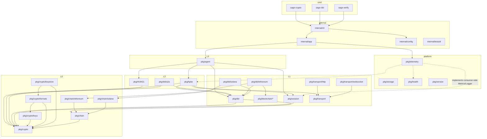
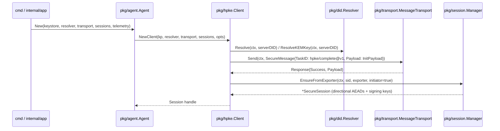

# SAGE Refactoring Design

Status: proposal (2026-09-11). Scope: Go module `github.com/sage-x-project/sage` at v1.5.2 plus the build/CI surface around it. Inputs: the AST/type-resolved code graph in `graph/` (generated by `tools/codegraph`), and the five scope analyses in `analysis/`.

## 요약 (Korean summary)

이 문서는 SAGE Go 코드베이스를 "pkg = 외부 공개 API, internal = 내부 조립/도구" 관점으로 재정렬하고, 모듈별 단일 책임·SSOT·레이어 분리·일관된 호출 규약을 적용하기 위한 설계안이다. 코드 그래프(58 패키지, 1,731 심볼, 1,424 엣지)와 5개 영역 분석 결과, 다음이 확인되었다.

1. 레이어 위반 6건(`pkg -> internal` 5건, `pkg -> deployments/config` 1건)과 import cycle 회피용 `init()`/함수포인터 등록 패턴 4종.
2. 치명 결함 3건: `did.Manager`가 프로덕션 경로에서 체인 클라이언트를 전혀 받지 못해 `sage-did resolve/list/verify/update/deactivate/card/key`가 모두 실패; HPKE 경로로 만든 세션의 `signingKey`가 0으로 남아 `SignCovered/EncryptAndSign`이 무효; `sage-did update/deactivate`가 파일 키 대신 난수 키를 생성.
3. 중복: 전송 wire 코덱, DID 파서 6벌, 리플레이 가드 5벌, 체인 기본값 테이블 10곳 이상, 키 로딩 4벌, 버전 값 9개, AgentMetadata 유사 타입 7개.
4. 사용처 없는 코드: `core/message/validator`, `crypto/vault`, `pkg/storage`(모듈 내 소비자 0), `pkg/version`(주입되지만 읽는 곳 없음), `handshake`(사실상 레거시), mock `ethereum.Resolver`.

설계는 6단계로 나누어 각 단계가 독립적으로 머지 가능하고, 각 단계의 종료 조건을 코드 그래프 지표(레이어 위반 0, 정확 중복 0, 사이클 0)와 빌드/테스트/lint/fmt 통과로 정의한다. 상세는 아래 영문 본문을 따른다.

---

## 1. Method and evidence

The graph was built with `go/packages` + `go/types` over every package in the module (tests excluded from nodes, counted for LOC). Nodes are packages and declared symbols; edges are `import`, `call`, `ref` (function referenced as a value, e.g. cobra `RunE`), `embeds`, and `implements` (computed with `types.Implements`, including pointer receivers). The tool also reports import SCCs, layer-rule violations, exact and structural duplicate bodies, and unexported symbols with zero callers.

| Metric (post-dependency-update tree) | Value |
|---|---|
| Packages | 58 |
| Symbols (funcs, methods, types) | 1,731 |
| Edges | 1,424 |
| Non-test LOC / test LOC | 37,974 / 38,007 |
| Import cycles | 0 |
| Layer violations (pkg -> internal) | 5 |
| Exact duplicate bodies (>= 8 lines) | 6 groups |
| Structural duplicate bodies (non-generated) | 21 groups |

Reproduce with:

```bash
cd tools/codegraph && go run . -dir ../.. -out ../../docs/refactoring/graph
```

Everything cited below with `file:line` was read from source; items marked "not executed" were established by reading only.

---

## 2. Current structure (as-is)

### Package clusters and their real roles

| Cluster | Packages | Declared role | Observed reality |
|---|---|---|---|
| Crypto primitives | `pkg/agent/crypto`, `/keys`, `/formats`, `/storage`, `/vault`, `/rotation`, `/chain`, `/chain/{ethereum,solana}` | key pairs, formats, storage, chain address | Root `crypto` holds a concrete `Manager` that needs its own sub-packages, resolved by a nil-function-pointer table (`wrappers.go:24-48`) filled by `internal/cryptoinit`; `keys/x25519.go` embeds a second HPKE implementation; `chain/ethereum` mixes a stateless address provider with an RPC client wrapper that imports `deployments/config`. |
| Identity | `pkg/agent/did`, `/ethereum`, `/solana`, `pkg/blockchain/.../agentcardregistry`, `deployments/config` | DID registry/resolver | Five overlapping abstractions (`Client`, `Registry`, `RegistryV4`, `Resolver`, `ClientFactory`) plus `Manager`; `Manager.Configure` never installs a client in production (`manager.go:95`, hook has no caller); the working write path (`AgentCardClient`) implements none of the interfaces; A2A card logic, PoP, address derivation, endpoint probing all live in `did` root. |
| Secure channel | `pkg/agent/session`, `/hpke`, `/handshake`, `/transport`, `/transport/{http,websocket}`, `internal/session_creator.go` | session keys, 1-RTT/4-phase handshake, transports | `handshake` (4-phase) has no non-test importer except the adapter in `internal/`; HPKE sessions leave `signingKey` zeroed (`session.go:251-291`); `http` and `websocket` carry byte-identical wire codecs; `session` and `handshake` import Prometheus globals from `internal/metrics`. |
| Verification | `pkg/agent/core`, `/core/rfc9421`, `/core/message{,/nonce,/dedupe,/order,/validator}` | RFC 9421 + facade | `validator` and `order.ResultBuilder` have no consumer; `rfc9421` has two verification paths with different replay semantics (`verifier.go:74-90` vs `verifier_http.go:111-189`); `core` blank-imports `internal/cryptoinit`. |
| Platform | `pkg/storage{,/memory,/postgres}`, `pkg/health`, `pkg/oidc{,/auth0}`, `pkg/version`, `internal/logger`, `internal/metrics` | persistence, health, auth, version, telemetry | `storage` has zero in-module consumers and zero tests; `version` is injected by ldflags but never read; `health.Server` unused and `pkg/health` does not build on Windows; `metrics` contains a second, never-fed collector. |
| Tooling | `cmd/*`, `lib/`, `tests/*`, `tools/*`, `examples/*` | binaries, cgo lib, tests | Business logic in `cmd/sage-did` (key sniffing, card validation copy, defaults tables); `lib/` exports nothing usable; 32 `pkg` unit tests import `tests/helpers`; `cmd/random-test` depends on `tests/random`, a simulation that cannot fail. |

### Layer graph (as-is, condensed)

```mermaid
graph TD
  subgraph cmd
    sagecrypto[cmd/sage-crypto]; sagedid[cmd/sage-did]; sageverify[cmd/sage-verify]; metricsdemo[cmd/metrics-demo]; randomtest[cmd/random-test]
  end
  subgraph pkg
    core[agent/core]; rfc[agent/core/rfc9421]; msg[agent/core/message/*]
    crypto[agent/crypto]; keys[agent/crypto/keys]; formats[agent/crypto/formats]; kstore[agent/crypto/storage]; chain[agent/crypto/chain/*]
    did[agent/did]; dideth[agent/did/ethereum]; didsol[agent/did/solana]; bind[blockchain/.../agentcardregistry]
    session[agent/session]; hpke[agent/hpke]; hs[agent/handshake]; transport[agent/transport/*]
    health[health]; storage[storage/*]
  end
  subgraph internal
    cryptoinit[internal/cryptoinit]; metrics[internal/metrics]; logger[internal/logger]; sessinit[internal (sessioninit)]
  end
  cfg[deployments/config]; testsh[tests/helpers]; testsr[tests/random]

  sagecrypto --> crypto; sagecrypto --> keys; sagecrypto --> formats; sagecrypto --> kstore; sagecrypto --> chain
  sagedid --> did; sagedid --> dideth; sagedid --> crypto; sagedid --> kstore
  sageverify --> health; sageverify --> cfg
  metricsdemo --> metrics; metricsdemo --> session
  randomtest --> testsr
  core --> did; core --> rfc; core --> crypto; core -. "pkg->internal" .-> cryptoinit
  cryptoinit --> keys; cryptoinit --> formats; cryptoinit --> kstore
  keys --> crypto; formats --> crypto; formats --> keys; kstore --> crypto; kstore --> formats
  chain --> crypto; chain --> keys; chain -. "pkg->deployments" .-> cfg
  did --> crypto; did --> chain; dideth --> did; dideth --> bind; didsol --> did; didsol --> chain
  rfc --> crypto; rfc --> msg
  hpke --> session; hpke --> did; hpke --> transport; hpke --> keys
  hs --> session; hs --> did; hs --> transport; hs --> msg; hs -. "pkg->internal" .-> metrics
  session -. "pkg->internal" .-> metrics
  sessinit --> hs; sessinit --> session
  health -. "pkg->internal" .-> logger; health -. "pkg->internal" .-> metrics
```

Dashed edges are the six direction violations. Dotted test-time edges (`pkg/**/_test.go -> tests/helpers`, 32 files) are not drawn.

### Cycle-avoidance mechanisms in use today

| Mechanism | Where | Effect |
|---|---|---|
| Nil function-pointer table filled by `init()` in another package | `pkg/agent/crypto/wrappers.go` + `internal/cryptoinit/init.go` | `crypto.NewEd25519KeyPair()` panics unless something blank-imports `internal/cryptoinit`; 7 examples and 6 tests do so. |
| Global registries mutated in `init()` | `keys/algorithms.go:28` -> `crypto.RegisterAlgorithm`; `chain/ethereum/provider.go:165`, `chain/solana/provider.go:168` -> `chain.globalRegistry`; `did/ethereum/client.go:65`, `did/solana/client.go:60` -> `did` factory; `transport/http/register.go`, `transport/websocket/register.go` -> `transport.DefaultSelector` | Behaviour depends on which packages happen to be linked; `log.Fatalf` at init in `keys/algorithms.go:40-96`. |
| Unused second hook | `did.RegisterEthereumV4ClientCreator` (`manager.go:40`) | Never called; `Manager.Configure` silently leaves the chain unconfigured. |
| Runtime type assertion on `interface{}` | `did.Manager.SetClient(chain, interface{})`, `handshake.Server` `any(s.events).(KeyIDBinder)` | Contracts invisible to the compiler. |

### Defects surfaced by the analysis (must be fixed before or during refactoring)

| # | Severity | Finding | Evidence |
|---|---|---|---|
| D1 | [치명] [High] | `did.Manager` is never wired to a chain client in production; every `sage-did` command that resolves (resolve, list, verify, update, deactivate, card, key), `core.ConfigureDID`, and all examples fail with `no resolver for chain ethereum`. | `pkg/agent/did/manager.go:95` requires `GetEthereumV4ClientCreator() != nil`; `RegisterEthereumV4ClientCreator` has no caller (grep, non-test); `did/ethereum/client.go:65` registers only the legacy factory hook. Confirmed by executing `sage-did resolve` (analysis 02). |
| D2 | [치명] [High] | Sessions created through the HPKE path have a zero `signingKey` and nil `aead`; `SignCovered`, `VerifyCovered`, `EncryptAndSign`, `DecryptAndVerify` are unsafe on them. | `session.go:251-291` fills only `keyMaterial[64:192]`; `NewSecureSessionFromExporterWithRole` (`:120-141`) never sets `aead`; consumers at `:568,:605,:661,:668`. Not executed. |
| D3 | [치명] [High] | `sage-did update` / `deactivate` with `--key-format jwk|pem` generate a fresh random key instead of loading the file. | `cmd/sage-did/helpers.go:78-84`. |
| D4 | [중요] [High] | Legacy `EthereumClient` packs V2 function signatures against the AgentCardRegistry ABI; `Register/Update/Deactivate` cannot succeed. | `did/ethereum/client.go:174-182, 464-471, 494` vs ABI. |
| D5 | [중요] [High] | `rfc9421.HTTPVerifier.VerifyRequest` performs no replay check although it parses `nonce`; `Verifier.VerifySignature` does. | `verifier_http.go:111-189` vs `verifier.go:74-90`. |
| D6 | [중요] [High] | `pkg/health` does not compile on Windows (`syscall.Statfs`), while the Makefile builds `sage-verify` for Windows. | `pkg/health/system.go:56-57`, `Makefile:53`. |
| D7 | [중요] [Mid] | 4-phase handshake never checks nonce/timestamp; replayable within the 15-minute pending TTL. Cleanup goroutine has no stop in non-test code. | `handshake/server.go` (no read of `Nonce`/`Timestamp`), `:136`. |
| D8 | [권장] [High] | `crypto.GetKeyTypeFromPublicKey` maps every `*ecdsa.PublicKey` to secp256k1, so P-256 HTTP signatures are rejected; RSA is advertised as PSS but signs PKCS#1 v1.5; JWK export does not zero-pad secp256k1 coordinates. | `algorithm_registry.go:202-214`, `keys/rs256.go:79`, `formats/jwk.go:96-98`. |

---

## 3. Target architecture (to-be)

### Principles mapped to enforceable rules

| Philosophy | Rule | Enforcement |
|---|---|---|
| a. `internal` vs `pkg` | `pkg/**` is the supported API and may import only `pkg/**` and third-party code. `internal/**` holds composition roots, CLI plumbing, test utilities, and deployment-specific config. `cmd/**` is thin: flag parsing plus one call into `internal/cli` or `pkg`. | `depguard` rules in `.golangci.yml` (Phase 0); codegraph "Layer violations" must be `None`. |
| b. Package = one role | Every package gets a `doc.go` with: purpose in one sentence, the concept it owns (SSOT), allowed dependencies. A package that needs a second sentence is split. | Review checklist + codegraph package table (funcs/types per package). |
| c. No duplication, high cohesion | One owner per concept (table in 3.3). Exact duplicate bodies = 0; structural duplicates outside generated code reviewed and either merged or justified in `doc.go`. | codegraph "Duplicate function bodies" section. |
| d. Packages grouped into clusters | Six clusters (3.1). A cluster's packages may only depend on lower clusters. | depguard, directory layout. |
| e. Layers decoupled through interfaces | Interfaces are declared in the consuming package (or a leaf `contract` package when several consumers share one), kept to the methods actually called, and implemented by lower packages. No package-level mutable registries; wiring happens in the composition root (`internal/app` or `cmd`) by passing values. | `go vet`-style test in `tools/codegraph` that fails on interfaces with zero consumers, and on `init()` functions that write package globals (allowed list: none). |
| f. Uniform call/response | See 3.4. | Lint rules (`revive` context-as-argument, `errorlint`), review checklist. |

### 3.1 Clusters, layers, and allowed dependencies

```
L0  foundation   pkg/crypto/**            key pairs, formats, keystore, algorithm table
                 pkg/chain/**             chain enum, network table, address derivation, chain->key mapping
L1  identity     pkg/did/**               DID grammar, agent metadata, Registry/Resolver contracts, multi-chain dispatch,
                                          per-chain implementations, caching decorator
                 pkg/blockchain/**        RPC client wrappers + generated bindings (used only by pkg/did/<chain>)
L1  channel      pkg/session              AEAD session, manager, single replay guard
                 pkg/transport/**         SecureMessage, wire codec (one copy), MessageTransport, Handler, http/ws adapters
L2  protocol     pkg/hpke                 1-RTT handshake (client/server) on top of session + did + transport
                 pkg/rfc9421              HTTP message signatures with injected ReplayGuard and key resolver
                 pkg/did/a2a              A2A agent card generation/validation/proof (uses did + crypto)
L3  facade       pkg/agent                Agent (formerly core.Core) and VerificationService: composition of L0-L2 for SDK users
X   platform     pkg/telemetry            Metrics/Logger contracts are consumer-side; this package ships the Prometheus adapter
                 pkg/storage/**           optional persistence (kept public, conformance-tested)
                 pkg/health, pkg/oidc/**, pkg/version
--- internal ---------------------------------------------------------------------------------------------------------
                 internal/app             composition root: builds Agent/Manager from config, registers chains explicitly
                 internal/cli             shared cobra helpers: key-file loading, network/contract resolution, output
                 internal/config          deployment config loading (moved from deployments/config)
                 internal/testutil        tests/helpers + tests/testutil merged; blockchain skip logic in one place
--- cmd --------------------------------------------------------------------------------------------------------------
                 cmd/sage-crypto, cmd/sage-did, cmd/sage-verify (absorbs deployment-verify)
```

Allowed import direction: `cmd -> internal -> pkg(L3) -> pkg(L2) -> pkg(L1) -> pkg(L0)`; platform packages are leaves except `pkg/agent`, which may compose them. `examples/` and `tests/` import `pkg` and `internal/testutil` only; nothing imports `examples/`, `tests/`, or `tools/`.

Naming note: the `pkg/agent/` prefix carries no information (everything in the module is "agent"), and `pkg/agent/core/message` vs `pkg/agent/transport` vs `pkg/agent/session` already overlap on "message". The layout above flattens it. Because this changes import paths, it is isolated in Phase 4 and is optional; Phases 0-3 and 5-6 apply unchanged under the current paths.

### Layer graph (to-be)



### 3.2 Module roles (one sentence each) and what moves in/out

| Target package | Role | Moves in | Moves out |
|---|---|---|---|
| `pkg/crypto` | Contracts: `KeyPair`, `KeyType`, `KeyStorage`, `Exporter/Importer`, static algorithm table, sentinel errors, `SignatureVerifier` (from hpke). | `hpke/signature_verifier.go`; static `AlgorithmInfo` table replacing `keys/algorithms.go` `init()`. | `Manager`, `wrappers.go`, `KeyManager`, `Set*Constructors`, `GetKeyTypeFromPublicKey` (fixed and moved to `keys`). |
| `pkg/crypto/keys` | Key pair implementations and generation; one `KeyID(pub)` helper; `Secp256k1Curve()`; `MarshalP256Uncompressed`. | | ECIES + HPKE helpers from `x25519.go` (to `pkg/hpke`); `publicKeyOnly*` dead types. |
| `pkg/crypto/formats` | JWK/PEM import/export and the SAGE key-file envelope (`{private_key, public_key, key_id, key_type}` currently defined only in `cmd/sage-crypto/generate.go`). | key-file envelope codec; JWK/PEM sniffing from `cmd/sage-did/helpers.go:98-316`. | unused `ComputeKeyIDRFC9421`. |
| `pkg/crypto/keystore` | `KeyStorage` backends (file, memory) and rotation. | `crypto/rotation` merged as `keystore.Rotator`. | `crypto/vault` deleted (no consumer, XOR "encryption"). |
| `pkg/chain` | `ChainType`, `Network`, the single chain-to-key-type table, network presets (chain id, default RPC, registry address per network), address derivation contract. | `did.Chain`/`did.Network` (aliases kept during migration); `deployments/config.NetworkPresets` data; `cmd/sage-did` default tables. | `PublicKeyResolver` (dead), `FormatAddress`, second mapping in `utils.go`. |
| `pkg/chain/ethereum`, `pkg/chain/solana` | Stateless address derivation and signature verification per chain, no RPC. | `did/utils.go` Ethereum address derivation. | `EnhancedProvider` (to `pkg/blockchain/ethereum`). |
| `pkg/blockchain/ethereum` | RPC client wrapper: retry with context, gas, receipt wait; generated bindings under `/contracts`. | `chain/ethereum/enhanced_provider.go`. | `deployments/config` import (takes a small `Endpoint` struct instead). |
| `pkg/did` | DID grammar (`Parse`, `Format`, `Validate`, one alias table), `AgentMetadata` (one type; `V4` becomes the type, legacy is a view), `Registry`/`Resolver`/`Lister` contracts, `MultiChain` dispatcher, `CachingResolver`, `MetadataVerifier`. | | A2A (`a2a.go`, `a2a_proof.go`, `key_proof.go` to `pkg/did/a2a`); endpoint probing (`verification.go:243-305` to `pkg/did/a2a` or `pkg/health`); key marshalling helpers (to `crypto/keys`); `Client`, `RegistryV4`, `ClientFactory`, package-level global manager, `EthereumV4ClientCreator`. |
| `pkg/did/ethereum` | `AgentCardClient` as the one Ethereum `Registry`+`Resolver`+`Lister`, commit-reveal helpers. | | `EthereumClient` (broken writes), mock `Resolver`/`DIDCache`/`DIDDocument`/`ParsedDID`, `SageRegistryABI`, `toKeyHashes`, `computeAgentID`. |
| `pkg/did/solana` | Solana `Registry`+`Resolver` (must satisfy the same contracts). | | duplicate `ResolvePublicKey`, `Search` stubs. |
| `pkg/did/a2a` | A2A agent card build/validate/merge, card proof, key proof-of-possession. | from `pkg/did` and `cmd/sage-did/card.go:343-434`. | |
| `pkg/session` | `SecureSession` (directional keys only after Phase 0 fix), `Manager`, `ReplayGuard` (the single nonce cache), `KeyIDBinder`. | `handshake.KeyIDBinder`/`hpke.KeyIDBinder` unified here. | `Metadata`/`GenerateSalt`, pool internals from the exported `Session` interface. |
| `pkg/transport` | `SecureMessage`, `Response`, wire codec (`wire.go`), `Handler` func type, `MessageTransport`, explicit `Selector` (no `init()`), `MockTransport` moved to `internal/testutil` or kept under `transport/transporttest`. | codec from `http` and `websocket`. | `RegisterHTTPFactory` placeholder, `TransportGRPC` constant. |
| `pkg/hpke` | 1-RTT handshake client/server; owns all HPKE helper code. | `keys.HPKE*`, ECIES helpers. | `SignatureVerifier` (to `crypto`), `nonceStore` (uses `session.ReplayGuard`), dead `HPKEBaseInitPayload`, `TrafficKeys`. |
| `pkg/rfc9421` | RFC 9421 sign/verify with injected `ReplayGuard` and `KeyResolver`; one verification path for envelope and HTTP. | | `core/message/nonce` (replaced by `session.ReplayGuard` behind a 1-method interface), `core/message/dedupe`, `/order`, `/validator` (deleted, no consumer). |
| `pkg/agent` | `Agent` (formerly `core.Core`) built from explicit dependencies; `VerificationService`. | `pkg/agent/core`. | `internal/cryptoinit` blank import; `Version` constant. |
| `pkg/telemetry` | Consumer-side interfaces stay in `session`/`hpke`/`health`; this package provides `prometheus.Recorder` implementing them and the `/metrics` handler. | `internal/metrics` (Prometheus part). | `MetricsCollector`, `SageError`, `internal/logger` (replaced by `log/slog`). |
| `internal/app` | Composition root: `New(cfg) (*agent.Agent, error)` that constructs keystore, chain registry, DID clients, session manager, telemetry, and passes them down. | wiring currently spread across `init()`s and `cmd/sage-did`. | |
| `internal/cli` | Shared cobra helpers: key loading (`LoadKeyPair`), network resolution, printing. | `cmd/sage-crypto/{sign,address,verify}.go` loaders, `cmd/sage-did/helpers.go`. | |
| `internal/config` | Deployment config (YAML/env), converters to `chain.Endpoint` and `did.RegistryConfig`. | `deployments/config`. | hard-coded Kaia address (moves to `pkg/chain` presets). |
| `internal/testutil` | Assertions, fixtures, blockchain skip logic (`SAGE_RPC_URL` only). | `tests/helpers`, `tests/testutil`, `tests/integration/test_helper.go`. | |

### 3.3 Single source of truth table

| Concept | Today (locations) | Owner after refactoring |
|---|---|---|
| Chain enum and aliases (`ethereum|eth`, `solana|sol`) | `did.Chain`, `chain.ChainType`, 6 parsers, switch in `did/factory.go` x2 | `pkg/chain.Type` + `chain.Parse` |
| DID grammar `did:sage:<chain>:<id>` | `manager.go:280`, `resolver.go:181`, `registry.go:176`, `did.go:67`, `ethereum/resolver.go:290`, `cmd/helpers.go:44` | `pkg/did.Parse/Format` |
| Key type enum | `crypto.KeyType` (string), `did.KeyType` (uint8), cmd mapping tables | `pkg/crypto.KeyType`; `did` stores the contract's uint8 only at the binding boundary (`did/ethereum`) |
| Algorithm names (RFC 9421 / JWK) | `keys/algorithms.go`, `rfc9421/types.go:85-88`, `formats/jwk.go`, `cmd/sage-crypto/sign.go:234` | `pkg/crypto.Algorithms` static table |
| Key ID derivation | 9 copies in `keys/*.go` | `keys.KeyID` |
| secp256k1 curve for `crypto/ecdsa` | 3 copies (now `keys.Secp256k1Curve`, done in the dependency update) | `keys.Secp256k1Curve` |
| Ethereum address derivation | `chain/ethereum/provider.go:70`, `did/utils.go:236`, `ethcrypto.PubkeyToAddress` in `did/ethereum` | `chain/ethereum.AddressFromPublicKey` |
| Network presets (chain id, RPC, registry address) | `cmd/sage-did/register.go:171-199`, `deployments/config/blockchain.go:43-71,172-185`, `deployment_loader.go:108-135`, examples, `.env*` | `pkg/chain.Presets` (data) + `internal/config` (override by env/YAML) |
| Key-file envelope and loading | `cmd/sage-crypto/{generate,sign,address,verify}.go`, `cmd/sage-did/helpers.go` | `pkg/crypto/formats.KeyFile` + `internal/cli.LoadKeyPair` |
| Agent metadata type | `did.AgentMetadata`, `AgentMetadataV4`, `agentMetadataLocal`, binding struct, `solana.AgentAccount`, `ethereum.DIDDocument`, `config.Agent` | `pkg/did.AgentMetadata` (single struct; binding structs converted at `did/ethereum` boundary) |
| Replay guard | `session.NonceCache`, `hpke.nonceStore`, `message/nonce.Manager`, `message/dedupe.Detector`, `storage.NonceStore` | `session.ReplayGuard` (interface, 1 method) + `session.MemoryReplayGuard`; `storage.NonceStore` adapts to it for persistent deployments |
| Transport wire format | `transport/http/*.go`, `transport/websocket/*.go` | `transport/wire.go` |
| Handler signature | `http.MessageHandler`, `websocket.MessageHandler`, `handshake.Server.HandleMessage`, `hpke.Server.HandleMessage` | `transport.Handler` |
| `KeyIDBinder` | `handshake/types.go:98`, `hpke/types.go:29` | `session.KeyIDBinder` |
| Signature verification (ed25519/secp256k1/p256) | `hpke/signature_verifier.go`, `handshake/server.go:382`, `did/key_proof.go`, `did/a2a_proof.go`, `cmd/sage-crypto/verify.go:255` | `crypto.SignatureVerifier` (+ `KeyPair.Verify`) |
| Version | `VERSION`, `pkg/version`, `core.Version`, `did.Version`, `cmd/sage-verify`, `lib/export.go`, `package.json`, SDK manifests | `VERSION` -> ldflags -> `pkg/version`; every binary exposes `--version`; SDK manifests explicitly independent |
| Logging | `internal/logger`, stdlib `log`, `fmt.Printf` in session/transport | `log/slog` with an injected `*slog.Logger` (nil = discard) |
| Metrics | `internal/metrics` promauto globals + unused collector | consumer-side `Metrics` interface per package, `pkg/telemetry/prometheus` adapter |

### 3.4 Call and response conventions (rule f)

1. Signature shape: `func (x *X) Op(ctx context.Context, in InType) (OutType, error)` for anything that performs I/O, waits, or may be cancelled. Pure computations omit `ctx`. `ctx` is always first; no method both takes a `ctx` and ignores it (today: `did/ethereum/client.go:552` sleeps ignoring `ctx`; `health.CheckBlockchain` creates its own).
2. Results: a call either returns a value or an error, never a value whose `Valid=false` plus `nil` error (today: `rfc9421.VerifyWithMetadata`, `core.VerificationService`, `validator.ValidationResult`). Verification failures are typed errors (`errors.Is(err, rfc9421.ErrSignatureInvalid)`); diagnostic detail travels on the error type, not on a result struct.
3. Errors: each package declares sentinels in `errors.go`; wrap with `%w`; compare with `errors.Is` (today `== pgx.ErrNoRows`, `== ErrX` in `chain/registry.go:103`). Cross-package duplicates (`vault.ErrKeyNotFound`) are removed.
4. Constructors: `New<Type>(deps..., opts ...Option)`; required dependencies are positional, optional behaviour is functional options (`WithLogger`, `WithMetrics`, `WithReplayGuard`, `WithClock`). No setter-style configuration after construction (`Manager.SetStorage`, `KeyRotator.SetRotationConfig`, `Manager.SetDefaultConfig` without lock).
5. Lifecycle: a constructor that starts a goroutine returns a type with `Close() error`; nothing starts goroutines in `init()`; `nonce.Manager`, `dedupe.Detector`, `handshake.Server` cleanup loops are the current offenders.
6. Wiring: no `init()` registration, no mutable package globals. Chain implementations are registered explicitly: `did.NewMultiChain(did.WithChain(chain.Ethereum, ethClient))` in `internal/app`. The compiler, not link order, decides what is available.
7. Messages: one envelope (`transport.SecureMessage`) with typed payload structs and JSON tags defined next to the protocol that owns them (`hpke.InitPayload`, not `map[string]any`).
8. Interfaces: declared by the consumer, sized to the calls made (e.g. `pkg/health` needs `Info/Error` only). Single-implementation interfaces without a test double are removed (`session.Session` 14 methods -> `*SecureSession`, or trimmed to the 6 methods callers use).

### 3.5 Sequence: HPKE session establishment across target layers



---

## 4. Migration plan

Each phase is independently mergeable and ends with the gates in section 5. Order is chosen so that defects are fixed first, layering second, deduplication third, and moves last (moves are cheap once ownership is settled).

### Phase 0. Safety net and defect fixes (1 PR each)

| Step | Change | Files |
|---|---|---|
| 0.1 | Add `depguard` (deny `pkg/** -> internal/**`, `pkg/** -> deployments/**`, `pkg/** -> tests/**`, `cmd/** -> tests/**`) to `.golangci.yml` as warnings; add `make codegraph` and a CI step that fails when `summary.md` "Layer violations" grows. | `.golangci.yml`, `Makefile`, `.github/workflows/test.yml` |
| 0.2 | Fix D1: in `did/ethereum` `init()` register a creator that returns `AgentCardClient` wrapped as `Registry`+`Resolver`; keep the API but make `Configure` fail loudly when no creator exists. Add a test that `NewManager()+Configure(ChainEthereum)` yields a resolver. | `pkg/agent/did/manager.go`, `pkg/agent/did/ethereum/*.go` |
| 0.3 | Fix D2: `NewSecureSessionFromExporterWithRole` derives `encryptKey`/`signingKey` from the same HKDF (info `sage-legacy-keys-v1`) or the legacy methods return `ErrDirectionalOnly`; add a test `FromExporterWithRole` + `SignCovered/EncryptAndSign`. | `pkg/agent/session/session.go`, `session_test.go` |
| 0.4 | Fix D3: `cmd/sage-did/helpers.go loadKeyPair` uses `formats` importers; share the loader with `sage-crypto`. | `cmd/sage-did/helpers.go`, `cmd/sage-crypto/{sign,address,verify}.go` |
| 0.5 | Fix D5/D6/D8 (replay check on HTTP path, `//go:build !windows` stub, P-256 detection, JWK padding). | `pkg/agent/core/rfc9421/verifier_http.go`, `pkg/health/system*.go`, `pkg/agent/crypto/algorithm_registry.go`, `formats/jwk.go` |
| 0.6 | Add storage conformance test run against memory and postgres (postgres skipped without DSN). | `pkg/storage/storagetest/` |

### Phase 1. Restore layer direction (no path renames)

| Step | Change |
|---|---|
| 1.1 | Delete `crypto.Manager`, `wrappers.go`, `internal/cryptoinit`; `core.Core` takes `KeyStorage` and a `KeyGenerator` func; examples switch to `keys.Generate*`. Removes 5 blank imports and the panic trap. |
| 1.2 | Metrics: define `type Metrics interface { ... }` in `session` and `handshake`/`hpke` with a `NopMetrics`; move Prometheus vectors to `pkg/telemetry/prometheus` implementing them; `cmd/metrics-demo` and `pkg/health` use the adapter. `internal/metrics` deleted. |
| 1.3 | `pkg/health`: local 2-method logger interface, `http.Handler` for metrics, `slog` default. `internal/logger` deleted after `SageError` is dropped (no consumer). |
| 1.4 | `chain/ethereum/enhanced_provider.go` -> `pkg/blockchain/ethereum`; takes `Endpoint{RPCURL, ChainID, Timeouts}` instead of `deployments/config`. |
| 1.5 | Replace all `init()` registrations (algorithms, chain providers, DID creators, transport selector) with explicit registration from `internal/app` (new) and from `cmd` mains; keep thin `Register*` funcs but no automatic calls. Gate: `grep -rn "^func init()" pkg/` returns only the generated bindings. |

### Phase 2. Single source of truth

| Step | Change |
|---|---|
| 2.1 | `pkg/chain`: `Type`, `Parse`, `Network`, `Presets` (chain id, RPC, registry address for local/sepolia/mainnet/kairos/cypress/devnet); delete the four default tables and both `0x4Ba6…` fallbacks; `internal/config` overlays env/YAML on presets. |
| 2.2 | `did.Parse/Format/Validate`: one implementation; remove the other five; `cmd parseChain` calls it. |
| 2.3 | `keys.KeyID`, `keys.MarshalP256Uncompressed`, `chain/ethereum.AddressFromPublicKey`; delete copies. |
| 2.4 | `crypto.Algorithms` static table; `rfc9421` and `formats` read names from it; delete `keys/algorithms.go` `init()`. |
| 2.5 | `transport/wire.go` + `transport.Handler`; http/ws call it. |
| 2.6 | `session.ReplayGuard` interface + `MemoryReplayGuard`; `rfc9421.Verifier` and `hpke.Server` take it via option; delete `message/nonce`, `dedupe`, `order`, `validator`, `hpke.nonceStore`. |
| 2.7 | One `did.AgentMetadata`; `AgentMetadataV4` becomes it, legacy fields retained as methods; binding structs converted only in `did/ethereum`. |
| 2.8 | `pkg/version` read by every binary (`--version`), `core.Version`/`did.Version`/`lib` literal/`sage-verify` const removed; `update-version.sh` extended or SDK manifests documented as independent. |
| 2.9 | Key-file envelope moved to `formats.KeyFile`; `internal/cli.LoadKeyPair` used by both CLIs; `cmd/sage-did` card validation calls `did.ValidateA2ACardWithDID`. |

### Phase 3. Interface minimisation

| Step | Change |
|---|---|
| 3.1 | `did`: keep `Registry`, `Resolver`, `Lister` (section 3.2); delete `Client`, `RegistryV4`, `ClientFactory`, `EthereumV4ClientCreator`, package-level global manager; `Manager` implements `Resolver` so it can be passed to `hpke`. `AgentCardClient` implements `Registry`+`Resolver`+`Lister`; `EthereumClient` and mock `Resolver` deleted; `SolanaClient` brought to the same contracts. |
| 3.2 | `session`: `KeyIDBinder` single definition; exported `Session` interface trimmed to the methods called outside the package (or removed in favour of `*SecureSession`); `SetDefaultConfig` locked. |
| 3.3 | `crypto.SignatureVerifier` (ed25519, secp256k1, p256, composite) from `hpke`; `handshake` (if kept), `did/a2a`, `cmd/sage-crypto verify` use it. |
| 3.4 | `chain.Registry` interface removed (single impl, only globals); `ChainKeyTypeMapper` becomes a function on the static table. |
| 3.5 | `storage`: unexport per-store types, add sentinels, `errors.Is`. `oidc/auth0`: exported `Verifier`, sentinels reused, test helper moved to `_test.go`. |

### Phase 4. Package moves (optional flatten)

| Step | Change |
|---|---|
| 4.1 | `did/a2a` (A2A card, proof, PoP), `did/ethereum` gets Ethereum-only helpers; `internal/session_creator.go` -> `pkg/handshake/sessionadapter.go` (or deleted with handshake in Phase 5). |
| 4.2 | `tests/helpers` + `tests/testutil` -> `internal/testutil`; `deployments/config` -> `internal/config`; `cmd/deployment-verify` folded into `sage-verify`; `cmd/metrics-demo` -> `examples/`. |
| 4.3 | Optional flatten: `pkg/agent/crypto -> pkg/crypto`, `pkg/agent/did -> pkg/did`, `pkg/agent/session -> pkg/session`, `pkg/agent/hpke -> pkg/hpke`, `pkg/agent/transport -> pkg/transport`, `pkg/agent/core/rfc9421 -> pkg/rfc9421`, `pkg/agent/core -> pkg/agent`. Old paths remain for one minor release as alias packages (`type X = new.X`, `var NewX = new.NewX`) marked `Deprecated`. |

### Phase 5. Deletions

`pkg/agent/handshake` (after a deprecation release; D7 makes keeping it without hardening unsafe), `crypto/vault`, `core/message/*` (after 2.6), `lib/` unless a real C API is specified, `tests/random` + `cmd/random-test` (simulation only), `tools/analyze` if `run-benchmarks.sh` is retired, dead exports listed in the analyses.

### Phase 6. Documentation and CI

`docs/ARCHITECTURE.md` rewritten from section 3 (with cmd/, internal/, lib/, sdk/ sections); `docs/INDEX.md` corrected (`deployment-verify` description); CI dead paths (`./test/e2e/...`, `tests/handshake/server/main.go`, `loadtest/**`) fixed; `make bindings` (abigen) with drift check; `//go:build integration` applied consistently; Dockerfile Go version tied to `go.mod`.

---

## 5. Gates per phase

| Gate | Command / metric | Target |
|---|---|---|
| Build, vet, format | `go build ./... && go vet ./... && gofmt -l .` | clean |
| Lint | `golangci-lint run` (+ `depguard` from Phase 0, error level from Phase 1) | 0 issues |
| Tests | `go test -race ./...`; contracts `npm test` | green; new tests from Phase 0 present |
| Graph: layer violations | `docs/refactoring/graph/summary.md` "Layer violations" | Phase 1: `None` |
| Graph: cycles | "Import cycles" | `None` (already) |
| Graph: exact duplicates | "Exact duplicates" | Phase 2: `None` |
| Graph: dead code | "Dead-code candidates" | Phase 5: only generated/cgo entries |
| Graph: interfaces | every interface in the table has >= 1 implementer and >= 1 consumer | Phase 3 |
| `init()` in `pkg/` | `grep -rn "^func init()" pkg/ --include=*.go` | Phase 1: only `pkg/blockchain/**` bindings |

---

## 6. Alternatives considered

| Option | Description | Trade-off |
|---|---|---|
| A. In-place (recommended if external Go importers exist) | Phases 0-3, 5, 6 only; keep `pkg/agent/**` paths. | Lowest churn, no import-path break; leaves the `agent/core/message` vs `transport` naming overlap and a deeper tree than the roles justify. |
| B. Flatten (recommended if the only consumers are this repo, the examples, and the HTTP-based SDKs) | Phases 0-6 including 4.3 with one release of alias packages. | Cleanest layout matching section 3.1; breaks import paths for any unknown downstream Go module; alias packages add ~30 small files for one release. |

Not recommended: a rewrite of `did` around a new abstraction. The interfaces in 3.2 already exist (`Registry`, `Resolver`); the work is deletion and wiring, not design.

---

## 7. Open decisions for the maintainers

1. Is the 4-phase `handshake` protocol still required by any deployment? If not, Phase 5 removes it (and `internal/session_creator.go`) instead of hardening it (D7).
2. Are there Go importers outside this repository? Determines Option A vs B.
3. Should `lib/` (cgo) expose a real API (sign, verify, resolve) or be removed? Today it exports only a version string.
4. SDK scope: Python/Rust/Java target `/debug/*` and `/v1/a2a:sendMessage` routes that no Go server here serves, and none implements RFC 9421; TypeScript ships placeholder zero keys at v1.0.0. Either implement the server routes and RFC 9421 signing in the SDKs or mark them experimental and remove the claims.
5. Is a live V2 `SageRegistry` (Kaia `0x4Ba6…`) still supported? If yes, `EthereumClient` must be bound to `SageRegistryABI`; if no, it is deleted in Phase 3.

## Facts vs. opinions

**Fact**
- The counts in section 1 come from `tools/codegraph` run on the post-dependency-update tree; the summary and JSON are in `graph/`.
- D1 was reproduced by executing `sage-did resolve` (analysis 02); D2-D8 were established by reading the cited lines.
- No Go file outside `internal/cryptoinit` assigns the `crypto.*Generators/*Constructors` tables; no non-test file calls `did.RegisterEthereumV4ClientCreator` or `Manager.SetClient`.
- `pkg/storage`, `pkg/version`, `core/message/validator`, `crypto/vault`, `health.Server` have zero non-test importers in the module.

**Opinion**
- [High] Phases 0-2 remove every layer violation and exact duplicate without changing any import path; they are the highest value per line changed.
- [High] `handshake` can be deleted with no functional loss inside this repository; only external deployments could depend on it.
- [Mid] Option B is the better end state; whether it is worth the path break depends on unknown downstream Go importers.
- [Mid] The SDKs are the largest source of unverifiable claims in the repository; scoping them down is cheaper than implementing interop, but that is a product decision.
