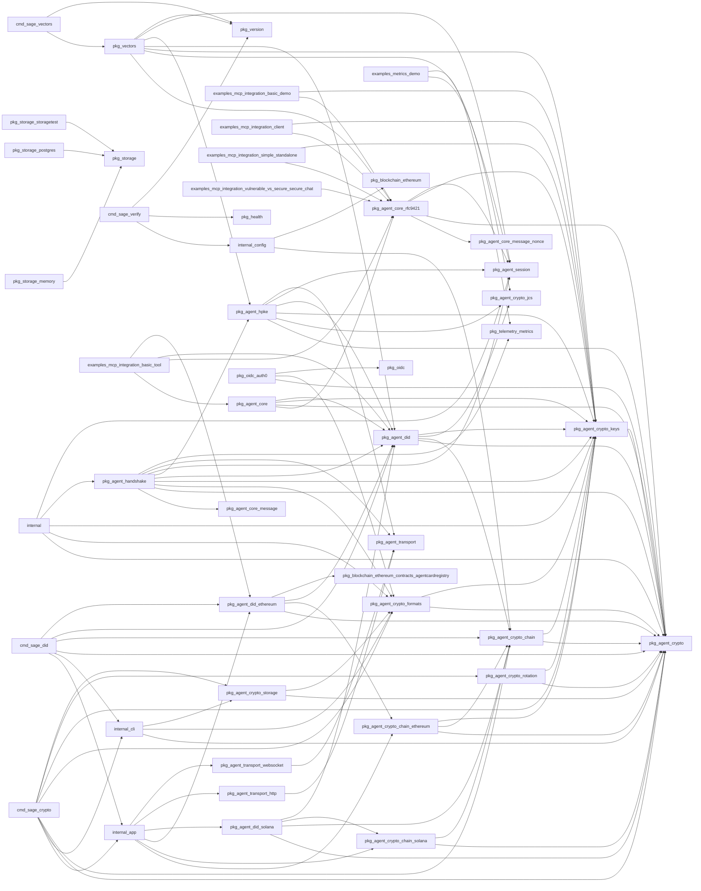

# Code Graph Summary

Module: `github.com/sage-x-project/sage`

| Metric | Value |
|---|---|
| Packages | 60 |
| Symbols | 2188 |
| Edges | 1845 |
| Non-test LOC | 44200 |
| Test LOC | 35844 |
| Funcs+methods | 1781 |
| Types | 407 |

## Packages

| Package | Kind | Files | LOC | Test LOC | Funcs | Types | Ifaces | Fan-in | Fan-out | Ext deps |
|---|---|---|---|---|---|---|---|---|---|---|
| cmd/sage-crypto | cmd | 7 | 1182 | 0 | 28 | 0 | 0 | 0 | 8 | 13 |
| cmd/sage-did | cmd | 13 | 2962 | 256 | 53 | 0 | 0 | 0 | 6 | 16 |
| cmd/sage-vectors | cmd | 1 | 64 | 0 | 2 | 0 | 0 | 0 | 2 | 3 |
| cmd/sage-verify | cmd | 1 | 410 | 0 | 10 | 0 | 0 | 0 | 3 | 6 |
| examples/mcp-integration/basic-demo | examples | 1 | 376 | 0 | 9 | 4 | 0 | 0 | 2 | 10 |
| examples/mcp-integration/basic-tool | examples | 2 | 298 | 0 | 6 | 3 | 0 | 0 | 4 | 5 |
| examples/mcp-integration/client | examples | 2 | 281 | 0 | 5 | 1 | 0 | 0 | 2 | 11 |
| examples/mcp-integration/simple-standalone | examples | 1 | 294 | 0 | 7 | 2 | 0 | 0 | 2 | 10 |
| examples/mcp-integration/vulnerable-vs-secure/attacker | examples | 1 | 156 | 0 | 4 | 1 | 0 | 0 | 0 | 7 |
| examples/mcp-integration/vulnerable-vs-secure/secure-chat | examples | 1 | 170 | 0 | 5 | 2 | 0 | 0 | 1 | 9 |
| examples/mcp-integration/vulnerable-vs-secure/vulnerable-chat | examples | 1 | 103 | 0 | 3 | 2 | 0 | 0 | 0 | 5 |
| examples/metrics-demo | examples | 1 | 161 | 0 | 2 | 0 | 0 | 0 | 2 | 8 |
| internal | other | 1 | 154 | 0 | 8 | 1 | 0 | 0 | 5 | 7 |
| internal/app | internal | 1 | 43 | 0 | 1 | 0 | 0 | 2 | 6 | 0 |
| internal/cli | internal | 1 | 71 | 70 | 1 | 1 | 0 | 2 | 3 | 3 |
| internal/config | internal | 6 | 1242 | 800 | 33 | 15 | 0 | 1 | 2 | 13 |
| internal/testutil | internal | 2 | 477 | 0 | 25 | 2 | 0 | 0 | 0 | 10 |
| pkg/agent/core | pkg | 2 | 317 | 748 | 17 | 4 | 1 | 1 | 4 | 3 |
| pkg/agent/core/message | pkg | 1 | 42 | 0 | 0 | 3 | 1 | 1 | 0 | 1 |
| pkg/agent/core/message/nonce | pkg | 1 | 147 | 362 | 9 | 1 | 0 | 1 | 0 | 5 |
| pkg/agent/core/rfc9421 | pkg | 8 | 2224 | 4257 | 91 | 17 | 0 | 7 | 4 | 18 |
| pkg/agent/crypto | pkg | 4 | 671 | 1684 | 28 | 11 | 6 | 19 | 0 | 9 |
| pkg/agent/crypto/chain | pkg | 5 | 645 | 628 | 23 | 6 | 1 | 7 | 2 | 10 |
| pkg/agent/crypto/chain/ethereum | pkg | 1 | 164 | 149 | 10 | 1 | 0 | 2 | 3 | 7 |
| pkg/agent/crypto/chain/solana | pkg | 1 | 174 | 170 | 12 | 1 | 0 | 2 | 2 | 5 |
| pkg/agent/crypto/formats | pkg | 2 | 891 | 786 | 19 | 5 | 0 | 6 | 2 | 16 |
| pkg/agent/crypto/jcs | pkg | 1 | 225 | 62 | 6 | 0 | 0 | 3 | 0 | 10 |
| pkg/agent/crypto/keys | pkg | 10 | 1496 | 2750 | 85 | 7 | 0 | 15 | 1 | 24 |
| pkg/agent/crypto/rotation | pkg | 1 | 145 | 198 | 4 | 1 | 0 | 1 | 2 | 3 |
| pkg/agent/crypto/storage | pkg | 2 | 312 | 824 | 13 | 3 | 0 | 2 | 2 | 7 |
| pkg/agent/crypto/vault | pkg | 1 | 407 | 324 | 15 | 4 | 1 | 0 | 0 | 14 |
| pkg/agent/did | pkg | 12 | 2865 | 5236 | 105 | 35 | 6 | 8 | 4 | 20 |
| pkg/agent/did/ethereum | pkg | 5 | 1064 | 1174 | 37 | 3 | 0 | 3 | 4 | 17 |
| pkg/agent/did/solana | pkg | 2 | 817 | 393 | 17 | 2 | 0 | 1 | 4 | 8 |
| pkg/agent/handshake | pkg | 5 | 976 | 825 | 36 | 13 | 1 | 1 | 9 | 11 |
| pkg/agent/hpke | pkg | 5 | 1509 | 2994 | 48 | 17 | 5 | 2 | 6 | 20 |
| pkg/agent/session | pkg | 6 | 1724 | 2519 | 84 | 13 | 3 | 6 | 0 | 14 |
| pkg/agent/transport | pkg | 4 | 469 | 363 | 16 | 9 | 1 | 4 | 0 | 5 |
| pkg/agent/transport/http | pkg | 3 | 427 | 324 | 12 | 3 | 0 | 1 | 1 | 8 |
| pkg/agent/transport/websocket | pkg | 3 | 673 | 496 | 29 | 3 | 0 | 1 | 1 | 8 |
| pkg/blockchain/ethereum | pkg | 1 | 355 | 592 | 13 | 3 | 1 | 1 | 0 | 9 |
| pkg/blockchain/ethereum/contracts/agentcardregistry | pkg | 3 | 5554 | 0 | 321 | 82 | 0 | 1 | 0 | 11 |
| pkg/health | pkg | 6 | 513 | 153 | 14 | 7 | 1 | 1 | 0 | 9 |
| pkg/oidc | pkg | 1 | 42 | 0 | 0 | 0 | 0 | 1 | 0 | 1 |
| pkg/oidc/auth0 | pkg | 1 | 405 | 699 | 12 | 4 | 0 | 0 | 3 | 12 |
| pkg/storage | pkg | 2 | 165 | 0 | 0 | 7 | 4 | 3 | 0 | 3 |
| pkg/storage/memory | pkg | 3 | 477 | 12 | 26 | 4 | 0 | 0 | 1 | 4 |
| pkg/storage/postgres | pkg | 4 | 688 | 42 | 26 | 5 | 0 | 0 | 1 | 6 |
| pkg/storage/storagetest | pkg | 1 | 202 | 0 | 6 | 0 | 0 | 0 | 1 | 5 |
| pkg/telemetry | pkg | 1 | 23 | 0 | 0 | 0 | 0 | 0 | 0 | 0 |
| pkg/telemetry/logger | pkg | 1 | 361 | 263 | 30 | 5 | 1 | 0 | 0 | 9 |
| pkg/telemetry/metrics | pkg | 9 | 786 | 111 | 23 | 3 | 0 | 2 | 0 | 8 |
| pkg/vectors | pkg | 7 | 1503 | 117 | 48 | 5 | 0 | 1 | 7 | 23 |
| pkg/version | pkg | 1 | 143 | 215 | 7 | 1 | 0 | 3 | 0 | 3 |
| reports/bindings | other | 3 | 5554 | 0 | 321 | 82 | 0 | 0 | 0 | 11 |
| sdk/typescript/node_modules/flatted/golang/pkg/flatted | other | 1 | 279 | 0 | 7 | 1 | 0 | 0 | 0 | 5 |
| tests | root | 0 | 0 | 0 | 0 | 0 | 0 | 0 | 0 | 0 |
| tests/integration | tests | 1 | 79 | 5248 | 4 | 0 | 0 | 0 | 0 | 4 |
| tools/analyze | tools | 1 | 243 | 0 | 5 | 2 | 0 | 0 | 0 | 6 |
| tools/benchmark | root | 0 | 0 | 0 | 0 | 0 | 0 | 0 | 0 | 0 |

## Package import graph (module-internal)

## Import cycles (SCC size > 1)

None.

## Layer violations

Rule: pkg must not import cmd/internal; internal must not import cmd; examples/tests/tools must not be imported by pkg/internal/cmd.

None.

## Interfaces and implementers

| Interface | Methods | Implementers (module-internal) |
|---|---|---|
| pkg/agent/core.DIDResolver | 2 | pkg/agent/did.Manager |
| pkg/agent/core/message.ControlHeader | 3 | pkg/agent/handshake.CompleteMessage, pkg/agent/handshake.InvitationMessage, pkg/agent/handshake.RequestMessage, pkg/agent/handshake.ResponseMessage |
| pkg/agent/crypto.KeyExporter | 2 | pkg/agent/crypto/formats.jwkExporter, pkg/agent/crypto/formats.pemExporter |
| pkg/agent/crypto.KeyImporter | 2 | pkg/agent/crypto/formats.jwkImporter, pkg/agent/crypto/formats.pemImporter |
| pkg/agent/crypto.KeyManager | 5 |  |
| pkg/agent/crypto.KeyPair | 6 | pkg/agent/crypto/keys.X25519KeyPair, pkg/agent/crypto/keys.ed25519KeyPair, pkg/agent/crypto/keys.p256KeyPair, pkg/agent/crypto/keys.publicKeyOnlyEd25519, pkg/agent/crypto/keys.publicKeyOnlyRSA, pkg/agent/crypto/keys.rsaKeyPair, pkg/agent/crypto/keys.secp256k1KeyPair |
| pkg/agent/crypto.KeyRotator | 3 | pkg/agent/crypto/rotation.keyRotator |
| pkg/agent/crypto.KeyStorage | 5 | pkg/agent/crypto/storage.fileKeyStorage, pkg/agent/crypto/storage.memoryKeyStorage |
| pkg/agent/crypto/chain.ChainProvider | 7 | pkg/agent/crypto/chain/ethereum.Provider, pkg/agent/crypto/chain/solana.Provider |
| pkg/agent/crypto/vault.SecureVault | 6 | pkg/agent/crypto/vault.FileVault, pkg/agent/crypto/vault.MemoryVault |
| pkg/agent/did.ChainClient | 2 | pkg/agent/did/ethereum.AgentCardClient, pkg/agent/did/ethereum.EthereumClient, pkg/agent/did/solana.SolanaClient |
| pkg/agent/did.KeyRegistry | 3 |  |
| pkg/agent/did.Lister | 2 | pkg/agent/did.Manager, pkg/agent/did.MultiChainResolver, pkg/agent/did/ethereum.AgentCardClient, pkg/agent/did/ethereum.EthereumClient, pkg/agent/did/solana.SolanaClient |
| pkg/agent/did.Registry | 4 | pkg/agent/did/ethereum.AgentCardClient, pkg/agent/did/ethereum.EthereumClient, pkg/agent/did/solana.SolanaClient |
| pkg/agent/did.RegistryV4 | 2 |  |
| pkg/agent/did.Resolver | 5 | pkg/agent/did.Manager, pkg/agent/did.MultiChainResolver, pkg/agent/did/ethereum.AgentCardClient, pkg/agent/did/ethereum.EthereumClient, pkg/agent/did/solana.SolanaClient |
| pkg/agent/handshake.Events | 5 | internal.Creator, pkg/agent/handshake.NoopEvents |
| pkg/agent/hpke.CookieSource | 1 |  |
| pkg/agent/hpke.CookieVerifier | 1 |  |
| pkg/agent/hpke.InfoBuilder | 2 | pkg/agent/hpke.DefaultInfoBuilder |
| pkg/agent/hpke.KeyIDBinder | 1 | internal.Creator |
| pkg/agent/hpke.SignatureVerifier | 2 | pkg/agent/hpke.CompositeVerifier, pkg/agent/hpke.ECDSAVerifier, pkg/agent/hpke.Ed25519Verifier |
| pkg/agent/session.Metrics | 5 | pkg/agent/session.NopMetrics, pkg/telemetry/metrics.PrometheusSessionMetrics |
| pkg/agent/session.ReplayGuard | 1 | pkg/agent/core/rfc9421.nonceManagerGuard, pkg/agent/session.MemoryReplayGuard |
| pkg/agent/session.Session | 5 | pkg/agent/session.SecureSession |
| pkg/agent/transport.MessageTransport | 1 | pkg/agent/transport.MockTransport, pkg/agent/transport/http.HTTPTransport, pkg/agent/transport/websocket.WSTransport |
| pkg/blockchain/ethereum.EthClient | 8 |  |
| pkg/health.Logger | 2 |  |
| pkg/storage.DIDStore | 7 | pkg/storage/memory.dIDStore, pkg/storage/postgres.dIDStore |
| pkg/storage.NonceStore | 4 | pkg/storage/memory.nonceStore, pkg/storage/postgres.nonceStore |
| pkg/storage.SessionStore | 8 | pkg/storage/memory.sessionStore, pkg/storage/postgres.sessionStore |
| pkg/storage.Store | 5 | pkg/storage/memory.Store, pkg/storage/postgres.Store |
| pkg/telemetry/logger.Logger | 9 | pkg/telemetry/logger.StructuredLogger |

## Most-called functions (top 25 by internal call fan-in)

| Function | Callers |
|---|---|
| pkg/agent/crypto.KeyPair.Type | 19 |
| pkg/agent/did.Manager.Configure | 16 |
| pkg/agent/did.NewManager | 16 |
| pkg/agent/did.ParseDID | 15 |
| cmd/sage-did.getDefaultContractAddress | 14 |
| pkg/agent/crypto.KeyPair.PublicKey | 14 |
| cmd/sage-did.getDefaultRPCEndpoint | 13 |
| pkg/agent/core/rfc9421.NewHTTPVerifier | 12 |
| pkg/agent/crypto.KeyPair.ID | 12 |
| pkg/agent/crypto.KeyPair.Sign | 12 |
| pkg/agent/crypto/keys.IsSecp256k1Curve | 12 |
| pkg/agent/did.Manager.ResolveAgent | 10 |
| pkg/agent/crypto.KeyPair.PrivateKey | 9 |
| pkg/agent/core/rfc9421.ComputeContentDigest | 8 |
| pkg/agent/did.AgentMetadata.Normalized | 8 |
| pkg/agent/did/ethereum.AgentCardClient.getTransactor | 8 |
| pkg/agent/session.SecureSession.UpdateLastUsed | 8 |
| pkg/agent/crypto/chain.GetProvider | 7 |
| pkg/agent/session.SecureSession.IsExpired | 7 |
| pkg/vectors.seed32 | 7 |
| pkg/agent/core/rfc9421.HTTPVerifier.SignRequest | 6 |
| pkg/agent/core/rfc9421.HTTPVerifier.VerifyRequest | 6 |
| pkg/agent/crypto/formats.NewJWKImporter | 6 |
| pkg/agent/crypto/keys.GenerateEd25519KeyPair | 6 |
| pkg/agent/crypto/keys.KeyID | 6 |

## Largest functions (top 25 by lines)

| Function | Lines | File |
|---|---|---|
| pkg/agent/handshake.Server.HandleMessage | 197 | pkg/agent/handshake/server.go:142 |
| pkg/vectors.cryptoSuite | 175 | pkg/vectors/crypto.go:17 |
| pkg/vectors.didSuite | 174 | pkg/vectors/did.go:13 |
| pkg/vectors.hpkeSuite | 164 | pkg/vectors/hpke.go:25 |
| pkg/vectors.sessionSuite | 153 | pkg/vectors/session.go:28 |
| pkg/agent/did/solana.SolanaClient.Register | 131 | pkg/agent/did/solana/client.go:106 |
| sdk/typescript/node_modules/flatted/golang/pkg/flatted.Stringify | 128 | sdk/typescript/node_modules/flatted/golang/pkg/flatted/flatted.go:16 |
| cmd/sage-did.runCardValidate | 125 | cmd/sage-did/card.go:230 |
| pkg/agent/did/solana.SolanaClient.Update | 125 | pkg/agent/did/solana/client.go:288 |
| cmd/sage-did.runKeyVerifyPop | 120 | cmd/sage-did/key.go:536 |
| pkg/agent/hpke.Client.Initialize | 114 | pkg/agent/hpke/client.go:80 |
| pkg/vectors.rfc9421Suite | 107 | pkg/vectors/rfc9421.go:165 |
| pkg/agent/did/solana.SolanaClient.Deactivate | 102 | pkg/agent/did/solana/client.go:415 |
| examples/mcp-integration/basic-demo.main | 101 | examples/mcp-integration/basic-demo/main.go:267 |
| pkg/agent/crypto/formats.jwkExporter.Export | 100 | pkg/agent/crypto/formats/jwk.go:64 |
| cmd/sage-did.runVerify | 98 | cmd/sage-did/verify.go:64 |
| cmd/sage-verify.runDeploymentCheck | 95 | cmd/sage-verify/main.go:316 |
| pkg/agent/hpke.parseServerSignedResponse | 93 | pkg/agent/hpke/client.go:341 |
| pkg/agent/crypto/formats.pemExporter.ExportPublic | 93 | pkg/agent/crypto/formats/pem.go:139 |
| pkg/agent/crypto/formats.pemExporter.Export | 92 | pkg/agent/crypto/formats/pem.go:45 |
| pkg/agent/transport/http.HTTPTransport.Send | 91 | pkg/agent/transport/http/client.go:79 |
| cmd/sage-did.runKeyAdd | 91 | cmd/sage-did/key.go:239 |
| internal/config.validateBlockchainConfig | 88 | internal/config/validator.go:61 |
| pkg/agent/crypto/formats.jwkExporter.ExportPublic | 84 | pkg/agent/crypto/formats/jwk.go:166 |
| pkg/agent/hpke.Server.HandleMessage | 83 | pkg/agent/hpke/server.go:137 |

## Duplicate function bodies

### Exact duplicates (identical body text, >= 8 lines)

- pkg/blockchain/ethereum/contracts/agentcardregistry.AgentCardRegistryAgentActivatedIterator.Next, reports/bindings.AgentCardRegistryAgentActivatedIterator.Next
- pkg/blockchain/ethereum/contracts/agentcardregistry.AgentCardRegistryAgentDeactivatedByHashIterator.Next, reports/bindings.AgentCardRegistryAgentDeactivatedByHashIterator.Next
- pkg/blockchain/ethereum/contracts/agentcardregistry.AgentCardRegistryAgentDeactivatedIterator.Next, reports/bindings.AgentCardRegistryAgentDeactivatedIterator.Next
- pkg/blockchain/ethereum/contracts/agentcardregistry.AgentCardRegistryAgentEndpointUpdatedIterator.Next, reports/bindings.AgentCardRegistryAgentEndpointUpdatedIterator.Next
- pkg/blockchain/ethereum/contracts/agentcardregistry.AgentCardRegistryAgentRegistered0Iterator.Next, reports/bindings.AgentCardRegistryAgentRegistered0Iterator.Next
- pkg/blockchain/ethereum/contracts/agentcardregistry.AgentCardRegistryAgentRegisteredIterator.Next, reports/bindings.AgentCardRegistryAgentRegisteredIterator.Next
- pkg/blockchain/ethereum/contracts/agentcardregistry.AgentCardRegistryAgentUpdatedIterator.Next, reports/bindings.AgentCardRegistryAgentUpdatedIterator.Next
- pkg/blockchain/ethereum/contracts/agentcardregistry.AgentCardRegistryApprovalForAgentIterator.Next, reports/bindings.AgentCardRegistryApprovalForAgentIterator.Next
- pkg/blockchain/ethereum/contracts/agentcardregistry.AgentCardRegistryCaller.ActivationDelay, reports/bindings.AgentCardRegistryCaller.ActivationDelay
- pkg/blockchain/ethereum/contracts/agentcardregistry.AgentCardRegistryCaller.AgentActivationTime, reports/bindings.AgentCardRegistryCaller.AgentActivationTime
- pkg/blockchain/ethereum/contracts/agentcardregistry.AgentCardRegistryCaller.AgentNonce, reports/bindings.AgentCardRegistryCaller.AgentNonce
- pkg/blockchain/ethereum/contracts/agentcardregistry.AgentCardRegistryCaller.AgentOperators, reports/bindings.AgentCardRegistryCaller.AgentOperators
- pkg/blockchain/ethereum/contracts/agentcardregistry.AgentCardRegistryCaller.AgentReputations, reports/bindings.AgentCardRegistryCaller.AgentReputations
- pkg/blockchain/ethereum/contracts/agentcardregistry.AgentCardRegistryCaller.AgentStakes, reports/bindings.AgentCardRegistryCaller.AgentStakes
- pkg/blockchain/ethereum/contracts/agentcardregistry.AgentCardRegistryCaller.DidToAgentId, reports/bindings.AgentCardRegistryCaller.DidToAgentId
- pkg/blockchain/ethereum/contracts/agentcardregistry.AgentCardRegistryCaller.GetAgent, reports/bindings.AgentCardRegistryCaller.GetAgent
- pkg/blockchain/ethereum/contracts/agentcardregistry.AgentCardRegistryCaller.GetAgentByDID, reports/bindings.AgentCardRegistryCaller.GetAgentByDID
- pkg/blockchain/ethereum/contracts/agentcardregistry.AgentCardRegistryCaller.GetAgentsByOwner, reports/bindings.AgentCardRegistryCaller.GetAgentsByOwner
- pkg/blockchain/ethereum/contracts/agentcardregistry.AgentCardRegistryCaller.GetKEMKey, reports/bindings.AgentCardRegistryCaller.GetKEMKey
- pkg/blockchain/ethereum/contracts/agentcardregistry.AgentCardRegistryCaller.GetKey, reports/bindings.AgentCardRegistryCaller.GetKey
- pkg/blockchain/ethereum/contracts/agentcardregistry.AgentCardRegistryCaller.IsAgentActive, reports/bindings.AgentCardRegistryCaller.IsAgentActive
- pkg/blockchain/ethereum/contracts/agentcardregistry.AgentCardRegistryCaller.IsApprovedOperator, reports/bindings.AgentCardRegistryCaller.IsApprovedOperator
- pkg/blockchain/ethereum/contracts/agentcardregistry.AgentCardRegistryCaller.Owner, reports/bindings.AgentCardRegistryCaller.Owner
- pkg/blockchain/ethereum/contracts/agentcardregistry.AgentCardRegistryCaller.Paused, reports/bindings.AgentCardRegistryCaller.Paused
- pkg/blockchain/ethereum/contracts/agentcardregistry.AgentCardRegistryCaller.PendingOwner, reports/bindings.AgentCardRegistryCaller.PendingOwner
- pkg/blockchain/ethereum/contracts/agentcardregistry.AgentCardRegistryCaller.RegistrationCommitments, reports/bindings.AgentCardRegistryCaller.RegistrationCommitments
- pkg/blockchain/ethereum/contracts/agentcardregistry.AgentCardRegistryCaller.RegistrationStake, reports/bindings.AgentCardRegistryCaller.RegistrationStake
- pkg/blockchain/ethereum/contracts/agentcardregistry.AgentCardRegistryCaller.ResolveAgent, reports/bindings.AgentCardRegistryCaller.ResolveAgent
- pkg/blockchain/ethereum/contracts/agentcardregistry.AgentCardRegistryCaller.ResolveAgentByAddress, reports/bindings.AgentCardRegistryCaller.ResolveAgentByAddress
- pkg/blockchain/ethereum/contracts/agentcardregistry.AgentCardRegistryCaller.VerifyHook, reports/bindings.AgentCardRegistryCaller.VerifyHook
- pkg/blockchain/ethereum/contracts/agentcardregistry.AgentCardRegistryCommitmentRecordedIterator.Next, reports/bindings.AgentCardRegistryCommitmentRecordedIterator.Next
- pkg/blockchain/ethereum/contracts/agentcardregistry.AgentCardRegistryFilterer.FilterAgentActivated, reports/bindings.AgentCardRegistryFilterer.FilterAgentActivated
- pkg/blockchain/ethereum/contracts/agentcardregistry.AgentCardRegistryFilterer.FilterAgentDeactivated, reports/bindings.AgentCardRegistryFilterer.FilterAgentDeactivated
- pkg/blockchain/ethereum/contracts/agentcardregistry.AgentCardRegistryFilterer.FilterAgentDeactivatedByHash, reports/bindings.AgentCardRegistryFilterer.FilterAgentDeactivatedByHash
- pkg/blockchain/ethereum/contracts/agentcardregistry.AgentCardRegistryFilterer.FilterAgentEndpointUpdated, reports/bindings.AgentCardRegistryFilterer.FilterAgentEndpointUpdated
- pkg/blockchain/ethereum/contracts/agentcardregistry.AgentCardRegistryFilterer.FilterAgentRegistered, reports/bindings.AgentCardRegistryFilterer.FilterAgentRegistered
- pkg/blockchain/ethereum/contracts/agentcardregistry.AgentCardRegistryFilterer.FilterAgentRegistered0, reports/bindings.AgentCardRegistryFilterer.FilterAgentRegistered0
- pkg/blockchain/ethereum/contracts/agentcardregistry.AgentCardRegistryFilterer.FilterAgentUpdated, reports/bindings.AgentCardRegistryFilterer.FilterAgentUpdated
- pkg/blockchain/ethereum/contracts/agentcardregistry.AgentCardRegistryFilterer.FilterApprovalForAgent, reports/bindings.AgentCardRegistryFilterer.FilterApprovalForAgent
- pkg/blockchain/ethereum/contracts/agentcardregistry.AgentCardRegistryFilterer.FilterCommitmentRecorded, reports/bindings.AgentCardRegistryFilterer.FilterCommitmentRecorded
- pkg/blockchain/ethereum/contracts/agentcardregistry.AgentCardRegistryFilterer.FilterKEMKeyUpdated, reports/bindings.AgentCardRegistryFilterer.FilterKEMKeyUpdated
- pkg/blockchain/ethereum/contracts/agentcardregistry.AgentCardRegistryFilterer.FilterKeyAdded, reports/bindings.AgentCardRegistryFilterer.FilterKeyAdded
- pkg/blockchain/ethereum/contracts/agentcardregistry.AgentCardRegistryFilterer.FilterKeyRevoked, reports/bindings.AgentCardRegistryFilterer.FilterKeyRevoked
- pkg/blockchain/ethereum/contracts/agentcardregistry.AgentCardRegistryFilterer.FilterOwnershipTransferStarted, reports/bindings.AgentCardRegistryFilterer.FilterOwnershipTransferStarted
- pkg/blockchain/ethereum/contracts/agentcardregistry.AgentCardRegistryFilterer.FilterOwnershipTransferred, reports/bindings.AgentCardRegistryFilterer.FilterOwnershipTransferred
- pkg/blockchain/ethereum/contracts/agentcardregistry.AgentCardRegistryFilterer.WatchAgentActivated, reports/bindings.AgentCardRegistryFilterer.WatchAgentActivated
- pkg/blockchain/ethereum/contracts/agentcardregistry.AgentCardRegistryFilterer.WatchAgentDeactivated, reports/bindings.AgentCardRegistryFilterer.WatchAgentDeactivated
- pkg/blockchain/ethereum/contracts/agentcardregistry.AgentCardRegistryFilterer.WatchAgentDeactivatedByHash, reports/bindings.AgentCardRegistryFilterer.WatchAgentDeactivatedByHash
- pkg/blockchain/ethereum/contracts/agentcardregistry.AgentCardRegistryFilterer.WatchAgentEndpointUpdated, reports/bindings.AgentCardRegistryFilterer.WatchAgentEndpointUpdated
- pkg/blockchain/ethereum/contracts/agentcardregistry.AgentCardRegistryFilterer.WatchAgentRegistered, reports/bindings.AgentCardRegistryFilterer.WatchAgentRegistered
- pkg/blockchain/ethereum/contracts/agentcardregistry.AgentCardRegistryFilterer.WatchAgentRegistered0, reports/bindings.AgentCardRegistryFilterer.WatchAgentRegistered0
- pkg/blockchain/ethereum/contracts/agentcardregistry.AgentCardRegistryFilterer.WatchAgentUpdated, reports/bindings.AgentCardRegistryFilterer.WatchAgentUpdated
- pkg/blockchain/ethereum/contracts/agentcardregistry.AgentCardRegistryFilterer.WatchApprovalForAgent, reports/bindings.AgentCardRegistryFilterer.WatchApprovalForAgent
- pkg/blockchain/ethereum/contracts/agentcardregistry.AgentCardRegistryFilterer.WatchCommitmentRecorded, reports/bindings.AgentCardRegistryFilterer.WatchCommitmentRecorded
- pkg/blockchain/ethereum/contracts/agentcardregistry.AgentCardRegistryFilterer.WatchKEMKeyUpdated, reports/bindings.AgentCardRegistryFilterer.WatchKEMKeyUpdated
- pkg/blockchain/ethereum/contracts/agentcardregistry.AgentCardRegistryFilterer.WatchKeyAdded, reports/bindings.AgentCardRegistryFilterer.WatchKeyAdded
- pkg/blockchain/ethereum/contracts/agentcardregistry.AgentCardRegistryFilterer.WatchKeyRevoked, reports/bindings.AgentCardRegistryFilterer.WatchKeyRevoked
- pkg/blockchain/ethereum/contracts/agentcardregistry.AgentCardRegistryFilterer.WatchOwnershipTransferStarted, reports/bindings.AgentCardRegistryFilterer.WatchOwnershipTransferStarted
- pkg/blockchain/ethereum/contracts/agentcardregistry.AgentCardRegistryFilterer.WatchOwnershipTransferred, reports/bindings.AgentCardRegistryFilterer.WatchOwnershipTransferred
- pkg/blockchain/ethereum/contracts/agentcardregistry.AgentCardRegistryFilterer.WatchPaused, reports/bindings.AgentCardRegistryFilterer.WatchPaused
- pkg/blockchain/ethereum/contracts/agentcardregistry.AgentCardRegistryFilterer.WatchUnpaused, reports/bindings.AgentCardRegistryFilterer.WatchUnpaused
- pkg/blockchain/ethereum/contracts/agentcardregistry.AgentCardRegistryKEMKeyUpdatedIterator.Next, reports/bindings.AgentCardRegistryKEMKeyUpdatedIterator.Next
- pkg/blockchain/ethereum/contracts/agentcardregistry.AgentCardRegistryKeyAddedIterator.Next, reports/bindings.AgentCardRegistryKeyAddedIterator.Next
- pkg/blockchain/ethereum/contracts/agentcardregistry.AgentCardRegistryKeyRevokedIterator.Next, reports/bindings.AgentCardRegistryKeyRevokedIterator.Next
- pkg/blockchain/ethereum/contracts/agentcardregistry.AgentCardRegistryOwnershipTransferStartedIterator.Next, reports/bindings.AgentCardRegistryOwnershipTransferStartedIterator.Next
- pkg/blockchain/ethereum/contracts/agentcardregistry.AgentCardRegistryOwnershipTransferredIterator.Next, reports/bindings.AgentCardRegistryOwnershipTransferredIterator.Next
- pkg/blockchain/ethereum/contracts/agentcardregistry.AgentCardRegistryPausedIterator.Next, reports/bindings.AgentCardRegistryPausedIterator.Next
- pkg/blockchain/ethereum/contracts/agentcardregistry.AgentCardRegistryUnpausedIterator.Next, reports/bindings.AgentCardRegistryUnpausedIterator.Next
- pkg/blockchain/ethereum/contracts/agentcardregistry.AgentCardStorageAgentDeactivatedByHashIterator.Next, reports/bindings.AgentCardStorageAgentDeactivatedByHashIterator.Next
- pkg/blockchain/ethereum/contracts/agentcardregistry.AgentCardStorageAgentRegisteredIterator.Next, reports/bindings.AgentCardStorageAgentRegisteredIterator.Next
- pkg/blockchain/ethereum/contracts/agentcardregistry.AgentCardStorageAgentUpdatedIterator.Next, reports/bindings.AgentCardStorageAgentUpdatedIterator.Next
- pkg/blockchain/ethereum/contracts/agentcardregistry.AgentCardStorageApprovalForAgentIterator.Next, reports/bindings.AgentCardStorageApprovalForAgentIterator.Next
- pkg/blockchain/ethereum/contracts/agentcardregistry.AgentCardStorageCaller.AgentNonce, reports/bindings.AgentCardStorageCaller.AgentNonce
- pkg/blockchain/ethereum/contracts/agentcardregistry.AgentCardStorageCaller.AgentOperators, reports/bindings.AgentCardStorageCaller.AgentOperators
- pkg/blockchain/ethereum/contracts/agentcardregistry.AgentCardStorageCaller.DidToAgentId, reports/bindings.AgentCardStorageCaller.DidToAgentId
- pkg/blockchain/ethereum/contracts/agentcardregistry.AgentCardStorageCaller.RegistrationCommitments, reports/bindings.AgentCardStorageCaller.RegistrationCommitments
- pkg/blockchain/ethereum/contracts/agentcardregistry.AgentCardStorageCommitmentRecordedIterator.Next, reports/bindings.AgentCardStorageCommitmentRecordedIterator.Next
- pkg/blockchain/ethereum/contracts/agentcardregistry.AgentCardStorageFilterer.FilterAgentDeactivatedByHash, reports/bindings.AgentCardStorageFilterer.FilterAgentDeactivatedByHash
- pkg/blockchain/ethereum/contracts/agentcardregistry.AgentCardStorageFilterer.FilterAgentRegistered, reports/bindings.AgentCardStorageFilterer.FilterAgentRegistered
- pkg/blockchain/ethereum/contracts/agentcardregistry.AgentCardStorageFilterer.FilterAgentUpdated, reports/bindings.AgentCardStorageFilterer.FilterAgentUpdated
- pkg/blockchain/ethereum/contracts/agentcardregistry.AgentCardStorageFilterer.FilterApprovalForAgent, reports/bindings.AgentCardStorageFilterer.FilterApprovalForAgent
- pkg/blockchain/ethereum/contracts/agentcardregistry.AgentCardStorageFilterer.FilterCommitmentRecorded, reports/bindings.AgentCardStorageFilterer.FilterCommitmentRecorded
- pkg/blockchain/ethereum/contracts/agentcardregistry.AgentCardStorageFilterer.FilterKEMKeyUpdated, reports/bindings.AgentCardStorageFilterer.FilterKEMKeyUpdated
- pkg/blockchain/ethereum/contracts/agentcardregistry.AgentCardStorageFilterer.FilterKeyAdded, reports/bindings.AgentCardStorageFilterer.FilterKeyAdded
- pkg/blockchain/ethereum/contracts/agentcardregistry.AgentCardStorageFilterer.FilterKeyRevoked, reports/bindings.AgentCardStorageFilterer.FilterKeyRevoked
- pkg/blockchain/ethereum/contracts/agentcardregistry.AgentCardStorageFilterer.WatchAgentDeactivatedByHash, reports/bindings.AgentCardStorageFilterer.WatchAgentDeactivatedByHash
- pkg/blockchain/ethereum/contracts/agentcardregistry.AgentCardStorageFilterer.WatchAgentRegistered, reports/bindings.AgentCardStorageFilterer.WatchAgentRegistered
- pkg/blockchain/ethereum/contracts/agentcardregistry.AgentCardStorageFilterer.WatchAgentUpdated, reports/bindings.AgentCardStorageFilterer.WatchAgentUpdated
- pkg/blockchain/ethereum/contracts/agentcardregistry.AgentCardStorageFilterer.WatchApprovalForAgent, reports/bindings.AgentCardStorageFilterer.WatchApprovalForAgent
- pkg/blockchain/ethereum/contracts/agentcardregistry.AgentCardStorageFilterer.WatchCommitmentRecorded, reports/bindings.AgentCardStorageFilterer.WatchCommitmentRecorded
- pkg/blockchain/ethereum/contracts/agentcardregistry.AgentCardStorageFilterer.WatchKEMKeyUpdated, reports/bindings.AgentCardStorageFilterer.WatchKEMKeyUpdated
- pkg/blockchain/ethereum/contracts/agentcardregistry.AgentCardStorageFilterer.WatchKeyAdded, reports/bindings.AgentCardStorageFilterer.WatchKeyAdded
- pkg/blockchain/ethereum/contracts/agentcardregistry.AgentCardStorageFilterer.WatchKeyRevoked, reports/bindings.AgentCardStorageFilterer.WatchKeyRevoked
- pkg/blockchain/ethereum/contracts/agentcardregistry.AgentCardStorageKEMKeyUpdatedIterator.Next, reports/bindings.AgentCardStorageKEMKeyUpdatedIterator.Next
- pkg/blockchain/ethereum/contracts/agentcardregistry.AgentCardStorageKeyAddedIterator.Next, reports/bindings.AgentCardStorageKeyAddedIterator.Next
- pkg/blockchain/ethereum/contracts/agentcardregistry.AgentCardStorageKeyRevokedIterator.Next, reports/bindings.AgentCardStorageKeyRevokedIterator.Next

### Structural duplicates (identical AST shape ignoring identifiers/literals, >= 8 lines)

- internal/config.BlockchainConfig.Validate, pkg/blockchain/ethereum.Endpoint.Validate
- pkg/agent/crypto/chain/ethereum.Provider.SignTransaction, pkg/agent/crypto/chain/solana.Provider.SignTransaction
- pkg/agent/crypto/formats.jwkImporter.importEd25519, pkg/agent/crypto/formats.jwkImporter.importSecp256k1
- pkg/agent/crypto/keys.ECDSAPrivateScalar, pkg/agent/crypto/keys.ECDSAPublicUncompressed
- pkg/agent/crypto/keys.NewSecp256k1KeyPair, pkg/agent/crypto/keys.NewX25519KeyPair
- pkg/agent/crypto/vault.MemoryVault.ListKeys, pkg/agent/did.Manager.GetSupportedChains
- pkg/agent/did.KeyType.String, pkg/agent/did.mapKeyTypeToA2A
- pkg/agent/did/ethereum.AgentCardClient.ResolveKEMKey, pkg/agent/did/solana.SolanaClient.ResolvePublicKey
- pkg/agent/did/ethereum.AgentCardClient.SetApprovalForAgent, pkg/agent/did/ethereum.AgentCardClient.UpdateAgent
- pkg/agent/handshake.Client.Complete, pkg/agent/handshake.Client.Invitation
- pkg/agent/handshake.Client.Request, pkg/agent/handshake.Client.Response
- pkg/agent/session.SecureSession.Decrypt, pkg/agent/session.SecureSession.Encrypt
- pkg/agent/session.SecureSession.DecryptWithAAD, pkg/agent/session.SecureSession.EncryptWithAAD
- pkg/agent/session.SecureSession.DecryptWithAADInbound, pkg/agent/session.SecureSession.EncryptWithAADOutbound
- pkg/blockchain/ethereum/contracts/agentcardregistry.AgentCardRegistryAgentActivatedIterator.Next, pkg/blockchain/ethereum/contracts/agentcardregistry.AgentCardRegistryAgentDeactivatedByHashIterator.Next, pkg/blockchain/ethereum/contracts/agentcardregistry.AgentCardRegistryAgentDeactivatedIterator.Next, pkg/blockchain/ethereum/contracts/agentcardregistry.AgentCardRegistryAgentEndpointUpdatedIterator.Next, pkg/blockchain/ethereum/contracts/agentcardregistry.AgentCardRegistryAgentRegistered0Iterator.Next, pkg/blockchain/ethereum/contracts/agentcardregistry.AgentCardRegistryAgentRegisteredIterator.Next, pkg/blockchain/ethereum/contracts/agentcardregistry.AgentCardRegistryAgentUpdatedIterator.Next, pkg/blockchain/ethereum/contracts/agentcardregistry.AgentCardRegistryApprovalForAgentIterator.Next, pkg/blockchain/ethereum/contracts/agentcardregistry.AgentCardRegistryCommitmentRecordedIterator.Next, pkg/blockchain/ethereum/contracts/agentcardregistry.AgentCardRegistryKEMKeyUpdatedIterator.Next, pkg/blockchain/ethereum/contracts/agentcardregistry.AgentCardRegistryKeyAddedIterator.Next, pkg/blockchain/ethereum/contracts/agentcardregistry.AgentCardRegistryKeyRevokedIterator.Next, pkg/blockchain/ethereum/contracts/agentcardregistry.AgentCardRegistryOwnershipTransferStartedIterator.Next, pkg/blockchain/ethereum/contracts/agentcardregistry.AgentCardRegistryOwnershipTransferredIterator.Next, pkg/blockchain/ethereum/contracts/agentcardregistry.AgentCardRegistryPausedIterator.Next, pkg/blockchain/ethereum/contracts/agentcardregistry.AgentCardRegistryUnpausedIterator.Next, pkg/blockchain/ethereum/contracts/agentcardregistry.AgentCardStorageAgentDeactivatedByHashIterator.Next, pkg/blockchain/ethereum/contracts/agentcardregistry.AgentCardStorageAgentRegisteredIterator.Next, pkg/blockchain/ethereum/contracts/agentcardregistry.AgentCardStorageAgentUpdatedIterator.Next, pkg/blockchain/ethereum/contracts/agentcardregistry.AgentCardStorageApprovalForAgentIterator.Next, pkg/blockchain/ethereum/contracts/agentcardregistry.AgentCardStorageCommitmentRecordedIterator.Next, pkg/blockchain/ethereum/contracts/agentcardregistry.AgentCardStorageKEMKeyUpdatedIterator.Next, pkg/blockchain/ethereum/contracts/agentcardregistry.AgentCardStorageKeyAddedIterator.Next, pkg/blockchain/ethereum/contracts/agentcardregistry.AgentCardStorageKeyRevokedIterator.Next, reports/bindings.AgentCardRegistryAgentActivatedIterator.Next, reports/bindings.AgentCardRegistryAgentDeactivatedByHashIterator.Next, reports/bindings.AgentCardRegistryAgentDeactivatedIterator.Next, reports/bindings.AgentCardRegistryAgentEndpointUpdatedIterator.Next, reports/bindings.AgentCardRegistryAgentRegistered0Iterator.Next, reports/bindings.AgentCardRegistryAgentRegisteredIterator.Next, reports/bindings.AgentCardRegistryAgentUpdatedIterator.Next, reports/bindings.AgentCardRegistryApprovalForAgentIterator.Next, reports/bindings.AgentCardRegistryCommitmentRecordedIterator.Next, reports/bindings.AgentCardRegistryKEMKeyUpdatedIterator.Next, reports/bindings.AgentCardRegistryKeyAddedIterator.Next, reports/bindings.AgentCardRegistryKeyRevokedIterator.Next, reports/bindings.AgentCardRegistryOwnershipTransferStartedIterator.Next, reports/bindings.AgentCardRegistryOwnershipTransferredIterator.Next, reports/bindings.AgentCardRegistryPausedIterator.Next, reports/bindings.AgentCardRegistryUnpausedIterator.Next, reports/bindings.AgentCardStorageAgentDeactivatedByHashIterator.Next, reports/bindings.AgentCardStorageAgentRegisteredIterator.Next, reports/bindings.AgentCardStorageAgentUpdatedIterator.Next, reports/bindings.AgentCardStorageApprovalForAgentIterator.Next, reports/bindings.AgentCardStorageCommitmentRecordedIterator.Next, reports/bindings.AgentCardStorageKEMKeyUpdatedIterator.Next, reports/bindings.AgentCardStorageKeyAddedIterator.Next, reports/bindings.AgentCardStorageKeyRevokedIterator.Next
- pkg/blockchain/ethereum/contracts/agentcardregistry.AgentCardRegistryCaller.ActivationDelay, pkg/blockchain/ethereum/contracts/agentcardregistry.AgentCardRegistryCaller.RegistrationStake, reports/bindings.AgentCardRegistryCaller.ActivationDelay, reports/bindings.AgentCardRegistryCaller.RegistrationStake
- pkg/blockchain/ethereum/contracts/agentcardregistry.AgentCardRegistryCaller.AgentActivationTime, pkg/blockchain/ethereum/contracts/agentcardregistry.AgentCardRegistryCaller.AgentNonce, pkg/blockchain/ethereum/contracts/agentcardregistry.AgentCardRegistryCaller.AgentStakes, pkg/blockchain/ethereum/contracts/agentcardregistry.AgentCardStorageCaller.AgentNonce, reports/bindings.AgentCardRegistryCaller.AgentActivationTime, reports/bindings.AgentCardRegistryCaller.AgentNonce, reports/bindings.AgentCardRegistryCaller.AgentStakes, reports/bindings.AgentCardStorageCaller.AgentNonce
- pkg/blockchain/ethereum/contracts/agentcardregistry.AgentCardRegistryCaller.AgentOperators, pkg/blockchain/ethereum/contracts/agentcardregistry.AgentCardRegistryCaller.IsApprovedOperator, pkg/blockchain/ethereum/contracts/agentcardregistry.AgentCardStorageCaller.AgentOperators, reports/bindings.AgentCardRegistryCaller.AgentOperators, reports/bindings.AgentCardRegistryCaller.IsApprovedOperator, reports/bindings.AgentCardStorageCaller.AgentOperators
- pkg/blockchain/ethereum/contracts/agentcardregistry.AgentCardRegistryCaller.AgentReputations, reports/bindings.AgentCardRegistryCaller.AgentReputations
- pkg/blockchain/ethereum/contracts/agentcardregistry.AgentCardRegistryCaller.DidToAgentId, pkg/blockchain/ethereum/contracts/agentcardregistry.AgentCardStorageCaller.DidToAgentId, reports/bindings.AgentCardRegistryCaller.DidToAgentId, reports/bindings.AgentCardStorageCaller.DidToAgentId
- pkg/blockchain/ethereum/contracts/agentcardregistry.AgentCardRegistryCaller.GetAgent, pkg/blockchain/ethereum/contracts/agentcardregistry.AgentCardRegistryCaller.GetAgentByDID, pkg/blockchain/ethereum/contracts/agentcardregistry.AgentCardRegistryCaller.GetKey, pkg/blockchain/ethereum/contracts/agentcardregistry.AgentCardRegistryCaller.IsAgentActive, pkg/blockchain/ethereum/contracts/agentcardregistry.AgentCardRegistryCaller.ResolveAgent, pkg/blockchain/ethereum/contracts/agentcardregistry.AgentCardRegistryCaller.ResolveAgentByAddress, reports/bindings.AgentCardRegistryCaller.GetAgent, reports/bindings.AgentCardRegistryCaller.GetAgentByDID, reports/bindings.AgentCardRegistryCaller.GetKey, reports/bindings.AgentCardRegistryCaller.IsAgentActive, reports/bindings.AgentCardRegistryCaller.ResolveAgent, reports/bindings.AgentCardRegistryCaller.ResolveAgentByAddress
- pkg/blockchain/ethereum/contracts/agentcardregistry.AgentCardRegistryCaller.GetAgentsByOwner, reports/bindings.AgentCardRegistryCaller.GetAgentsByOwner
- pkg/blockchain/ethereum/contracts/agentcardregistry.AgentCardRegistryCaller.GetKEMKey, reports/bindings.AgentCardRegistryCaller.GetKEMKey
- pkg/blockchain/ethereum/contracts/agentcardregistry.AgentCardRegistryCaller.Owner, pkg/blockchain/ethereum/contracts/agentcardregistry.AgentCardRegistryCaller.PendingOwner, pkg/blockchain/ethereum/contracts/agentcardregistry.AgentCardRegistryCaller.VerifyHook, reports/bindings.AgentCardRegistryCaller.Owner, reports/bindings.AgentCardRegistryCaller.PendingOwner, reports/bindings.AgentCardRegistryCaller.VerifyHook
- pkg/blockchain/ethereum/contracts/agentcardregistry.AgentCardRegistryCaller.Paused, reports/bindings.AgentCardRegistryCaller.Paused
- pkg/blockchain/ethereum/contracts/agentcardregistry.AgentCardRegistryCaller.RegistrationCommitments, pkg/blockchain/ethereum/contracts/agentcardregistry.AgentCardStorageCaller.RegistrationCommitments, reports/bindings.AgentCardRegistryCaller.RegistrationCommitments, reports/bindings.AgentCardStorageCaller.RegistrationCommitments
- pkg/blockchain/ethereum/contracts/agentcardregistry.AgentCardRegistryFilterer.FilterAgentActivated, pkg/blockchain/ethereum/contracts/agentcardregistry.AgentCardRegistryFilterer.FilterAgentDeactivatedByHash, pkg/blockchain/ethereum/contracts/agentcardregistry.AgentCardRegistryFilterer.FilterAgentEndpointUpdated, pkg/blockchain/ethereum/contracts/agentcardregistry.AgentCardRegistryFilterer.FilterAgentUpdated, pkg/blockchain/ethereum/contracts/agentcardregistry.AgentCardRegistryFilterer.FilterCommitmentRecorded, pkg/blockchain/ethereum/contracts/agentcardregistry.AgentCardStorageFilterer.FilterAgentDeactivatedByHash, pkg/blockchain/ethereum/contracts/agentcardregistry.AgentCardStorageFilterer.FilterAgentUpdated, pkg/blockchain/ethereum/contracts/agentcardregistry.AgentCardStorageFilterer.FilterCommitmentRecorded, reports/bindings.AgentCardRegistryFilterer.FilterAgentActivated, reports/bindings.AgentCardRegistryFilterer.FilterAgentDeactivatedByHash, reports/bindings.AgentCardRegistryFilterer.FilterAgentEndpointUpdated, reports/bindings.AgentCardRegistryFilterer.FilterAgentUpdated, reports/bindings.AgentCardRegistryFilterer.FilterCommitmentRecorded, reports/bindings.AgentCardStorageFilterer.FilterAgentDeactivatedByHash, reports/bindings.AgentCardStorageFilterer.FilterAgentUpdated, reports/bindings.AgentCardStorageFilterer.FilterCommitmentRecorded
- pkg/blockchain/ethereum/contracts/agentcardregistry.AgentCardRegistryFilterer.FilterAgentDeactivated, pkg/blockchain/ethereum/contracts/agentcardregistry.AgentCardRegistryFilterer.FilterAgentRegistered0, pkg/blockchain/ethereum/contracts/agentcardregistry.AgentCardRegistryFilterer.FilterKEMKeyUpdated, pkg/blockchain/ethereum/contracts/agentcardregistry.AgentCardRegistryFilterer.FilterKeyAdded, pkg/blockchain/ethereum/contracts/agentcardregistry.AgentCardRegistryFilterer.FilterKeyRevoked, pkg/blockchain/ethereum/contracts/agentcardregistry.AgentCardRegistryFilterer.FilterOwnershipTransferStarted, pkg/blockchain/ethereum/contracts/agentcardregistry.AgentCardRegistryFilterer.FilterOwnershipTransferred, pkg/blockchain/ethereum/contracts/agentcardregistry.AgentCardStorageFilterer.FilterKEMKeyUpdated, pkg/blockchain/ethereum/contracts/agentcardregistry.AgentCardStorageFilterer.FilterKeyAdded, pkg/blockchain/ethereum/contracts/agentcardregistry.AgentCardStorageFilterer.FilterKeyRevoked, reports/bindings.AgentCardRegistryFilterer.FilterAgentDeactivated, reports/bindings.AgentCardRegistryFilterer.FilterAgentRegistered0, reports/bindings.AgentCardRegistryFilterer.FilterKEMKeyUpdated, reports/bindings.AgentCardRegistryFilterer.FilterKeyAdded, reports/bindings.AgentCardRegistryFilterer.FilterKeyRevoked, reports/bindings.AgentCardRegistryFilterer.FilterOwnershipTransferStarted, reports/bindings.AgentCardRegistryFilterer.FilterOwnershipTransferred, reports/bindings.AgentCardStorageFilterer.FilterKEMKeyUpdated, reports/bindings.AgentCardStorageFilterer.FilterKeyAdded, reports/bindings.AgentCardStorageFilterer.FilterKeyRevoked
- pkg/blockchain/ethereum/contracts/agentcardregistry.AgentCardRegistryFilterer.FilterAgentRegistered, pkg/blockchain/ethereum/contracts/agentcardregistry.AgentCardRegistryFilterer.FilterApprovalForAgent, pkg/blockchain/ethereum/contracts/agentcardregistry.AgentCardStorageFilterer.FilterAgentRegistered, pkg/blockchain/ethereum/contracts/agentcardregistry.AgentCardStorageFilterer.FilterApprovalForAgent, reports/bindings.AgentCardRegistryFilterer.FilterAgentRegistered, reports/bindings.AgentCardRegistryFilterer.FilterApprovalForAgent, reports/bindings.AgentCardStorageFilterer.FilterAgentRegistered, reports/bindings.AgentCardStorageFilterer.FilterApprovalForAgent
- pkg/blockchain/ethereum/contracts/agentcardregistry.AgentCardRegistryFilterer.WatchAgentActivated, pkg/blockchain/ethereum/contracts/agentcardregistry.AgentCardRegistryFilterer.WatchAgentDeactivatedByHash, pkg/blockchain/ethereum/contracts/agentcardregistry.AgentCardRegistryFilterer.WatchAgentEndpointUpdated, pkg/blockchain/ethereum/contracts/agentcardregistry.AgentCardRegistryFilterer.WatchAgentUpdated, pkg/blockchain/ethereum/contracts/agentcardregistry.AgentCardRegistryFilterer.WatchCommitmentRecorded, pkg/blockchain/ethereum/contracts/agentcardregistry.AgentCardStorageFilterer.WatchAgentDeactivatedByHash, pkg/blockchain/ethereum/contracts/agentcardregistry.AgentCardStorageFilterer.WatchAgentUpdated, pkg/blockchain/ethereum/contracts/agentcardregistry.AgentCardStorageFilterer.WatchCommitmentRecorded, reports/bindings.AgentCardRegistryFilterer.WatchAgentActivated, reports/bindings.AgentCardRegistryFilterer.WatchAgentDeactivatedByHash, reports/bindings.AgentCardRegistryFilterer.WatchAgentEndpointUpdated, reports/bindings.AgentCardRegistryFilterer.WatchAgentUpdated, reports/bindings.AgentCardRegistryFilterer.WatchCommitmentRecorded, reports/bindings.AgentCardStorageFilterer.WatchAgentDeactivatedByHash, reports/bindings.AgentCardStorageFilterer.WatchAgentUpdated, reports/bindings.AgentCardStorageFilterer.WatchCommitmentRecorded
- pkg/blockchain/ethereum/contracts/agentcardregistry.AgentCardRegistryFilterer.WatchAgentDeactivated, pkg/blockchain/ethereum/contracts/agentcardregistry.AgentCardRegistryFilterer.WatchAgentRegistered0, pkg/blockchain/ethereum/contracts/agentcardregistry.AgentCardRegistryFilterer.WatchKEMKeyUpdated, pkg/blockchain/ethereum/contracts/agentcardregistry.AgentCardRegistryFilterer.WatchKeyAdded, pkg/blockchain/ethereum/contracts/agentcardregistry.AgentCardRegistryFilterer.WatchKeyRevoked, pkg/blockchain/ethereum/contracts/agentcardregistry.AgentCardRegistryFilterer.WatchOwnershipTransferStarted, pkg/blockchain/ethereum/contracts/agentcardregistry.AgentCardRegistryFilterer.WatchOwnershipTransferred, pkg/blockchain/ethereum/contracts/agentcardregistry.AgentCardStorageFilterer.WatchKEMKeyUpdated, pkg/blockchain/ethereum/contracts/agentcardregistry.AgentCardStorageFilterer.WatchKeyAdded, pkg/blockchain/ethereum/contracts/agentcardregistry.AgentCardStorageFilterer.WatchKeyRevoked, reports/bindings.AgentCardRegistryFilterer.WatchAgentDeactivated, reports/bindings.AgentCardRegistryFilterer.WatchAgentRegistered0, reports/bindings.AgentCardRegistryFilterer.WatchKEMKeyUpdated, reports/bindings.AgentCardRegistryFilterer.WatchKeyAdded, reports/bindings.AgentCardRegistryFilterer.WatchKeyRevoked, reports/bindings.AgentCardRegistryFilterer.WatchOwnershipTransferStarted, reports/bindings.AgentCardRegistryFilterer.WatchOwnershipTransferred, reports/bindings.AgentCardStorageFilterer.WatchKEMKeyUpdated, reports/bindings.AgentCardStorageFilterer.WatchKeyAdded, reports/bindings.AgentCardStorageFilterer.WatchKeyRevoked
- pkg/blockchain/ethereum/contracts/agentcardregistry.AgentCardRegistryFilterer.WatchAgentRegistered, pkg/blockchain/ethereum/contracts/agentcardregistry.AgentCardRegistryFilterer.WatchApprovalForAgent, pkg/blockchain/ethereum/contracts/agentcardregistry.AgentCardStorageFilterer.WatchAgentRegistered, pkg/blockchain/ethereum/contracts/agentcardregistry.AgentCardStorageFilterer.WatchApprovalForAgent, reports/bindings.AgentCardRegistryFilterer.WatchAgentRegistered, reports/bindings.AgentCardRegistryFilterer.WatchApprovalForAgent, reports/bindings.AgentCardStorageFilterer.WatchAgentRegistered, reports/bindings.AgentCardStorageFilterer.WatchApprovalForAgent
- pkg/blockchain/ethereum/contracts/agentcardregistry.AgentCardRegistryFilterer.WatchPaused, pkg/blockchain/ethereum/contracts/agentcardregistry.AgentCardRegistryFilterer.WatchUnpaused, reports/bindings.AgentCardRegistryFilterer.WatchPaused, reports/bindings.AgentCardRegistryFilterer.WatchUnpaused
- pkg/storage/memory.dIDStore.Delete, pkg/storage/memory.sessionStore.Delete
- pkg/storage/memory.dIDStore.Update, pkg/storage/memory.sessionStore.Update
- pkg/storage/memory.nonceStore.Count, pkg/storage/memory.sessionStore.Count
- pkg/storage/memory.nonceStore.DeleteExpired, pkg/storage/memory.sessionStore.DeleteExpired
- pkg/storage/postgres.dIDStore.Delete, pkg/storage/postgres.dIDStore.Revoke, pkg/storage/postgres.sessionStore.Delete
- pkg/storage/postgres.nonceStore.Count, pkg/storage/postgres.sessionStore.Count
- pkg/storage/postgres.nonceStore.DeleteExpired, pkg/storage/postgres.sessionStore.DeleteExpired
- pkg/telemetry/metrics.MetricsCollector.RecordDIDResolution, pkg/telemetry/metrics.MetricsCollector.RecordVerification

## Dead-code candidates (unexported funcs/methods with no internal callers or references)

- pkg/oidc/auth0.containsScope (pkg/oidc/auth0/auth0.go:394)
