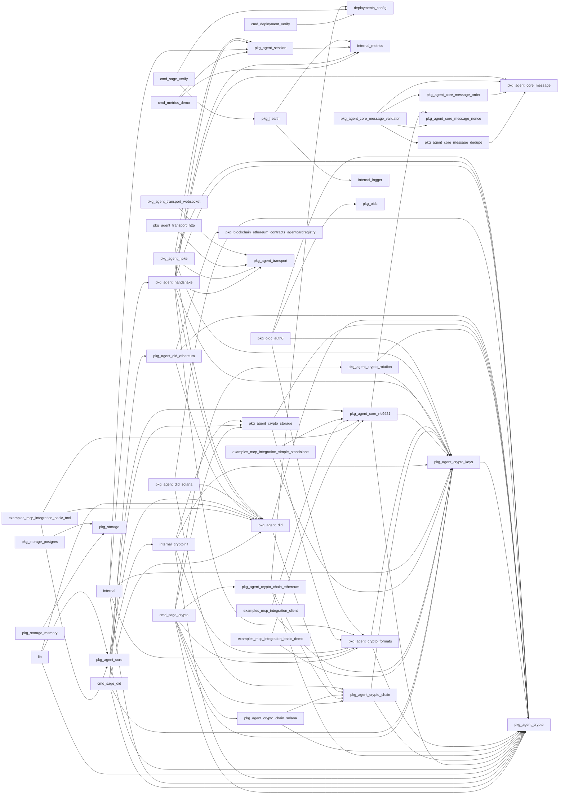

# Code Graph Summary

Module: `github.com/sage-x-project/sage`

| Metric | Value |
|---|---|
| Packages | 58 |
| Symbols | 1731 |
| Edges | 1426 |
| Non-test LOC | 37984 |
| Test LOC | 38007 |
| Funcs+methods | 1391 |
| Types | 340 |

## Packages

| Package | Kind | Files | LOC | Test LOC | Funcs | Types | Ifaces | Fan-in | Fan-out | Ext deps |
|---|---|---|---|---|---|---|---|---|---|---|
| cmd/deployment-verify | cmd | 1 | 159 | 0 | 1 | 0 | 0 | 0 | 1 | 7 |
| cmd/metrics-demo | cmd | 1 | 160 | 0 | 2 | 0 | 0 | 0 | 2 | 8 |
| cmd/sage-crypto | cmd | 7 | 1332 | 0 | 28 | 0 | 0 | 0 | 8 | 14 |
| cmd/sage-did | cmd | 13 | 3115 | 257 | 53 | 0 | 0 | 0 | 5 | 17 |
| cmd/sage-verify | cmd | 1 | 305 | 0 | 9 | 0 | 0 | 0 | 2 | 3 |
| deployments/config | other | 6 | 1222 | 800 | 31 | 15 | 0 | 3 | 0 | 13 |
| examples/mcp-integration/basic-demo | examples | 1 | 360 | 0 | 8 | 4 | 0 | 0 | 2 | 8 |
| examples/mcp-integration/basic-tool | examples | 2 | 285 | 0 | 6 | 3 | 0 | 0 | 3 | 5 |
| examples/mcp-integration/client | examples | 2 | 254 | 0 | 4 | 1 | 0 | 0 | 2 | 8 |
| examples/mcp-integration/simple-standalone | examples | 1 | 245 | 0 | 5 | 2 | 0 | 0 | 2 | 7 |
| examples/mcp-integration/vulnerable-vs-secure/attacker | examples | 1 | 156 | 0 | 4 | 1 | 0 | 0 | 0 | 7 |
| examples/mcp-integration/vulnerable-vs-secure/secure-chat | examples | 1 | 138 | 0 | 4 | 2 | 0 | 0 | 0 | 5 |
| examples/mcp-integration/vulnerable-vs-secure/vulnerable-chat | examples | 1 | 103 | 0 | 3 | 2 | 0 | 0 | 0 | 5 |
| internal | other | 1 | 149 | 0 | 8 | 1 | 0 | 0 | 5 | 7 |
| internal/cryptoinit | internal | 1 | 48 | 0 | 1 | 0 | 0 | 1 | 4 | 0 |
| internal/logger | internal | 1 | 416 | 321 | 34 | 6 | 1 | 1 | 0 | 9 |
| internal/metrics | internal | 7 | 666 | 111 | 17 | 2 | 0 | 4 | 0 | 7 |
| lib | other | 1 | 60 | 0 | 4 | 0 | 0 | 0 | 3 | 3 |
| pkg/agent/core | pkg | 2 | 312 | 786 | 18 | 4 | 1 | 2 | 4 | 3 |
| pkg/agent/core/message | pkg | 1 | 42 | 0 | 0 | 3 | 1 | 4 | 0 | 1 |
| pkg/agent/core/message/dedupe | pkg | 1 | 124 | 422 | 7 | 1 | 0 | 1 | 1 | 5 |
| pkg/agent/core/message/nonce | pkg | 1 | 120 | 362 | 7 | 1 | 0 | 2 | 0 | 5 |
| pkg/agent/core/message/order | pkg | 2 | 153 | 830 | 9 | 3 | 0 | 1 | 1 | 4 |
| pkg/agent/core/message/validator | pkg | 2 | 175 | 450 | 5 | 3 | 0 | 0 | 4 | 3 |
| pkg/agent/core/rfc9421 | pkg | 7 | 1557 | 3746 | 55 | 11 | 0 | 5 | 3 | 17 |
| pkg/agent/crypto | pkg | 5 | 684 | 2485 | 35 | 12 | 6 | 20 | 0 | 8 |
| pkg/agent/crypto/chain | pkg | 4 | 620 | 593 | 25 | 9 | 4 | 5 | 2 | 9 |
| pkg/agent/crypto/chain/ethereum | pkg | 2 | 492 | 742 | 22 | 3 | 1 | 1 | 3 | 14 |
| pkg/agent/crypto/chain/solana | pkg | 1 | 170 | 170 | 12 | 1 | 0 | 1 | 2 | 5 |
| pkg/agent/crypto/formats | pkg | 2 | 858 | 786 | 18 | 5 | 0 | 6 | 2 | 16 |
| pkg/agent/crypto/keys | pkg | 7 | 1358 | 2637 | 73 | 7 | 0 | 14 | 1 | 24 |
| pkg/agent/crypto/rotation | pkg | 1 | 145 | 198 | 4 | 1 | 0 | 1 | 2 | 3 |
| pkg/agent/crypto/storage | pkg | 2 | 312 | 824 | 13 | 3 | 0 | 3 | 2 | 7 |
| pkg/agent/crypto/vault | pkg | 1 | 407 | 324 | 15 | 4 | 1 | 0 | 0 | 14 |
| pkg/agent/did | pkg | 13 | 2845 | 5142 | 99 | 35 | 5 | 8 | 2 | 20 |
| pkg/agent/did/ethereum | pkg | 4 | 1847 | 2283 | 50 | 7 | 0 | 1 | 3 | 20 |
| pkg/agent/did/solana | pkg | 2 | 793 | 393 | 16 | 2 | 0 | 0 | 3 | 9 |
| pkg/agent/handshake | pkg | 4 | 951 | 825 | 36 | 13 | 2 | 1 | 8 | 11 |
| pkg/agent/hpke | pkg | 5 | 1533 | 2974 | 48 | 18 | 5 | 0 | 5 | 23 |
| pkg/agent/session | pkg | 5 | 1491 | 2165 | 64 | 9 | 1 | 4 | 1 | 13 |
| pkg/agent/transport | pkg | 3 | 355 | 363 | 12 | 7 | 1 | 4 | 0 | 5 |
| pkg/agent/transport/http | pkg | 3 | 491 | 272 | 14 | 5 | 0 | 0 | 1 | 7 |
| pkg/agent/transport/websocket | pkg | 3 | 724 | 482 | 31 | 5 | 0 | 0 | 1 | 6 |
| pkg/blockchain/ethereum/contracts/agentcardregistry | pkg | 3 | 5388 | 0 | 315 | 80 | 0 | 1 | 0 | 9 |
| pkg/health | pkg | 5 | 508 | 123 | 12 | 6 | 0 | 1 | 2 | 9 |
| pkg/oidc | pkg | 1 | 40 | 0 | 0 | 0 | 0 | 1 | 0 | 1 |
| pkg/oidc/auth0 | pkg | 2 | 490 | 613 | 13 | 4 | 0 | 0 | 4 | 17 |
| pkg/storage | pkg | 2 | 155 | 0 | 0 | 7 | 4 | 2 | 0 | 2 |
| pkg/storage/memory | pkg | 3 | 477 | 0 | 26 | 4 | 0 | 0 | 1 | 4 |
| pkg/storage/postgres | pkg | 4 | 688 | 0 | 26 | 5 | 0 | 0 | 1 | 6 |
| pkg/version | pkg | 1 | 143 | 215 | 7 | 1 | 0 | 0 | 0 | 3 |
| tests | root | 0 | 0 | 0 | 0 | 0 | 0 | 0 | 0 | 0 |
| tests/helpers | tests | 1 | 206 | 0 | 10 | 0 | 0 | 0 | 0 | 7 |
| tests/integration | tests | 1 | 79 | 5313 | 4 | 0 | 0 | 0 | 0 | 4 |
| tests/random | tests | 4 | 1564 | 0 | 48 | 18 | 0 | 0 | 0 | 15 |
| tests/testutil | tests | 1 | 271 | 0 | 15 | 2 | 0 | 0 | 0 | 7 |
| tools/analyze | tools | 1 | 243 | 0 | 5 | 2 | 0 | 0 | 0 | 6 |
| tools/benchmark | root | 0 | 0 | 0 | 0 | 0 | 0 | 0 | 0 | 0 |

## Package import graph (module-internal)

## Import cycles (SCC size > 1)

None.

## Layer violations

Rule: pkg must not import cmd/internal; internal must not import cmd; examples/tests/tools must not be imported by pkg/internal/cmd.

- pkg/agent/core (pkg) -> internal/cryptoinit (internal)
- pkg/agent/handshake (pkg) -> internal/metrics (internal)
- pkg/agent/session (pkg) -> internal/metrics (internal)
- pkg/health (pkg) -> internal/logger (internal)
- pkg/health (pkg) -> internal/metrics (internal)

## Interfaces and implementers

| Interface | Methods | Implementers (module-internal) |
|---|---|---|
| internal/logger.Logger | 9 | internal/logger.StructuredLogger |
| pkg/agent/core.DIDResolver | 2 | pkg/agent/did.Manager |
| pkg/agent/core/message.ControlHeader | 3 | pkg/agent/handshake.CompleteMessage, pkg/agent/handshake.InvitationMessage, pkg/agent/handshake.RequestMessage, pkg/agent/handshake.ResponseMessage |
| pkg/agent/crypto.KeyExporter | 2 | pkg/agent/crypto/formats.jwkExporter, pkg/agent/crypto/formats.pemExporter |
| pkg/agent/crypto.KeyImporter | 2 | pkg/agent/crypto/formats.jwkImporter, pkg/agent/crypto/formats.pemImporter |
| pkg/agent/crypto.KeyManager | 5 |  |
| pkg/agent/crypto.KeyPair | 6 | pkg/agent/crypto/keys.X25519KeyPair, pkg/agent/crypto/keys.ed25519KeyPair, pkg/agent/crypto/keys.p256KeyPair, pkg/agent/crypto/keys.publicKeyOnlyEd25519, pkg/agent/crypto/keys.publicKeyOnlyRSA, pkg/agent/crypto/keys.rsaKeyPair, pkg/agent/crypto/keys.secp256k1KeyPair |
| pkg/agent/crypto.KeyRotator | 3 | pkg/agent/crypto/rotation.keyRotator |
| pkg/agent/crypto.KeyStorage | 5 | pkg/agent/crypto/storage.fileKeyStorage, pkg/agent/crypto/storage.memoryKeyStorage |
| pkg/agent/crypto/chain.ChainKeyTypeMapper | 4 | pkg/agent/crypto/chain.defaultKeyMapper |
| pkg/agent/crypto/chain.ChainProvider | 7 | pkg/agent/crypto/chain/ethereum.Provider, pkg/agent/crypto/chain/solana.Provider |
| pkg/agent/crypto/chain.ChainRegistry | 4 | pkg/agent/crypto/chain.defaultRegistry |
| pkg/agent/crypto/chain.PublicKeyResolver | 2 |  |
| pkg/agent/crypto/chain/ethereum.EthClient | 8 |  |
| pkg/agent/crypto/vault.SecureVault | 6 | pkg/agent/crypto/vault.FileVault, pkg/agent/crypto/vault.MemoryVault |
| pkg/agent/did.Client | 4 | pkg/agent/did/ethereum.EthereumClient, pkg/agent/did/solana.SolanaClient |
| pkg/agent/did.ClientFactory | 4 | pkg/agent/did.defaultClientFactory |
| pkg/agent/did.Registry | 4 | pkg/agent/did/ethereum.EthereumClient, pkg/agent/did/solana.SolanaClient |
| pkg/agent/did.RegistryV4 | 4 |  |
| pkg/agent/did.Resolver | 6 | pkg/agent/did.MultiChainResolver, pkg/agent/did/ethereum.EthereumClient |
| pkg/agent/handshake.Events | 5 | internal.Creator, pkg/agent/handshake.NoopEvents |
| pkg/agent/handshake.KeyIDBinder | 1 | internal.Creator |
| pkg/agent/hpke.CookieSource | 1 |  |
| pkg/agent/hpke.CookieVerifier | 1 |  |
| pkg/agent/hpke.InfoBuilder | 2 | pkg/agent/hpke.DefaultInfoBuilder |
| pkg/agent/hpke.KeyIDBinder | 1 | internal.Creator |
| pkg/agent/hpke.SignatureVerifier | 2 | pkg/agent/hpke.CompositeVerifier, pkg/agent/hpke.ECDSAVerifier, pkg/agent/hpke.Ed25519Verifier |
| pkg/agent/session.Session | 14 | pkg/agent/session.SecureSession |
| pkg/agent/transport.MessageTransport | 1 | pkg/agent/transport.MockTransport, pkg/agent/transport/http.HTTPTransport, pkg/agent/transport/websocket.WSTransport |
| pkg/storage.DIDStore | 7 | pkg/storage/memory.DIDStore, pkg/storage/postgres.DIDStore |
| pkg/storage.NonceStore | 4 | pkg/storage/memory.NonceStore, pkg/storage/postgres.NonceStore |
| pkg/storage.SessionStore | 8 | pkg/storage/memory.SessionStore, pkg/storage/postgres.SessionStore |
| pkg/storage.Store | 5 | pkg/storage/memory.Store, pkg/storage/postgres.Store |

## Most-called functions (top 25 by internal call fan-in)

| Function | Callers |
|---|---|
| pkg/agent/crypto.KeyPair.Type | 20 |
| pkg/agent/did.NewManager | 17 |
| pkg/agent/did.Manager.Configure | 16 |
| pkg/agent/crypto.KeyPair.PublicKey | 15 |
| pkg/agent/crypto.KeyPair.Sign | 14 |
| cmd/sage-did.getDefaultContractAddress | 13 |
| pkg/agent/crypto.KeyPair.ID | 13 |
| cmd/sage-did.getDefaultRPCEndpoint | 12 |
| pkg/agent/session.SecureSession.UpdateLastUsed | 12 |
| pkg/agent/did.Manager.ResolveAgent | 10 |
| pkg/agent/did.ParseDID | 10 |
| pkg/agent/crypto.KeyPair.PrivateKey | 9 |
| pkg/agent/crypto/formats.NewJWKImporter | 8 |
| pkg/agent/did/ethereum.AgentCardClient.getTransactor | 8 |
| tests/random.TestCaseGenerator.randomInt | 8 |
| pkg/agent/core/rfc9421.NewHTTPVerifier | 7 |
| pkg/agent/crypto.KeyImporter.Import | 7 |
| pkg/agent/crypto.KeyStorage.Load | 7 |
| pkg/agent/crypto/chain.GetProvider | 7 |
| pkg/agent/crypto/keys.GenerateEd25519KeyPair | 7 |
| pkg/agent/crypto/formats.NewPEMImporter | 6 |
| pkg/agent/crypto/storage.NewFileKeyStorage | 6 |
| pkg/agent/did.FromAgentMetadata | 6 |
| pkg/agent/transport.MessageTransport.Send | 6 |
| tests/random.TestCaseGenerator.randomString | 6 |

## Largest functions (top 25 by lines)

| Function | Lines | File |
|---|---|---|
| pkg/agent/did/ethereum.EthereumClient.Resolve | 224 | pkg/agent/did/ethereum/client.go:203 |
| pkg/agent/handshake.Server.HandleMessage | 197 | pkg/agent/handshake/server.go:142 |
| pkg/agent/did/solana.SolanaClient.Register | 131 | pkg/agent/did/solana/client.go:102 |
| cmd/deployment-verify.main | 127 | cmd/deployment-verify/main.go:33 |
| pkg/agent/did/solana.SolanaClient.Update | 125 | pkg/agent/did/solana/client.go:283 |
| tests/random.ResultReporter.saveHTML | 120 | tests/random/reporter.go:164 |
| cmd/sage-did.runKeyVerifyPop | 120 | cmd/sage-did/key.go:536 |
| pkg/agent/hpke.Client.Initialize | 114 | pkg/agent/hpke/client.go:79 |
| cmd/sage-did.runCardValidate | 110 | cmd/sage-did/card.go:231 |
| cmd/sage-did.runDebug | 109 | cmd/sage-did/debug.go:73 |
| pkg/agent/did.VerifyA2ACardProof | 108 | pkg/agent/did/a2a_proof.go:154 |
| pkg/agent/did/solana.SolanaClient.Deactivate | 102 | pkg/agent/did/solana/client.go:410 |
| examples/mcp-integration/basic-demo.main | 101 | examples/mcp-integration/basic-demo/main.go:260 |
| cmd/sage-did.runVerify | 98 | cmd/sage-did/verify.go:64 |
| pkg/agent/did/ethereum.toKeyHashes | 97 | pkg/agent/did/ethereum/client.go:575 |
| pkg/agent/crypto/formats.pemExporter.ExportPublic | 91 | pkg/agent/crypto/formats/pem.go:137 |
| pkg/agent/transport/http.HTTPTransport.Send | 91 | pkg/agent/transport/http/client.go:79 |
| cmd/sage-did.validateCardWithDID | 91 | cmd/sage-did/card.go:343 |
| cmd/sage-did.runKeyAdd | 91 | cmd/sage-did/key.go:239 |
| pkg/agent/crypto/formats.pemExporter.Export | 89 | pkg/agent/crypto/formats/pem.go:46 |
| deployments/config.validateBlockchainConfig | 88 | deployments/config/validator.go:61 |
| pkg/agent/did/ethereum.EthereumClient.Register | 84 | pkg/agent/did/ethereum/client.go:116 |
| pkg/agent/crypto/formats.jwkExporter.Export | 84 | pkg/agent/crypto/formats/jwk.go:64 |
| pkg/agent/hpke.Server.HandleMessage | 83 | pkg/agent/hpke/server.go:115 |
| cmd/sage-did.runRegister | 83 | cmd/sage-did/register.go:76 |

## Duplicate function bodies

### Exact duplicates (identical body text, >= 8 lines)

- cmd/sage-crypto.loadKey, cmd/sage-crypto.loadKeyForAddress
- pkg/agent/did/ethereum.EthereumClient.ResolvePublicKey, pkg/agent/did/solana.SolanaClient.ResolvePublicKey
- pkg/agent/did/ethereum.EthereumClient.Search, pkg/agent/did/solana.SolanaClient.Search
- pkg/agent/transport/http.fromWireResponse, pkg/agent/transport/websocket.fromWireResponse
- pkg/agent/transport/http.toWireMessage, pkg/agent/transport/websocket.toWireMessage
- pkg/agent/transport/http.toWireResponse, pkg/agent/transport/websocket.toWireResponse

### Structural duplicates (identical AST shape ignoring identifiers/literals, >= 8 lines)

- cmd/sage-crypto.getSignatureAlgorithm, cmd/sage-did.getDefaultContractAddress, cmd/sage-did.getDefaultRPCEndpoint
- cmd/sage-crypto.loadKey, cmd/sage-crypto.loadKeyForAddress
- internal/metrics.MetricsCollector.RecordDIDResolution, internal/metrics.MetricsCollector.RecordVerification
- pkg/agent/crypto.Manager.ExportKeyPair, pkg/agent/crypto.Manager.ImportKeyPair
- pkg/agent/crypto/chain/ethereum.Provider.SignTransaction, pkg/agent/crypto/chain/solana.Provider.SignTransaction
- pkg/agent/crypto/formats.jwkImporter.importEd25519, pkg/agent/crypto/formats.jwkImporter.importSecp256k1
- pkg/agent/crypto/keys.NewSecp256k1KeyPair, pkg/agent/crypto/keys.NewX25519KeyPair
- pkg/agent/crypto/vault.MemoryVault.ListKeys, pkg/agent/did.Manager.GetSupportedChains
- pkg/agent/did.KeyType.String, pkg/agent/did.mapKeyTypeToA2A
- pkg/agent/did.MultiChainResolver.ResolveKEMKey, pkg/agent/did.MultiChainResolver.ResolvePublicKey
- pkg/agent/did/ethereum.AgentCardClient.SetApprovalForAgent, pkg/agent/did/ethereum.AgentCardClient.UpdateAgent
- pkg/agent/did/ethereum.EthereumClient.ResolveKEMKey, pkg/agent/did/ethereum.EthereumClient.ResolvePublicKey, pkg/agent/did/solana.SolanaClient.ResolvePublicKey
- pkg/agent/did/ethereum.EthereumClient.Search, pkg/agent/did/solana.SolanaClient.Search
- pkg/agent/handshake.Client.Complete, pkg/agent/handshake.Client.Invitation
- pkg/agent/handshake.Client.Request, pkg/agent/handshake.Client.Response
- pkg/agent/session.SecureSession.DecryptInbound, pkg/agent/session.SecureSession.DecryptWithAADInbound
- pkg/agent/session.SecureSession.EncryptOutbound, pkg/agent/session.SecureSession.EncryptWithAADOutbound
- pkg/agent/transport/http.fromWireResponse, pkg/agent/transport/websocket.fromWireResponse
- pkg/agent/transport/http.init, pkg/agent/transport/websocket.init
- pkg/agent/transport/http.toWireMessage, pkg/agent/transport/websocket.toWireMessage
- pkg/agent/transport/http.toWireResponse, pkg/agent/transport/websocket.toWireResponse
- pkg/blockchain/ethereum/contracts/agentcardregistry.AgentCardRegistryAgentActivatedIterator.Next, pkg/blockchain/ethereum/contracts/agentcardregistry.AgentCardRegistryAgentDeactivatedByHashIterator.Next, pkg/blockchain/ethereum/contracts/agentcardregistry.AgentCardRegistryAgentDeactivatedIterator.Next, pkg/blockchain/ethereum/contracts/agentcardregistry.AgentCardRegistryAgentEndpointUpdatedIterator.Next, pkg/blockchain/ethereum/contracts/agentcardregistry.AgentCardRegistryAgentRegistered0Iterator.Next, pkg/blockchain/ethereum/contracts/agentcardregistry.AgentCardRegistryAgentRegisteredIterator.Next, pkg/blockchain/ethereum/contracts/agentcardregistry.AgentCardRegistryAgentUpdatedIterator.Next, pkg/blockchain/ethereum/contracts/agentcardregistry.AgentCardRegistryApprovalForAgentIterator.Next, pkg/blockchain/ethereum/contracts/agentcardregistry.AgentCardRegistryCommitmentRecordedIterator.Next, pkg/blockchain/ethereum/contracts/agentcardregistry.AgentCardRegistryKEMKeyUpdatedIterator.Next, pkg/blockchain/ethereum/contracts/agentcardregistry.AgentCardRegistryKeyAddedIterator.Next, pkg/blockchain/ethereum/contracts/agentcardregistry.AgentCardRegistryKeyRevokedIterator.Next, pkg/blockchain/ethereum/contracts/agentcardregistry.AgentCardRegistryOwnershipTransferStartedIterator.Next, pkg/blockchain/ethereum/contracts/agentcardregistry.AgentCardRegistryOwnershipTransferredIterator.Next, pkg/blockchain/ethereum/contracts/agentcardregistry.AgentCardRegistryPausedIterator.Next, pkg/blockchain/ethereum/contracts/agentcardregistry.AgentCardRegistryUnpausedIterator.Next, pkg/blockchain/ethereum/contracts/agentcardregistry.AgentCardStorageAgentDeactivatedByHashIterator.Next, pkg/blockchain/ethereum/contracts/agentcardregistry.AgentCardStorageAgentRegisteredIterator.Next, pkg/blockchain/ethereum/contracts/agentcardregistry.AgentCardStorageAgentUpdatedIterator.Next, pkg/blockchain/ethereum/contracts/agentcardregistry.AgentCardStorageApprovalForAgentIterator.Next, pkg/blockchain/ethereum/contracts/agentcardregistry.AgentCardStorageCommitmentRecordedIterator.Next, pkg/blockchain/ethereum/contracts/agentcardregistry.AgentCardStorageKeyAddedIterator.Next, pkg/blockchain/ethereum/contracts/agentcardregistry.AgentCardStorageKeyRevokedIterator.Next
- pkg/blockchain/ethereum/contracts/agentcardregistry.AgentCardRegistryCaller.ActivationDelay, pkg/blockchain/ethereum/contracts/agentcardregistry.AgentCardRegistryCaller.RegistrationStake
- pkg/blockchain/ethereum/contracts/agentcardregistry.AgentCardRegistryCaller.AgentActivationTime, pkg/blockchain/ethereum/contracts/agentcardregistry.AgentCardRegistryCaller.AgentNonce, pkg/blockchain/ethereum/contracts/agentcardregistry.AgentCardRegistryCaller.AgentStakes, pkg/blockchain/ethereum/contracts/agentcardregistry.AgentCardStorageCaller.AgentNonce
- pkg/blockchain/ethereum/contracts/agentcardregistry.AgentCardRegistryCaller.AgentOperators, pkg/blockchain/ethereum/contracts/agentcardregistry.AgentCardRegistryCaller.IsApprovedOperator, pkg/blockchain/ethereum/contracts/agentcardregistry.AgentCardStorageCaller.AgentOperators
- pkg/blockchain/ethereum/contracts/agentcardregistry.AgentCardRegistryCaller.DidToAgentId, pkg/blockchain/ethereum/contracts/agentcardregistry.AgentCardStorageCaller.DidToAgentId
- pkg/blockchain/ethereum/contracts/agentcardregistry.AgentCardRegistryCaller.GetAgent, pkg/blockchain/ethereum/contracts/agentcardregistry.AgentCardRegistryCaller.GetAgentByDID, pkg/blockchain/ethereum/contracts/agentcardregistry.AgentCardRegistryCaller.GetKey, pkg/blockchain/ethereum/contracts/agentcardregistry.AgentCardRegistryCaller.IsAgentActive, pkg/blockchain/ethereum/contracts/agentcardregistry.AgentCardRegistryCaller.ResolveAgent, pkg/blockchain/ethereum/contracts/agentcardregistry.AgentCardRegistryCaller.ResolveAgentByAddress
- pkg/blockchain/ethereum/contracts/agentcardregistry.AgentCardRegistryCaller.Owner, pkg/blockchain/ethereum/contracts/agentcardregistry.AgentCardRegistryCaller.PendingOwner, pkg/blockchain/ethereum/contracts/agentcardregistry.AgentCardRegistryCaller.VerifyHook
- pkg/blockchain/ethereum/contracts/agentcardregistry.AgentCardRegistryCaller.RegistrationCommitments, pkg/blockchain/ethereum/contracts/agentcardregistry.AgentCardStorageCaller.RegistrationCommitments
- pkg/blockchain/ethereum/contracts/agentcardregistry.AgentCardRegistryFilterer.FilterAgentActivated, pkg/blockchain/ethereum/contracts/agentcardregistry.AgentCardRegistryFilterer.FilterAgentDeactivatedByHash, pkg/blockchain/ethereum/contracts/agentcardregistry.AgentCardRegistryFilterer.FilterAgentEndpointUpdated, pkg/blockchain/ethereum/contracts/agentcardregistry.AgentCardRegistryFilterer.FilterAgentUpdated, pkg/blockchain/ethereum/contracts/agentcardregistry.AgentCardRegistryFilterer.FilterCommitmentRecorded, pkg/blockchain/ethereum/contracts/agentcardregistry.AgentCardStorageFilterer.FilterAgentDeactivatedByHash, pkg/blockchain/ethereum/contracts/agentcardregistry.AgentCardStorageFilterer.FilterAgentUpdated, pkg/blockchain/ethereum/contracts/agentcardregistry.AgentCardStorageFilterer.FilterCommitmentRecorded
- pkg/blockchain/ethereum/contracts/agentcardregistry.AgentCardRegistryFilterer.FilterAgentDeactivated, pkg/blockchain/ethereum/contracts/agentcardregistry.AgentCardRegistryFilterer.FilterAgentRegistered0, pkg/blockchain/ethereum/contracts/agentcardregistry.AgentCardRegistryFilterer.FilterKEMKeyUpdated, pkg/blockchain/ethereum/contracts/agentcardregistry.AgentCardRegistryFilterer.FilterKeyAdded, pkg/blockchain/ethereum/contracts/agentcardregistry.AgentCardRegistryFilterer.FilterKeyRevoked, pkg/blockchain/ethereum/contracts/agentcardregistry.AgentCardRegistryFilterer.FilterOwnershipTransferStarted, pkg/blockchain/ethereum/contracts/agentcardregistry.AgentCardRegistryFilterer.FilterOwnershipTransferred, pkg/blockchain/ethereum/contracts/agentcardregistry.AgentCardStorageFilterer.FilterKeyAdded, pkg/blockchain/ethereum/contracts/agentcardregistry.AgentCardStorageFilterer.FilterKeyRevoked
- pkg/blockchain/ethereum/contracts/agentcardregistry.AgentCardRegistryFilterer.FilterAgentRegistered, pkg/blockchain/ethereum/contracts/agentcardregistry.AgentCardRegistryFilterer.FilterApprovalForAgent, pkg/blockchain/ethereum/contracts/agentcardregistry.AgentCardStorageFilterer.FilterAgentRegistered, pkg/blockchain/ethereum/contracts/agentcardregistry.AgentCardStorageFilterer.FilterApprovalForAgent
- pkg/blockchain/ethereum/contracts/agentcardregistry.AgentCardRegistryFilterer.WatchAgentActivated, pkg/blockchain/ethereum/contracts/agentcardregistry.AgentCardRegistryFilterer.WatchAgentDeactivatedByHash, pkg/blockchain/ethereum/contracts/agentcardregistry.AgentCardRegistryFilterer.WatchAgentEndpointUpdated, pkg/blockchain/ethereum/contracts/agentcardregistry.AgentCardRegistryFilterer.WatchAgentUpdated, pkg/blockchain/ethereum/contracts/agentcardregistry.AgentCardRegistryFilterer.WatchCommitmentRecorded, pkg/blockchain/ethereum/contracts/agentcardregistry.AgentCardStorageFilterer.WatchAgentDeactivatedByHash, pkg/blockchain/ethereum/contracts/agentcardregistry.AgentCardStorageFilterer.WatchAgentUpdated, pkg/blockchain/ethereum/contracts/agentcardregistry.AgentCardStorageFilterer.WatchCommitmentRecorded
- pkg/blockchain/ethereum/contracts/agentcardregistry.AgentCardRegistryFilterer.WatchAgentDeactivated, pkg/blockchain/ethereum/contracts/agentcardregistry.AgentCardRegistryFilterer.WatchAgentRegistered0, pkg/blockchain/ethereum/contracts/agentcardregistry.AgentCardRegistryFilterer.WatchKEMKeyUpdated, pkg/blockchain/ethereum/contracts/agentcardregistry.AgentCardRegistryFilterer.WatchKeyAdded, pkg/blockchain/ethereum/contracts/agentcardregistry.AgentCardRegistryFilterer.WatchKeyRevoked, pkg/blockchain/ethereum/contracts/agentcardregistry.AgentCardRegistryFilterer.WatchOwnershipTransferStarted, pkg/blockchain/ethereum/contracts/agentcardregistry.AgentCardRegistryFilterer.WatchOwnershipTransferred, pkg/blockchain/ethereum/contracts/agentcardregistry.AgentCardStorageFilterer.WatchKeyAdded, pkg/blockchain/ethereum/contracts/agentcardregistry.AgentCardStorageFilterer.WatchKeyRevoked
- pkg/blockchain/ethereum/contracts/agentcardregistry.AgentCardRegistryFilterer.WatchAgentRegistered, pkg/blockchain/ethereum/contracts/agentcardregistry.AgentCardRegistryFilterer.WatchApprovalForAgent, pkg/blockchain/ethereum/contracts/agentcardregistry.AgentCardStorageFilterer.WatchAgentRegistered, pkg/blockchain/ethereum/contracts/agentcardregistry.AgentCardStorageFilterer.WatchApprovalForAgent
- pkg/blockchain/ethereum/contracts/agentcardregistry.AgentCardRegistryFilterer.WatchPaused, pkg/blockchain/ethereum/contracts/agentcardregistry.AgentCardRegistryFilterer.WatchUnpaused
- pkg/storage/memory.DIDStore.Delete, pkg/storage/memory.SessionStore.Delete
- pkg/storage/memory.DIDStore.Update, pkg/storage/memory.SessionStore.Update
- pkg/storage/memory.NonceStore.Count, pkg/storage/memory.SessionStore.Count
- pkg/storage/memory.NonceStore.DeleteExpired, pkg/storage/memory.SessionStore.DeleteExpired
- pkg/storage/postgres.DIDStore.Delete, pkg/storage/postgres.DIDStore.Revoke, pkg/storage/postgres.SessionStore.Delete
- pkg/storage/postgres.NonceStore.Count, pkg/storage/postgres.SessionStore.Count
- pkg/storage/postgres.NonceStore.DeleteExpired, pkg/storage/postgres.SessionStore.DeleteExpired

## Dead-code candidates (unexported funcs/methods with no internal callers or references)

- pkg/agent/did/ethereum.AgentCardClient.computeAgentID (pkg/agent/did/ethereum/agentcard_client.go:590)
- pkg/agent/did/ethereum.toKeyHashes (pkg/agent/did/ethereum/client.go:575)
- pkg/oidc/auth0.containsScope (pkg/oidc/auth0/auth0.go:395)
