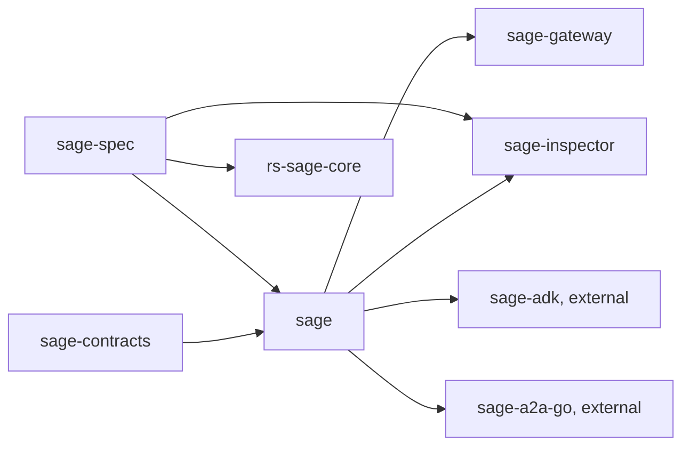
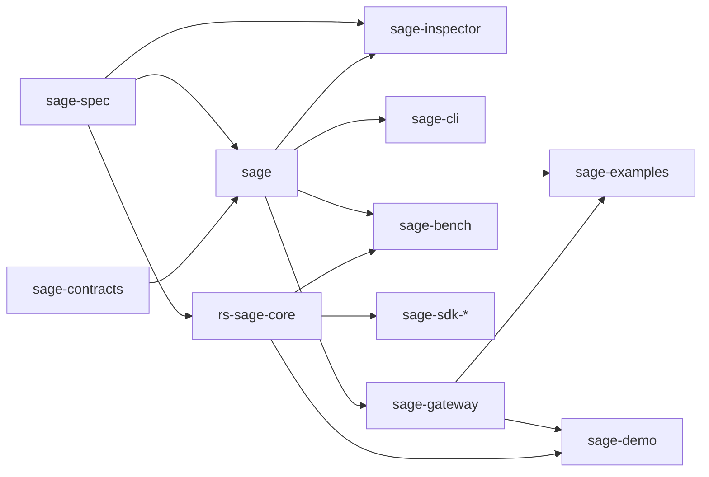

# Repository structure options

Status: proposal for review, 2026-09-13. Nothing here is executed; the
maintainer chooses an option (or a mix) before any extraction starts
(BACKLOG F-10, DECISIONS.md 7). Measurements come from
`review/02-code-graph.md` and `review/11-repository-split-and-research-plan.md`
at `sage` `878932d`.

## 1. Where the code is today

| Repository | Content | State |
|---|---|---|
| `sage` (Go, LGPL-3.0) | reference core (`pkg/agent/**`, 17,400 source LOC), bindings (`pkg/blockchain/ethereum`, 5,900), platform packages (`pkg/{storage,telemetry,health,oidc,version}`, 3,800), vector generator (1,600), CLI binaries and composition root (5,900), examples (3,800), tooling (1,400), integration tests, experimental SDK stubs (5,400 lines in four languages), deprecated handshake (1,100) | one module, one release train |
| `sage-spec` (Apache-2.0) | protocol chapters 00-08, 26 vectors (28 on the review branch) | `1.0.0-draft.1`, untagged |
| `rs-sage-core` (MIT OR Apache-2.0) | Rust core, C header, WASM package | 0.3.0, aligned with the spec at vector level |
| `sage-contracts` (MIT) | Solidity, ABIs, deployments | untagged |
| `sage-gateway`, `sage-inspector` (LGPL-3.0) | proxies; conformance checker | pin `sage` pseudo-versions |

Dependency direction today (arrows point at what is imported or pinned):



`sage` carries everything a consumer might not want: importing the core
library pulls the CLI's dependencies (cobra, YAML), the Ethereum RPC client,
PostgreSQL, Auth0 and Prometheus into `go.sum`, and the examples and SDK
stubs sit in the same release train as the protocol code.

## 2. Options

### Option A. Keep the current split, tidy inside `sage`

No new repositories. Inside `sage`: nested Go modules for `examples/` and
`tools/benchmark`, the SDK stubs archived under `docs/archive`, deprecated
code removed on the policy schedule (v1.8.0). The attack demonstration
(F-09) becomes one more nested module, `examples/attack-lab`.

| | |
|---|---|
| Repositories | 6 (unchanged) + none |
| Moves | none; two `go.mod` files added |
| Effort | S (days) |
| Reuse | consumers still import one module that contains CLI, storage and RPC code; `go mod` prunes unused packages, but `go.sum` and vulnerability scans still see them |
| Research | benchmarks and the attack lab live next to the code they measure; results cannot be versioned independently of the library |
| Risk | lowest; the split can still happen later |

Choose when the priority is finishing the wire-format fixes (BACKLOG G) and
the live end-to-end path (F-03b) before anything else.

### Option B. Library core plus operator, demonstration and research repositories (the review's proposal)

`sage` keeps only the reference library; four repositories are created.

| Repository | Content | Public surface | Licence |
|---|---|---|---|
| `sage` | `pkg/agent/**` (crypto, JCS, RFC 9421, did, hpke, session, transport), `pkg/blockchain/ethereum`, `pkg/vectors`, `pkg/telemetry`, `pkg/version`, `cmd/sage-vectors` | Go packages, tagged `v1.x` | LGPL-3.0 |
| `sage-cli` (new) | `cmd/sage-crypto`, `cmd/sage-did`, `cmd/sage-verify`, `internal/{app,cli,config}`, `deployments/` | binaries, container image | LGPL-3.0 |
| `sage-examples` (new) | `examples/**` with READMEs executed in CI | `go run` targets | Apache-2.0 |
| `sage-bench` (new) | benchmarks, interoperability matrix, adversarial suites, results | harness, CSV/JSON results | Apache-2.0 |
| `sage-demo` (new, F-09) | two agents, an attacker proxy (eavesdrop, replace, replay), the same scenario without SAGE, with signatures, with the session layer | runnable scenario, CI matrix, report | Apache-2.0 |
| `sage-sdk-{python,typescript,java}` (later, F-04) | generated bindings over `rs-sage-core` | packages | MIT OR Apache-2.0 |

Deleted from `sage`: `pkg/agent/handshake`, `core/message`, `crypto/vault`
(v1.8.0); `sdk/` archived; `pkg/storage`, `pkg/oidc`, `pkg/health` moved to
`sage-gateway` or deleted (open decision, `review/11` §6 item 4).



| | |
|---|---|
| Repositories | 6 + 4 now, + 3 SDKs later |
| Moves | about 11,000 LOC out of `sage` (CLI 5,900, examples 3,800, tooling 1,400), 1,100 deleted |
| Effort | M for the moves (history kept with `git filter-repo`), plus one CI per repository |
| Reuse | a consumer of the library sees only protocol code; the CLI and gateway pin a library tag; the demo and benchmarks can pin different library versions and publish results against them |
| Research | `sage-bench` and `sage-demo` are the paper's artefacts and can be cited by tag |
| Risk | six release trains to keep consistent (mitigated by `VERSION_POLICY.md` §2 pins); external consumers (`sage-adk`, `sage-a2a-go`) are unaffected because import paths under `pkg/agent/*` do not change |

Choose when the paper and the demonstration are the next milestones and the
operator CLI is expected to evolve on its own schedule.

### Option C. Library core plus one applications repository

Between A and B: one new repository, `sage-apps`, that holds the CLI, the
examples, the demonstration and the benchmarks as separate Go modules in
one tree (`cli/`, `examples/`, `demo/`, `bench/`), each pinning a `sage`
tag.

| | |
|---|---|
| Repositories | 6 + 1 |
| Moves | the same 11,000 LOC as B, into one repository |
| Effort | S to M |
| Reuse | the library is as clean as in B; the applications share one CI and one issue tracker |
| Research | results live under `sage-apps/bench/results`; citable by tag of `sage-apps` |
| Risk | the applications repository mixes an operator tool with research code; a release of the CLI tags research code too |

Choose when the maintainer count stays at one and the overhead of four
repositories outweighs the separation.

## 3. Comparison

| Criterion | A | B | C |
|---|---|---|---|
| Library import weight for consumers | unchanged | smallest | smallest |
| Number of release trains | 6 | 10 (13 with SDKs) | 7 |
| Time to first result | days | weeks | one to two weeks |
| Fit for the attack demonstration (F-09) | nested module | own repository | `sage-apps/demo` |
| Fit for a research paper artefact | weak (versioned with the library) | strong | adequate |
| History preservation | n/a | `git filter-repo` per path set | one `git filter-repo` |
| External consumers | unaffected | unaffected | unaffected |

## 4. Layout of the new repositories (for B or C)

### `sage-cli`

```
cmd/sage-crypto/  cmd/sage-did/  cmd/sage-verify/
internal/app/     composition root (RegisterDefaults, config to did.RegistryConfig)
internal/cli/     shared cobra helpers, key loading
internal/config/  YAML and environment overlay
deployments/      sample configuration, docker compose
docs/             CLI guides (moved from sage/docs/cli)
```

Pins `sage` by tag; no `replace`. Releases with GoReleaser; the container
image moves here from `sage`.

### `sage-demo` (attack lab)

```
agents/           agent A and agent B: minimal HTTP services behind sage-gateway
attacker/         proxy with switches: passthrough, eavesdrop (log), replace (edit body), replay (resend), downgrade (strip signature headers)
scenarios/        one YAML per scenario: layer (none | signed | signed+session), attack, expected outcome
runner/           starts the three processes, runs every scenario, writes results/<date>.json
report/           renders the results table (which layer stops which attack)
.github/          CI runs the full matrix on every push
```

The expected results table the CI asserts:

| Attack | No SAGE | Signatures (RFC 9421) | Signatures + HPKE session |
|---|---|---|---|
| Eavesdrop | plaintext visible | plaintext visible | ciphertext only |
| Replace body | accepted | rejected (digest, signature) | rejected (AEAD tag) |
| Replay | accepted | rejected (nonce, created window) | rejected (sequence window) |
| Strip signature | accepted | rejected (missing Signature-Input) | rejected (no session record) |

The third column needs the gateway HPKE session mode and the live
interoperability item (F-03b) first.

### `sage-bench`

```
bench/            Go testing.B packages: sign/verify, handshake, record encrypt/decrypt, DID resolve
interop/          matrix driver: Go core, Rust core (FFI), gateway; every vector and every procedure in review/09
adversarial/      replay, reorder, truncation, oversized body, clock skew, malformed Signature-Input
baselines/        TLS 1.3 (crypto/tls), mTLS, a Noise NK/IK implementation, for the same message sizes
results/          CSV and JSON per run, machine description, commit ids of every repository
```

### `sage-examples`

`examples/**` as today, one `go.mod`, `run-examples.sh` executed in CI so
READMEs stay true.

## 5. Ordering that applies to every option

1. BACKLOG G-01 to G-05 (wire-format fixes) and the `sage-spec` and
   `sage-contracts` tags, because every new repository would pin them.
2. Gateway HPKE session mode and F-03b, because the demonstration's third
   column depends on them.
3. Only then the extraction chosen above.

## 6. Recommendation

Option B, executed after step 2 above, with `sage-demo` created first
because it is the artefact the maintainer wants to show. If the maintainer
count stays at one for the next quarter, Option C gives most of the benefit
with one repository to run. Option A is the fallback if the wire-format work
takes longer than expected.

Trade-off of the recommendation: four more repositories to keep green and
to tag in the order of `VERSION_POLICY.md` §4 rule 6; in return the
library becomes importable without operator or research code, and the demo
and the benchmarks can be cited independently.
