# Documentation graph, second pass (X-bar classification)

Status: review, 2026-09-12. Read-only analysis; nothing but this file was written. Line numbers refer to the working tree at commit `878932d` (sage) and to the sibling checkouts named in section 1. Confidence marks: [High] = read directly in code or document; [Mid] = inferred from one source; [Low] = not checked.

## 1. Scope and method

The first documentation graph, `docs/refactoring/DOCS_GRAPH.md` (2026-09-11), classified 139 Markdown documents as X-bar nodes and its scheme is reused unchanged: the **head** is the topic noun, the **type** is SPEC / GUIDE / REFERENCE / RATIONALE / STATUS / INDEX, the **specifier** is audience and scope, the **complement** is the code or protocol the document acts on, and **adjuncts** are language, dates, twins and caveats (`DOCS_GRAPH.md:5-13`). Freshness is judged against the working tree, not against other documents: CURRENT = every checked claim matches; MIXED = the core matches but named sections do not; STALE = the subject or most concrete claims no longer exist.

This pass covers what the first graph could not:

1. Every Markdown file created or changed in `sage` since 2026-09-11 (`git log --since=2026-09-11 --name-only --format= -- '*.md' | sort -u`: 97 paths; 21 were deleted by the contracts move `b04477b`, the archive commit `f068212` and the example clean-up `004c9ba`, leaving 76 in the tree).
2. `docs/refactoring/**` (23 files, 14 of them untouched since 09-11), which the first graph excluded as its own output.
3. The specification repository `sage-spec` (`spec/00..08`, `vectors/README.md`, `README.md`; HEAD `a34dd49`, 2026-09-12).
4. The README of `rs-sage-core` (`206bbbb`), `sage-contracts` (`d9f313b`), `sage-gateway` (`4e72668`) and `sage-inspector` (`05b890d`), all 2026-09-12.

Reading depth: every file under 400 lines was read in full; longer files were read by headings, status banner and every section that names a path, symbol, flag or address; 5-15 claims per file were checked with `ls` / `grep` against the tree. The three `DETAILED_GUIDE` parts were sampled (identifier hit/miss counts in the notes).

Ground truth used for freshness (verified in code on 2026-09-12): Go packages live only under `pkg/agent/{core,crypto,did,handshake,hpke,session,transport}` and `pkg/{blockchain,health,oidc,storage,telemetry,vectors,version}`; binaries are `cmd/{sage-crypto,sage-did,sage-vectors,sage-verify}`; `contracts/` holds only the pinned checkout target (`.contracts-version` = `2ff992e`), the sources having moved to `sage-contracts`; there is no HTTP API server, no `lib/`, no `internal/cryptoinit`, no `internal/{logger,metrics}`; replay protection is one `session.ReplayGuard` shared by RFC 9421, HPKE and sessions (`pkg/agent/core/rfc9421/verifier_http.go:46-58`, `pkg/agent/hpke/server.go:117`); sessions carry an 8-byte sequence header with a 1024-entry window and rekey every 256 records (`pkg/agent/session/session.go:128-141`); `pkg/agent/handshake` is marked Deprecated (`doc.go:20-28`).

## 2. Summary

### The 139 first-pass documents, by cluster

Per-document rows are in `DOCS_GRAPH.md` §4 and are not repeated. What changed for each cluster since 2026-09-11:

| Cluster (first pass) | Docs | First-pass verdicts | What happened since (commit) | Effect |
|---|---|---|---|---|
| Identity/DID | 15 | 1 C / 8 M / 6 S | `SAGE_A2A_INTEGRATION_GUIDE.md` archived; banners on `pkg/agent/did/README.md`, `did-{en,ko}.md`, `SECTION_3_DID.md` (`f068212`); code under them changed again (`555c8be`, `332e2b1`, `d7e131d`, `878932d`) | Banners point at current sources; bodies are further from the code than on 09-11 |
| Handshake/Session | 19 | 3 C / 15 M / 1 S | README twins label 4-phase "legacy" and cite D-06; `cryptographic-en.md:91-92` ackTag labels fixed; `handshake` package Deprecated (`eff53f8`) | First-pass contradiction 9 closed; new gaps opened by the sequence-window session layer (`e7c713c`, `2c48ceb`), section 6 |
| Signing/RFC9421 | 15 | 3 C / 10 M / 2 S | `rfc9421-en.md` P-256 and algorithm names fixed (`f068212`); response signing shipped (`6bf8d90`) | The "response signing pending" sections and the `-ko` twin are behind the code |
| Crypto/Keys | 8 | 2 C / 6 M / 0 S | Vault and file-storage claims corrected | Otherwise unchanged |
| Contracts | 21 | 0 C / 17 M / 4 S | All 21 moved to `sage-contracts` with history (`b04477b`) | Cluster no longer exists in `sage`; `sage-contracts/README.md` is its entry point |
| Transport/API | 7 | 0 C / 4 M / 3 S | Status notes on `docs/API.md`, `api/*`, `deployments/README.md` | Still describe an unbuilt server; only the transport section is live |
| CLI | 4 | 0 C / 4 M / 0 S | Untouched | Still document flags that do not exist (`DOCS_GRAPH.md` §5 row 2) |
| Build/CI/Ops | 12 | 1 C / 8 M / 3 S | CI rewritten (`fca9c5c`, `60381d6`, `414e086`, `9bfa54f`, `58cf20c`); guides only banner-touched | `docs/CI-CD.md` describes a pipeline that was replaced |
| Testing/Verification | 12 | 1 C / 6 M / 5 S | `TEST_EXECUTION_GUIDE.md`, load and performance plans archived | Remaining bodies unchanged |
| SDKs | 4 | 0 C / 4 M / 0 S | Experimental banners, TS 0.1.0, CI build (`9b0f7a4`) | Feature claims below the banner unchanged |
| Audit/History | 6 | 0 C / 1 M / 5 S | `docs/audit/` archived (`f068212`) | Cluster is now `docs/archive/2026-09/` |
| Project meta | 16 | 2 C / 8 M / 6 S | `docs/INDEX.md` generated from the tree (`2e3f5af`); README samples fixed; `SECURITY.md`, `CODE_OF_CONDUCT.md` added | INDEX is the first generated document in the repository |

Reading: the 09-12 commits removed or fenced the STALE tail (16 archived, 21 deleted) and fixed point contradictions, but did not rewrite bodies. The code moved faster than the documents on the same day (26 refactoring PRs), so the MIXED majority of the first pass is still MIXED, with different stale lines.

### The 105 documents classified in this pass

| Dimension | Counts |
|---|---|
| Documents | 105 = 76 changed in `sage` (incl. 9 under `docs/refactoring`) + 14 other `docs/refactoring` files + 11 `sage-spec` + 4 sibling READMEs |
| By type | GUIDE 31, STATUS 23, REFERENCE 18, RATIONALE 15, INDEX 9, SPEC 9 |
| By freshness | MIXED 46, STALE 33, CURRENT 26 |
| CURRENT by origin | `sage-spec` 11, sibling READMEs 3, `docs/refactoring` 6, `sage` body 6 (`CHANGELOG`, `CODE_OF_CONDUCT`, `docs/INDEX`, two MCP example READMEs, `pkg/telemetry/metrics/README`) |
| STALE by origin | `docs/archive` 16, `docs/refactoring` snapshots 9, `api/*` + `docs/API.md` 4, examples 2, test records 2 |

Every SPEC-type document in the whole corpus now lives in `sage-spec`; `sage` has none (the first pass counted 4 SPEC documents, all protocol-level guides that are here reclassified under their type of use).

## 3. Node table (105 rows)

Columns follow `DOCS_GRAPH.md` §4. Notes give the deciding code location for every MIXED / STALE verdict.

### sage: project meta, API, build, SDKs, examples (27)

| path | head | type | specifier | complement | adjuncts | freshness | last commit |
|---|---|---|---|---|---|---|---|
| `README.md` | SAGE project overview | INDEX | new user, contributor | `pkg/agent`, CLIs, AgentCardRegistry, SDKs | en; v1.5.2; Sepolia table; SDK-experimental note | MIXED | 2026-09-12 |
| `INSTALL.md` | build, install, LGPL relinking | GUIDE | downstream distributor | `cmd/*`, `go build`, contracts npm | en; Go-version claims | MIXED | 2026-09-12 |
| `CONTRIBUTING.md` | contribution and release process | GUIDE | contributor, maintainer | make targets, contracts npm, pre-commit, `VERSION` | en; Conventional Commits | MIXED | 2026-09-12 |
| `CHANGELOG.md` | release history | STATUS | all users | every package, contracts, CI | en; Keep-a-Changelog; `[Unreleased]` | CURRENT | 2026-09-12 |
| `CODE_OF_CONDUCT.md` | Contributor Covenant 2.1 | RATIONALE | community | none | en; verbatim text | CURRENT | 2026-09-12 |
| `SECURITY.md` | vulnerability reporting, release verification | GUIDE | reporters, consumers | `release.yml`, cosign, SLSA, SBOM | en; supported-version table | MIXED | 2026-09-12 |
| `api/README.md` | planned HTTP API | REFERENCE | integrator; unimplemented | `api/openapi.yaml`, `cmd/sage-server` | en; status banner | STALE | 2026-09-12 |
| `api/examples/authentication.md` | HPKE auth over debug routes | GUIDE | HTTP client developer; unimplemented | `/debug/*`, `tests/session/handshake` | en; status banner | STALE | 2026-09-12 |
| `api/examples/signatures.md` | RFC 9421 signing example | GUIDE | HTTP client developer | `pkg/signature`, hand-rolled verifier | en; no banner | STALE | 2026-09-12 |
| `deployments/README.md` | deployment config, Docker, migrations | GUIDE | operator | `deployments/config`, compose, `sage-server` | en; status banner (config API only) | MIXED | 2026-09-12 |
| `docs/INDEX.md` | documentation catalogue | INDEX | all readers | every Markdown file | en; generated by `gen-docs-index.py`; first-pass verdict column | CURRENT | 2026-09-12 |
| `docs/ARCHITECTURE.md` | system architecture and data flow | RATIONALE | architect, contributor | `pkg/agent` modules, handshake, session, transport, contracts | en; ASCII diagrams | MIXED | 2026-09-12 |
| `docs/API.md` | HTTP API server and transport API | REFERENCE | integrator; server part unimplemented | `cmd/sage-server`, `transport/{http,websocket,a2a}` | en; status banner; v1.0.0 2025-10-10 | STALE | 2026-09-12 |
| `docs/BUILD.md` | binary, library and cross-platform builds | GUIDE | builder, releaser | make targets, `lib/` | en; CGO sections | MIXED | 2026-09-12 |
| `docs/CI-CD.md` | GitHub Actions pipeline | REFERENCE | maintainer | workflows, make targets | en; job lists | MIXED | 2026-09-12 |
| `tools/loadtest/README.md` | k6 load-testing suite | GUIDE | performance tester | `tools/loadtest/scenarios/*.js`, `sage-server` | en | MIXED | 2026-09-12 |
| `tools/scripts/README_VERSION.md` | `update-version.sh` helper | GUIDE | release manager | `VERSION`, `pkg/version`, contracts `package.json`, `lib/export.go` | en | MIXED | 2026-09-12 |
| `sdk/java/sage-client/README.md` | Java client SDK | REFERENCE | Java developer; experimental | `SageClient`, `Crypto`, server endpoints | en; banner; 0.1.0; LGPL | MIXED | 2026-09-12 |
| `sdk/python/README.md` | Python client SDK | REFERENCE | Python developer; experimental | `SAGEClient`, `Crypto`, server endpoints | en; banner; 0.1.0; LGPL | MIXED | 2026-09-12 |
| `sdk/rust/sage-client/README.md` | Rust client SDK | REFERENCE | Rust developer; experimental | `Client`, `Crypto`, server endpoints | en; banner; 0.1.0; LGPL | MIXED | 2026-09-12 |
| `sdk/typescript/README.md` | TypeScript SDK and React hooks | REFERENCE | JS developer; experimental | `SAGEClient`, hooks, server endpoints | en; banner; 0.1.0; LGPL | MIXED | 2026-09-12 |
| `examples/a2a-integration/README.md` | A2A multi-key example set | INDEX | example runner | examples 01-04, Hardhat, SageRegistryV4 | en; series parent | STALE | 2026-09-12 |
| `examples/a2a-integration/01-register-agent/README.md` | multi-key registration example | GUIDE | example runner | `did.Manager.RegisterAgent`, SageRegistryV4, `sage-did key approve` | en; series 1 | STALE | 2026-09-12 |
| `examples/a2a-integration/04-secure-message/README.md` | HPKE-encrypted, Ed25519-signed message | GUIDE | example runner | `keys.HPKESealAndExportToX25519Peer`, `did.Manager` | en; series 4; security table | MIXED | 2026-09-12 |
| `examples/mcp-integration/README.md` | MCP tool security examples | INDEX | MCP tool developer | basic-demo, simple-standalone, vulnerable-vs-secure | en; pseudo `sage.VerifyRequest` snippets | MIXED | 2026-09-12 |
| `examples/mcp-integration/simple-standalone/README.md` | insecure vs SAGE-gated endpoint | GUIDE | MCP tool developer | `rfc9421.HTTPVerifier` strict, port 8082 | en; states what is not checked | CURRENT | 2026-09-12 |
| `examples/mcp-integration/vulnerable-vs-secure/README.md` | attack demo vs RFC 9421-gated chat | GUIDE | MCP tool developer | vulnerable :8082, secure :8083, `SAGE_TRUSTED_AGENTS` | en; states what is not shown | CURRENT | 2026-09-12 |

Notes: `README.md:89-146,180,387` root-level tree, `sage-crypto list -d` (flag is `-s`, `cmd/sage-crypto/list.go:42`), "gRPC API"; `INSTALL.md:16,114-123` Go 1.21, `contracts/ethereum` npm (untracked after `b04477b`); `CONTRIBUTING.md:64-66,699` contracts npm, `make security-scan` (absent); `SECURITY.md:22` contracts scope; `api/README.md:42-43` `cmd/sage-server`; `authentication.md:25,105`, `signatures.md:212,540` `tests/session/handshake`, `pkg/crypto/hpke`, `pkg/signature` (none exist; real paths `pkg/agent/hpke/client.go:80`, `rfc9421/verifier_http.go:71`); `deployments/README.md:12-16,53,393` Go files now in `internal/config`, `sage-server`, `cmd/config-validator`; `ARCHITECTURE.md:299-300,339-374,449-454` blank-import registration (explicit `Register()` since `e954265`), `SageRegistryV2.sol`, nonce-cache flow; `docs/API.md:102-130,957-959` `transport/a2a`, `pkg/crypto|session|signature`; `BUILD.md:182-312` `build-lib-*` targets (removed with `lib/`, `eff53f8`); `CI-CD.md:21,29-42,96-97,193-205` Go 1.24, old job names, `make test-hpke`, matrix release (now GoReleaser); `tools/loadtest/README.md:27-48,470` server path, script path (`tools/scripts/run-loadtest.sh`), dashboard file; `README_VERSION.md:9-16,327` `lib/export.go`, `make bump-version` (target is `update-version`; `update-version.sh:21-22` carries a broken `.sage-.sage-contracts` literal); SDK READMEs: in-SDK symbols exist, Quick Starts target `localhost:8080` routes no Go code serves; `a2a-integration/README.md:19-35,180`, `01/README.md:12,129-133,191` SageRegistryV4, `run_all_examples.sh`, `--contract-address` (flags `--contract/--rpc`, `key.go:213-214`), `manager.RegisterAgent` returns `ErrCommitRevealRequired` (`did/ethereum/chainclient.go:21-33`); `04/README.md:7,26,180,204,294` registration exit, `hpke.Seal/Open`, "AES-GCM"; `mcp-integration/README.md:104-115,147-179,199-205` header-only check, pseudo-API, links escaping the repo. `docs/INDEX.md`: `make docs-index-check` reports up to date. Two MCP example READMEs verified against `main.go` (`simple-standalone/main.go:57-90,181`; `secure-chat/main.go:53-90`; `attacker/main.go:141`).

### sage: package references, protocol documents, ADRs, tests (24)

| path | head | type | specifier | complement | adjuncts | freshness | last commit |
|---|---|---|---|---|---|---|---|
| `pkg/agent/crypto/README.md` | key management | REFERENCE | Go developer | `crypto/{keys,storage,vault,formats,chain,rotation}`, RFC 9421 alg names | en; bench figures; no banner | MIXED | 2026-09-12 |
| `pkg/agent/did/README.md` | did:sage identity package | REFERENCE | Go developer; pre-AgentCard era | `did`, Ethereum client, A2A card, SageRegistryV2/V4 | en; banner; V2 Sepolia address | MIXED | 2026-09-12 |
| `pkg/agent/session/README.md` | secure session | REFERENCE | Go developer | `SecureSession`, `Manager`, `NonceCache`, HKDF, ChaCha20 | en; wire-format section rewritten `878932d` | MIXED | 2026-09-12 |
| `pkg/telemetry/logger/README.md` | structured logger | REFERENCE | internal developer | `pkg/telemetry/logger` | en; moved `f61995e` | MIXED | 2026-09-12 |
| `pkg/telemetry/metrics/README.md` | Prometheus metrics | REFERENCE | operator, Go developer | `pkg/telemetry/metrics` | en; Grafana examples; moved `f61995e` | CURRENT | 2026-09-12 |
| `internal/sessioninit/README.md` | handshake-to-session adapter | REFERENCE | internal maintainer | `internal/session_creator.go`, `handshake` (4-phase), `session.Manager` | en; no legacy note | MIXED | 2026-09-12 |
| `docs/core/rfc9421-en.md` | HTTP message signatures package | REFERENCE | Go developer | `core/rfc9421`, algorithm registry, `VerificationService` | en; twin `-ko` unchanged; alg names fixed | MIXED | 2026-09-12 |
| `docs/did/did-en.md` | DID package and `sage-did` | GUIDE | Go developer, CLI user | `did`, `cmd/sage-did`, SageRegistryV2 table | en; twin `did-ko` | MIXED | 2026-09-12 |
| `docs/did/did-ko.md` | DID package and `sage-did` | GUIDE | Korean reader | same | ko; identical identifiers | MIXED | 2026-09-12 |
| `docs/adr/001-transport-layer-abstraction.md` | transport abstraction | RATIONALE | architect; Accepted 2025-10-26 | `transport/{interface,http,websocket,mock,selector}` | en; date fixed; gRPC "planned" | MIXED | 2026-09-12 |
| `docs/adr/002-hpke-selection-rationale.md` | HPKE selection | RATIONALE | architect; Accepted 2025-10-26 | `pkg/agent/hpke` | en; date fixed; benchmarks Go 1.22 | MIXED | 2026-09-12 |
| `docs/adr/003-did-method-selection.md` | did:sage method choice | RATIONALE | architect; Accepted 2025-10-26 | `did`, SageRegistryV4, Solana program | en; date fixed; link rewritten | MIXED | 2026-09-12 |
| `docs/AGENTCARD_MIGRATION_GUIDE.md` | AgentCardRegistry migration | GUIDE | integrator moving from V4 | `did/ethereum/agentcard_client.go`, `sage-did commit/register/activate` | en; Sepolia address inserted | MIXED | 2026-09-12 |
| `docs/handshake/README.md` | handshake documentation index | INDEX | developer; two protocols | `handshake` (legacy), `hpke`, `session` | en; twin `-ko`; legacy label | MIXED | 2026-09-12 |
| `docs/handshake/README-ko.md` | same | INDEX | Korean reader | same | ko | MIXED | 2026-09-12 |
| `docs/handshake/cryptographic-en.md` | cryptographic assurances of the pipeline | RATIONALE | all readers | DID keys, X25519, HPKE, HKDF, AEAD/HMAC, RFC 9421 | en; twin `-ko` unchanged | MIXED | 2026-09-12 |
| `docs/handshake/hpke-based-handshake-en.md` | HPKE 1-RTT handshake | GUIDE | developer | `hpke`, `session`, DID resolver | en; twin `-ko` | MIXED | 2026-09-12 |
| `docs/handshake/hpke-based-handshake-ko.md` | same | GUIDE | Korean reader | same | ko; same structure | MIXED | 2026-09-12 |
| `docs/test/TESTING.md` | test workflow | GUIDE | contributor, CI | make targets, `tools/scripts`, `tests/integration` | en; e2e "Not present" note | MIXED | 2026-09-12 |
| `docs/test/SPECIFICATION_VERIFICATION_MATRIX.md` | verification matrix | STATUS | QA; v1.1 2025-10-25 | `docs/test/sections/*`, `verify_all_features.sh` | ko; count fixed 83/83 | MIXED | 2026-09-12 |
| `docs/test/sections/SECTION_3_DID.md` | DID test record | STATUS | QA; 2025-10-23/24 | V4 client, `deploy_v4.js`, `sage-did` flags | ko; banner; series 1..9 | STALE | 2026-09-12 |
| `docs/overview/DETAILED_GUIDE_PART3_KO.md` | DID and blockchain tutorial | GUIDE | Korean beginner | `did.Manager`, SageRegistryV2, Kaia, `sage-did` | ko; series; banner | MIXED | 2026-09-12 |
| `docs/overview/DETAILED_GUIDE_PART5_KO.md` | SageRegistry contract internals | GUIDE | Korean developer | `SageRegistry.sol`, hooks, abigen | ko; series; banner | STALE | 2026-09-12 |
| `docs/overview/DETAILED_GUIDE_PART6B_KO.md` | integration cookbook | GUIDE | Korean developer | `sage-crypto`, `sage-did`, 4-phase handshake, rfc9421, `sdk/` | ko; series; banner | MIXED | 2026-09-12 |

Notes: `crypto/README.md:29,131-141,424,588` `crypto.Manager`, `vault.NewSecureStorage` (`vault/secure_storage.go:76` `NewFileVault`), `keys/algorithms.go` (absent); `did/README.md:170,432,630-635` `UpdateAgent` signature (`manager.go:229`), `ResolveAgentV4`, `clientv4.go`; `session/README.md:161-164,251-254,748-756` `DeleteSession/GetStatus` (`manager.go:305,365`), `NonceCache` struct (`nonce.go:27` wraps `MemoryReplayGuard`), tree lists `metadata.go`; `logger/README.md:97,437,236` `logger.New`, `NewWithWriter`, `SageError` (`logger.go:146,155`); `sessioninit/README.md:156-193` `handshake.New/Initiate/Protocol` (only `NewClient` `client.go:40`, `NewServer` `server.go:91`), never says legacy (`session_creator.go:19-22`); `rfc9421-en.md:307,443` response signing "pending" (`verifier_http.go:118 SignResponse`, `:251 VerifyResponse`); `did-{en,ko}.md:31,101-117,202-218,300-303` `did/client.go`, `Configure` example needs `ethereum.Register()` (`internal/app/register.go:36`), `register --chain --name` (flags `commit-hash, contract, private-key, rpc`), V2 table; `adr/001:130,318,334` `transport/mock/`, `RegisterScheme`, `NewMock` (`selector.go:68 RegisterFactory`); `adr/002:105,110-118,454-455` Auth mode, `client.Seal/server.Open`, RFC vectors (none in `pkg/agent/hpke`); `adr/003:146,519,568,588` SageRegistryV4, dead link, `NewEthereumClient(rpc)` (`ethereum/client.go:32`), `AddChain`; `AGENTCARD_MIGRATION_GUIDE.md:53,140-146,195` dropped error, contracts npm, `make generate-bindings` (`Makefile:591 bindings`), missing script — flow, enum and CLI match; `handshake/README.md:31,147,157,180-181` and `hpke-based-handshake-{en,ko}.md` see section 6; `TESTING.md:107,133-142,425` `test-coverage/test-hpke/test-handshake` (Makefile has `test-crypto` only), Go matrix 1.21/1.22; `MATRIX.md:184,191` `tests/random`, `TestMessagePerformance`; `SECTION_3_DID.md:24,28-34,166,334-351` `deploy_v4.js`, flags, tests and testdata absent; `PART3` 10/16 identifiers hit, `PART5` 6/17 (only via compiled bindings), `PART6B` 9/15, all with pre-`pkg/agent` import paths.

### docs/refactoring/** (23)

| path | head | type | specifier | complement | adjuncts | freshness | last commit |
|---|---|---|---|---|---|---|---|
| `docs/refactoring/README.md` | refactoring artefact index | INDEX | contributor; phase 1 | all files below, `tools/codegraph` | en; regenerate commands | CURRENT | 2026-09-12 |
| `docs/refactoring/BACKLOG.md` | improvement backlog A-01..F-08 | STATUS | maintainer; live tracker | governance, security wiring, contracts, Go layout, docs, strategy | en with Korean severity tags | CURRENT | 2026-09-12 |
| `docs/refactoring/STRATEGY.md` | protocol-first multi-repository strategy | RATIONALE | maintainer; proposal 2026-09-11 | spec, Go core, Rust core, SDKs, gateway, contracts, CI | en; Facts vs opinions | MIXED | 2026-09-11 |
| `docs/refactoring/DECISIONS.md` | six refactoring decisions | RATIONALE | maintainer; executed | handshake, import paths, `lib/`, SDKs, SageRegistryV2, secp256k1 | en; evidence and cost per decision | CURRENT | 2026-09-11 |
| `docs/refactoring/FEATURE_MAP.md` | feature reachability from entry points | STATUS | maintainer; snapshot 2026-09-11 | `cmd/*`, `lib/`, examples, external consumers | en | STALE | 2026-09-11 |
| `docs/refactoring/DOCS_GRAPH.md` | X-bar graph of 139 documents | STATUS | maintainer; snapshot 2026-09-11 | every doc except `docs/refactoring` | en; mermaid; §5 stale list, §7 contradictions | MIXED | 2026-09-11 |
| `docs/refactoring/REFACTORING_DESIGN.md` | target architecture, phases 0-6 | RATIONALE | maintainer; proposal | `pkg/**` layout, SSOT table, gates | en + Korean summary | MIXED | 2026-09-11 |
| `docs/refactoring/SECURITY_WIRING_AUDIT.md` | security controls on live paths | STATUS | security reviewer; audit at `e98b42b` | hpke, session, rfc9421, transport, did, A2A proof | en; [tested] markers | STALE | 2026-09-11 |
| `docs/refactoring/SUPPLY_CHAIN_AUDIT.md` | CI, release, governance audit | STATUS | maintainer; audit at `14283ce` | workflows, Dockerfiles, Dependabot, rulesets | en; Scorecard checklist | STALE | 2026-09-11 |
| `docs/refactoring/PR_LOG.md` | Dependabot PR verification log | STATUS | maintainer; three batches | dependency PRs, code-graph deltas | en | CURRENT | 2026-09-11 |
| `docs/refactoring/analysis/01-crypto.md` | crypto package analysis | STATUS | maintainer; input snapshot | `crypto/**`, `internal/cryptoinit` | en | STALE | 2026-09-11 |
| `docs/refactoring/analysis/02-did-blockchain-config.md` | DID layer analysis | STATUS | maintainer; input snapshot | `did/**`, `pkg/blockchain`, `deployments/config`, `cmd/sage-did` | en | STALE | 2026-09-11 |
| `docs/refactoring/analysis/03-handshake-hpke-session-transport.md` | session-layer analysis | STATUS | maintainer; input snapshot | `handshake`, `hpke`, `session`, `transport` | en; Facts vs opinions | STALE | 2026-09-11 |
| `docs/refactoring/analysis/04-core-storage-health-oidc-internal.md` | core and support packages | STATUS | maintainer; input snapshot | `core`, `rfc9421`, `storage`, `health`, `oidc`, `internal/{logger,metrics}` | en | STALE | 2026-09-11 |
| `docs/refactoring/analysis/05-cmd-lib-tests-sdk-contracts-ci.md` | peripheral analysis | STATUS | maintainer; input snapshot | `cmd`, `lib`, `tests`, `tools`, `examples`, `sdk`, `contracts`, CI | en | STALE | 2026-09-11 |
| `docs/refactoring/graph/summary.md` | code-graph metrics | REFERENCE | maintainer | every Go package | en; generated | MIXED | 2026-09-12 |
| `docs/refactoring/graph/entrypoints.md` | entry-point reachability | REFERENCE | maintainer | binaries, cobra commands, examples | en; generated | MIXED | 2026-09-12 |
| `docs/refactoring/graph/delta.md` | code-graph delta | STATUS | maintainer | symbol/edge diff | en; untracked, 2026-09-11 | STALE | untracked |
| `docs/refactoring/v2/README.md` | phase-2 index and naming rule | INDEX | contributor; from 2026-09-12 | `REPO_PLAN`, `LICENSING`, `RS_SAGE_CORE_ALIGNMENT` | en | MIXED | 2026-09-12 |
| `docs/refactoring/v2/REPO_PLAN.md` | repository split plan | RATIONALE | maintainer; final 2026-09-12 | six repositories, dependency direction, order | en; evidence list | MIXED | 2026-09-12 |
| `docs/refactoring/v2/LICENSING.md` | licence review per repository | RATIONALE | maintainer | LGPL-3.0, MIT, Apache-2.0 per repo | en; A-16 options | MIXED | 2026-09-12 |
| `docs/refactoring/v2/RS_SAGE_CORE_ALIGNMENT.md` | Rust core alignment plan and progress | STATUS | maintainer; F-03 | `rs-sage-core` modules vs spec chapters | en; §1a progress table | CURRENT | 2026-09-12 |
| `docs/refactoring/v2/VERSION_POLICY.md` | cross-repository version policy | STATUS | maintainer; F-06 | tags, pins, compatibility matrix | en; matrix dated by commit | CURRENT | 2026-09-12 |

Notes: `STRATEGY.md` §2.3 still names the Rust core "sage-core" (superseded by `v2/README.md:16-21`) and §1 lists as current the unwired controls that BACKLOG B-01..B-13 record as fixed; the target shape remains the reference. `FEATURE_MAP.md:126,131,133,142,147,151` names `cmd/deployment-verify`, `lib/`, `internal/cryptoinit`, `internal/logger`, an unwired `did.Manager`, an unguarded RFC 9421 path, 202 contract tests — all changed by `403f1d4`, `eff53f8`, `ea6309d`, `8ab096e`, `b04477b`. `DOCS_GRAPH.md`: 23 of 33 contradictions fixed (E-07), paths under `docs/audit`, `docs/dev`, `contracts/**` moved. `REFACTORING_DESIGN.md` §2 describes the pre-09-12 tree; phases 0-4 executed with deviations (D-05). The two audits: every §11 / §8 item has a Done or PR status in BACKLOG; keep as history. `graph/{summary,entrypoints}.md`: the committed copy (`403f1d4`) predates `cmd/sage-vectors` and the package moves; a regenerated copy sits uncommitted in the tree (`git status`, 2026-09-12 23:27), so the committed text is MIXED and the tree copy CURRENT. `v2/README.md:8-13` does not list `VERSION_POLICY.md`. `v2/REPO_PLAN.md:161-168,195-210` describe `rs-sage-core` with a four-phase handshake and AES-GCM sessions "today" while `:217` and `RS_SAGE_CORE_ALIGNMENT.md:9-10,20-30` say those modules were removed. `v2/LICENSING.md:9-19` lists a GPL-2.0 `LICENSE` in `rs-sage-core` and missing licences in four repositories as open; the trees hold `rs-sage-core/LICENSE-{MIT,APACHE}` (#16) and a `LICENSE` in each new repository. `VERSION_POLICY.md` §3: four of five sibling hashes match HEAD; `rs-sage-core 284f754` is one dependency-bump behind `206bbbb` (no pin changed).

### sage-spec (11; `../sage-spec`, HEAD `a34dd49`)

| path | head | type | specifier | complement | adjuncts | freshness | last commit |
|---|---|---|---|---|---|---|---|
| `sage-spec/README.md` | specification repository | INDEX | implementers; 1.0.0-draft.1 | chapters 00-08, `vectors/`, `sage-vectors check` | en; Apache-2.0 | CURRENT | 2026-09-12 |
| `sage-spec/spec/00-overview.md` | scope, layering, conformance, versioning | SPEC | implementers | all layers; Go core normative when silent | en; RFC 2119 | CURRENT | 2026-09-12 |
| `sage-spec/spec/01-crypto.md` | key types, signature encodings, key id | SPEC | implementers | Ed25519, secp256k1 Keccak, P-256, X25519, RSA; `keys/*.go` | en; O-1..O-3 | CURRENT | 2026-09-12 |
| `sage-spec/spec/02-jcs.md` | JSON canonicalisation (RFC 8785) | SPEC | implementers | `crypto/jcs/jcs.go`; HPKE envelope, A2A card | en | CURRENT | 2026-09-12 |
| `sage-spec/spec/03-rfc9421.md` | HTTP Message Signatures profile | SPEC | implementers | `core/rfc9421/*`; headers, base, `;req`, replay | en; O-4, O-5 | CURRENT | 2026-09-12 |
| `sage-spec/spec/04-hpke.md` | HPKE handshake profile | SPEC | implementers | `hpke/*`; suite, info, combiner, ack tag, envelopes | en; O-6, O-7 | CURRENT | 2026-09-12 |
| `sage-spec/spec/05-session.md` | session layer | SPEC | implementers | `session/*`; seed, key schedule, record, window, rekey | en | CURRENT | 2026-09-12 |
| `sage-spec/spec/06-did-sage.md` | `did:sage` method | SPEC | implementers | `did/*`; grammar, chains, record, proof of possession | en; O-8 | CURRENT | 2026-09-12 |
| `sage-spec/spec/07-a2a.md` | A2A agent card and proof | SPEC | implementers | `did/a2a.go`, `a2a_proof.go` | en; verify-only vector | CURRENT | 2026-09-12 |
| `sage-spec/spec/08-transport.md` | transport envelope and headers | SPEC | implementers | `transport/wire.go`, `transport/http/*` | en; no dedicated vector | CURRENT | 2026-09-12 |
| `sage-spec/vectors/README.md` | golden vector format and suites | REFERENCE | implementers | six suites, 26 vectors, `make vectors` | en | CURRENT | 2026-09-12 |

Notes: every Go file cited in chapters 01-08 exists (`ls`, 2026-09-12); labels and constants match `hpke/types.go:47-55`, `hpke/common.go:86,207,226`, `hpke/server.go:114,117`, `session/session.go:131,134,335,376,409,861,898-899`, `crypto/keys/keyid.go:33-35`, `did/manager.go:315-317`; the init payload carries `exportCtx` as a string (`hpke/client.go:252`, sage-spec #3). Chapter 06 §3 names `AgentMetadataV4`, a deprecated alias of `AgentMetadata` since `555c8be` (naming lag only). Chapters 07 and 08 were checked for file existence and field names, not field by field [Mid].

### Sibling repository READMEs (4)

| path | head | type | specifier | complement | adjuncts | freshness | last commit |
|---|---|---|---|---|---|---|---|
| `rs-sage-core/README.md` | Rust core crate `sage_crypto_core` | GUIDE | Rust, C and WASM users; aligned banner | crypto, RFC 9421, HPKE, session, did/A2A, FFI, WASM | en; status 2026-09-12; "Phase" tags; benchmarks | MIXED | 2026-09-12 |
| `sage-contracts/README.md` | contracts repository | GUIDE | contract developer, Go core maintainer | AgentCardRegistry, ERC-8004, governance, Solana, `abi/` | en; Sepolia table; C-01 note | CURRENT | 2026-09-12 |
| `sage-gateway/README.md` | signing and verifying HTTP proxy | GUIDE | MCP operator; skeleton | RFC 9421 verify/sign, DID resolution, recipes | en; roadmap | CURRENT | 2026-09-12 |
| `sage-inspector/README.md` | conformance and diagnostics CLI | GUIDE | implementer, auditor | vector runner, request/response/card inspection | en; roadmap | CURRENT | 2026-09-12 |

Notes: `rs-sage-core/README.md` banner, feature bullets and "Scope (2026-09)" match the tree (`src/{crypto,jcs,rfc9421,hpke,session,did,ffi,wasm}`, `tests/spec_vectors.rs`, `include/sage_crypto.h` with `sage_keypair_generate`, `sage_sign`, `sage_verify_with_keypair`); stale: `:57` "AES-256-GCM" (no `aes` crate in `Cargo.toml`, no AES source), `:65` "207 tests" (481 `#[test]` markers), `docs/security_audit_phase6_2.md` and `CONTRIBUTING.md` absent, "~3x faster than Go" not re-run [Low]. `sage-contracts`: `abi/` holds 10 JSON files, `scripts/export-abi.sh`, `ethereum/README.md`, `LICENSE`, three workflows exist; "219 tests" not reconciled (209 `it(` lines by grep, suite not run) [Low]. `sage-gateway`: `cmd/sage-gateway`, `pkg/gateway/{keyfile,resolve,sign,verify}`, `docs/recipes/{claude-code,codex,hermes}.md`, `LICENSE` exist; `go.mod` pins `sage` at `b04477b`; flags not executed [Mid]. `sage-inspector`: `cmd/sage-inspector`, `LICENSE`, `ci.yml` exist; `go.mod` pins `sage` at `5ab9c7e` [Mid].

### docs/archive/2026-09 (16; archived by `f068212`, each with a dated banner)

| path | head | type | specifier | complement | adjuncts | freshness | last commit |
|---|---|---|---|---|---|---|---|
| `docs/archive/2026-09/SAGE_A2A_INTEGRATION_GUIDE.md` | sage-a2a-go integration on SageRegistryV4 | GUIDE | external contributor | V4 client, `pkg/verifier` (gone) | en; banner | STALE | 2026-09-12 |
| `docs/archive/2026-09/audit/README.md` | SageRegistryV2 audit package | STATUS | auditor | V2 + UUPS contracts, HMAC signatures | en; banner | STALE | 2026-09-12 |
| `docs/archive/2026-09/audit/AUDIT-SCOPE.md` | audit scope for V2 | STATUS | auditor | V2 contracts, old packages | en; banner | STALE | 2026-09-12 |
| `docs/archive/2026-09/audit/ARCHITECTURE-OVERVIEW.md` | V2-era architecture | RATIONALE | auditor | V2 contracts, old HKDF labels | en; banner | STALE | 2026-09-12 |
| `docs/archive/2026-09/audit/SECURITY-CONSIDERATIONS.md` | V2-era security analysis | RATIONALE | auditor | commit-reveal as future work | en; banner | STALE | 2026-09-12 |
| `docs/archive/2026-09/contracts/contracts-submodule-setup.md` | contracts as git submodule | GUIDE | maintainer; not adopted | `contracts/`, `.gitmodules` | en; banner | STALE | 2026-09-12 |
| `docs/archive/2026-09/dev/README.md` | planning-era Gateway/Rust/WASM design | RATIONALE | contributor | unbuilt gateway, gRPC | ko; banner | STALE | 2026-09-12 |
| `docs/archive/2026-09/dev/architecture.md` | planning-era architecture | RATIONALE | contributor | gateway, gRPC handshake | ko; banner | STALE | 2026-09-12 |
| `docs/archive/2026-09/dev/development-guide.md` | planning-era development guide | GUIDE | contributor | root-level package paths | ko; banner | STALE | 2026-09-12 |
| `docs/archive/2026-09/dev/api-spec.md` | planning-era API specification | REFERENCE | contributor | unbuilt server routes | ko; banner | STALE | 2026-09-12 |
| `docs/archive/2026-09/maintenance/DOCUMENTATION_AUDIT_2025-10-26.md` | documentation audit at v1.3.0 | STATUS | maintainer | docs tree of 2025-10 | en; banner | STALE | 2026-09-12 |
| `docs/archive/2026-09/planning/PERFORMANCE_OPTIMIZATION_ROADMAP.md` | performance roadmap | STATUS | maintainer | session layer before pooling | ko; banner | STALE | 2026-09-12 |
| `docs/archive/2026-09/test/LOAD-TESTING.md` | load testing against `cmd/sage-server` | GUIDE | tester | unbuilt server, disabled workflow | en; banner | STALE | 2026-09-12 |
| `docs/archive/2026-09/test/OPTIMIZATION-PLAN.md` | session allocation plan | STATUS | maintainer | old benchmark figures | en; banner | STALE | 2026-09-12 |
| `docs/archive/2026-09/test/PERFORMANCE-BASELINE.md` | benchmark snapshot | STATUS | maintainer | old benchmark figures | en; banner | STALE | 2026-09-12 |
| `docs/archive/2026-09/test/TEST_EXECUTION_GUIDE.md` | full test execution guide | GUIDE | tester | `clientv4.go`, removed npm scripts | en; banner | STALE | 2026-09-12 |

Archived files are STALE by definition ("kept for history only"); the verdict records that the banner is present in all 16 (`sed -n 3p` on each) and that no body text changed.

## 4. Concept graph

Nodes are heads, not documents: protocol layers as the specification names them (`sage-spec/spec/00-overview.md:101-113`), components as repositories or package groups, and governance topics. A document group "is about" one or more heads (solid arrows from `D_*`); a "depends on" edge is drawn only where a document states it (the spec layering, `v2/REPO_PLAN.md:224-233`, the gateway and inspector READMEs, `VERSION_POLICY.md` §2). 44 nodes.

```mermaid
graph TD
  subgraph Protocol["Protocol layers (sage-spec 00-08)"]
    P_CRYPTO["crypto (01)"]
    P_JCS["JCS (02)"]
    P_RFC["RFC 9421 (03)"]
    P_HPKE["HPKE handshake (04)"]
    P_SESS["session (05)"]
    P_DID["did:sage (06)"]
    P_A2A["A2A card (07)"]
    P_TRANS["transport envelope (08)"]
    P_HS4["4-phase handshake (deprecated)"]
    P_MCP["MCP binding (open)"]
  end
  subgraph Components
    C_SPEC["sage-spec + vectors"]
    C_GO["Go core pkg/agent"]
    C_KEYS["key storage / vault"]
    C_CLI["sage-crypto, sage-did, sage-verify, sage-vectors"]
    C_RUST["rs-sage-core"]
    C_CONTR["sage-contracts / AgentCardRegistry"]
    C_GW["sage-gateway"]
    C_INSP["sage-inspector"]
    C_SDK["sdk/* (experimental)"]
    C_HTTPAPI["HTTP API server (never built)"]
    C_CI["CI / release / supply chain"]
    C_TELE["telemetry / health"]
  end
  subgraph Governance
    G_BACK["BACKLOG"]
    G_STRAT["STRATEGY"]
    G_DEC["DECISIONS"]
    G_REPO["REPO_PLAN"]
    G_VER["VERSION_POLICY"]
    G_LIC["LICENSING"]
    G_DOCS["DOCS_GRAPH"]
  end
  subgraph Documents["Document groups"]
    D_SPEC["spec chapters (9)"]
    D_HS["docs/handshake (5)"]
    D_ADR["docs/adr (3)"]
    D_PKG["pkg READMEs (6)"]
    D_ARCH["README, ARCHITECTURE, API"]
    D_API["api/*, deployments, loadtest"]
    D_EX["examples (6)"]
    D_SDKR["sdk READMEs (4)"]
    D_SIB["sibling READMEs (4)"]
    D_REF["docs/refactoring (23)"]
    D_ARC["docs/archive (16)"]
    D_TEST["docs/test (3), DETAILED_GUIDE (3)"]
  end
  P_TRANS --> P_RFC --> P_SESS --> P_HPKE --> P_DID
  P_HPKE --> P_JCS
  P_DID --> P_CRYPTO
  P_A2A --> P_JCS
  P_A2A --> P_DID
  P_DID -. registry record .-> C_CONTR
  C_GO -- vectors in CI --> C_SPEC
  C_RUST -- vectors in CI --> C_SPEC
  C_GO -- abi pin --> C_CONTR
  C_GW --> C_GO
  C_INSP --> C_GO
  C_SDK -. routes .-> C_HTTPAPI
  C_SDK -. future .-> C_RUST
  C_CLI --> C_GO
  D_SPEC --> P_CRYPTO & P_JCS & P_RFC & P_HPKE & P_SESS & P_DID & P_A2A & P_TRANS
  D_HS --> P_HPKE & P_SESS & P_HS4
  D_ADR --> P_TRANS & P_HPKE & P_DID
  D_PKG --> C_KEYS & P_DID & P_SESS & C_TELE
  D_ARCH --> C_GO & P_HS4 & C_HTTPAPI
  D_API --> C_HTTPAPI
  D_EX --> P_RFC & P_A2A & P_HPKE
  D_SDKR --> C_SDK
  D_SIB --> C_RUST & C_CONTR & C_GW & C_INSP
  D_REF --> G_BACK & G_STRAT & G_DEC & G_REPO & G_VER & G_LIC & G_DOCS & C_CI
  D_ARC --> C_HTTPAPI & P_HS4
  D_TEST --> C_GO & C_CLI
  G_STRAT --> G_REPO --> G_VER
  G_DEC --> P_HS4
  G_BACK --> P_MCP
  C_GW -. practice .-> P_MCP
```

Adjacency table (C / M / S = CURRENT / MIXED / STALE from section 3):

| Head | Normative source | Documents about it | Depends on (stated) |
|---|---|---|---|
| crypto | `spec/01-crypto.md`, `vectors/crypto.json` | spec (C); `pkg/agent/crypto/README.md` (M); `rfc9421-en.md` (M) | none |
| JCS | `spec/02-jcs.md`, `vectors/jcs.json` | spec (C); no guide in `sage` | none |
| RFC 9421 | `spec/03-rfc9421.md`, `vectors/rfc9421.json` | spec (C); `rfc9421-en.md` (M); gateway, inspector README (C); `api/examples/signatures.md` (S) | crypto; JCS via A2A |
| HPKE handshake | `spec/04-hpke.md`, `vectors/hpke.json` | spec (C); `hpke-based-handshake-{en,ko}.md` (M); `cryptographic-en.md` (M); `adr/002` (M); `README.md` (M) | crypto, JCS, did:sage |
| session | `spec/05-session.md`, `vectors/session.json` | spec (C); `pkg/agent/session/README.md` (M); `cryptographic-en.md` (M); `ARCHITECTURE.md` (M) | HPKE seed |
| did:sage | `spec/06-did-sage.md`, `vectors/did.json` | spec (C); `pkg/agent/did/README.md`, `did-{en,ko}.md`, `AGENTCARD_MIGRATION_GUIDE.md`, `adr/003` (M) | crypto; registry record (contracts) |
| A2A card | `spec/07-a2a.md`, `vectors/did.json` | spec (C); examples 01-04 (M/S); inspector README (C) | JCS, did:sage |
| transport envelope | `spec/08-transport.md` (no vector) | spec (C); `docs/API.md` transport part (M); `adr/001` (M) | RFC 9421 |
| 4-phase handshake | none (Deprecated, `handshake/doc.go`) | `docs/handshake/README*.md` (M); `handshake-{en,ko}.md` (first-pass M); `ARCHITECTURE.md:159-173` (M); `sessioninit/README.md` (M) | replaced by HPKE (DECISIONS 1) |
| MCP binding | none (spec open item, BACKLOG F-01) | `sage-gateway/README.md` (C, practice); `examples/mcp-integration/*` (C/M) | RFC 9421 |
| Go core | code; `docs/INDEX.md` (C) | `README.md`, `ARCHITECTURE.md` (M); refactoring set | spec vectors, contracts ABI |
| key storage / vault | none | `pkg/agent/crypto/README.md` (M) | crypto |
| CLI | none (BACKLOG E-06 open) | `docs/cli/*` (first-pass M); `did-{en,ko}.md` (M) | Go core |
| Rust core | `rs-sage-core/README.md` (M); `RS_SAGE_CORE_ALIGNMENT.md` (C) | 2 | spec vectors |
| contracts | `sage-contracts/README.md` (C) | 1 in scope; 21 first-pass docs moved | none (ABI consumed by Go core) |
| gateway | `sage-gateway/README.md` (C) | 1 | Go core, RFC 9421 |
| inspector | `sage-inspector/README.md` (C) | 1 | Go core, `pkg/vectors` |
| SDKs | none | 4 READMEs (M) + `README.md` table | HTTP API server (unbuilt); future Rust core |
| HTTP API server | none; never built | `api/*` (S), `docs/API.md` (S), `deployments/README.md` (M), `tools/loadtest/README.md` (M), 3 archived | none |
| CI / release | `SECURITY.md` (M), `docs/CI-CD.md` (M) | `SUPPLY_CHAIN_AUDIT.md` (S), `VERSION_POLICY.md` (C) | none |
| telemetry / health | `pkg/telemetry/{logger,metrics}/README.md` (M / C) | 2; `sage-verify` has no guide | none |
| governance | `BACKLOG.md` (C) | `STRATEGY` (M), `DECISIONS` (C), `REPO_PLAN` (M), `LICENSING` (M), `VERSION_POLICY` (C), `DOCS_GRAPH` (M) | each other |

## 5. Coverage: normative, guide-only, nothing

**Normative specification with vectors.** crypto, JCS, RFC 9421, HPKE handshake, session, did:sage, A2A card. The transport envelope has a chapter but no vector (`spec/08-transport.md:5-6`). All nine chapters cite Go files that exist and constants that match the tree [High]. Every implementation-side document for these heads in `sage` is MIXED or STALE, so the spec is the only CURRENT protocol text.

**Guide only, no spec (expected by scope).** Key storage and vault, CLI, contracts, gateway, inspector, CI/release, telemetry. `spec/00-overview.md:78-80` excludes contracts, gateway, storage and metrics on purpose. Only the three sibling READMEs, `pkg/telemetry/metrics/README.md` and `BACKLOG.md` are CURRENT; the other `sage`-side guides lag the tree.

**Nothing current.** (1) The 4-phase handshake: its status lives only in `handshake/doc.go` and one line of `docs/handshake/README.md:11`; `handshake-{en,ko}.md` and `internal/sessioninit/README.md` still present it without a legacy note. (2) MCP binding: spec open item, described in practice only by the gateway README. (3) `sage-did commit / register / activate / key / card` and the `hpke` package API (BACKLOG E-06, Open). (4) `pkg/vectors` and `cmd/sage-vectors`: documented only by `sage-spec/vectors/README.md` and a CHANGELOG line. (5) `sage-verify`, `pkg/oidc`, `pkg/storage`: no guide (unchanged since the first pass §6). (6) A DID Document projection (spec O-8).

## 6. Contradictions (this pass; file:line against the tree of 2026-09-12)

| # | A says | B says (code or spec) | Verdict |
|---|---|---|---|
| 1 | `docs/handshake/README.md:31` 4-phase maturity "Stable"; `:157` both protocols reject replays by nonce and timestamp | `pkg/agent/handshake/doc.go:23-26` Deprecated, server does not validate Nonce/Timestamp; same README `:11` says legacy | Internal contradiction in one file; `README-ko.md` identical [High] |
| 2 | `docs/handshake/README.md:180-181` import paths `sage/handshake`, `sage/hpke`; `hpke-based-handshake-en.md:27` `go get .../sage/hpke` | packages are `pkg/agent/handshake`, `pkg/agent/hpke` | Stale paths [High] |
| 3 | `docs/handshake/cryptographic-en.md:195-198` session keys from HKDF info `"encryption"` / `"signing"` | `session.go:376` one expansion `sage-session-keys-v1` split 32/32; `:409` `sage-directional-keys-v1`; `spec/05` §2 | Key schedule in the doc is not the one shipped [High] |
| 4 | `pkg/agent/session/README.md:113-124,447-456` `HKDF-Extract(salt="sage/hpke v1")` yields 192 bytes of keys | `"sage/hpke v1"` is the Manager's session-id label (`manager.go:92`, `session.go:351`); keys come from `session.go:376,409`; HPKE peers use label `sage/hpke+e2e v1` (`hpke/server.go:323`, `client.go:510`) | Label misused as salt; examples would derive a different session id from an HPKE peer [High] |
| 5 | `hpke-based-handshake-en.md:243` (`-ko.md:251`) AEAD nonce = `IV XOR seq`; `:242` labels `"c2s:key"` | `session.go:898-899` 12 random bytes per record, `seq` is an authenticated header; `hpke/types.go:52` `SAGE-c2s:key`; `spec/05` §3 "not derived from seq" | Wrong nonce discipline and labels [High] |
| 6 | `cryptographic-en.md:321`, `docs/handshake/README.md:147`, `docs/ARCHITECTURE.md:182,449-454,489` replay by "nonce cache" | `session.go:131-141` 1024-entry sequence window (`ErrReplayedMessage`, `ErrStaleMessage`); `ARCHITECTURE.md:190` itself says so | `ARCHITECTURE.md` contradicts itself; `CLAUDE.md:61` (git-ignored) says "nonce LRU 캐시" [High] |
| 7 | `hpke-based-handshake-en.md:272-273` (`-ko.md:282-283`) init `info` = `sage/hpke v1|ctx=…`, `exportCtx` = `exporter:CTX` | same file `:56-72`, `hpke/types.go:47-48`, `spec/04` §2: `sage/hpke-info|v1|suite=…`, `sage/hpke-export|v1|…` | Schema section predates the builder it quotes [High] |
| 8 | `hpke-based-handshake-en.md:279-286` Ack = `{kid, ackTagB64, ephS, ts}` | `spec/04` §6 response envelope has `v, task, ctx, kid, ephS, ackTagB64, ts, did, infoHash, exportCtxHash, enc, ephC, sigB64` (JCS-signed, BACKLOG B-11) | Doc omits the signed envelope [Mid: `server.go` fields not enumerated] |
| 9 | `hpke-based-handshake-en.md:5,351` handshake over gRPC | `pkg/agent/transport` has `http`, `websocket` only; `spec/08` | Stale transport claim (first-pass item still open) [High] |
| 10 | `hpke-based-handshake-en.md:223,396` init nonces in a `NonceStore`; `:224` and `cryptographic-en.md:143` RFC 9421 replay via `ReplayGuardSeenOnce(kid, nonce)` | `hpke/server.go:117` `session.NewMemoryReplayGuard(10m)`; `rfc9421/verifier_http.go:431-436` keyid-scoped guard after signature check; `session/manager.go:347` `ReplayGuardSeenOnce` exists but BACKLOG B-16 lists it as dead | Names the wrong mechanism [High] |
| 11 | `hpke-based-handshake-en.md:427,439` `hpke.DeriveToPeer`, `OpenWithPriv`; `docs/adr/002:110-118` `hpke.NewClient(pub).Seal`, `NewServer(priv).Open`; `adr/002:105,454` Auth mode "supported" | `hpke/client.go` `NewClient(...)` / `Initialize`, `server.go` `HandleMessage`; `spec/04` §1 Base mode only | API and mode claims not in code [High] |
| 12 | `docs/core/rfc9421-en.md:307,443` response signing "pending" | `verifier_http.go:118 SignResponse`, `:251 VerifyResponse`, `response_signer.go:38`; `spec/03` §4 | Doc behind `6bf8d90` [High] |
| 13 | `docs/API.md:457-493` `hpke.SetupSender`, signature over `sender_did||receiver_did||message||timestamp`, "store signature nonce"; `api/examples/signatures.md:343-353` nonce = SHA-256(signature) | RFC 9421 `nonce` parameter is the replay key (`verifier_http.go:431-436`, `spec/03` §5); HPKE init is signed as a transport message | Banner says the server is unbuilt, but the protocol text is also wrong [High] |
| 14 | `docs/ARCHITECTURE.md:159-173` Invitation/Request/Response/Complete as the session flow; `internal/sessioninit/README.md:17-27,303` same, no legacy note | `:188` derives session keys from the HPKE secret; `handshake/doc.go`, `session_creator.go:19-22` Deprecated | Two handshakes narrated as one [High] |
| 15 | `rs-sage-core/README.md:57` AES-256-GCM authenticated encryption; `:65` 207 tests | no `aes` crate, no AES source; 481 `#[test]`; sessions ChaCha20-Poly1305 per its own banner `:6-8` | Pre-alignment bullets under an "aligned" banner [High] |
| 16 | `v2/REPO_PLAN.md:161-168,195-210` rs-sage-core ships a four-phase handshake, AES-GCM sessions, SHA-256 secp256k1 ("today") | `:217` and `RS_SAGE_CORE_ALIGNMENT.md:9-10,20-30`: modules removed, every vector passes | Same document dated two ways [High] |
| 17 | `spec/06-did-sage.md` §3 record type `AgentMetadataV4` | `555c8be` (#316): `AgentMetadata` is the type, `AgentMetadataV4` a deprecated alias | Naming lag, no wire change [High] |
| 18 | `examples/a2a-integration/04-secure-message/README.md:294` "X25519 + AES-GCM" | same file `:8` and `main.go`: ChaCha20-Poly1305 | Leftover from the rewritten example [High] |

Closed since the first pass: its contradictions 3-6, 9, 10, 13-20, 22-25, 29-33 (BACKLOG E-07). Its item 2 (handshake overstated) is half closed (README banner, `doc.go`) and half open (`handshake-{en,ko}.md`, rows 1 and 14 here). Its item 1 (`CLAUDE.md`) cannot be closed in git because the file is ignored (`.gitignore:462`).

## 7. How to regenerate

1. List the changed documents: `git log --since=<date> --name-only --format= -- '*.md' | sort -u`; drop deleted paths with `[ -f ]`; take `git log -1 --format=%ad --date=short -- <path>` for the date column.
2. Reuse the scheme in `docs/refactoring/DOCS_GRAPH.md` §1; classify by reading and decide freshness only against the tree (`ls`, `grep -rn` in `pkg/`, `cmd/`, `Makefile`, `.github/workflows`).
3. Spec checks: `make vectors-check` (`Makefile:127`) runs `sage-vectors check` against `../sage-spec/vectors`; the `Spec Vectors` job (`.github/workflows/test.yml:170-192`) does the same in CI. A green run means chapters 01-07 match the Go core byte for byte; chapter 08 must be read.
4. Index and graph: `make docs-index` / `make docs-index-check` (`Makefile:606,611`; `tools/scripts/gen-docs-index.py`) regenerate `docs/INDEX.md`; `make codegraph` (`Makefile:626`) regenerates `docs/refactoring/graph/`. Commit the graph after running it; at the time of writing the regenerated copy was uncommitted.
5. The mermaid graph and adjacency table are hand-built from sections 2-3; update the counts when rows change.

## 8. Facts vs opinions

**Facts** (read in files or command output on 2026-09-12)
- 97 Markdown paths changed since 2026-09-11 in `sage`; 21 no longer exist in the tree (contracts move `b04477b`, archive `f068212`, README-only example directories `004c9ba`).
- `sage-spec` has nine chapters and six vector suites (26 vectors) at `1.0.0-draft.1`; all Go files it cites exist; the labels, window size, rekey interval, skew and replay TTL it states match `pkg/agent/hpke` and `pkg/agent/session` (section 3 notes).
- `pkg/agent/handshake/doc.go:20-28` marks the package Deprecated; `docs/handshake/handshake-{en,ko}.md` were not changed since the first pass.
- `docs/refactoring/graph/{summary,entrypoints}.md` are modified and uncommitted in the working tree; `graph/delta.md` is untracked.
- `rs-sage-core` has no AES dependency or source and 481 `#[test]` markers; `LICENSE-MIT` and `LICENSE-APACHE` exist; the four new repositories each have a `LICENSE`.
- `CLAUDE.md` is git-ignored (`.gitignore:462`) and describes `handshake/` as "1-RTT / 2-Phase" and sessions with a "nonce LRU cache" (`CLAUDE.md:33,61`).

**Opinions**
- [High] The specification is now the only current description of the protocol; the `docs/handshake` set should be reduced to a pointer plus what the spec leaves out (threat model, operational guidance), because every mechanism-level statement in it is either duplicated by the spec or wrong (rows 1-11).
- [High] `FEATURE_MAP.md`, the five `analysis/*.md` and the two audits are input snapshots whose findings were executed; they should be moved under an `archive/` or dated heading in `docs/refactoring/README.md` rather than left beside the live BACKLOG, otherwise the next reader repeats the 09-11 diagnosis.
- [Mid] `v2/REPO_PLAN.md` and `v2/LICENSING.md` should have their "today" sections rewritten to the post-alignment state or dated explicitly; `RS_SAGE_CORE_ALIGNMENT.md` §1a already does this correctly.
- [Mid] The MCP binding is the largest gap between what the project promises (`STRATEGY.md` §2.1) and what has a normative text; the gateway README is the de facto profile and should be lifted into a spec chapter.
- [Low] The test-count discrepancies (`sage-contracts` 219 vs 209 `it(` lines; `rs-sage-core` 207 vs 481) were not resolved by running the suites.
