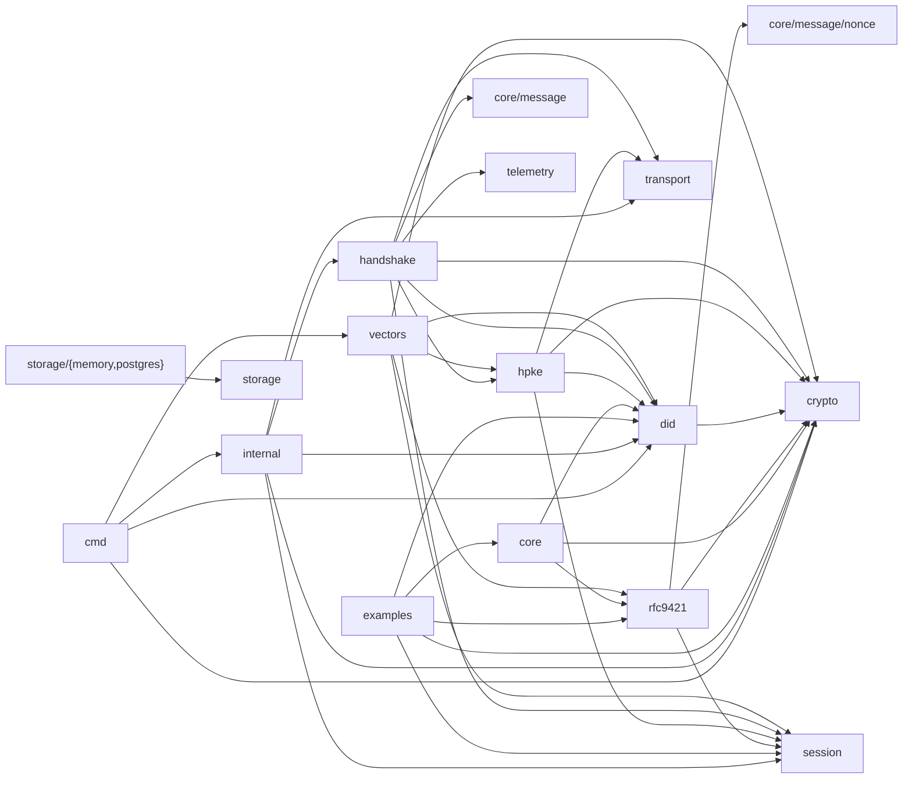

# 02. Code graph of main (AST-based)

Scope: `github.com/sage-x-project/sage` at main `878932d` (2026-09-12), graph generated by `make codegraph` (`tools/codegraph`, 60 packages, 2188 symbols, 1845 edges). This document reads the generated reports and the AST-derived edges; it does not restate them. Generated files: `docs/refactoring/graph/summary.md`, `entrypoints.md`, `delta.md` (committed) and `graph.json` (not committed). Judgements carry [High]/[Mid]/[Low]; everything else is read directly from the graph or the cited source line.

Companion documents: `rs-sage-core` alignment in `docs/refactoring/v2/RS_SAGE_CORE_ALIGNMENT.md`, deprecation policy in `docs/refactoring/v2/VERSION_POLICY.md` §4, removal backlog in `docs/refactoring/BACKLOG.md` (D-06, B-16).

---

## 1. Graph summary

### Packages that matter for the security review

Full table (60 rows, with funcs/types/interfaces/fan-in/fan-out/external deps): `summary.md` "Packages". The subset below adds the exported-symbol count computed from `graph.json` (`exported: true`).

| Package | Files | LOC | Test LOC | Exported symbols | Fan-in | Fan-out |
|---|---|---|---|---|---|---|
| pkg/agent/core | 2 | 317 | 748 | 21 | 1 | 4 |
| pkg/agent/core/message | 1 | 42 | 0 | 3 | 1 | 0 |
| pkg/agent/core/message/nonce | 1 | 147 | 362 | 8 | 1 | 0 |
| pkg/agent/core/rfc9421 | 8 | 2224 | 4257 | 69 | 7 | 4 |
| pkg/agent/crypto | 4 | 671 | 1684 | 37 | 19 | 0 |
| pkg/agent/crypto/keys | 10 | 1496 | 2750 | 79 | 15 | 1 |
| pkg/agent/crypto/jcs | 1 | 225 | 62 | 2 | 3 | 0 |
| pkg/agent/did | 12 | 2865 | 5236 | 120 | 8 | 4 |
| pkg/agent/did/ethereum | 5 | 1064 | 1174 | 30 | 3 | 4 |
| pkg/agent/did/solana | 2 | 817 | 393 | 14 | 1 | 4 |
| pkg/agent/handshake | 5 | 976 | 825 | 37 | 1 | 9 |
| pkg/agent/hpke | 5 | 1509 | 2994 | 38 | 2 | 6 |
| pkg/agent/session | 6 | 1724 | 2519 | 73 | 6 | 0 |
| pkg/agent/transport (+http, +websocket) | 10 | 1569 | 1183 | 56 | 4/1/1 | 0/1/1 |
| pkg/storage (+memory, +postgres) | 9 | 1330 | 54 | 62 | 3/0/0 | 0/1/1 |
| internal (package name `sessioninit`) | 1 | 154 | 0 | 8 | 0 | 5 |
| cmd/sage-crypto, sage-did, sage-vectors, sage-verify | 22 | 4618 | 256 | 0 | 0 | 8/6/2/3 |
| pkg/vectors | 7 | 1503 | 117 | 8 | 1 | 7 |

Two rows of the full table are noise, not module code: `reports/bindings` (an exact copy of `pkg/blockchain/ethereum/contracts/agentcardregistry`, 5554 LOC; every "exact duplicate" in `summary.md` is this pair) and `sdk/typescript/node_modules/flatted/golang/pkg/flatted`. [High] Both should be excluded by the tool's directory filter rather than reasoned around in every review.

`examples/a2a-integration/*` are `//go:build ignore` (e.g. `examples/a2a-integration/04-secure-message/main.go:1`), so the graph does not see them; `entrypoints.md` lists only the `mcp-integration` and `metrics-demo` examples.

### Import graph, collapsed to clusters

Derived from `summary.md` "Package import graph (module-internal)". Clusters: crypto = `crypto`, `crypto/{keys,chain,chain/ethereum,chain/solana,formats,storage,rotation,jcs,vault}`; did = `did`, `did/{ethereum,solana}`, `blockchain/ethereum/contracts/agentcardregistry`; core = `core`, `core/message`, `core/message/nonce`; transport = `transport`, `transport/{http,websocket}`; storage = `pkg/storage/*`; internal = `internal/{app,cli,config}` plus the `sessioninit` file.



Observations, read from the edges:

- `session` has fan-out 0 (imports nothing module-internal) and fan-in 6: `rfc9421`, `hpke`, `handshake`, `internal`, `vectors`, `examples/metrics-demo`. It is the shared replay-guard and record layer; `rfc9421 -> session` exists only for `session.ReplayGuard` (`pkg/agent/core/rfc9421/verifier_http.go:50`).
- `handshake` is the only `pkg/agent` package importing `pkg/telemetry/metrics` (`pkg/agent/handshake/server.go:154-159`) and the only importer of `core/message` (interface `ControlHeader`, `summary.md` "Interfaces").
- `pkg/storage` and its two backends have fan-in 0 from any `pkg/agent` package; `storage.NonceStore` is not an implementer of `session.ReplayGuard` (`summary.md` "Interfaces": `ReplayGuard` implementers are `session.MemoryReplayGuard` and `rfc9421.nonceManagerGuard` only). This is BACKLOG B-16.

### Cycles and layer violations

- Import cycles (SCC > 1): none (`summary.md` "Import cycles").
- Layer violations against `tools/codegraph/layer-baseline.txt`: none; the baseline file lists no tolerated violation (`tools/codegraph/layer-baseline.txt:6-7`). The rule the tool checks is `pkg` must not import `cmd`/`internal`, `internal` must not import `cmd`, nothing imports `examples`/`tests`/`tools` (`summary.md` "Layer violations"); the same rule set is enforced by `depguard` in `.golangci.yml:26-48`. [High] The tool does not check the intra-`pkg` ordering that `.golangci.yml` also encodes (crypto below did/session/transport below hpke/core), so a new `crypto -> did` import would pass `make codegraph-check` and fail only in lint.

### Interfaces and implementers (security-relevant subset)

Full list: `summary.md` "Interfaces and implementers" (34 interfaces).

| Interface | Implementers in module | Note |
|---|---|---|
| `session.ReplayGuard` (1 method) | `session.MemoryReplayGuard`, `rfc9421.nonceManagerGuard` | the one replay contract; see §2a |
| `did.Resolver` (5) | `did.Manager`, `did.MultiChainResolver`, `ethereum.AgentCardClient`, `ethereum.EthereumClient`, `solana.SolanaClient` | HPKE client/server take this |
| `did.ChainClient` (2) | `AgentCardClient`, `EthereumClient`, `SolanaClient` | `Registry` + `Resolver` |
| `did.KeyRegistry`, `did.RegistryV4` | none | `RegistryV4` deprecated alias |
| `hpke.SignatureVerifier` (2) | `CompositeVerifier`, `ECDSAVerifier`, `Ed25519Verifier` | all deprecated, delegate to `keys.VerifySignature` |
| `hpke.KeyIDBinder` (1) | `internal.Creator` (sessioninit) only | the HPKE server's binder has no non-legacy implementer |
| `hpke.CookieSource`, `hpke.CookieVerifier` | none | DoS cookie hooks are unimplemented in-tree |
| `handshake.Events` (5) | `internal.Creator`, `handshake.NoopEvents` | legacy only |
| `core.DIDResolver` (2) | `did.Manager` | |
| `transport.MessageTransport` (1) | `MockTransport`, `http.HTTPTransport`, `websocket.WSTransport` | `Send` only; server side is not an interface |
| `storage.NonceStore` (4) | `memory.nonceStore`, `postgres.nonceStore` | unused by any verifier |

### Hot functions, largest functions, dead code

- Most-called (`summary.md` "Most-called functions"): `crypto.KeyPair.Type` 19, `did.Manager.Configure` 16, `did.NewManager` 16, `did.ParseDID` 15, `rfc9421.NewHTTPVerifier` 12, `did.Manager.ResolveAgent` 10, `rfc9421.ComputeContentDigest` 8, `HTTPVerifier.SignRequest` / `VerifyRequest` 6 each.
- Largest: `handshake.Server.HandleMessage` is the largest function in the module (197 lines, `pkg/agent/handshake/server.go:142`); `hpke.Client.Initialize` 114 lines (`pkg/agent/hpke/client.go:80`); `hpke.Server.HandleMessage` 83 lines (`pkg/agent/hpke/server.go:137`).
- Dead-code candidates in `summary.md` cover unexported symbols only (one hit: `auth0.containsScope`). Exported symbols with zero incoming call/ref edges in `graph.json` that belong to the security surface: `session.Manager.ReplayGuardSeenOnce` (`pkg/agent/session/manager.go:347`), `session.NewNonceCache` and `NonceCache.Seen` (`nonce.go:34`, `:42`), `rfc9421.NewVerifierWithNonceManager` (`verifier.go:62`), `nonce.NewManager` (`pkg/agent/core/message/nonce/manager.go:41`), `did.ValidateA2ACardWithProofAndDID` (`pkg/agent/did/a2a_proof.go:383`), `ethereum.NewEthereumClient` (`pkg/agent/did/ethereum/client.go:32`), `hpke.NewClient` / `hpke.NewServer`, `handshake.NewClient` / `NewServer`, `internal.NewCreator` (tests only, see §2e). [High] The tool should report exported symbols with no non-test callers as a second list; today the deprecated set is invisible to it.
- `delta.md` is stale: `make codegraph` does not pass `-diff` (`Makefile:628`), so the file still shows the 2026-09-11 run (59 packages, 1752 symbols) while `summary.md` shows 60 / 2188.

---

## 2. Request paths of the security features

Notation: `caller (file:line of the call) -> callee (file:line of the definition)`. Dynamic dispatch through an interface is written `-> Iface.Method [-> impl]`.

### 2a. RFC 9421 HTTP message signatures and replay protection

Signing a request:

```
HTTPVerifier.SignRequest                       pkg/agent/core/rfc9421/verifier_http.go:99
  -> Canonicalizer.BuildSignatureBase (:101)   canonicalizer.go:46 -> buildSignatureBase :66
       -> canonicalizeComponent :128, buildSignatureParams :300
  -> HTTPVerifier.sign (:105)                  verifier_http.go:144
       secp256k1: keys.IsSecp256k1Curve + keys.SignSecp256k1Keccak (keys/secp256k1_keccak.go:25, :35)
       P-256:     keys.EncodeRawECDSASignature (keys/ecdsa_encoding.go:96)
       Ed25519:   crypto.Signer.Sign
  -> setSignatureHeaders (:109)                verifier_http.go:138
```

Responses: `SignResponse` (`:118`) -> `BuildResponseSignatureBase` (`canonicalizer.go:56`) -> `sign` -> `setSignatureHeaders`. The middleware `ResponseSigner.Wrap` (`response_signer.go:53`) computes `ComputeContentDigest` (`body_integrity.go:170`) and calls `SignResponse` with a verifier built by `NewHTTPVerifierWithReplayGuard` (`verifier_http.go:82`).

Verifying a request (order is the security property; the replay mark is last so an unverifiable message cannot poison the guard, comment at `verifier_http.go:431-432`):

```
HTTPVerifier.VerifyRequest                     verifier_http.go:189
  -> selectSignature (:197)                    :310   label choice, Signature-Input/Signature parse
  -> checkSignatureTimes (:201)                :353   created/expires, MaxAge, DefaultMaxClockSkew (:47)
  -> checkCovered (:213)                       :379   RequiredComponents, content-digest when body, @authority, nonce
  -> checkSignerIdentity (:216)                :402   keyid vs ExpectedDID/ExpectedKeyID (KeyIDDID :394)
  -> checkAudience (:219)                      :415   ExpectedAuthorities
  -> BodyIntegrityValidator.ValidateContentDigest (:227)  body_integrity.go:71
  -> Canonicalizer.BuildSignatureBase (:232)
  -> HTTPVerifier.verifySignature (:238)       :461
       -> crypto.ValidateAlgorithmForPublicKey (:463)  crypto/algorithm_registry.go:298
       -> ed25519.Verify (:474) | keys.VerifySecp256k1Keccak (:480) | ecdsa.Verify after parseECDSASignature (:491, :622)
  -> HTTPVerifier.checkReplay (:242)           :433
       -> session.ReplayGuard.CheckAndMark(keyid, nonce)  [-> session.MemoryReplayGuard.CheckAndMark replay.go:66]
```

`VerifyResponse` (`:251`) is the same chain against `resp.Header` (`:262-303`) with the `;req` components resolved from the request. The guard is created by `NewHTTPVerifier` (`:71`) -> `NewNonceReplayGuard` (`:57`) -> `session.NewMemoryReplayGuard` (`replay.go:52`); `NewHTTPVerifierWithReplayGuard` (`:82`) injects one. Nonce scope is `keyid` (`:434-436`).

Envelope (`rfc9421.Message`) path:

```
core.NewVerificationService (verification_service.go:43) -> rfc9421.NewVerifier (verifier.go:45)
   -> NewHTTPVerifier + session.NewMemoryReplayGuard(5m) (:48-49)
Verifier.VerifyWithMetadata (:125) -> Verifier.VerifySignature (:137)
Verifier.VerifySignature (:81)
  clock skew (:87-93)
  -> ReplayGuard.Seen peek, scope = message.AgentDID (:99-101, replayScope :78)   fail-fast only
  -> ConstructSignatureBase (:106) :172
  -> verifySignatureWithAlgorithm (:110) :203
  -> ReplayGuard.CheckAndMark (:116)                                              authoritative mark
```

Deprecated replay plumbing, all still compiled:

- `NewVerifierWithNonceManager` (`verifier.go:62`) wraps `nonce.Manager` in `nonceManagerGuard` (`:72`), which drops the scope argument (`:74`): one global nonce space. No caller in the module.
- `core/message/nonce` (`manager.go`) is therefore reachable only through that constructor. `entrypoints.md` nevertheless credits `cmd/sage-vectors` and every MCP example with `core/message/nonce(1)`: the reachability walk expands `ReplayGuard.CheckAndMark` to every implementer, including `nonceManagerGuard`, although nothing constructs it. [High] This is an over-approximation of the tool, not a real path.
- `session.NonceCache` (`nonce.go:27`) is a wrapper over `MemoryReplayGuard` with no callers; `session.Manager.nonceCache` (`manager.go:52`, 10 min) is used only by `ReplayGuardSeenOnce` (`:347`), which has no callers (BACKLOG B-16).

Replay guards in use, by scope: HTTP verifier (keyid), envelope verifier (agent DID), HPKE server (context id, §2b). Session records use a separate sequence window (§2b). [High] Four guard instances with three scopes and one unused; the HTTP and envelope verifiers do not share a store unless the caller injects one.

### 2b. HPKE 1-RTT handshake, key schedule, ack, session, rekey, replay window

Client side (`pkg/agent/hpke/client.go`):

```
Client.Initialize                                     client.go:80
  1  resolvePeerKEM (:82) :196 -> did.Resolver.ResolveKEMKey (:200)
        [-> did.Manager.ResolveKEMKey manager.go:171 -> MultiChainResolver.ResolveKEMKey resolver.go:133
         -> AgentCardClient.ResolveKEMKey chainclient.go:59 -> Resolve :39 -> GetAgentByDID agentcard_client.go:371]
  2  InfoBuilder.BuildInfo / BuildExportContext (:88-89)   [DefaultInfoBuilder common.go:39, :52]
  3  deriveHPKESenderSecrets (:92) :225 -> keys.HPKEDeriveSharedSecretToPeer (:226)   enc, exporter(32)
  4  genEphX25519 (:98) :237
  5  buildAndSignInitMsg (:106) :247 -> KeyPair.Sign(payload) (:264); nonce = uuid (:105)
  5b CookieSource.GetCookie (:115)  optional, no in-tree implementer
  6  sendAndGetSignedMsg (:123) :289 -> transport.MessageTransport.Send (:290)
  7  parseServerSignedResponse (:130) :341 -> jcs.Marshal (:394) canonical bytes of the received envelope
  8  computeE2ESecret (:137) :480   X25519(ephC, ephS), all-zero rejected (:494)
  9  combineSecrets (:144) common.go:81; info/exportCtx hash compare (:150-156)
  10 verifyAckTag (:161) :498 -> MakeAckTag common.go:206 (HMAC-SHA256 over ctx, nonce, kid, transcript binds)
  11 verifySignature (:181) :435 -> did.Resolver.ResolvePublicKey (:446); pin check (:451); did/enc/ephC echo (:465-471)
        -> hpke.verifySignature common.go:135 -> NewCompositeVerifier (:153) -> keys.VerifySignature (signature_verifier.go:80, :104)
  12 createAndBindSession (:187) :507
        -> session.Manager.EnsureSessionFromExporterWithRole(combined, "sage/hpke+e2e v1", initiator=true) (:508) manager.go:82
        -> session.Manager.BindKeyID(kid, sid) (:518) manager.go:233
```

Server side (`pkg/agent/hpke/server.go`):

```
NewServer :106   ReplayGuard default session.NewMemoryReplayGuard(10m) (:117), MaxSkew default 2m (:114)
Server.HandleMessage :137
  1  task check (:143)
  2  verifySender (:147) :222 -> did.Resolver.ResolvePublicKey (:230) -> hpke.verifySignature(msg.Payload, msg.Signature) (:237)
  3  ParseHPKEInitPayloadWithEphCFromJSON (:153) common.go:246
  3b CookieVerifier.Verify (:161)  optional
  4  validateInitEnvelope (:167) :244
        initDid == signing DID (:250) | respDid == s.DID (:255) | ts within MaxSkew (:258)
        ReplayGuard.CheckAndMark(ctxID, nonce) (:261) | info / exportCtx recomputed and compared (:264-270) | suite whitelist (:273)
        every failure -> reject (:69) -> ErrInitRejected (reason only to the logger)
  5  reproduceExporter (:172) :280 -> keys.HPKEOpenSharedSecretWithPriv (:284)
  6  generateSrvE2E (:178) :298
  7  combineSecrets (:185)
  8  createSessionAndBindKid (:193) :320
        -> EnsureSessionFromExporterWithRole(initiator=false) (:321) -> KeyIDBinder.IssueKeyID (:332) -> BindKeyID (:336)
  9  MakeAckTag (:200)
  10 buildAndSignResponse (:218) :341 -> jcs.Marshal (:368) -> KeyPair.Sign (:372)
```

Session establishment and key schedule (`pkg/agent/session`):

```
Manager.EnsureSessionFromExporterWithRole   manager.go:82
  -> ComputeSessionIDFromSeed (:94)          session.go:351   sid = b64url(SHA256(label || seed)[:16])
  -> NewSecureSessionFromExporterWithRole (:112)  session.go:248
       -> deriveDirectionalKeys (:262) :391  HKDF(seed, salt=sid, "sage-directional-keys-v1") -> c2s/s2c enc+sign; role picks out/in (:418-426)
       -> initAEADs (:265) :433              ChaCha20-Poly1305 per direction
       -> deriveKeys (:272) :365             HKDF(..., "sage-session-keys-v1") for the legacy single-key API
```

Record path, rekey and replay window:

```
EncryptOutbound :782 -> EncryptWithAADOutbound :793 -> seal :885
  seq = sendSeq++ (:886-889)
  -> aeadForSeq :845 -> generation :835 (= seq / RekeyInterval, default 256 session.go:134)
       gen > 0: HKDF(seed, salt=sid, "sage-session-rekey-v1" || direction || be64(gen)) (:857-862); cache per (direction, gen), drop gen+1 < current (:874-877)
  random 12-byte nonce (:896); AAD = be64(seq) || callerAAD (boundAAD :933); record = seq || nonce || ct

DecryptInbound :788 -> DecryptWithAADInbound :806 -> open :908
  -> replayWindow.check (:916) :164   ErrStaleMessage beyond 1024 (:131), ErrReplayedMessage on a set bit
  -> aeadForSeq (:919)
  -> aead.Open (:924)
  -> replayWindow.mark (:928) :179    only after successful decryption
```

[High] The handshake nonce guard (`Server.nonces`), the session sequence window and `Manager.nonceCache` are three independent mechanisms; only the first two are on a live path.

### 2c. Deprecated four-phase handshake and `sessioninit`

`pkg/agent/handshake` is marked deprecated at `pkg/agent/handshake/doc.go:22`. The adapter lives in `internal/session_creator.go` (package clause `sessioninit`, `:24`, directory `internal/`), so it is imported as `sessioninit "github.com/sage-x-project/sage/internal"` (`pkg/agent/handshake/server_test.go:37`); `internal/sessioninit/` holds only a README. The graph lists it as package `internal`.

```
handshake.Server.HandleMessage   server.go:142  -> parsePhase utils.go:35
  case Invitation (:164): did.Resolver.ResolvePublicKey via singleflight (:174-195), savePeer (:429), Events.OnInvitation (:217)
  case Request (:221):    keys.DecryptWithEd25519Peer (:233), Events.AskEphemeral (:266) [-> internal.Creator.AskEphemeral :108 -> keys.GenerateX25519KeyPair]
                          Events.OnRequest (:280), sendResponseToPeer (:342) -> keys.EncryptWithEd25519Peer (:357), KeyPair.Sign
  case Complete (:291):   Events.OnComplete (:308 / :320) [-> internal.Creator.OnComplete :79
                             -> X25519KeyPair.DeriveSharedSecret (:87)
                             -> session.Manager.EnsureSessionWithParams (:93) manager.go:155
                                  -> DeriveSessionSeed session.go:326 (label "a2a/handshake v1", salt = SHA256(label||ctx||sorted ephs), HKDF-Extract)
                                  -> ComputeSessionIDFromSeed :351 -> NewSecureSessionWithParams :313]
                          hpke.KeyIDBinder.IssueKeyID [-> internal.Creator.IssueKeyID :130 -> Manager.BindKeyID]
handshake.Client: Invitation :48, Request :90, Response :138, Complete :186 (each: KeyPair.Sign, transport.MessageTransport.Send;
                  Request/Response wrap the body with keys.EncryptWithEd25519Peer client.go:105, :153)
```

What still calls it: nothing in `cmd/`, `examples/`, `pkg/` non-test code. Incoming edges to `handshake.NewServer`, `NewClient` and `internal.NewCreator` in `graph.json`: zero. Non-graph evidence: `pkg/agent/handshake/server_test.go` is the only file importing the package (`tests/integration/basic_test.go:30` imports `hpke`, not `handshake`); `pkg/agent/transport/http/server.go:49` and `websocket/server.go:49` mention `handshakeServer.HandleMessage` in a comment only.

What it duplicates:

| Legacy element | Duplicate of | Only other user |
|---|---|---|
| `EnsureSessionWithParams` / `DeriveSessionSeed` / `NewSecureSessionWithParams` (`manager.go:155`, `session.go:326`, `:313`) | `EnsureSessionFromExporterWithRole` path (§2b) | `pkg/vectors/session.go:55`, `:198` (spec 05 §1 vectors) |
| `handshake.Server.verifySignature` (`server.go:382`) | `hpke.verifySignature` (`common.go:135`) | none |
| `keys.EncryptWithEd25519Peer` / `DecryptWithEd25519Peer` (`keys/x25519.go:178`, `:234`) | HPKE seal/open | none outside handshake |
| `core/message.ControlHeader` (`pkg/agent/core/message/types.go`) | none; implemented only by the four handshake message types | none |
| `hpke.KeyIDBinder` implementer `internal.Creator` | HPKE server generates `kid-<uuid>` itself (`server.go:329`) | none |

The server never reads `Nonce` or `Timestamp` of incoming handshake messages (no such field access in `server.go`; the `doc.go:24-25` statement is accurate). [High] Removing the package (D-06) also removes `core/message`, the `EncryptWithEd25519Peer` pair, the `Params`-based session constructors unless the session vectors are kept, and the only `KeyIDBinder` implementer.

### 2d. DID resolution and A2A card verification

Wiring: `internal/app.RegisterDefaults` -> `ethereum.Register` (`pkg/agent/did/ethereum/client.go:22`) -> `did.RegisterClientCreator(ChainEthereum, NewAgentCardClient)` (`:24`); `did.Manager.Configure` (`manager.go:54`) -> `ParseChain` (`:313`) -> `ClientCreatorFor` (`factory.go:59`) -> `setClientUnlocked` (`:84`) -> `MultiChainResolver.AddResolver` (`resolver.go:76`).

```
did.Manager.Resolve :166 -> ResolveAgent :148 -> requireClient :207 -> MultiChainResolver.Resolve resolver.go:87
  -> extractChainFromDID :198   (on failure: tries ethereum then solana in order, :90-101)
  -> did.Resolver.Resolve [-> AgentCardClient.Resolve chainclient.go:39 -> GetAgentByDID agentcard_client.go:371]
       -> AgentCardRegistryCaller.GetAgentByDID (:373)  bindings AgentCardRegistry.go:509
       -> owner/did empty -> did.ErrDIDNotFound (:378-380)
       -> per keyHash: AgentCardRegistryCaller.GetKey (:407) bindings :602; fetch error skips the key silently (:408-410)
       -> applyKeyPolicy (:421) key_policy.go:75 -> selectAgentKeys :34
            PublicKey = first verified ECDSA, else first verified Ed25519; KEM = first verified 32-byte X25519;
            a verified key that does not parse is an error (:53-55, :63-65)
ResolvePublicKey chainclient.go:44 -> Resolve; !IsActive -> ErrInactiveAgent (:50); PublicKey nil -> ErrNoSigningKey (:53)
ResolveKEMKey    chainclient.go:59 -> Resolve; !IsActive -> ErrInactiveAgent; returns PublicKEMKey (raw bytes or nil)
```

A2A card verification (both entry points are called from `sage-did card validate`, `cmd/sage-did/card.go:230`):

```
did.ValidateA2ACardWithDID     a2a.go:271
  -> did.Resolver.Resolve (:283) -> AgentMetadata.Normalized (:289) types_v4.go:154
  -> per card key: decodeA2APublicKey (:293) a2a_proof.go:276; hex-compare with on-chain Keys, must be Verified (:300-310)
  -> primary endpoint == on-chain endpoint (:314-320) -> IsActive (:325)

did.VerifyA2ACardProofWithDID  a2a_proof.go:218
  -> ParseDID (:227) -> verificationMethod must start with "<did>#" (:230)
  -> findA2APublicKey (:234) :265 -> decodeA2APublicKey (:238)
  -> did.Resolver.Resolve (:243) -> IsActive (:247) -> key must be a Verified on-chain key (:250-259)
  -> verifyA2ACardProofWithKey (:262) :297
       base58 proofValue (:300) -> a2aCardCanonicalBytes (:306) :77 (JCS, proof removed)
       Ed25519Signature2020 -> ed25519.Verify (:315) | EcdsaSecp256k1Signature2019 -> keys.VerifySecp256k1Keccak
```

`ValidateA2ACardWithProofAndDID` (`a2a_proof.go:383`) chains both and has no callers. Offline `VerifyA2ACardProof` (`:191`) is what `pkg/vectors/did.go:174` runs. Key proof of possession: `VerifyKeyProofOfPossession` (`key_proof.go:97`) -> `createPoPChallenge` (`:218`), SHA-256, Ed25519 or secp256k1; called from `sage-did key verify-pop` (`cmd/sage-did/key.go:536`) and `pkg/vectors/did.go:95`, `:127`.

[Mid] `GetAgentByDID` skipping a key whose `GetKey` call fails (`agentcard_client.go:408-410`) can silently downgrade the signing key selection under RPC errors; the malformed-key rule in `selectAgentKeys` guards data corruption but not transport failure.

### 2e. Reachability from binaries versus tests and examples

Computed by walking call/ref edges from each `cmd`/`examples` package in `graph.json` with interface dispatch expanded (same rule as `entrypoints.md`).

| Path | Binaries | Examples | Tests only |
|---|---|---|---|
| `HTTPVerifier.SignRequest` / `VerifyRequest` / `VerifyResponse` (§2a) | `sage-vectors` (`pkg/vectors/rfc9421.go:162`, `:214`, `:225`, `:267`) | mcp-integration basic-demo, basic-tool, client, simple-standalone, secure-chat | |
| `session.MemoryReplayGuard.CheckAndMark` | `sage-vectors` (via the HTTP verifier) | same five examples | |
| envelope `Verifier.VerifySignature`, `core.VerificationService` | none | basic-tool constructs `core.New()` (`calculator_tool.go:55`) but no call reaches `VerifySignature` | `pkg/agent/core`, `rfc9421` tests |
| `nonce.Manager`, `NewVerifierWithNonceManager`, `session.NonceCache` | none (dispatch artefact, §2a) | none | `nonce` tests |
| `hpke.Client.Initialize`, `hpke.Server.HandleMessage`, `Manager.EnsureSessionFromExporterWithRole` (§2b) | none | none | `pkg/agent/hpke/{e2e,security,server}_test.go`, `tests/integration/basic_test.go` |
| HPKE primitives `MakeAckTag`, `DeriveTrafficKeys`, `CombineSecrets`, `DefaultInfo`, `DefaultExportContext` | `sage-vectors` (`pkg/vectors/hpke.go:40-152`) | none | |
| session record path (`EncryptOutbound`, `aeadForSeq`, `replayWindow`) | `sage-vectors` (`pkg/vectors/session.go:117`, `:230`) | metrics-demo | |
| `handshake.*`, `internal.Creator` (§2c) | none | none | `pkg/agent/handshake/server_test.go` only |
| `did.Manager.Resolve` -> `AgentCardClient.GetAgentByDID` -> `applyKeyPolicy` (§2d) | `sage-did` resolve, verify, list, debug, card *, key * (`entrypoints.md` "CLI commands") | basic-tool | |
| `ValidateA2ACardWithDID`, `VerifyA2ACardProofWithDID` | `sage-did card validate` | none | |
| `VerifyKeyProofOfPossession` | `sage-did key verify-pop`, `sage-vectors` | none | |
| `keys.VerifySignature` | `sage-crypto verify` (`cmd/sage-crypto/verify.go:258`) | none | |

[High] No binary or in-tree example performs an HPKE handshake or opens a session over a transport; the only live end-to-end evidence is the test suite. `sage-gateway` (separate repository) is the first consumer; the review of §2b therefore cannot rely on any `cmd/` path.

---

## 3. Comparison with the Rust core

`rs-sage-core` 0.3.0 (main `206bbbb`), `src/`: `core`, `crypto`, `error`, `formats`, `jcs`, `rfc9421`, `did`, `hpke`, `session`, `validation`, `ffi`, `wasm` (`src/lib.rs:10-26`). All 26 sage-spec vectors pass in both CIs; live interoperability is open (`RS_SAGE_CORE_ALIGNMENT.md` §1a step 9, BACKLOG F-03b). Spec chapters: `sage-spec/spec/00-08` at `a34dd49`.

| Rust module (files) | Mirrors Go | Spec |
|---|---|---|
| `jcs/mod.rs` (`canonicalize`, `parse`, `to_string`, `number_to_string`) | `crypto/jcs` (`Marshal` `jcs.go:45`, `Canonicalize`) | 02 |
| `crypto/{keys,ed25519,secp256k1,p256,x25519,signature,algorithm_registry}.rs`, `storage/{file,memory}.rs`, `rotation.rs` | `crypto` + `crypto/keys` (`KeyPair`, `KeyID`, `EthereumAddress`, `VerifySignature`, `HPKE*`), `crypto/storage`, `crypto/rotation` | 01 |
| `crypto/manager.rs`, `crypto/multi_key.rs` | none: Go removed `crypto.Manager` (CHANGELOG "Unreleased", D-02) | none |
| `formats/mod.rs` | `crypto/formats` (JWK, PEM) | 01 §4 |
| `rfc9421/canonicalize.rs` (`content_digest`, `canonicalize_request/response`, `build_signature_base`) | `rfc9421.Canonicalizer`, `ComputeContentDigest`, `BodyIntegrityValidator` | 03 §1, §2 |
| `rfc9421/components.rs`, `dictionary.rs` (`SignatureParams`, `key_id_did`, `parse_signature_input`, `parse_signature_header`) | `SignatureInputParams`, `KeyIDDID`, `ParseSignatureInput`, `ParseSignature` (`parser.go:40`, `:73`) | 03 §1, §3 |
| `rfc9421/signer.rs` (`HttpSigner.sign_request/sign_response`) | `HTTPVerifier.SignRequest/SignResponse`, `ResponseSigner` | 03 §3, §4 |
| `rfc9421/verifier.rs` (`HttpVerifier.verify_request_with/verify_response`, `VerifyOptions.strict_request/strict_response`) | `HTTPVerifier.VerifyRequest/VerifyResponse`, `StrictHTTPVerificationOptions`, `StrictHTTPResponseVerificationOptions` | 03 §5 |
| `rfc9421/replay.rs` (`ReplayGuard`, `MemoryReplayGuard`) | `session.ReplayGuard`, `session.MemoryReplayGuard` (Go keeps it in `session`, Rust in `rfc9421`) | 03 §5 |
| `hpke/common.rs` (`kem_seal`, `kem_open`, `combine_secrets`, `derive_traffic_keys`, `make_ack_tag`, `verify_ack_tag`) | `keys.HPKEDeriveSharedSecretToPeer`, `keys.HPKEOpenSharedSecretWithPriv`, `hpke.CombineSecrets`, `DeriveTrafficKeys`, `MakeAckTag`, `verifyAckTag` | 04 §1-§5 |
| `hpke/client.rs` (`HpkeClient.initialize` + `complete`, transport-free) | `hpke.Client.Initialize` (single method incl. transport) | 04 §6 |
| `hpke/server.rs` (`HpkeServer.handle_init(_detailed)`) | `hpke.Server.HandleMessage` | 04 §6 |
| `hpke/nonce_store.rs` (`NonceStore`, `RateLimitConfig`) | none by name: Go replaced its `nonceStore` with `session.MemoryReplayGuard` (CHANGELOG) | 04 §6 |
| `hpke/types.rs` (`InfoBuilder`, `KeyIDBinder`, `CookieVerifier`, `CookieSource`, `HpkeInitPayload`, `ServerSigEnvelope`, `DIDResolver`) | `hpke/types.go`, `HPKEInitPayload`, `serverSigEnvelope`; `did.Resolver` | 04 §6, §7 |
| `hpke/resolver.rs` (`MemoryKeyResolver`, `DidDocumentKemResolver`) | `did.Manager` / `MultiChainResolver` as `did.Resolver` (Rust has no chain-backed resolver) | 06 §3 |
| `session/derive.rs` (`derive_session_seed`, `compute_session_id`) | `session.DeriveSessionSeed`, `ComputeSessionIDFromSeed` | 05 §1 |
| `session/secure_session.rs` (`from_exporter_with_role`, `encrypt_with_aad_outbound` ..., replay window, `INFO_REKEY`) | `NewSecureSessionFromExporterWithRole`, `EncryptWithAADOutbound` ..., `replayWindow`, `aeadForSeq` | 05 §2-§5 |
| `session/manager.rs` (`SessionManager.ensure_session_from_exporter_with_role`, `bind_key_id`, `get_by_key_id`) | `session.Manager` same names | 05 §7 |
| `session/types.rs` (`Session` trait, `SessionConfig`) | deprecated `session.Session`, `session.Config` | 05 |
| `did/mod.rs` (`parse_chain`, `generate_did`, `parse_did`, `validate_did`) | `did.ParseChain`, `GenerateDID`, `ParseDID` (`manager.go:313`, `:306`, `:327`) | 06 §1, §2 |
| `did/proof.rs` (`pop_challenge`, `generate_key_pop`, `verify_key_pop`) | `createPoPChallenge`, `GenerateKeyProofOfPossession`, `VerifyKeyProofOfPossession` | 06 §4 |
| `did/a2a.rs` (`A2AAgentCard.sign/validate/verify_proof/canonical_bytes`) | `GenerateA2ACardWithProof`, `ValidateA2ACard`, `VerifyA2ACardProof`, `a2aCardCanonicalBytes` | 07 |
| `did/resolver.rs` (`MemoryDIDResolver`, `MockDIDResolver`, empty `BlockchainDIDResolver`) | `did/ethereum.AgentCardClient`, `did/solana.SolanaClient` (on-chain only in Go) | 06 §3 |
| `core/message.rs`, `core/verification_service.rs` | `rfc9421.Message`/`MessageBuilder`, `core.VerificationService` (Rust nonce tracker is commented out, `verification_service.rs:109-116`) | none |
| `validation/*` (size and format limits) | none | none |
| `ffi/*` (54 `#[no_mangle]` functions: HTTP signer/verifier, keypair, JCS, DID, PoP, A2A verify, session records), `wasm/*` | none: Go `lib/` was removed (CHANGELOG "Removed") | none |

Not in Rust: `transport`, `did/ethereum` chain client, `handshake` (dropped, F-03), `pkg/storage`, `telemetry`, `health`, `oidc`. Not in Go: `validation`, `ffi`, `wasm`. Divergence detail by area (secp256k1 encoding, header formats, HPKE labels, record format) is the table in `RS_SAGE_CORE_ALIGNMENT.md` §2; [Mid] that table describes the state before PRs #23-#25 and should be re-derived against `206bbbb` before it is cited as current.

---

## 4. Exported symbols marked `Deprecated:` in `pkg/`

Policy: an exported symbol is removed two minor releases after the release that marked it (`VERSION_POLICY.md` §4 rule 3). Every marker below is unreleased on main and will ship in 1.6.0 (CHANGELOG "[Unreleased]"), so the earliest removal under the policy is 1.8.0. Three in-tree statements disagree with that: BACKLOG D-06 says "deprecate v1.6, remove v1.7" for `handshake`; `pkg/agent/hpke/signature_verifier.go:38` says the verifier types "remain for one release"; `pkg/agent/crypto/wrappers.go:46-47` says "two minor releases after v1.6.0". [High] The policy document wins by its own rule; the two shorter horizons need correcting or an explicit exception.

| Symbol(s) | Location | Replacement | Earliest removal |
|---|---|---|---|
| `SetKeyGenerators`, `SetStorageConstructors`, `SetFormatConstructors` | `pkg/agent/crypto/wrappers.go:48`, `:57`, `:65` | call `keys.Generate*`, `storage.NewMemoryKeyStorage`, `formats.New*` | 1.8.0 |
| `NewEd25519KeyPair`, `NewSecp256k1KeyPair`, `NewP256KeyPair`, `GenerateEd25519KeyPair`, `GenerateSecp256k1KeyPair`, `GenerateP256KeyPair` | `wrappers.go:82-107` | `keys.Generate*KeyPair` | 1.8.0 |
| `NewMemoryKeyStorage`, `NewJWKExporter`, `NewPEMExporter`, `NewJWKImporter`, `NewPEMImporter` | `wrappers.go:113-153` | `storage.NewMemoryKeyStorage`, `formats.New*` | 1.8.0 |
| `rfc9421.NewVerifierWithNonceManager` | `pkg/agent/core/rfc9421/verifier.go:62` | `NewVerifierWithReplayGuard` | 1.8.0 (takes `core/message/nonce` with it, D-06) |
| `rfc9421.NonceReplayGuard` (alias) | `verifier_http.go:52` | `session.MemoryReplayGuard` | 1.8.0 |
| `did.GetRecommendedKeyType`, `ValidateKeyTypeForChain`, `GetRFC9421Algorithm` | `pkg/agent/did/factory.go:79`, `:90`, `:101` | `chain.*` in `pkg/agent/crypto/chain` | 1.8.0 |
| `did.RegistryV4` | `pkg/agent/did/registry.go:59` | `Registry` + `KeyRegistry` | 1.8.0 |
| `did.AgentMetadataV4` (alias), `AgentMetadata.ToAgentMetadata`, `did.FromAgentMetadata` | `pkg/agent/did/types_v4.go:72`, `:195`, `:202` | `AgentMetadata`, `Normalized()` | 1.8.0 |
| `ethereum.EthereumClient`, `NewEthereumClient` | `pkg/agent/did/ethereum/client.go:13`, `:31` | `AgentCardClient`, `NewAgentCardClient` | 1.8.0 |
| package `handshake` (37 exported symbols) and `internal` `sessioninit` | `pkg/agent/handshake/doc.go:22`, `internal/session_creator.go:22` | `pkg/agent/hpke` | 1.8.0 by policy; 1.7.0 per D-06 |
| `hpke.SignatureVerifier`, `ECDSAVerifier`, `Ed25519Verifier`, `CompositeVerifier`, `New*Verifier` | `pkg/agent/hpke/signature_verifier.go:37` | `keys.VerifySignature` | 1.8.0 by policy; 1.7.0 per comment |
| `session.Session` | `pkg/agent/session/types.go:29` | `*SecureSession` | 1.8.0 |
| `session.NonceCache`, `NewNonceCache`, `NonceCache.Seen`, `NonceCache.DeleteKey` | `pkg/agent/session/nonce.go:25`, `:33`, `:41`, `:51` | `MemoryReplayGuard` | 1.8.0 |
| `agentcardregistry.AgentCardRegistryABI`, `AgentCardStorageABI`, `IRegistryHookABI` | `pkg/blockchain/ethereum/contracts/agentcardregistry/{AgentCardRegistry.go:89, AgentCardStorage.go:42, IRegistryHook.go:42}` | `*MetaData.ABI` | abigen-generated; regenerated with `make bindings`, not subject to the policy |

Marked deprecated in prose but without a `Deprecated:` marker in code: package `core/message/nonce` (no marker in `nonce/manager.go`; BACKLOG D-06 keeps it "behind" `NewVerifierWithNonceManager`) and `core/message` (`ControlHeader`). [High] Adding the marker to `nonce.NewManager` and `message.ControlHeader` makes `staticcheck` report the remaining test uses and closes the gap between CHANGELOG and code. The CHANGELOG "Unreleased" section also lists the mock `ethereum.Resolver`/`DIDCache` and `chain/ethereum.EnhancedProvider` as deprecated; neither symbol exists on main any more (no match in `pkg/`), so those entries belong under "Removed".

---

## How to regenerate

```bash
make codegraph            # tools/codegraph -> docs/refactoring/graph/{summary.md,entrypoints.md,graph.json}; delta.md needs -diff
make codegraph-check      # same tool with -layer-baseline tools/codegraph/layer-baseline.txt, exit 2 on a new violation
cd tools/codegraph && go run . -dir ../.. -out ../../docs/refactoring/graph -diff /path/to/previous/graph.json   # refresh delta.md
```

The per-function edge listings and the reachability table in §2 were derived from `graph.json` (`edges[]` with `kind` in call/ref/implements; dispatch expanded interface method -> every implementer's method). Re-run after any change to `pkg/agent/{core,hpke,session,handshake,did}` and diff §2e; the Rust column of §3 is against `rs-sage-core` `206bbbb` and `sage-spec` `a34dd49`.

## Facts vs Opinions

Facts (read from generated reports, source lines cited above, or `git`):

- 60 packages, 2188 symbols, 1845 edges, no import cycle, no layer violation, empty baseline.
- `hpke.Client.Initialize`, `hpke.Server.HandleMessage`, `session.Manager.EnsureSessionFromExporterWithRole`, all of `handshake` and `internal.Creator` have no caller in any `cmd/` or `examples/` package; their callers are test files.
- `core/message/nonce` is constructed only by `rfc9421.NewVerifierWithNonceManager`, which has no caller; `session.Manager.ReplayGuardSeenOnce`, `session.NonceCache`, `did.ValidateA2ACardWithProofAndDID`, `ethereum.NewEthereumClient` have no callers.
- The RFC 9421 verifiers mark the nonce after signature verification; the HPKE server marks it before the KEM operation but after the sender signature check; the session record path checks the window before and marks after AEAD open.
- `sessioninit` is the package name of `internal/session_creator.go`; `internal/sessioninit/` contains only a README.
- `delta.md` was last written 2026-09-11 and reflects a 59-package graph.
- `VERSION_POLICY.md` §4 rule 3 (two minor releases) conflicts with BACKLOG D-06 ("remove v1.7") and `signature_verifier.go:38` ("one release").
- `examples/a2a-integration/*` carry `//go:build ignore` and are absent from the graph.

Opinions:

- [High] The `core/message/nonce(1)` entries in `entrypoints.md` are a dispatch over-approximation and should not be read as a live path; the tool should skip implementers that are never constructed.
- [High] Because no binary drives the HPKE handshake, the security review of §2b has to be done on `pkg/agent/hpke/*_test.go`, `tests/integration/basic_test.go` and `sage-gateway`, not on `cmd/`.
- [High] Deleting `handshake` (D-06) drags `core/message`, `keys.{Encrypt,Decrypt}WithEd25519Peer`, the `Params`-based session constructors and the only `KeyIDBinder` implementer; decide first whether the session vectors keep `DeriveSessionSeed`.
- [High] The codegraph tool should exclude `reports/` and `node_modules`, report exported symbols without non-test callers, and check the intra-`pkg` cluster order that `depguard` already enforces.
- [Mid] `GetAgentByDID` silently skipping keys on RPC error (`agentcard_client.go:408-410`) is a reviewable weakness of the resolution path.
- [Mid] The `RS_SAGE_CORE_ALIGNMENT.md` §2 divergence table predates the Rust PRs that closed most rows and should be regenerated before being cited.
