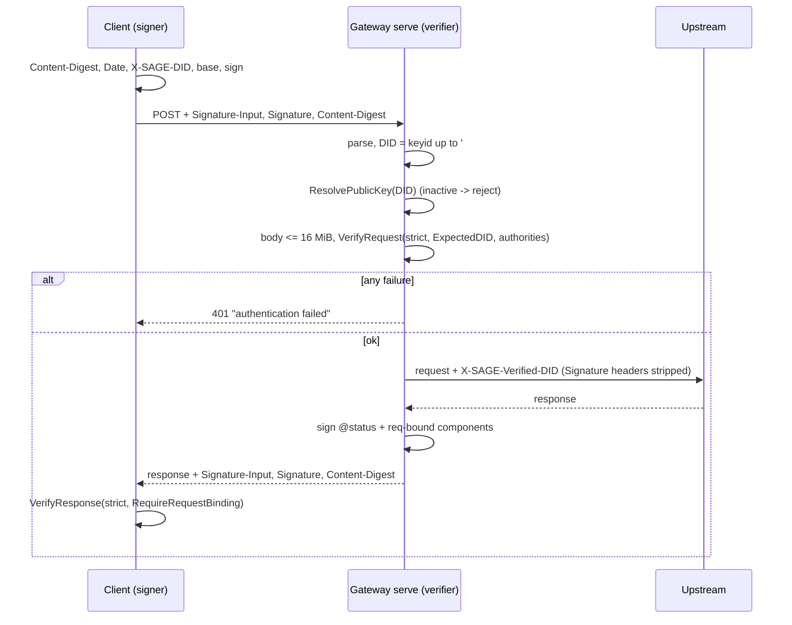
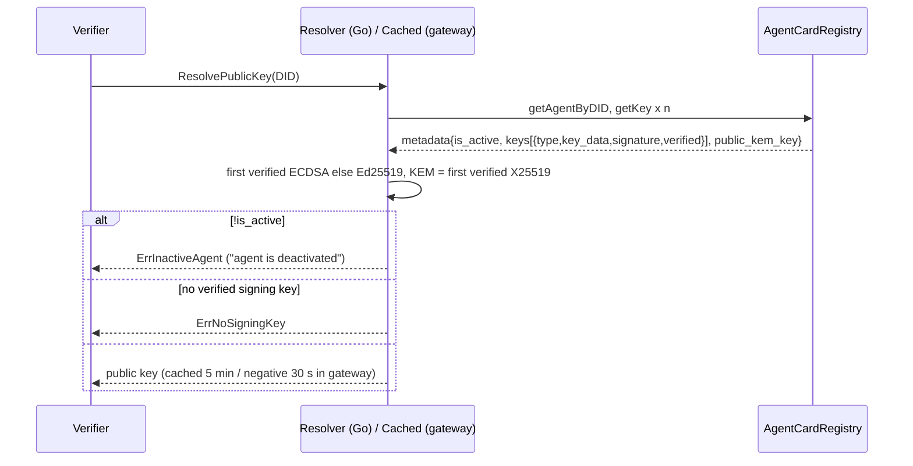
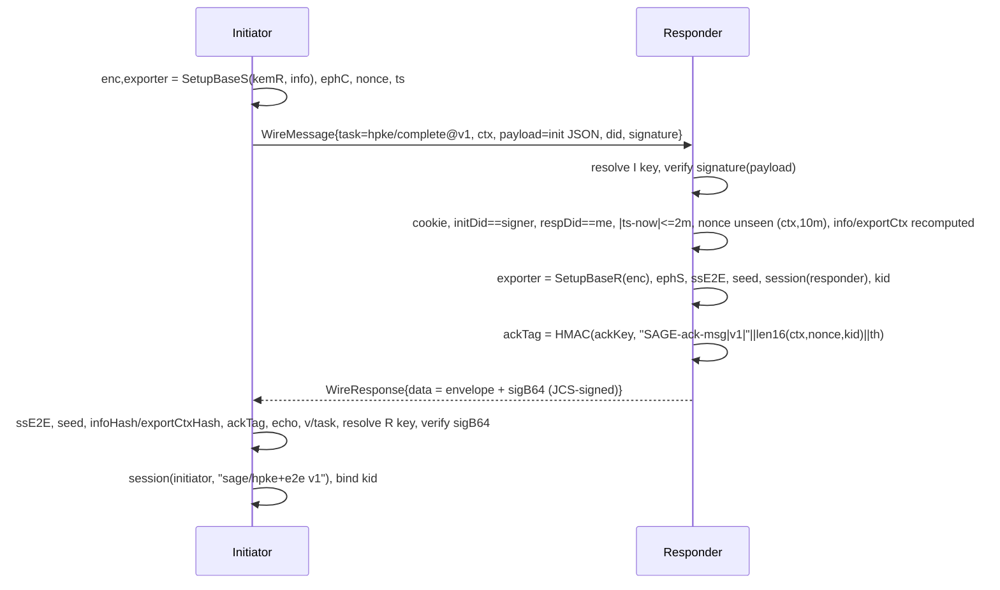
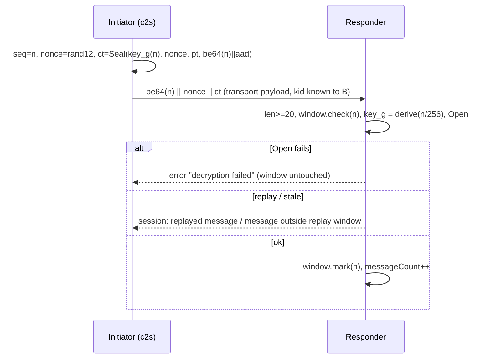
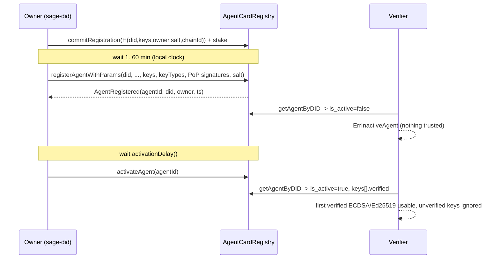
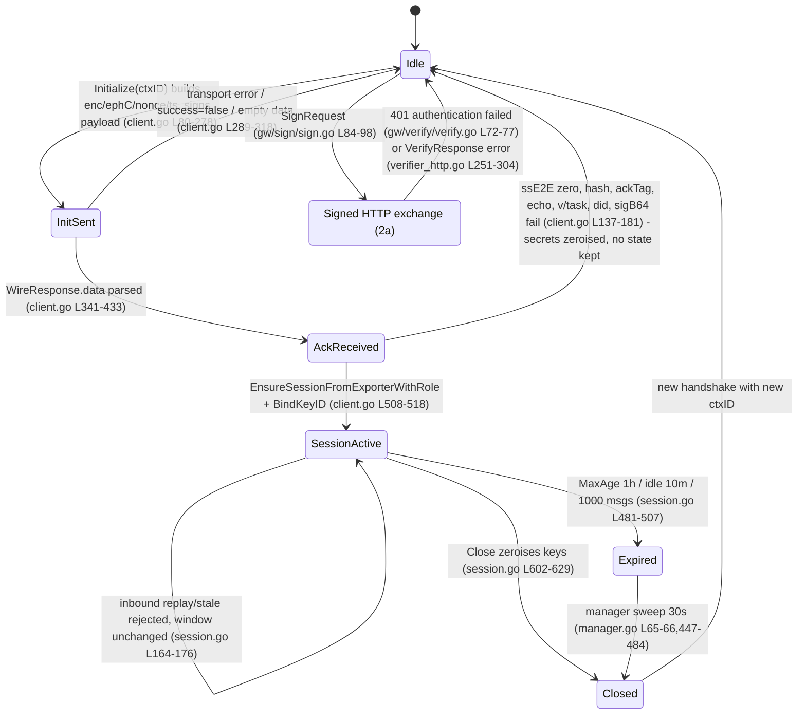
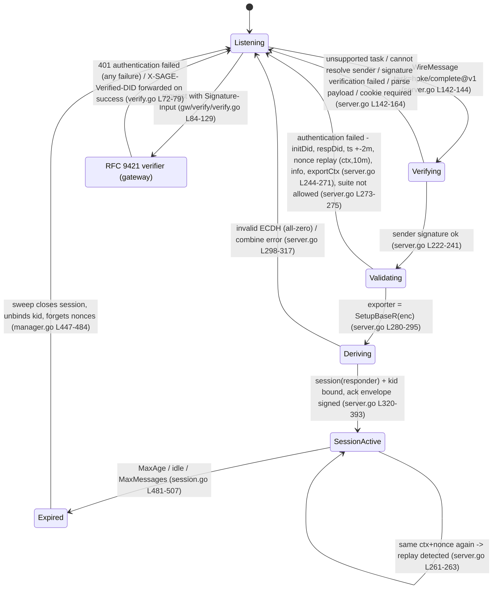

# 09. SAGE protocol flows as implemented (protocol overview)

Status: review document, 2026-09-12. No code was changed.
Sources (commit at survey time): `sage` 878932d (Go reference core),
`sage-spec` a34dd49 (spec 1.0.0-draft.1), `rs-sage-core` 206bbbb (crate
0.3.0), `sage-gateway` 4e72668, `sage-inspector` 05b890d.

Conventions. `spec NN §k` cites `sage-spec/spec/NN-*.md` section k;
`sage/...:L` cites a file and line in the Go core; `rs/...:L` is
`rs-sage-core/src/...`; `gw/...` is `sage-gateway/pkg/gateway/...`;
`insp/...` is `sage-inspector/pkg/inspect/...`. Confidence: [High] read
directly in the cited file; [Mid] inferred from two cited places; [Low]
not verified by execution. Every statement below is [High] unless marked.
"Silent" means sage-spec does not state the behaviour.

---

## 1. Terminology, roles, key material, layering

### Roles

| Role | Meaning here | Where |
|---|---|---|
| Agent | A SAGE peer; "initiator" starts a handshake, "responder" answers (spec 00 §2). In HTTP terms the initiator is the client. | spec 00 §2 |
| DID | `did:sage:<chain>:<identifier>` naming an agent (spec 06 §1). Carried in RFC 9421 `keyid`, `X-SAGE-DID`, `WireMessage.did`, HPKE `initDid`/`respDid`. | spec 03 §3, 08 §3, 04 §6 |
| Registry | On-chain `AgentCardRegistry` (sage-contracts, out of scope of the spec, spec 00 §1). Go client: `sage/pkg/agent/did/ethereum/agentcard_client.go`. | spec 06 §3 |
| Resolver | Turns a DID into `AgentMetadata` and a signing/KEM key: `sage/pkg/agent/did/resolver.go:38-52` (interface), `ethereum/chainclient.go:39-66`. No cache in the Go core; the gateway adds one (`gw/resolve/resolve.go:106-152`). | spec 06 §3 |
| Gateway | Verifying reverse proxy (`serve`) and signing forward proxy (`client`); RFC 9421 only, no HPKE termination (`sage-gateway/README.md:3-16,57-59`). Conformance level "Verifier" (spec 00 §4). | spec 00 §4 |
| Inspector | Runs the spec vectors against the Go core and explains captured requests, responses and cards (`sage-inspector/README.md`, `insp/http.go`, `insp/card.go`, `insp/vectors.go`). | spec 00 §4 |

### Key material per role

| Role | Key | Type / encoding | Used for | Source |
|---|---|---|---|---|
| Agent (any) | signing key | Ed25519 (32 B pub), secp256k1 (65 B SEC1, 64 B on chain), P-256 optional | RFC 9421 signatures, `WireMessage.signature`, HPKE envelope `sigB64`, A2A card proof, key PoP | spec 01 §1-2; `sage/pkg/agent/did/utils.go:46-55` |
| Agent (responder) | static KEM key | X25519 32 B, registry `public_kem_key` | HPKE `SetupBaseR` | spec 04 §3; `sage/pkg/agent/hpke/server.go:280-295` |
| Agent (both) | ephemeral X25519 `ephC`/`ephS` | 32 B, per handshake | `ssE2E` | spec 04 §3; `client.go:243`, `server.go:298-317` |
| Agent (both) | session keys | derived (§2d) | records | spec 05 §2 |
| Registry owner | Ethereum EOA | secp256k1 | commit/register/activate transactions | `agentcard_client.go:113-270` |
| Gateway `serve` | optional response-signing key | as agent | `;req`-bound response signatures | `gw/verify/verify.go:69-71` |
| Inspector | none (operator passes `-key`) | hex | offline verification | `insp/http.go:65-86` |

Key identifiers: RFC 9421 `keyid` is the DID with optional `#key-n`
(spec 03 §3; `sage/pkg/agent/did/a2a.go:48`); `keys.KeyID` =
`hex(SHA-256(pub)[0:8])` is a local identifier only (spec 01 §4;
`sage/pkg/agent/crypto/keys/keyid.go:33-36`).

### Layering (spec 00 §3) versus the code

```
transport envelope (08)   WireMessage/WireResponse + X-SAGE-* headers   sage/pkg/agent/transport/wire.go:25-43
  RFC 9421 (03)           Signature-Input / Signature / Content-Digest   sage/pkg/agent/core/rfc9421/verifier_http.go
    session records (05)  be64(seq)||nonce[12]||AEAD                     sage/pkg/agent/session/session.go:104-135
      HPKE handshake (04) init payload -> signed ack envelope            sage/pkg/agent/hpke/{client,server}.go
        identity (06,07)  did:sage, PoP, A2A card                        sage/pkg/agent/did/
          primitives (01,02)                                              sage/pkg/agent/crypto/, crypto/jcs
```

Two facts the spec's layering picture does not say:

1. The Go HTTP transport (`transport/http/client.go:101-114`) does not add
   RFC 9421 headers; it signs only the `payload` field
   (`WireMessage.signature`). RFC 9421 signing on the wire is done by the
   gateway `client` mode (`gw/sign/sign.go:43-98`) or by the application.
   spec 08 §3 ("the request and response are additionally signed per 03")
   describes the gateway path, not `transport/http`. [High]
2. The Go HTTP transport server verifies no signature at all
   (`transport/http/server.go:96-152`); `WireMessage.signature` is verified
   by the HPKE server (`hpke/server.go:222-241`), and RFC 9421 by the
   gateway. [High]

---

## 2. Procedures

### 2a. Signed request and signed response (RFC 9421 profile)

Steps (signer = gateway `client` or application; verifier = gateway `serve`
with `StrictHTTPVerificationOptions`):

1. Signer computes `Content-Digest: sha-256=:<base64>:` over the body
   (`sage/pkg/agent/core/rfc9421/body_integrity.go:170-174`), sets
   `Content-Type`, `X-SAGE-DID`, `Date` (`gw/sign/sign.go:73-79`).
2. Signer chooses covered components
   `"@method" "@target-uri" "@authority" "content-type" "content-digest" "x-sage-did" "date"`
   (`gw/sign/sign.go:43`; `sage/pkg/vectors/rfc9421.go:30`; spec 03 §3 SHOULD),
   dropping `content-*` when there is no body (`sign.go:82`).
3. Signer sets `keyid=<DID>[#key-n]`, `alg` from key type
   (`sage/pkg/agent/crypto/algorithm_registry.go:69-103`), `created=now`,
   `nonce=uuid` (`sign.go:84-98`); no `expires`.
4. Signer builds the base (`canonicalizer.go:66-83`) and signs it
   (`verifier_http.go:144-186`): Ed25519 64 B; secp256k1 Keccak-256 + RFC 6979
   65 B `r||s||v` (`keys/secp256k1_keccak.go:35-40`); P-256 SHA-256 raw 64 B
   low-S (`keys/ecdsa_encoding.go:85-103`).
5. Signer emits `Signature-Input: sig1=(...);keyid=...;alg=...;created=...[;expires=...];nonce=...`
   and `Signature: sig1=:<std base64>:` (`verifier_http.go:138-141,509-532`; spec 03 §1).
6. Verifier: `selectSignature` -> `checkSignatureTimes` -> required components
   -> `checkSignerIdentity` -> `checkAudience` -> Content-Digest -> rebuild base
   -> `verifySignature` -> `checkReplay` (`verifier_http.go:189-243`).
7. Responder signs the response with `@status`, `@method;req`, `@target-uri;req`,
   `@authority;req`, `content-digest;req` (if request had one), `signature;req`
   (if request was signed), `content-type`, `content-digest` (if body)
   (`response_signer.go:97-110`; spec 03 §4), `created=now`, no nonce
   (`response_signer.go:65-74`).
8. Client verifies the response with `StrictHTTPResponseVerificationOptions`
   (`verifier_http.go:611-619`): `@status` required, `content-digest` when body,
   request binding = `@method;req`, `@target-uri;req`, `@authority;req` plus
   `content-digest;req` when the request had a body (`verifier_http.go:274-280`).



Message fields:

| Field | Encoding / size | Source |
|---|---|---|
| `Signature-Input` | RFC 8941 inner list; params in order `keyid, alg, created, expires, nonce`; label default `sig1` | `verifier_http.go:509-532`; spec 03 §1 |
| `Signature` | `<label>=:<base64 std, padded>:`; 64 B (Ed25519, P-256), 65 or 64 B (secp256k1) | `parser.go:96-105`; `verifier_http.go:622-637`; `keys/secp256k1_keccak.go:44-63` |
| `Content-Digest` | `sha-256=:<base64>:`; body buffered up to `MaxBodyBytes = 16 MiB` | `body_integrity.go:45,170-174` |
| `nonce` | any string; gateway uses UUID; examples use 22-char base64url of 16 random bytes | `gw/sign/sign.go:97`; `examples/mcp-integration/client/sage_client.go:187-193` |
| `created`, `expires` | integer Unix seconds | `parser.go:227-233` |
| header values | multiple instances joined with `", "` and trimmed | `canonicalizer.go:268-276`; spec 03 §2 |
| `@query` | `?` when empty | `canonicalizer.go:249-254` |

Validation rules and errors (Go strings; gateway maps all to
`401 authentication failed`, `gw/verify/verify.go:72-77`; spec 03 §5 last
paragraph):

| Check | Rule | Error text (Go) | Source |
|---|---|---|---|
| headers present | both `Signature-Input` and `Signature` | `missing Signature-Input header`, `missing Signature header` | `verifier_http.go:313,322` |
| label | `opts.SignatureName` else lexicographically first | `signature '%s' not found in ...` | `verifier_http.go:329-347` |
| age | `now - created > MaxAge` (5 min; 0 disables) | `signature expired: created %d seconds ago (max %d)` | `verifier_http.go:355-359` |
| future | `created > now + MaxClockSkew` (5 min; skew <= 0 -> default) | `signature created in the future: ...` | `verifier_http.go:362-370` |
| expires | `now > expires` | `signature expired at %d (now %d)` | `verifier_http.go:372-374` |
| covered | strict: `@method @target-uri @authority`, `content-digest` when body, `@authority` when authorities configured; nonce required | `required component %s is not covered by the signature`, `signature nonce is required but missing` | `verifier_http.go:206-213,382,386,596-604` |
| identity | `KeyIDDID(keyid) == ExpectedDID`; exact `ExpectedKeyID` | `signature keyid %q does not belong to DID %q` | `verifier_http.go:394-410` |
| X-SAGE-DID | header == DID from keyid | `X-SAGE-DID does not match keyid` (gateway only; core has no such check) | `gw/verify/verify.go:101-103` |
| audience | `req.Host` equal-fold to `ExpectedAuthorities` | `request authority %q is not served by this verifier` | `verifier_http.go:415-428` |
| digest | recompute when `content-digest` covered; missing or mismatch fails; > 16 MiB fails | `content-digest header missing while covered by signature`, `content-digest mismatch: ...`, `request body exceeds %d bytes` | `body_integrity.go:71-98,200-205` |
| `;req` in request | rejected at base build | `component %s: the req parameter is only valid in response signatures` | `canonicalizer.go:138-141` |
| alg vs key | `ValidateAlgorithmForPublicKey`; empty alg allowed | `algorithm mismatch: ...`, `algorithm not supported` | `algorithm_registry.go:298-323` |
| signature | per key type; high-S normalised for secp256k1; DER rejected on the HTTP P-256 path | `ed25519 signature verification failed`, `secp256k1 signature verification failed: %w`, `invalid ECDSA signature format`, `ASN.1 parsing not implemented` | `verifier_http.go:461-506,622-637`; `secp256k1_keccak.go:59` |
| replay | after signature; scope = `keyid`; TTL = MaxAge (5 min) | `signature replay detected: nonce %q was already used for keyid %q` | `verifier_http.go:433-439,71-77`; `session/replay.go:52-80` |
| response binding | strict: `@status` + the three `;req` components (+ `content-digest;req`) | `request binding required but no request is associated with the response` | `verifier_http.go:251-304` |

Spec status. spec 03 §5 lists the same checks but in the order
timing -> base -> signature -> nonce -> digest -> expected; the Go order
runs digest and the identity/audience checks before the signature
(`verifier_http.go:216-238`). spec 00 §6 makes Go normative, so the text
order is descriptive only [High]. spec 03 §3 requires the `X-SAGE-DID`
comparison; only the gateway and the Rust verifier do it
(`rs/rfc9421/verifier.rs:159-169`), the Go core verifier does not [High].
spec 03 §5 says "DER SHOULD be accepted" via 01 §2, but the HTTP P-256
path rejects DER (`verifier_http.go:632-636`) [High]. spec is silent on:
`expires` being optional and never emitted by the reference signer; label
selection when several signatures are present; the 1 MiB transport body
cap versus the 16 MiB digest cap (`transport/http/server.go:63`).

Timing/replay parameters: `MaxAge` 5 min, `MaxClockSkew` 5 min, nonce TTL =
`MaxAge`, scope `keyid`, in-memory and unbounded (`session/replay.go:42-48`).

### 2b. DID resolution, key selection, proof of possession, A2A card

Steps:

1. Parse the DID: `strings.Split(did, ":")`, at least four parts, `did`,
   `sage`, chain via `ParseChain` (`ethereum|eth`, `solana|sol`, trimmed,
   lower-cased), identifier = remaining parts joined with `:`
   (`sage/pkg/agent/did/manager.go:313-341`; spec 06 §1-2). `ValidateDID`
   adds `len >= 10` and `did:` prefix (`did.go:26-37`).
2. Resolve: `GetAgentByDID` on the contract; `Owner == 0 || Did == ""` ->
   `ErrDIDNotFound` (`ethereum/agentcard_client.go:371-380`); each key hash
   is fetched with `GetKey`, keys that fail to load are skipped
   (`agentcard_client.go:406-419`); `is_active` and `verified` are copied
   from chain (`:391,414-417`).
3. Key selection (`ethereum/key_policy.go:34-69`): skip `!Verified`; signing
   key = first verified ECDSA, else first verified Ed25519; KEM = first
   verified X25519 of 32 bytes; a malformed verified key is an error.
   `ResolvePublicKey` then rejects `!IsActive` (`ErrInactiveAgent`,
   `chainclient.go:49-50`) and no signing key (`ErrNoSigningKey`, `:52-53`).
4. Fragment handling: verifiers derive the DID with `KeyIDDID` and discard
   `#key-n` (`rfc9421/verifier_http.go:394-399`; `gw/verify/verify.go:97`);
   the fragment never selects a key. spec 03 §3 allows the fragment but
   is silent on whether it must select the key [High].
5. Proof of possession: `challenge = "SAGE-PoP:" || DID || ":" || hex(key)`
   (`key_proof.go:219`), `digest = SHA-256(challenge)` (`:51,108`),
   Ed25519 signs the digest (`:55-61`), secp256k1 `ethcrypto.Sign(digest)`
   65 B (`:63-72`), X25519 has no proof (`:74-80,194-196`); verification
   drops `v` and calls `ethcrypto.VerifySignature` without low-S
   normalisation (`:147-153`). Matches spec 06 §4 and 01 O-1.
6. A2A card: verified keys only, `id = <DID>#key-<i+1>` with `i` the
   registry index (`a2a.go:42-58`), base58 and hex of the raw bytes,
   `@context` and `type` as spec 07 §1 (`a2a.go:88-94`).
7. Card proof: JCS of the received JSON with `proof` deleted
   (`a2a_proof.go:77-89`), Ed25519 over the canonical bytes or secp256k1
   Keccak (`:127-154`), `proofValue` base58 (`:166`). Verification
   `VerifyA2ACardProofWithDID` (`:218-262`): `verificationMethod` must start
   with `<id>#`, key found in card, DID resolved, `is_active`, key present
   and verified on chain, signature verified with the on-chain bytes.
   Self-attestation `VerifyA2ACardProof` (`:191-207`) skips the chain.



Errors: `invalid DID format`, `unknown chain: %s`, `invalid DID format:
empty identifier` (`manager.go:327-341`); `DID not found in registry`,
`agent is deactivated`, `agent has no verified signing key`
(`types.go:117-123`); card: `verification method %s does not belong to
DID %s`, `DID %s is not active on-chain`, `verification key %s is not a
verified key of %s on-chain` (`a2a_proof.go:231,248,259`).

Spec status. spec 07 §1 says hex and base58 "MUST decode to the same
bytes; verifiers MAY reject"; Go uses base58 when present and never
compares (`a2a_proof.go:276-293`) [High]. spec 07 §3 step 3 requires the
key `type` to match the proof `type`; Go selects the algorithm from
`proof.type` only (`a2a_proof.go:297-350`) [High]. Silent: cache TTLs
(gateway 5 min / 30 s negative, `sage-gateway/cmd/sage-gateway/main.go:60-61`),
the ECDSA-before-Ed25519 preference, `#key-n` numbering when unverified
keys exist (index skips, `a2a.go:42-48`).

### 2c. HPKE 1-RTT handshake

Steps:

1. Client builds `info` and `exportCtx` (`hpke/common.go:39-59`; spec 04 §2),
   resolves the responder KEM key, runs `SetupBaseS` + `Export(exportCtx, 32)`
   giving `enc` (32 B) and `exporterHPKE` (`client.go:226-230`;
   `keys/x25519.go:359-385`), generates `ephC` (`client.go:243`), `nonce = uuid`
   (`:105`), `ts = RFC3339Nano UTC` (`:254`).
2. Client marshals the init payload as a JSON object with members
   `initDid, respDid, info, exportCtx, nonce, ts, enc, ephC` (`client.go:247-257`)
   and sends `SecureMessage{ID: uuid, ContextID: ctxID, TaskID: "hpke/complete@v1",
   Payload, DID, Signature = key.Sign(payload), Role: "user", Metadata}` (`:264-278`);
   optional `Metadata["cookie"]` (`:113-119`).
3. Server `HandleMessage` (`server.go:137-219`): task check -> `verifySender`
   (resolve sender key, verify `Signature` over `Payload`, `:222-241`) ->
   parse (`common.go:255-297`) -> cookie (`:159-164`) -> `validateInitEnvelope`
   (`:244-277`): `initDid == signer DID`, `respDid == own DID`, `|ts - now| <= 2 min`,
   nonce unseen per `ContextID` for 10 min, `info` and `exportCtx` recomputed
   and equal, suite allowed.
4. Server `SetupBaseR` + export (`:280-295`), `ephS`, `ssE2E = X25519(ephS, ephC)`,
   all-zero rejected (`:298-317`), `seed = HKDF-Expand(HKDF-Extract(exporter||ssE2E,
   salt=exportCtx), "SAGE-HPKE+E2E-Combiner", 32)` (`common.go:81-90`).
5. Server creates the session with label `sage/hpke+e2e v1` as responder,
   `kid = "kid-" + uuid` or from `KeyIDBinder`, binds `kid -> sid` (`:320-338`).
6. Server computes `ackTag` (`common.go:206-232`; spec 04 §5) and the envelope
   `v, task, ctx, kid, ephS, ackTagB64, ts, did, infoHash, exportCtxHash, enc, ephC`
   (`:91-104,346-363`), signs `jcs.Marshal(envelope)` with its signing key,
   appends `sigB64` (`:368-393`), returns `WireResponse{success, data}` (`:399-404`).
7. Client (`client.go:137-192`): `ssE2E` all-zero check, combine, hash compare
   (`pre-ack mismatch`), ack tag `hmac.Equal`, `enc`/`ephC` echo, then
   `verifySignature` (`:435-477`): `v == "v1"`, task, resolve responder key,
   optional TOFU pin, `did == serverDID`, echo, signature over the JCS bytes.
8. Client creates the session as initiator with the same label and binds
   `kid` (`:508-518`).



Fields (all byte members base64url without padding, `common.go:174`):

| Message | Member | Type / size | Source |
|---|---|---|---|
| init | `initDid`, `respDid` | string | `client.go:249-250` |
| init | `info`, `exportCtx` | ASCII string (not base64) | `client.go:251-252`; spec 04 §6 |
| init | `nonce` | UUID string | `client.go:105` |
| init | `ts` | RFC 3339 with nanoseconds | `client.go:254`; parser `common.go:255-297` |
| init | `enc`, `ephC` | 32 B each; other lengths `bad enc length`, `bad ephC length` | `common.go:292-297` |
| ack | `v` = `v1`, `task` = `hpke/complete@v1`, `ctx`, `kid`, `ephS` 32 B, `ackTagB64` 32 B, `ts`, `did`, `infoHash`/`exportCtxHash` 32 B SHA-256, `enc`, `ephC`, `sigB64` | `server.go:91-104,346-393` |

Failure cases (server side, spec 04 §6 "one generic error"):

| Condition | Returned to peer | Source |
|---|---|---|
| wrong task | `unsupported task: %s` | `server.go:142-144` |
| sender unresolvable / bad `signature` | `cannot resolve sender pubkey`, `signature verification failed: %w` | `server.go:222-241` |
| payload parse | `parse payload: %w` (`missing <key>`, `bad ts`, `bad enc length`) | `server.go:153-156`; `common.go:164,255-297` |
| cookie | `cookie required or invalid` | `server.go:159-164` |
| initDid/respDid/ts/nonce/info/exportCtx | `ErrInitRejected` = `authentication failed`; reason logged only | `server.go:66-74,244-271` |
| suite | `suite not allowed` (distinct) | `server.go:273-275` |
| all-zero DH | `invalid ECDH (all-zero)` | `server.go:313` |

Client failure strings: `unsupported version/task`, `pre-ack mismatch:
info/exportCtx`, `ack tag mismatch`, `enc mismatch`, `ephC mismatch`,
`response did %q does not match server DID %q`, `enc/ephC echo mismatch`,
`server signature verify failed`, `pin mismatch` (`client.go:155,166-178,
437-475,501`). No retry: any failure returns after zeroising secrets;
there is no pending state per `ctxID` on the client (`client.go:45-55,80-193`).

Timing/replay: `ts` window ±2 min (`server.go:113-114`); nonce scope =
`ContextID`, TTL 10 min (`server.go:117,262`); a `ctxID` has no lifetime of
its own; the session it produces is bounded by 2d.

Spec status. spec 04 §7 puts the cookie before DID resolution; Go resolves
and verifies the sender first (`server.go:147` before `:159`; open item O-6)
[High]. spec 04 §6 says the initiator "checks `ephS` is not all-zero"; Go
checks the DH output instead (`client.go:492`), Rust checks both
(`rs/hpke/client.rs:150-209`) [High]. spec 04 §4 traffic keys and channel
binding are computed only by the vector generator (`pkg/vectors/hpke.go:108`);
neither `client.go` nor `server.go` uses `DeriveTrafficKeys`; sessions
are keyed by 2d [High]. Silent: the transport-level `signature` over the
init payload (spec 08 §1 mentions the field, 04 does not require it);
the client-side echo and hash checks; the pin map, which nothing populates
(`client.go:448-453`).

### 2d. Session record exchange

Steps:

1. Both peers call `EnsureSessionFromExporterWithRole(seed, "sage/hpke+e2e v1", role)`
   (`client.go:508-513`; `server.go:323`). `sid = base64url(SHA-256(label||seed)[0:16])`
   (`session.go:351-360`) and the session seed is the HPKE seed verbatim
   (`manager.go:88-94`; `session.go:259`). `DeriveSessionSeed` (spec 05 §1
   salt formula) is used by the legacy handshake and the vectors, not by
   the HPKE path [High].
2. Keys: `HKDF(ikm=seed, salt=sid, info="sage-session-keys-v1")` 64 B ->
   `encryptKey||signingKey`; `info="sage-directional-keys-v1"` 128 B ->
   `c2sEnc||c2sSign||s2cEnc||s2cSign`; initiator sends on `c2s`
   (`session.go:365-431`; spec 05 §2).
3. Record: `be64(seq) || nonce[12] random || ChaCha20-Poly1305(key_g, nonce, pt,
   aad = be64(seq) || callerAAD)`; `seq` starts at 0, +1 per record, no wrap
   check on the `uint64` (`session.go:885-904`; spec 05 §3).
4. Receiver: `len < 20` -> `ErrDataTooShort`; `replayWindow.check(seq)`
   before the AEAD; `mark(seq)` only after a successful open
   (`session.go:908-930,164-196`); window 1024, `ErrStaleMessage` when
   `highest - seq >= 1024`, `ErrReplayedMessage` when the bit is set.
5. Rekey: `g = seq / RekeyInterval` (256 default, 0 disables); `g > 0` key =
   `HKDF(seed, salt=sid, info="sage-session-rekey-v1"||dir||be64(g))`,
   derived on demand from the received `seq`, cache keeps `g-1..g`
   (`session.go:847-879`; spec 05 §5).
6. MAC path: `EncryptAndSign` adds `HMAC-SHA256(signingKey, covered)`, verified
   before opening (`session.go:681-726`; spec 05 §6).
7. Expiry: `MaxAge` 1 h, `IdleTimeout` 10 min, `MaxMessages` 1000
   (`manager.go:46-51`), checked in `IsExpired` (`session.go:481-507`); the
   manager sweeps every 30 s, closes, zeroises, unbinds `kid`
   (`manager.go:65-66,447-484`). `Close` zeroises all keys (`session.go:602-629`).
   There is no close message on the wire (grep: only WebSocket close frames).



Spec status. spec 05 §1 describes the salted `DeriveSessionSeed`; the HPKE
path skips it (step 1). spec 05 §7 says lifetimes are local policy; the
code agrees. Silent: how `kid` is carried on the wire for a record (Go
`KeyIDBinder`, `hpke/types.go`; the transport `WireMessage` has no `kid`
member, spec 08 §1); sequence wrap; what a receiver does with `seq` gaps
larger than the window (`mark` clears the bitmap, `session.go:184-186`).

### 2e. Agent registration on chain (commit -> register -> activate)

Steps (Go client `ethereum/agentcard_client.go`; CLI `cmd/sage-did`):

1. Commit: `salt` = 32 random bytes (`:115`), `commitHash =
   keccak256(abi.encode(did, keys[], owner, salt, chainId))` (`:556-594`),
   `commitRegistration(commitHash)` with the contract's `registrationStake`
   (`:126-137`), wait mined (`:143`). Name, endpoint, key types and PoP
   signatures are not in the commitment.
2. Register: allowed 1-60 min after the local `CommitTimestamp` (`:168-176`);
   `registerAgentWithParams(did, name, description, endpoint, capabilities,
   keys[], keyTypes[], signatures[], salt)` (`:600-622`); `AgentRegistered`
   event gives `agentId`, `timestamp` (`:657-668`); `CanActivateAt =
   timestamp + activationDelay()` (`:214-227`).
3. Activate: after `CanActivateAt`, `activateAgent(agentId)` by the committing
   key (`:234-270`).
4. Keys after activation: the `verified` flag per key is read from chain
   (`:414-417`); Go never sets it. Ed25519 keys additionally need
   `ApproveEd25519Key` by the contract owner (`cmd/sage-did/register.go:55`,
   `key.go:321-326`), and no Ethereum implementation of `AddKey/RevokeKey/
   ApproveEd25519Key` exists (`manager.go:354-395` returns "does not support
   multi-key management").



What a verifier can trust and when (Go side only; contract logic is in
sage-contracts and not verified here):

| After | Readable | Trusted by Go verifiers |
|---|---|---|
| commit | nothing under the DID (`ErrDIDNotFound`, `:378-380`) | nothing |
| register | full record, `is_active=false` | nothing: `ResolvePublicKey` -> `ErrInactiveAgent` (`chainclient.go:49-50`); card check -> `is not active on-chain` |
| activate | `is_active=true`, per-key `verified` | keys with `verified=true` only; ECDSA preferred; KEM = `public_kem_key` or first verified X25519 |
| deactivate | `is_active=false` (`deactivateAgentByHash`, `:481-502`) | nothing |
| key revoke | `verified` cleared, hash kept (`key_policy.go:23-25`) | that key ignored |

Spec status. spec 00 §1 places contracts out of scope; spec 06 §3 fixes
the record shape and "inactive agents MUST NOT be trusted", which the Go
resolvers enforce. Silent: commit/reveal windows, the activation delay,
what `verified` means, Ed25519 owner approval, revocation semantics.
CLI gap: `sage-did commit` sends `DID = did:sage:ethereum:TBD` and empty
`Keys/KeyTypes/Signatures` (`cmd/sage-did/commit.go:120-129`), so the
commitment does not bind the keys the register step would need [High].

---

## 3. State machines

Client (initiator) covering 2a, 2c, 2d. Transitions cite the code that
implements them; no retry logic exists in the Go client, so "retry" means
the application calls `Initialize` again with a new `ctxID` and nonce.



Server (responder):



Replay handling summary: RFC 9421 nonce per `keyid`, 5 min
(`verifier_http.go:71-77`); HPKE nonce per `ContextID`, 10 min
(`server.go:117`); session `seq` bitmap 1024 (`session.go:131`); all three
guards are in-memory and unbounded, so a restart forgets them [High].

---

## 4. Coverage: specified / Go / Rust / vector

Legend: Y = present; N = absent; P = partial (see note). Rust facts from
`rs-sage-core/src` and `tests/spec_vectors.rs`; Rust passes all 26
vectors in CI (`rs-sage-core/CHANGELOG.md:31-32`; `tests/spec_vectors.rs:27`).

| # | Procedure step | sage-spec | Go | Rust | Vector | Gap / note |
|---|---|---|---|---|---|---|
| a1 | Request covered set and param order | 03 §1, §3 (SHOULD, O-5) | Y `gw/sign/sign.go:43` | Y `rs/rfc9421/signer.rs:18-28` | `rfc9421/request-*` | No normative default set (O-5) |
| a2 | Content-Digest emit/verify, 16 MiB cap | 03 §1, §5.6 | Y `body_integrity.go:45,71-98` | P `rs/rfc9421/verifier.rs:191-203` needs caller-supplied body; no size cap | positive only | No digest-mismatch or oversize vector |
| a3 | created/expires/MaxAge/skew | 03 §5.3 | Y `verifier_http.go:353-376` | Y `rs/rfc9421/verifier.rs:335-351`; disable = `max_age None` | none (vectors run MaxAge 0) | No expired/future vector |
| a4 | nonce required + replay per keyid | 03 §5.5 | Y `verifier_http.go:433-439` | Y `rs/rfc9421/replay.rs:16-60` | none | No replay vector; guards unbounded |
| a5 | keyid -> DID, ExpectedDID | 03 §3 | Y `verifier_http.go:394-410` | Y `rs/rfc9421/verifier.rs:364-370` | `request-*` (ExpectedDID set) | mismatch case untested by vector |
| a6 | X-SAGE-DID == keyid DID | 03 §3 MUST | N core; Y gateway `verify.go:101-103` | Y `verifier.rs:159-169` | none | Core/Rust differ; spec says verifier MUST |
| a7 | alg vs key type | 01 §3 | Y `algorithm_registry.go:298-323` | P `verifier.rs:352-357` only when `alg` present | none | Empty `alg` accepted in both |
| a8 | secp256k1 64/65/DER, high-S normalise | 01 §2 | P DER rejected on HTTP path `verifier_http.go:632-636`; high-S normalised `secp256k1_keccak.go:59` | Y `rs/crypto/signature.rs:59-105`, `keys.rs:397-410` | `crypto/secp256k1-keccak-sign` (65 and 64) | No high-S or DER vector |
| a9 | `;req` rejected in requests | 03 §4 | Y `canonicalizer.go:138-141` | Y `verifier.rs:152-156` | none | |
| a10 | Response covered set with `;req` | 03 §4 | Y `response_signer.go:97-110` | Y `signer.rs:34-58` | `rfc9421/response-ed25519` | Rust test does not feed Go's response headers to its verifier (`spec_vectors.rs:324-377`) |
| a11 | Strict response binding = 3 (+1) specific `;req` components | 03 §4 "request binding" | Y `verifier_http.go:274-280` | P any `;req` suffices `verifier.rs:217-222` | none | Rust weaker; inspector same weakness (`insp/http.go:187-197`) |
| a12 | Label selection (first lexicographic) | 03 §5.1 | Y `verifier_http.go:329-339` | Y `verifier.rs:280-283` | none | Gateway picks map-iteration first (`verify.go:92-96`), non-deterministic with >1 label |
| a13 | Generic auth error to sender | 03 §5 | Y gateway 401 | n/a (library) | n/a | |
| b1 | DID grammar, aliases, rejects | 06 §1-2 | Y `manager.go:313-341` | Y `rs/did/mod.rs:53-84` | `did/parse`, `chain-aliases` | Only negative vector list in the suite |
| b2 | Resolution record shape | 06 §3 | Y `types.go:38-51` | N on-chain (`rs/did/resolver.rs:30-36`) | none | Rust has memory/mock resolvers only |
| b3 | inactive agent rejected | 06 §3 MUST | Y `chainclient.go:49-50` and 8 callers | N (no resolver) | none | |
| b4 | Key selection policy (verified, ECDSA first, KEM) | silent | Y `key_policy.go:34-69` | N | none | Spec should state selection and `#key-n` semantics |
| b5 | Key PoP | 06 §4 | Y `key_proof.go:46-165` | Y `rs/did/proof.rs:12-86` | `did/pop-ed25519`, `pop-secp256k1` | Go verify skips low-S normalisation (`:153`); Rust normalises |
| b6 | A2A card shape and proof | 07 §1-2 | Y `a2a.go`, `a2a_proof.go` | Y `rs/did/a2a.rs:57-218` | `did/a2a-card-proof-ed25519` (verify) | No secp256k1 card vector |
| b7 | Card: hex==base58, key type == proof type | 07 §1 MAY, §3 MUST | N `a2a_proof.go:276-293,297-350` | Y `rs/did/a2a.rs:221-296` | none | Go misses a spec MUST |
| b8 | Card cross-check with chain | 07 §3.5 | Y `a2a_proof.go:218-262` | N | none | |
| c1 | info/exportCtx strings | 04 §2 | Y `common.go:39-59` | Y `rs/hpke/types.rs:55-65` | `hpke/info-and-export-context` | |
| c2 | KEM export, `enc` 32 B | 04 §3 | Y `keys/x25519.go:359-385` | Y `rs/hpke/common.rs:22-61` | `hpke-export-roundtrip` | |
| c3 | ssE2E, all-zero rejected | 04 §3 | Y `server.go:313`, `client.go:492` | Y | `x25519-e2e-shared-secret` | No all-zero vector |
| c4 | Combiner | 04 §3 | Y `common.go:81-90` | Y `common.rs:64-77` | `combine-secrets` | |
| c5 | Traffic keys / channel binding | 04 §4 | Y but unused by handshake (`common.go:116-124`) | Y `common.rs:97-115` | `traffic-keys` | Spec describes keys the handshake does not use |
| c6 | Ack tag transcript | 04 §5 | Y `common.go:206-232` | Y `common.rs:119-143` | `ack-tag` | |
| c7 | Init member set, encodings | 04 §6 | Y `client.go:247-257`, `common.go:255-297` | Y `rs/hpke/types.rs:161-204`; adds `cookie` member | none (no init-payload vector) | Cookie location differs (metadata vs payload) |
| c8 | Server check order incl. ts ±2 min, nonce per ctx 10 min | 04 §6 | Y `server.go:244-277` | Y `rs/hpke/server.rs:130-171` | none | No negative vectors |
| c9 | Transport signature over init payload | 08 §1 only | Y `server.go:222-241` | N (`sender_did` trusted input, `server.rs:113-118`) | none | Rust responder does not authenticate the initiator |
| c10 | Cookie before resolution | 04 §7 (O-6) | N (order reversed) | Y `server.rs:130-135` | none | |
| c11 | Ack envelope, JCS `sigB64` | 04 §6, 02 §2 | Y `server.go:346-393` | Y `types.rs:218-261` | none | No envelope vector (signing time varies; a verify-mode vector is possible) |
| c12 | Client ack checks | 04 §6 | Y `client.go:137-192` | Y `rs/hpke/client.rs:150-209` | none | Go has no `ctx` string equality check (ctx enters the tag only) |
| c13 | Session creation + kid binding | 04 §6, 05 §1 | Y `server.go:320-338` | N (returns seed/kid, `server.rs:230-236`) | none | |
| d1 | Session seed and sid | 05 §1 | P HPKE path uses seed verbatim (`manager.go:88-94`) | P same (`rs/session/manager.rs:56-82`) | `session/seed-and-id` (DeriveSessionSeed) | Vector tests a function the HPKE path does not call |
| d2 | Key schedule labels | 05 §2 | Y `session.go:365-431` | Y `secure_session.rs:44-46,180-234` | `directional-with-aad` | |
| d3 | Record format, seq, AAD, min 20 B | 05 §3 | Y `session.go:885-930` | P min length 36 (`secure_session.rs:350-379`) | `encrypt-decrypt` | Rust rejects 20..35 B records Go would try to open |
| d4 | Replay window 1024, replay/stale | 05 §4 | Y `session.go:164-196` | Y `secure_session.rs:57-72` | replay only (`vectors/session.go:116-119`) | No stale vector |
| d5 | Rekey generation | 05 §5 | Y `session.go:847-879` | Y `secure_session.rs:261-287` | `encrypt-decrypt` seq 256 | boundary 255/256 both directions untested by vector |
| d6 | MAC path | 05 §6 | Y `session.go:681-726` | Y `secure_session.rs:489-504` | none | Rust uses directional sign key, Go `signingKey` (`session.go:693`) [Mid] |
| d7 | Expiry defaults | 05 §7 | Y `manager.go:46-51` | Y `rs/session/types.rs:23-32` | n/a | Rust `count > max` vs Go `>=` (same 1000 accepted) |
| e1-e3 | commit / register / activate | out of scope (00 §1) | Y `agentcard_client.go:113-270` | N | none | CLI commit omits keys |
| e4 | inactive until activate; verified flag | 06 §3 | Y | N | none | |
| t1 | WireMessage / X-SAGE-* agreement | 08 §1-3 | Y `transport/http/server.go:128-131,170-179` | N (transport removed, `RS_SAGE_CORE_ALIGNMENT.md` §1) | none | WebSocket does no header check (`websocket/server.go:251-262`) |

Gaps in one list: (1) no negative vectors outside `did/parse`; (2) no
init-payload or ack-envelope vector; (3) a6, b7, c9, c10, d3 are
behavioural differences between Go and Rust or between Go and the spec
text; (4) spec silent on key selection, `#key-n`, `kid` transport, cache,
registration timing; (5) the CLI commit path does not bind keys.

---

## Facts vs Opinions

Facts (verified in the cited files):

- The Go verifier order is select -> times -> covered -> identity ->
  audience -> digest -> base -> signature -> replay (`verifier_http.go:189-243`).
- The Go core RFC 9421 verifier never reads `X-SAGE-DID`; the gateway and
  the Rust verifier do (`gw/verify/verify.go:101-103`, `rs/rfc9421/verifier.rs:159-169`).
- The HPKE server verifies the sender signature before the cookie
  (`server.go:147,159`); six validation failures collapse to
  `authentication failed` (`server.go:66-74,244-271`).
- The HPKE path passes the combined seed verbatim to the session and never
  calls `DeriveSessionSeed` (`manager.go:88-94`, `session.go:259`).
- `DeriveTrafficKeys` is called only by the vector generator (`pkg/vectors/hpke.go:108`).
- `sage-did commit` sends `did:sage:ethereum:TBD` and no keys (`cmd/sage-did/commit.go:120-129`).
- Rust `require_request_binding` accepts any `;req` component (`verifier.rs:217-222`);
  Go requires three specific ones (`verifier_http.go:274-280`).
- Rust's responder takes `sender_did` as an argument and does not verify a
  transport signature (`rs/hpke/server.rs:113-118`).

Opinions:

- [High] spec 03 §5 should be reordered to match Go or state that order is
  not normative; spec 00 §6 already makes Go normative.
- [High] spec 05 §1 should say the HPKE path uses the combined seed
  directly and reserve the salted derivation for the manager/legacy path,
  or the code should be changed; today the `seed-and-id` vector does not
  exercise the production path.
- [High] spec 04 §4 should either be moved to an informative annex or the
  handshake should use the traffic keys; as written it specifies unused key
  material.
- [Mid] The Go card verifier's omission of the key-type/proof-type check
  (spec 07 §3.3) is a security-relevant gap only if an attacker can place
  a mismatched key entry in a card the verifier trusts without the chain
  cross-check; with `VerifyA2ACardProofWithDID` the on-chain bytes bound
  the key, so the practical impact is limited to self-attested cards.
- [Mid] Key selection ignoring `#key-n` means a signer cannot use a second
  verified key of the same type; the spec should decide whether the
  fragment is binding.
- [Low] The unbounded in-memory replay guards are a memory-exhaustion
  vector under sustained unique-nonce traffic; not measured.
