# SAGE-A2A 통합 설계 문서

## 1. 개요

### 1.1 목적
이 문서는 SAGE(Secure Agent Guarantee Engine) 보안 기능을 sage-a2a-go 프레임워크에 통합하기 위한 설계를 설명합니다. 통합은 기존 코드의 변경을 최소화하면서 옵션으로 SAGE 기능을 활성화/비활성화할 수 있도록 설계되었습니다.

### 1.2 설계 원칙
- **SOLID 원칙** 준수
- **최소 침습적 통합** - 기존 sage-a2a-go 코드 변경 최소화
- **플러그인 방식** - 옵션으로 기능 on/off 가능
- **인터페이스 기반 설계** - 확장성과 테스트 용이성 확보

## 2. 아키텍처 개요

### 2.1 전체 구조도


### 2.2 모듈 구성

| 모듈 | 책임 | 위치 |
|------|------|------|
| **sage-security** | SAGE 핵심 기능 구현 | `/sage/` |
| **Integration Layer** | sage-a2a-go와 SAGE 연결 | `/sage/integration/` |
| **기존 sage-a2a-go** | A2A 프로토콜 구현 | 변경 없음 |

## 3. 상세 설계

### 3.1 클래스 다이어그램

```mermaid
classDiagram
    %% 인터페이스 정의
    class SecurityProvider {
        <<interface>>
        +SignRequest(req *http.Request) error
        +VerifyRequest(req *http.Request) error
        +SignResponse(resp *http.Response) error
        +VerifyResponse(resp *http.Response) error
    }

    class DIDResolver {
        <<interface>>
        +ResolveDID(did string) (*DIDDocument, error)
        +GetPublicKey(did string) (*PublicKey, error)
    }

    class KeyManager {
        <<interface>>
        +GenerateKeyPair() (*KeyPair, error)
        +GetSigningKey() (*PrivateKey, error)
        +StoreKey(key *PrivateKey) error
    }

    %% 구현체
    class SAGESecurityProvider {
        -keyManager KeyManager
        -didResolver DIDResolver
        -enabled bool
        +SignRequest(req *http.Request) error
        +VerifyRequest(req *http.Request) error
    }

    class MultiChainDIDResolver {
        -providers map[string]BlockchainProvider
        -cache Cache
        +ResolveDID(did string) (*DIDDocument, error)
    }

    class SecureKeyManager {
        -algorithm string
        -storage KeyStorage
        +GenerateKeyPair() (*KeyPair, error)
    }

    %% 통합 컴포넌트
    class SAGEMiddleware {
        -provider SecurityProvider
        -options SAGEOptions
        +Wrap(handler http.Handler) http.Handler
    }

    class SAGEInterceptor {
        -provider SecurityProvider
        -options SAGEOptions
        +WrapTransport(rt http.RoundTripper) http.RoundTripper
    }

    class SAGEAuthProvider {
        -didResolver DIDResolver
        -fallbackProvider auth.Provider
        +Authenticate(r *http.Request) (*User, error)
    }

    %% 관계
    SAGESecurityProvider ..|> SecurityProvider
    MultiChainDIDResolver ..|> DIDResolver
    SecureKeyManager ..|> KeyManager
    
    SAGESecurityProvider --> KeyManager
    SAGESecurityProvider --> DIDResolver
    
    SAGEMiddleware --> SecurityProvider
    SAGEInterceptor --> SecurityProvider
    SAGEAuthProvider --> DIDResolver
```



### 3.2 모듈별 상세 설명

#### 3.2.1 SAGE Core 모듈

**책임**: RFC-9421 구현 및 암호화 기본 기능

| 컴포넌트 | 기능 |
|----------|------|
| HTTP Canonicalization | HTTP 메시지 정규화 |
| Signature Generator | 서명 생성 |
| Signature Verifier | 서명 검증 |
| Header Parser | HTTP 헤더 파싱 및 검증 |

#### 3.2.2 SAGE Crypto 모듈

**책임**: 키 관리 및 암호화 연산

| 컴포넌트 | 기능 |
|----------|------|
| Key Generator | Ed25519, Secp256k1 키 생성 |
| Key Storage | 안전한 키 저장소 인터페이스 |
| Key Rotation | 키 순환 지원 |
| Format Converter | JWK, PEM 형식 변환 |

#### 3.2.3 SAGE DID 모듈

**책임**: DID 관련 작업 처리

| 컴포넌트 | 기능 |
|----------|------|
| DID Parser | DID 문자열 파싱 |
| Metadata Manager | DID 메타데이터 생성/관리 |
| Public Key Extractor | DID에서 공개키 추출 |
| Method Registry | did:eth, did:key 등 지원 |

#### 3.2.4 SAGE Provider 모듈

**책임**: 블록체인 상호작용 및 DID 해석

| 컴포넌트 | 기능 |
|----------|------|
| Ethereum Provider | 이더리움 DID 해석 |
| Solana Provider | 솔라나 DID 해석 |
| Cache Layer | 5분 TTL 캐싱 |
| Provider Interface | 확장 가능한 프로바이더 |

## 4. 통합 플로우

### 4.1 요청/응답 시퀀스


### 4.2 HTTP 헤더 구조

SAGE가 활성화되면 다음 헤더가 추가됩니다:

```http
Signature-Input: sig1=("@method" "@authority" "@path" "content-digest" "content-type");created=1234567890;keyid="did:eth:0x123...#key-1"
Signature: sig1=:base64signature:
Content-Digest: sha-256=:base64hash:
X-Agent-DID: did:eth:0x123...
```

## 5. SOLID 원칙 적용

### 5.1 단일 책임 원칙 (SRP)

각 모듈은 하나의 명확한 책임만을 가집니다:

| 모듈 | 단일 책임 |
|------|-----------|
| SAGECore | HTTP 메시지 서명/검증 |
| SAGECrypto | 암호화 키 관리 |
| SAGEProvider | 블록체인 DID 해석 |
| SAGEMiddleware | 서버 요청 인터셉트 |
| SAGEInterceptor | 클라이언트 요청 인터셉트 |

### 5.2 개방-폐쇄 원칙 (OCP)

- 인터페이스를 통한 확장 가능
- 새로운 서명 알고리즘 추가 시 기존 코드 수정 불필요
- 새로운 블록체인 프로바이더 추가 가능

### 5.3 리스코프 치환 원칙 (LSP)

- `SecurityProvider` 인터페이스의 모든 구현체는 상호 교체 가능
- `SAGEAuthProvider`는 기존 `auth.Provider`와 완전 호환

### 5.4 인터페이스 분리 원칙 (ISP)

세분화된 인터페이스:
- `SecurityProvider` - 서명/검증
- `DIDResolver` - DID 해석
- `KeyManager` - 키 관리

### 5.5 의존성 역전 원칙 (DIP)

- sage-a2a-go는 SAGE 구현체가 아닌 인터페이스에 의존
- 고수준 모듈이 저수준 모듈에 직접 의존하지 않음

## 6. 통합 방법

### 6.1 서버 측 통합

```go
// sage/integration/server_options.go
func WithSAGESecurity(opts SAGEOptions) server.Option {
    return func(s *server.A2AServer) {
        if opts.Enabled {
            // SAGE 미들웨어 생성
            sageMiddleware := NewSAGEMiddleware(opts)
            
            // 기존 핸들러 래핑
            s.SetMiddleware(sageMiddleware.Wrap)
            
            // SAGE 인증 프로바이더 추가
            if opts.EnableDIDAuth {
                sageAuth := NewSAGEAuthProvider(opts)
                s.AddAuthProvider(sageAuth)
            }
        }
    }
}

// 사용 예시
srv, err := server.NewA2AServer(
    agentCard,
    taskManager,
    server.WithSAGESecurity(sage.Options{
        Enabled: true,
        Algorithm: "Ed25519",
        DIDMethod: "did:eth",
        EnableDIDAuth: true,
    }),
)
```

### 6.2 클라이언트 측 통합

```go
// sage/integration/client_options.go
func WithSAGESecurity(opts SAGEOptions) client.Option {
    return func(c *client.A2AClient) {
        if opts.Enabled {
            // SAGE 인터셉터 생성
            interceptor := NewSAGEInterceptor(opts)
            
            // HTTP 트랜스포트 래핑
            c.WrapTransport(interceptor.WrapTransport)
        }
    }
}

// 사용 예시
client, err := client.NewA2AClient(
    agentURL,
    client.WithSAGESecurity(sage.Options{
        Enabled: true,
        Algorithm: "Ed25519",
        PrivateKeyPath: "/path/to/key",
    }),
)
```

### 6.3 옵션 구조체

```go
// sage/options.go
type Options struct {
    // 기본 설정
    Enabled bool
    Algorithm string // "Ed25519" or "Secp256k1"
    
    // 서버 설정
    EnableDIDAuth bool
    DIDMethod string
    BlockchainRPC string
    
    // 클라이언트 설정
    PrivateKeyPath string
    AgentDID string
    
    // 고급 설정
    CacheTTL time.Duration
    VerifyTimeout time.Duration
    SkipVerification bool // 개발용
}
```

## 7. 파일 구조

```
sage-x-project/
├── sage-a2a-go/          # 기존 프로젝트 (변경 없음)
│   ├── server/
│   ├── client/
│   └── ...
└── sage/                 # SAGE 보안 모듈
    ├── core/            # RFC-9421 구현
    │   ├── canonicalization.go
    │   ├── signature.go
    │   └── verification.go
    ├── crypto/          # 암호화 기능
    │   ├── keys.go
    │   ├── ed25519.go
    │   └── secp256k1.go
    ├── did/             # DID 관리
    │   ├── resolver.go
    │   ├── document.go
    │   └── methods.go
    ├── provider/        # 블록체인 프로바이더
    │   ├── ethereum.go
    │   ├── solana.go
    │   └── cache.go
    └── integration/     # A2A 통합 레이어
        ├── middleware.go
        ├── interceptor.go
        ├── auth_provider.go
        ├── server_options.go
        └── client_options.go
```

## 8. 성능 고려사항

### 8.1 캐싱 전략

| 항목 | TTL | 설명 |
|------|-----|------|
| DID Document | 5분 | 블록체인 조회 최소화 |
| 공개키 | 10분 | 서명 검증 성능 향상 |
| 서명 검증 결과 | 1분 | 동일 요청 재검증 방지 |

### 8.2 성능 목표

- 서명 생성: < 10ms
- 서명 검증: < 50ms (캐시 미스 시)
- DID 해석: < 100ms (캐시 미스 시)
- 전체 오버헤드: < 100ms

## 9. 보안 고려사항

### 9.1 키 관리

- 하드웨어 보안 모듈(HSM) 지원
- 키 순환(rotation) 메커니즘
- 안전한 키 저장소 인터페이스

### 9.2 검증 정책

- 타임스탬프 검증 (±5분)
- 재전송 공격 방지
- DID 유효성 검증

## 10. 테스트 전략

### 10.1 단위 테스트

- 각 모듈별 독립적 테스트
- 모의 객체(Mock) 활용
- 90% 이상 커버리지 목표

### 10.2 통합 테스트

- SAGE 활성/비활성 시나리오
- 다양한 DID 메소드 테스트
- 에러 처리 및 복구 테스트

### 10.3 성능 테스트

- 부하 테스트
- 지연 시간 측정
- 메모리 사용량 모니터링

## 11. 마이그레이션 계획

### 11.1 단계별 적용

1. **Phase 1**: SAGE 모듈 개발 및 테스트
2. **Phase 2**: Integration Layer 구현
3. **Phase 3**: 예제 애플리케이션 적용
4. **Phase 4**: 문서화 및 가이드 작성

### 11.2 하위 호환성

- 기존 sage-a2a-go 사용자는 변경 없이 계속 사용 가능
- SAGE 기능은 opt-in 방식으로 제공
- 점진적 마이그레이션 지원

## 12. 결론

이 설계는 SAGE 보안 기능을 sage-a2a-go에 최소 침습적으로 통합하면서도, 확장 가능하고 유지보수가 용이한 구조를 제공합니다. SOLID 원칙을 준수하여 향후 변경사항에 유연하게 대응할 수 있으며, 옵션 기반 활성화로 기존 사용자에게 영향을 주지 않습니다.